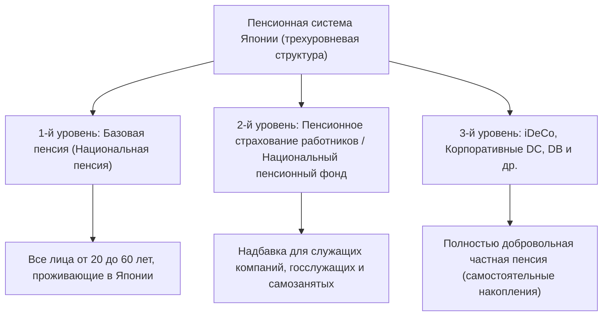

## Введение: Почему именно iDeCo (индивидуальный пенсионный план с установленными взносами) сегодня

В современной Японии на фоне старения населения, снижения рождаемости и увеличения продолжительности жизни (так называемая "эпоха столетней жизни"), тревога о будущей пенсии и нехватка средств на старость стали серьезной социальной проблемой. Эпоха, когда "можно было безбедно жить в старости только на государственную пенсию", подошла к концу, и мы вступили в период, когда формирование капитала собственными силами стало жизненно необходимым. В этой ситуации одним из главных инструментов, который активно поддерживает государство, является "iDeCo (индивидуальный пенсионный план с установленными взносами)".

iDeCo — это не просто инвестиционная система. По своему устройству это "самый мощный инструмент для накопления средств на старость", в который встроены беспрецедентно сильные налоговые льготы. Однако за этим мощным эффектом экономии на налогах кроются сложные механизмы, связанные с налогами и пенсиями. В этой статье мы подробно и систематично разберем устройство iDeCo через призму всей пенсионной системы Японии, обсудим теоретическую базу "трех эффектов налоговой экономии" (при внесении взносов, инвестировании и получении средств), влияние на предельную налоговую ставку, смысл заморозки средств до 60 лет, а также оптимальную стратегию выхода.

---

## 1. Место iDeCo в пенсионной системе Японии (трехуровневая структура)

Чтобы точно понять, как работает iDeCo, необходимо сначала разобраться в общей структуре государственных и частных пенсионных систем Японии, так называемой "трехуровневой структуре пенсий".

### 1-й уровень: Базовая пенсия (Национальная пенсия)
Фундаментом пенсионной системы Японии является "Национальная пенсия" (Кокумин нэнкин). К участию в ней обязаны все лица в возрасте от 20 до 60 лет, имеющие адрес в Японии (застрахованные лица категорий с 1 по 3). Это называется "первым уровнем", и он служит базой для поддержки основного уровня жизни в старости, но сохранить достаточный уровень жизни только на эти средства проблематично.

### 2-й уровень: Пенсионное страхование работников / Национальный пенсионный фонд
Над первым уровнем надстраивается "второй уровень". Служащие компаний и государственные служащие (застрахованные лица 2-й категории) присоединяются к "Пенсионному страхованию работников" (Косэй нэнкин) через своего работодателя. Пенсия работников пропорциональна доходу, то есть размер страховых взносов и будущей пенсии варьируется в зависимости от доходов в период трудовой деятельности. С другой стороны, самозанятые и фрилансеры (застрахованные лица 1-й категории) не могут присоединиться к пенсии работников, поэтому они могут использовать "Национальный пенсионный фонд" (Кокумин нэнкин кикин) для формирования второго уровня.

### 3-й уровень: Добровольная частная пенсия (iDeCo и корпоративные пенсии)
Чтобы компенсировать нехватку средств на старость только от государственных пенсий (1 и 2 уровни), предусмотрен "третий уровень", представляющий собой частные пенсии. Сюда относятся корпоративные пенсионные планы с установленными взносами (Корпоративные DC) и корпоративные пенсии с установленными выплатами (DB), которые компании внедряют для своих сотрудников, а также "iDeCo (индивидуальный пенсионный план с установленными взносами)", к которому люди присоединяются самостоятельно. iDeCo доступен для всех лиц в возрасте от 20 до 65 лет, независимо от профессии или наличия пенсионной системы на рабочем месте, и является инфраструктурой, через которую государство активно поддерживает "формирование активов собственными усилиями граждан" с помощью налоговых льгот.

---

## 2. Главная привлекательность iDeCo: 3 механизма налоговых льгот

В iDeCo предусмотрены чрезвычайно мощные "3 налоговые льготы", которых нет в обычных инвестиционных фондах или при инвестировании в акции. Благодаря их совместному действию эффект сложного процента и налоговый эффект при формировании капитала максимизируются.

### Номер 1: Механизм "полного вычета из дохода" взносов
Самым быстрым и надежным преимуществом iDeCo является "полный вычет взносов из дохода". Вычет из дохода — это механизм, позволяющий вычесть определенную сумму из "налогооблагаемого дохода", который служит базой для расчета налогов.

Подоходный налог в Японии использует "систему прогрессивного налогообложения", при которой чем выше доход, тем выше применяемая налоговая ставка (предельная ставка налога). Взносы, уплаченные в iDeCo, полностью вычитаются из дохода за этот год как "вычет взносов на страхование малых предприятий и т.д.".

#### Механизм расчета предельной налоговой ставки и эффекта экономии на налогах
Рассмотрим конкретный пример сотрудника компании с налогооблагаемым доходом 5 миллионов иен (ставка подоходного налога 20%, ставка муниципального налога 10%), который ежемесячно вносит 23 000 иен (276 000 иен в год).

1. **Экономия на подоходном налоге**: 276 000 иен × 20% = 55 200 иен
2. **Экономия на муниципальном налоге**: 276 000 иен × 10% = 27 600 иен
3. **Общая сумма экономии на налогах (за год)**: 82 800 иен

Эта годовая экономия в размере 82 800 иен равносильна тому, что "на инвестиции в размере 276 000 иен в год вы гарантированно получаете кэшбэк в размере около 30% (82 800 иен)". В инвестициях не существует такого понятия, как "гарантированный доход", но этот эффект экономии на налогах за счет вычета из дохода можно назвать "безрисковой доходностью", которую можно получать ежегодно, просто используя систему. Особенно для людей с высокими доходами и высокой предельной ставкой налога эта налоговая льгота становится колоссальной.

### Номер 2: Механизм, при котором инвестиционный доход "полностью не облагается налогом"
Обычно прибыль (дивиденды или прирост капитала), полученная от акций и инвестиционных фондов, облагается налогом в размере 20,315% (подоходный налог 15,315%, муниципальный налог 5%). Однако прибыль, полученная от инвестирования на счете iDeCo, остается "необлагаемой налогом" на протяжении всего периода.

Истинная сила этого освобождения от налогов на инвестиционный доход заключается в "максимизации эффекта сложного процента". При инвестировании на обычном счете каждый раз при получении прибыли (или дивидендов) вычитается около 20% в виде налога, что уменьшает сумму, которую можно реинвестировать. Однако в iDeCo эти 20%, которые должны были быть удержаны в качестве налога, остаются в основной сумме и снова инвестируются. При долгосрочном инвестировании (20, 30 лет) эффект сложного процента, обеспечиваемый этой "отсрочкой налога (реинвестирование без уплаты налогов)", создает колоссальную разницу в миллионы иен в итоговой сумме активов.

### Номер 3: Мощные вычеты при получении средств (вычет на выходное пособие, вычет на государственную пенсию и т.д.)
При получении активов, накопленных и приумноженных с помощью iDeCo, после 60 лет также предусмотрены мощные налоговые льготы. Способы получения делятся на "единовременную выплату" и "пенсию (частичные выплаты)", и к каждому из них применяются разные вычеты.

*   **В случае единовременной выплаты: "Вычет на выходное пособие"**
    При получении в виде единовременной выплаты, для целей налогообложения это рассматривается как "выходное пособие". Механизм вычета на выходное пособие устроен так, что чем дольше срок участия (стаж работы), тем больше сумма вычета. Формула расчета следующая:
    *   Срок участия 20 лет и меньше: 400 000 иен × Срок участия
    *   Срок участия более 20 лет: 8 миллионов иен + 700 000 иен × (Срок участия - 20 лет)
    Если сумма укладывается в этот лимит вычета, налоги вообще не взимаются. Более того, даже если лимит превышен, применяется крайне льготный метод расчета, при котором облагается налогом только "половина" от суммы превышения.

*   **В случае получения в виде пенсии: "Вычет на государственную пенсию и т.д."**
    При получении по частям это рассматривается как "прочий доход", но применяется "вычет на государственную пенсию и т.д.". Он рассчитывается совместно с государственными пенсиями, такими как Национальная пенсия или Пенсия работников. Для лиц старше 65 лет до 1,1 миллиона иен в год (при наличии только доходов от государственной пенсии и т.д.) не облагаются налогом.

---

## 3. Дилемма заморозки средств: смысл того, почему деньги нельзя снять до 60 лет

Наиболее часто упоминаемым недостатком iDeCo является правило заморозки средств, согласно которому "как правило, активы нельзя снять до 60 лет". Даже если вам потребуются крупные суммы на важные жизненные события, такие как образование или покупка жилья, вы не сможете тронуть активы iDeCo.

Однако эта "заморозка средств" — не просто недостаток, она содержит в себе важный системный замысел.

### Принудительный механизм "долгосрочного инвестирования и обеспечения средств на старость"
С точки зрения поведенческой экономики, люди склонны отдавать предпочтение "немедленной небольшой выгоде (или желанию)" перед "большой выгодой в будущем" (предвзятость настоящего). При накоплении средств на счете, с которого можно свободно снимать деньги, люди часто склонны легко расторгать договор и забирать деньги в случае паники при обвале рынка или при малейшей нужде в средствах.

Заморозка средств в iDeCo до 60 лет действует как мощная функция блокировки, физически подавляющая эту "предвзятость настоящего". Это механизм безопасности, который принудительно реализует цель "это средства для старости" и гарантирует работу эффекта сложного процента на протяжении десятилетий.

### Блокировка как цена за налоговые льготы
Причина, по которой государство предоставляет столь щедрые налоговые льготы (вычет из дохода, необлагаемый налогом инвестиционный доход, вычет на выходное пособие), заключается в том, чтобы "заставить граждан самостоятельно формировать средства на старость". Если бы это была система, из которой можно было бы свободно снимать средства, ее могли бы использовать во зло просто как инструмент для краткосрочной экономии на налогах. Следует понимать, что заморозка средств до 60 лет существует как "взаимообразное условие" для достижения государственной политической цели формирования пенсионных накоплений.

---

## 4. Оптимальное решение для стратегии выхода: Единовременная выплата, пенсия или их комбинация

После того как с помощью iDeCo накоплены активы в десятки миллионов иен, самым важным становится то, "как их получить (стратегия выхода)". В зависимости от способа получения, итоговая сумма, которая останется на руках (сумма после вычета налогов), может сильно различаться, поэтому тщательное предварительное моделирование просто необходимо.

### Вариант 1: Механизм и стратегия единовременной выплаты
В большинстве случаев "получение в виде единовременной выплаты" имеет высокие шансы оказаться наиболее выгодным с точки зрения налогообложения. Как упоминалось ранее, вычет на выходное пособие очень мощный. Например, при сроке участия 30 лет сумма вычета составит: "8 млн иен + 700 000 иен × 10 лет = 15 млн иен". Если сумма к получению, включая инвестиционный доход, не превышает 15 миллионов иен, налог будет равен нулю.

**На что обратить внимание (правило суммирования с выходным пособием от компании):**
Однако, если вы являетесь сотрудником компании и получаете крупное выходное пособие от работодателя, следует быть осторожным. Если получить единовременную выплату от iDeCo и выходное пособие от компании в один и тот же год (или в близкие годы), лимит вычета на выходное пособие будет рассчитываться совместно (суммироваться) для обоих. Чтобы избежать этого, требуются продвинутые стратегии изменения сроков получения (использование так называемого "правила 5 лет для вычета на выходное пособие"), например: "Сначала получить iDeCo в 60 лет, а выходное пособие от компании получить в 65 лет (оставив 5-летний промежуток)".

### Вариант 2: Механизм и стратегия пенсии (частичные выплаты)
При получении частями средства снимаются постепенно, при этом продолжая инвестироваться, что имеет преимущество в виде продления "продолжительности жизни" активов. Однако с точки зрения налогов это суммируется с государственными пенсиями (Национальная пенсия, Пенсия работников). Таким образом, для людей с большими суммами государственных пенсий существует риск того, что добавление пенсионных выплат iDeCo приведет к превышению лимита вычета на государственную пенсию и т.д., и эта сумма будет облагаться налогом как прочий доход.

Кроме того, при выборе пенсионных выплат трастовые банки и другие финансовые учреждения будут каждый раз взимать "комиссию за выплату (комиссию за перевод)", поэтому следует учитывать возможность того, что при частом получении мелких сумм комиссионные расходы могут превысить выгоду.

### Вариант 3: Комбинация единовременной выплаты и пенсии
Во многих финансовых учреждениях можно выбрать "комбинацию", объединяющую единовременную выплату и пенсию. Это гибридная стратегия, при которой не облагаемый налогом лимит вычета на выходное пособие используется полностью для получения единовременной выплаты, а сумма превышения лимита получается в виде пенсии, чтобы уложиться в рамки вычета на государственную пенсию и т.д. Оптимизация этого баланса в зависимости от индивидуальной ситуации (наличие выходного пособия, размер государственной пенсии, другие доходы и т.д.) является конечной целью стратегии выхода.

---

## Заключение: iDeCo — это система, где "разрыв в знаниях" напрямую ведет к разрыву в активах

iDeCo (индивидуальный пенсионный план с установленными взносами) — это мощнейшая инфраструктура для формирования активов, инициированная государством и составляющая 3-й уровень пенсионной системы Японии. "Тройная налоговая льгота", включающая гарантированную экономию на налогах в соответствии с предельной ставкой благодаря полному вычету взносов из дохода, максимизацию эффекта сложного процента за счет необлагаемого налогом инвестиционного дохода и мощные вычеты при получении средств, дает подавляющее преимущество, с которым не может сравниться ни один другой финансовый продукт.

С другой стороны, невозможно в полной мере раскрыть истинную ценность этой системы без правильного понимания всей ее структуры и стратегического использования, включая строгие правила заморозки средств до 60 лет и сложные налоговые расчеты, связанные с вычетами на выходное пособие и государственную пенсию при получении средств.

В современной Японии решение использовать iDeCo и то, как именно его использовать, больше не является просто "инвестиционным выбором", это "налоговая стратегия на всю жизнь" и сама "стратегия выживания в старости". Повышение финансовой грамотности и максимальное использование государственной системы станет самым верным первым шагом к выживанию в богатую эпоху столетней жизни.
