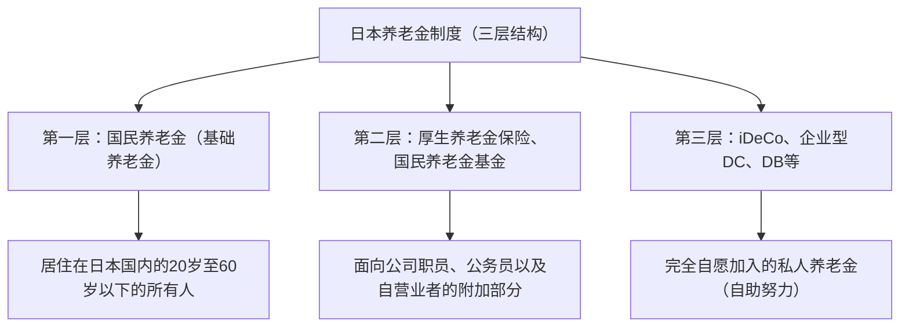

## 引言：为什么现在要关注iDeCo（个人型确定缴费养老金）

在现代日本，在少子老龄化加剧和寿命延长（即所谓“人生100年时代”）的背景下，对未来养老金的担忧以及养老资金的不足已成为重大的社会问题。曾经那种“仅靠国家发放的公共养老金就能度过富足晚年”的时代宣告结束，社会已经步入了必须通过自助努力来积累资产的时代。其中，国家大力支持的制度首推“iDeCo（个人型确定缴费养老金）”。

iDeCo不仅仅是一个投资制度。在国家制度设计上，它融入了史无前例的强大税收优惠，是“最强的养老资金积累工具”。然而，在其强大的避税效果背后，存在着与税收和养老金相关的复杂机制。本文将从日本养老金制度的整体框架出发，深入剖析iDeCo的机制，极其详细且系统地解说在缴纳保费时、投资期间、领取时所能享受的“三大避税效果”的理论背景、对边际税率的影响、60岁前资金锁定的意义，以及最佳的退出策略。

---

## 1. iDeCo在日本养老金制度中的定位（三层结构）

为了准确理解iDeCo的机制，首先必须掌握日本的公共养老金和私人养老金制度的整体结构，即所谓的“养老金三层结构”。

### 第一层：国民养老金（基础养老金）
日本养老金制度的基础是“国民养老金”。居住在日本国内的20岁至60岁以下的所有人都必须加入（第1号至第3号被保险人）。这被称为“第一层”，是支撑晚年基本生活的基石，但仅靠这部分很难维持足够的生活水平。

### 第二层：厚生养老金保险、国民养老金基金
建立在第一层之上的是“第二层”。公司职员和公务员（第2号被保险人）通过工作单位加入“厚生养老金保险”。厚生养老金与薪酬成正比，保费和未来的领取额会根据在职期间的收入而波动。另一方面，由于自营业者和自由职业者（第1号被保险人）无法加入厚生养老金，他们可以利用“国民养老金基金”来构建第二层。

### 第三层：自愿加入的私人养老金（iDeCo和企业养老金）
为了弥补仅靠公共养老金（第一层和第二层）所不足的养老资金，准备了作为私人养老金的“第三层”。除了企业为员工引入的企业型确定缴费养老金（企业型DC）和确定给付企业养老金（DB）之外，个人自行加入的“iDeCo（个人型确定缴费养老金）”也定位在此。无论职业如何，也无论工作单位是否有相关制度，原则上20岁至65岁以下的所有人都可以加入iDeCo，它已成为国家在税收方面大力支持“国民通过自助努力积累资产”的基础设施。

---

## 2. iDeCo的最大魅力：三大税收优惠机制

iDeCo具备普通投资信托和股票投资所没有的、极其强大的“三大避税优势”。这些优势相互联动，使资产积累中的复利效果和税收效应最大化。

### 其一：缴费额“全额所得扣除”的机制
iDeCo最立竿见影且确定的优势是“缴费全额所得扣除”。所谓所得扣除，是指在计算税金时，可以从作为计算基础的“应税所得”中减去特定金额的机制。

日本的个人所得税采用“超额累进税制”，收入越高，适用的税率（边际税率）就越高。通过iDeCo缴纳的保费作为“小规模企业共济等挂金扣除”，将从当年的所得中全额扣除。

#### 边际税率与避税效果的计算机制
作为具体例子，假设应税所得为500万日元（所得税率20%，居民税率10%）的公司职员，每月缴纳2万3000日元（每年27万6000日元）的保费。

1. **所得税避税额**：276,000日元 × 20% = 55,200日元
2. **居民税避税额**：276,000日元 × 10% = 27,600日元
3. **合计避税额（每年）**：82,800日元

这每年82,800日元的避税，换言之，就等同于“对每年27万6000日元的投资，确实获得了约30%（82,800日元）的现金返还”。在投资中不存在所谓的“确定回报”，但这种通过所得扣除带来的避税效果，可以说是只要利用制度就每年都能确实获得的“零风险收益率”。特别是收入越高、边际税率越高的人，这种避税优势就会急剧增大。

### 其二：投资收益“全额免税”的机制
通常，通过股票或投资信托获得的收益（分红和资本利得），会被征收20.315%的税金（所得税15.315%，居民税5%）。但是，在iDeCo账户内通过投资获得的收益，在整个期间内都是“免税”的。

这种投资收益免税的真正力量在于“复利效果的最大化”。如果在普通账户中进行投资，每次产生收益（或领取分红）时，都会被扣除约20%作为税金，可用于再投资的金额就会缩水。然而，在iDeCo中，本应作为税金被扣除的约20%的资金也会原封不动地计入本金，再次投入运用。在长达20年、30年的长期投资中，这种“税收递延（免税再投资）”所带来的复利效果，将在最终的资产总额上产生数百万日元级别的巨大差异。

### 其三：领取时的强大扣除（退职所得扣除、公共养老金等扣除）
在60岁之后领取通过iDeCo积累并增值的资产时，也备有强大的税收优惠。领取方式大致分为“一次性金（一次性领取）”和“年金（分期领取）”，分别适用不同的扣除。

*   **一次性领取时：“退职所得扣除”**
    如果作为一次性金领取，在税务上将被视为“退职所得”。退职所得扣除的机制是，加入期间（连续工作年限）越长，扣除额就越大，计算公式如下：
    *   加入期间20年及以下：40万日元 × 加入期间
    *   加入期间超过20年：800万日元 ＋ 70万日元 ×（加入期间 － 20年）
    如果在这个扣除额度内，将不征收任何税金。此外，即使超出了扣除额度，也只对超出部分的“二分之一”进行征税，这是一种极其优厚的计算方法。

*   **分期领取时：“公共养老金等扣除”**
    如果分期领取，将被视为“杂项收入”，但适用“公共养老金等扣除”。这是与国民养老金和厚生养老金等公共养老金合并计算的，如果年龄在65岁以上，每年最高110万日元（仅有公共养老金等收入的情况）免税。

---

## 3. 资金锁定的困境：原则上60岁前无法提取的意义

iDeCo最常被提及的最大缺点，就是“原则上到60岁为止无法提取资产”这一资金锁定规则。即使在教育资金或购房资金等人生大事上需要大笔资金，也无法动用iDeCo的资产。

然而，这种“资金锁定”不仅仅是一个缺点，它包含了制度设计上的重要意图。

### 强制性的“长期投资与确保养老资金”机制
从人类行为经济学的角度来看，人们倾向于优先考虑“眼前的微小利益（或欲望）”而不是“未来的巨大利益”（现在偏见）。如果在一个可以自由提取的账户中进行定投，当市场暴跌陷入恐慌时，或者在稍微需要一点钱的时候，很容易就会解除定投。

iDeCo到60岁为止的资金锁定，可以作为一种强大的锁定功能，在物理上封锁这种“现在偏见”。这是一种安全装置，强制贯彻“这是为了老后的资金”这一目的，从而确保复利效果在数十年间稳定发挥作用。

### 作为税收优惠代价的锁定
国家之所以提供如此丰厚的税收优惠（所得扣除、投资收益免税、退职所得扣除），理由是“希望国民独立建立养老资金”。如果是一个可以自由提取的制度，就有可能被滥用为单纯的短期避税工具。我们应该理解为，为了实现形成养老资金这一国家政策目的，作为“交换条件”，才存在到60岁为止的资金锁定。

---

## 4. 退出策略的最优解：一次性金、年金、还是混合使用

在通过iDeCo积累了数千万日元级别的资产后，最重要的事情就是“如何领取（退出策略）”。因为领取方式的不同，最终留在手里的金额（税后金额）会发生巨大变化，所以事先进行周密的模拟是不可或缺的。

### 选择1：一次性金（一次性领取）的机制与策略
在很多情况下，在税务上最有可能有利的是“一次性领取”。如前所述，退职所得扣除非常强大。例如，如果加入期间为30年，扣除额将是“800万日元 ＋ 70万日元 × 10年 ＝ 1500万日元”。如果包含投资收益在内的领取总额在1500万日元以下，税金就是零。

**注意事项（与公司退职金的合并计算规则）：**
但是，如果是公司职员并从工作单位领取大额退职金，则需要注意。如果在同一年（或相近的年份）领取iDeCo的一次性金和公司的退职金，退职所得扣除的额度将在两者之间共享（合并）计算。为了避免这种情况，需要采取战略性错开领取时间的进阶技巧（即利用所谓的“退职所得扣除的5年规则”等），例如“先在60岁时领取iDeCo，在65岁时领取公司的退职金（空出5年间隔的规则）”。

### 选择2：年金（分期领取）的机制与策略
如果分期领取，因为是边继续投资边提取，所以有延长资产寿命的优势。但在税收方面，由于它与公共养老金（国民养老金、厚生养老金）合并计算，因此公共养老金领取额度较高的人，由于加上了iDeCo的年金领取部分，可能会超出公共养老金等扣除的额度，从而存在作为杂项收入被征税的风险。

此外，如果选择年金领取，每次都需要向信托银行等支付“给付手续费（转账手续费）”，因此必须考虑到如果频繁领取小额资金，可能会出现手续费亏损的可能性。

### 选择3：一次性金和年金的混合使用
在许多金融机构中，可以选择一次性金和年金相结合的“混合使用”。这是一种混合策略：充分利用退职所得扣除的免税额度领取一次性金，对超出额度的部分作为年金分期领取，使其保持在公共养老金等扣除的额度内。根据个人的情况（是否有退职金、公共养老金的领取额、其他收入等），优化这种平衡，是退出策略中的终极目标。

---

## 结论：iDeCo是一个“认知差距”直接转化为资产差距的制度

iDeCo（个人型确定缴费养老金）是承担日本养老金制度第三层、国家重点支持的最强资产积累基础设施。通过全额扣除缴费额带来与边际税率相应的确定避税效果、通过投资收益免税带来的复利效果极大化、以及领取时强大的扣除，这种“三重税收优惠”拥有其他任何金融产品都无法模仿的绝对优势。

另一方面，如果不正确理解制度的全貌并进行战略性的利用，如60岁前资金锁定的严格规则，以及围绕领取时退职所得扣除和公共养老金等扣除的复杂税务计算，就无法充分发挥其真正的价值。

在现代日本，是否利用iDeCo以及如何利用它，不再仅仅是单纯的“投资选择”，而是“终生的税务策略”，更是“晚年的生存策略”本身。提高金融素养，最大限度地破解（Hack）国家制度，将是我们在富足的人生100年时代生存下去的最坚实的第一步。
