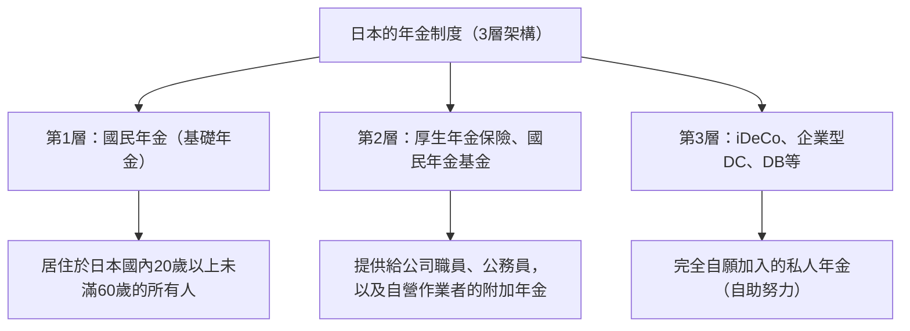

## 前言：為什麼現在要談iDeCo（個人型確定提撥年金）

在現代日本，隨著少子高齡化的發展與長壽化（即所謂的「人生100年時代」）為背景，對未來年金的不安與退休資金的不足已成為重大的社會課題。過去那種「光靠國家發放的公共年金就能度過充裕晚年」的時代宣告結束，我們已經邁入必須透過自助努力來進行資產形成的時代。在這樣的背景下，國家強力推動的制度之首，便是「iDeCo（個人型確定提撥年金）」。

iDeCo不僅僅是單純的投資制度。在國家的制度設計上，它被賦予了史無前例的強力稅制優惠，堪稱「最強的退休資金形成工具」。然而，在這些強力的節稅效果背後，存在著關於稅金與年金的複雜機制。本文將從日本年金制度的整體面貌來解構iDeCo的機制，針對在繳納保費時、投資運用時以及領取時所能享受的「3種節稅效果」的理論背景、對邊際稅率的影響、鎖定資金至60歲的意義，以及最佳的出場策略，進行極為詳細且系統化的解說。

---

## 1. iDeCo在日本年金制度中的定位（3層架構）

為了準確理解iDeCo的機制，首先必須掌握日本公共年金以及私人年金制度的整體架構，也就是所謂的「年金的3層架構」。

### 第1層：國民年金（基礎年金）
日本年金制度的基礎是「國民年金」。所有居住在日本國內，年齡在20歲以上未滿60歲的人，都被強制要求加入（第1號至第3號被保險人）。這被稱為「第1層」，是支撐退休後基本生活的基礎，但光靠這個要維持充足的生活水準是很困難的。

### 第2層：厚生年金保險、國民年金基金
建立在第1層之上的是「第2層」。公司職員與公務員（第2號被保險人）會透過工作單位加入「厚生年金保險」。厚生年金採用報酬比例制，會根據工作時期的收入來變動保費與未來的領取金額。另一方面，自營作業者與自由工作者（第1號被保險人）因為無法加入厚生年金，可以改為利用「國民年金基金」來建構第2層。

### 第3層：自願加入的私人年金（iDeCo與企業年金）
為了彌補僅靠公共年金（第1層、第2層）所不足的退休資金，所準備的私人年金便是「第3層」。企業為員工導入的企業型確定提撥年金（企業型DC）與確定給付企業年金（DB），以及個人自行加入的「iDeCo（個人型確定提撥年金）」，都被定位於此。iDeCo原則上不論職業或工作單位是否有設立制度，20歲以上未滿65歲的所有人都可以加入，已成為國家在稅制方面強力支援「國民透過自助努力進行資產形成」的基礎設施。

---

## 2. iDeCo的最大魅力：3種稅制優惠機制

iDeCo擁有一般投資信託或股票投資所沒有的、極為強力的「3種節稅優勢」。透過這些機制的連動，可以將資產形成中的複利效果與稅務效果最大化。

### 其1：提撥金「全額所得扣除」的機制
iDeCo最快見效且最確實的優勢就是「提撥金的全額所得扣除」。所得扣除是指，在計算稅金的基礎「課稅所得」中，可以扣除特定金額的機制。

日本的所得稅採用「超額累進稅率制度」，所得越高，所適用的稅率（邊際稅率）就越高。在iDeCo中提撥的金額會作為「小規模企業共濟等掛金扣除」，從當年的所得中全額扣除。

#### 邊際稅率與節稅效果的計算機制
舉例來說，假設一位課稅所得為500萬日圓（所得稅率20%、住民稅率10%）的公司職員，每個月提撥2萬3000日圓（每年27萬6000日圓）。

1. **所得稅的節稅額**：276,000日圓 × 20% = 55,200日圓
2. **住民稅的節稅額**：276,000日圓 × 10% = 27,600日圓
3. **合計節稅額（每年）**：82,800日圓

這每年82,800日圓的節稅，換言之就等同於「對於每年27萬6000日圓的投資，確實獲得了約30%（82,800日圓）的現金回饋」。在投資中並不存在所謂的「確定報酬」，但這種透過所得扣除帶來的節稅效果，可以說是只要利用制度，每年就能確實獲得的「無風險殖利率」。特別是所得越高、邊際稅率越高的人，這種節稅優勢就會呈戲劇性地放大。

### 其2：投資收益「全額免稅」的機制
通常，透過股票或投資信託所獲得的利益（股息或資本利得），會被課徵20.315%的稅金（所得稅15.315%、住民稅5%）。但是，在iDeCo帳戶內運用所獲得的利益，在期間內將會一直「免稅」。

這種投資收益免稅的真正力量在於「複利效果的最大化」。在使用一般帳戶投資時，每次獲利（或領取股息）都會被扣除約20%的稅金，導致可再投資的金額減少。然而，在iDeCo中，原本應被扣除的約20%稅金會原封不動地滾入本金，再次進行投資。在長達20年、30年的長期投資中，這種「稅金遞延（免稅再投資）」所帶來的複利效果，將在最終資產額上產生數百萬日圓的壓倒性差距。

### 其3：領取時的強力扣除（退職所得扣除、公共年金等扣除）
透過iDeCo累積並增加的資產，在60歲之後領取時，也準備了強力的稅制優惠。領取方式大致可分為「一時金（一次性領取）」與「年金（分期領取）」，各自適用不同的扣除額。

*   **一次性領取的情況：「退職所得扣除」**
    如果是以一次性領取的方式，在稅務上會被視為「退職所得」。退職所得扣除的機制是，加入期間（工作年資）越長，扣除額就越多。計算公式如下：
    *   加入期間20年以下：40萬日圓 × 加入期間
    *   加入期間20年超：800萬日圓 ＋ 70萬日圓 ×（加入期間 － 20年）
    只要在這個扣除額度內，就完全不需要繳稅。而且，即使超過了扣除額度，也只會針對超過部分的「二分之一」來課稅，這是一種極為優惠的計算方式。

*   **分期領取的情況：「公共年金等扣除」**
    如果是以分期領取的方式，會被視為「雜項所得」，但可適用「公共年金等扣除」。這是與國民年金或厚生年金等公共年金合併計算的，如果是65歲以上，每年110萬日圓（僅有公共年金等收入的情況）以內皆為免稅。

---

## 3. 資金鎖定的兩難：原則上到60歲都無法提領的意義

iDeCo最大的缺點，最常被提到的就是「原則上到60歲為止都無法提領資產」這項資金鎖定規則。即使遇到教育資金或購屋資金等人生大事需要一筆錢，也無法動用iDeCo的資產。

然而，這個「資金鎖定」並不單純只是一個缺點，它包含了制度設計上的重要意圖。

### 強制性「長期投資・確保退休資金」的機制
從人類行為經濟學的觀點來看，人有一種傾向，會優先選擇「眼前的微小利益（或欲望）」，而不是「未來的巨大獲益」（現在偏見）。如果在可以自由提領的帳戶中進行定期定額投資，當市場崩盤引發恐慌時，或者稍微需要用錢時，就很容易輕易解約。

iDeCo到60歲為止的資金鎖定，正是作為一種強力的鎖定功能，在物理上封印了這種「現在偏見」。它是為了強制貫徹「作為退休資金」的目的，並確保複利效果能確實發揮數十年的一種安全裝置。

### 作為稅制優惠代價的鎖定
國家之所以提供如此豐厚的稅制優惠（所得扣除、投資收益免稅、退職所得扣除），理由是「希望國民能獨立自主地準備退休資金」。如果是一個可以自由提領的制度，很有可能會被惡用為單純的短期節稅工具。我們應該理解，為了達成國家政策中形成退休資金的目的，到60歲為止的資金鎖定是作為一種「交換條件」而存在的。

---

## 4. 出場策略的最佳解：一次性領取、年金領取，還是兩者並用

在透過iDeCo累積了數千萬等級的資產後，最重要的就是「如何領取（出場策略）」。因為領取方式會大幅改變最終留在手邊的金額（稅後金額），所以事前的縝密模擬是不可或缺的。

### 選項1：一次性領取（一筆領取）的機制與策略
在多數情況下，稅制上最有利的可能性就是「一次性領取」。如前所述，退職所得扣除非常強大。舉例來說，假設加入期間為30年，扣除額將是「800萬日圓 ＋ 70萬日圓 × 10年 ＝ 1500萬日圓」。只要包含投資收益在內的領取額在1500萬日圓以下，稅金就是零。

**注意事項（與公司退休金合併計算的規則）：**
不過，如果是會從工作單位領取高額退休金的公司職員，就需要特別注意。如果在同一年（或相近的年份）領取iDeCo的一次性領取金與公司的退休金，那麼退職所得扣除的額度將由兩者共享（合併）計算。為了避免這種情況，需要運用高度的技巧來策略性地錯開領取時間（也就是活用所謂的「退職所得扣除的5年規則」等），例如「先在60歲領取iDeCo，再於65歲領取公司的退休金（空出5年空白期的規則）」。

### 選項2：年金（分期領取）的機制與策略
如果是分期領取，因為是在持續投資的狀態下提領，所以有延長資產壽命的優點。但是在稅制方面，因為會與公共年金（國民年金・厚生年金）合併計算，所以公共年金領取額較高的人，加上iDeCo的年金領取額後，可能會超出公共年金等扣除的額度，進而產生被視為雜項所得而被課稅的風險。

此外，如果選擇年金領取，每次都會對信託銀行等產生「給付手續費（匯款手續費）」，因此也必須考慮到，如果小額頻繁領取，可能會因手續費而不划算。

### 選項3：並用一次性領取與年金
許多金融機構都提供了一次性領取與年金相結合的「並用」選項。充分利用退職所得扣除的免稅額度來進行一次性領取，超出額度的部分則作為年金分期領取，並控制在公共年金等扣除的額度內，這是一種混合策略。根據個人的情況（有無退休金、公共年金的領取額、其他所得等），將這種平衡調整至最佳化，將是出場策略中的終極目標。

---

## 結論：iDeCo是一個「知識差距」直接連結到資產差距的制度

iDeCo（個人型確定提撥年金）擔綱著日本年金制度的第3層，是國家傾力打造的最強資產形成基礎設施。提撥金全額所得扣除帶來根據邊際稅率的確實節稅、投資收益免稅帶來的複利效果極大化，以及領取時的強力扣除，這「3重稅制優惠」擁有其他任何金融商品都無法模仿的壓倒性優勢。

另一方面，如果不正確理解制度的全貌並策略性地活用，例如到60歲為止資金鎖定的嚴格規則，以及圍繞領取時退職所得扣除、公共年金等扣除的複雜稅務計算等，就無法充分發揮其真正的價值。

在現代日本，是否活用iDeCo，以及如何活用，早已不再只是單純的「投資選擇」，而是「一生的稅務策略」，更是「退休後的生存策略」本身。提升金融素養，將國家制度發揮到極致，將是為了在充裕的人生100年時代中生存下來，最確實的第一步。
