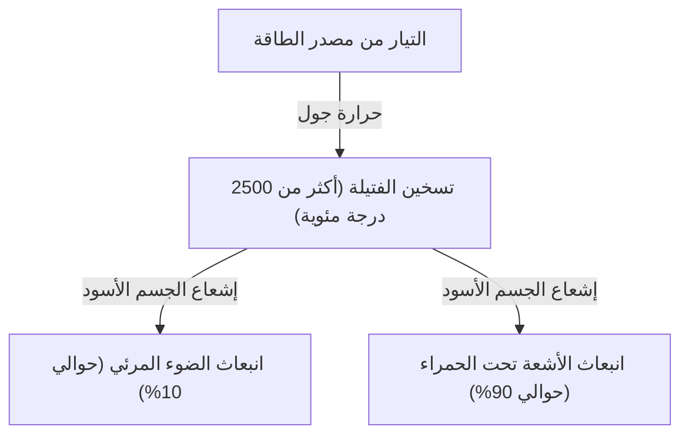
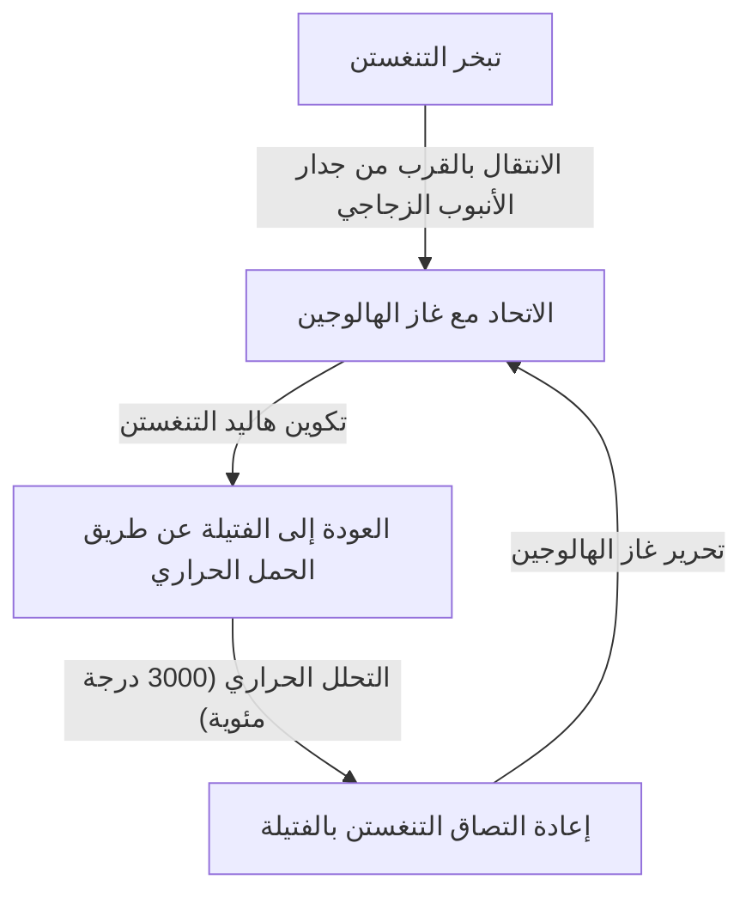

المصباح المتوهج هو اختراع عظيم غير تاريخ ليل البشرية بشكل جذري. تم تطويره للاستخدام العملي من قبل توماس إديسون وجوزيف سوان وآخرين، واستمر في إضاءة العالم لأكثر من قرن. على الرغم من أنه يتخلى الآن عن مكانته لصالح الإضاءة عالية الكفاءة مثل مصابيح LED، إلا أن الآلية التي يشع بها المصباح المتوهج الضوء رائعة جداً ولها آلية جميلة عند دراسة أساسيات الفيزياء وعلم المواد.

في هذا المقال، سنشرح بالتفصيل كيف تشع فتيلة المصباح المتوهج الضوء، والفيزياء وراء حرارة جول وإشعاع الجسم الأسود، ولغز سبب انتهاء عمره الافتراضي.

## 1. مبدأ توليد الضوء: حرارة جول وإشعاع الجسم الأسود

المبدأ الأساسي للمصباح المتوهج هو استخدام الحرارة (حرارة جول) المتولدة عندما يتدفق التيار عبر مادة لرفع درجة حرارتها وجعلها تشع ضوءاً (إشعاع الجسم الأسود).

### توليد حرارة جول

عند تمرير تيار كهربائي عبر موصل مثل المعدن، تصطدم الإلكترونات المتحركة بالذرات داخل الموصل، وتتحول طاقتها الحركية إلى طاقة حرارية. هذه هي حرارة جول.
يتم التعبير عن كمية الحرارة المتولدة $Q$ باستخدام قانون جول التالي، مع التيار $I$ والمقاومة $R$ والوقت $t$.

$Q = I^2 R t$

تُصنع فتيلة المصباح المتوهج بشكل رفيع جداً لزيادة المقاومة الكهربائية عن قصد، وعندما يتدفق التيار، تسخن بسرعة وتصل إلى درجة حرارة عالية جداً تتراوح بين 2,000 و 3,000 درجة مئوية.

### الانبعاث بواسطة إشعاع الجسم الأسود (الإشعاع الحراري)

عندما تصل درجة حرارة الجسم إلى مستوى عالٍ، فإنه يشع موجات كهرومغناطيسية تتوافق مع تلك الحرارة. يُطلق على هذا إشعاع الجسم الأسود (أو الإشعاع الحراري). هذا هو نفس المبدأ الذي يجعل الحديد يضيء باللون الأحمر عند تسخينه لأول مرة، ثم يسطع باللون الأبيض مع زيادة درجة الحرارة.

يتم التعبير عن ذروة الطول الموجي $\lambda_{max}$ للطاقة التي يشعها جسم أسود بدرجة حرارة $T$ بواسطة قانون إزاحة فين على النحو التالي.

$\lambda_{max} = \frac{b}{T}$ ($b$ هو ثابت إزاحة فين، تقريباً $2.898 \times 10^{-3} \text{ m}\cdot\text{K}$)

عندما تصل درجة حرارة الفتيلة إلى حوالي 2500 درجة مئوية (حوالي 2773 كلفن)، يدخل جزء من الموجات الكهرومغناطيسية المنبعثة في نطاق "الضوء المرئي" الذي يمكن للعين البشرية رؤيته، ويتم التعرف عليه كضوء. ومع ذلك، نظراً لأن معظم الطاقة (أكثر من 90٪) تنبعث كأشعة تحت حمراء (حرارة)، فإن كفاءة الطاقة للمصابيح المتوهجة كإضاءة ليست عالية جداً. هذا هو سبب أن "المصباح ساخن".

## 2. علم المواد للفتيلة: لماذا التنغستن؟

استخدمت المصابيح القديمة (مثل تلك التي طورها إديسون) "فتيلة كربون" مصنوعة من خيزران مكربن مستخرج من ياواتا في كيوتو باليابان. ومع ذلك، كان للكربون عمر قصير، ولجعله أكثر سطوعاً، كانت هناك حاجة إلى مادة يمكنها تحمل درجات حرارة أعلى.

لذلك، يتم استخدام **التنغستن (Tungsten، الرمز الكيميائي: W)** في المصابيح المتوهجة الحديثة. تم اختيار التنغستن لأسباب فيزيائية وكيميائية واضحة:

1. **نقطة انصهار عالية جداً**: تبلغ نقطة انصهار التنغستن 3,422 درجة مئوية، وهي أعلى نقطة انصهار بين جميع المعادن. نظراً لأن فتيلة المصباح المتوهج تصل إلى ما يقرب من 3,000 درجة مئوية، فإن التنغستن هو الأمثل لأنه لا يذوب حتى عند هذه الدرجة.
2. **ضغط بخار منخفض**: له خاصية أنه لا يتبخر (يتطاير) بسهولة حتى عند درجات الحرارة المرتفعة. إذا كان التبخر سريعاً، ستصبح الفتيلة رفيعة بسرعة وتنقطع.
3. **قابلية التشغيل**: يمكن سحبه إلى سلك رفيع، ومن خلال لفه في شكل ملف (مثل لفائف مزدوجة)، يمكن وضع فتيلة طويلة في مساحة محدودة، وزيادة مساحة السطح للحصول على مزيد من السطوع.

## 3. الغاز داخل المصباح ولغز العمر الافتراضي

كيف يبدو داخل المصباح الزجاجي للمصباح المتوهج؟ غالباً ما يُعتقد أنه مجرد فراغ، ولكن يتم إغلاق **غاز خامل (مثل الأرجون أو النيتروجين)** داخل المصابيح المتوهجة العامة الحديثة.

### المعركة مع التبخر والغاز الخامل

إذا كان الجزء الداخلي من المصباح الزجاجي عبارة عن فراغ كامل، فإن التنغستن عالي الحرارة سيتبخر (يتسامى) باستمرار. يلتصق التنغستن المتبخر بداخل الزجاج ويجعله معتماً وأسود اللون (ظاهرة التسويد)، وتصبح الفتيلة نفسها أرق وتنكسر في النهاية (نهاية العمر).

لمنع ذلك، يتم إغلاق غاز خامل، مثل الأرجون أو كمية صغيرة من النيتروجين، والذي لا يتفاعل كيميائياً مع التنغستن في المصباح الزجاجي. من خلال ضغط الغاز، يتم قمع تبخر ذرات التنغستن فيزيائياً، مما يطيل عمر المصباح.

### ابتكار مصابيح الهالوجين: دورة الهالوجين

النسخة المطورة من المصباح المتوهج هي "مصباح الهالوجين". هذا مصباح يتم فيه إغلاق كمية دقيقة من غاز الهالوجين (مثل اليود أو البروم) داخل الأنبوب الزجاجي.
في مصابيح الهالوجين، يتم إجراء إعادة تدوير كيميائي رائع يسمى "دورة الهالوجين" على النحو التالي.

1. يتبخر التنغستن من الفتيلة عند درجة حرارة عالية.
2. يتحد التنغستن المتبخر مع غاز الهالوجين في منطقة درجة حرارة منخفضة نسبياً بالقرب من جدار الأنبوب الزجاجي لتشكيل هاليد التنغستن.
3. يتم حمل هاليد التنغستن الغازي هذا مرة أخرى إلى المنطقة المجاورة للفتيلة ذات درجة الحرارة العالية عن طريق الحمل الحراري.
4. يتحلل هاليد التنغستن بسبب درجات الحرارة المرتفعة، ويعود التنغستن إلى الفتيلة (ترسيب)، وينطلق غاز الهالوجين مرة أخرى.

تمنع هذه الدورة اسوداد الزجاج وتقلل في نفس الوقت من تآكل الفتيلة، مما يتيح انبعاث الضوء عند درجات حرارة أعلى، ونتيجة لذلك، يصبح المصباح أكثر سطوعاً ويدوم لفترة أطول من المصباح المتوهج العادي.

## 4. كيف يتم تحديد عمر المصباح المتوهج؟

ينتهي عمر المصباح المتوهج في اللحظة التي تنكسر فيها الفتيلة. ولكن لماذا تنكسر؟

من المستحيل جعل سمك الفتيلة موحداً تماماً أثناء التصنيع. هناك دائماً "أجزاء رفيعة" أو "خدوش" دقيقة.
عندما يتدفق التيار، تزداد المقاومة الكهربائية محلياً في هذه "الأجزاء الرفيعة"، مما يولد حرارة جول أكثر من الأجزاء الأخرى، وترتفع درجة الحرارة محلياً (البقعة الساخنة).

مع ارتفاع درجة الحرارة، يتبخر التنغستن في هذا الجزء بشكل أسرع من الأجزاء الأخرى. مع تقدم التبخر، يصبح هذا الجزء أرق. وعندما يصبح أرق، تزداد المقاومة أكثر، وتصبح درجة الحرارة أعلى ... وتحدث حلقة مفرغة (تغذية مرتدة إيجابية).
في النهاية، لا تستطيع هذه البقعة الساخنة تحملها، وتذوب وتنقطع. هذه هي الآلية التي ينتهي بها عمر المصباح.

يميل المصباح إلى الاحتراق في اللحظة التي يتم فيها تشغيله لأن التنغستن البارد له مقاومة كهربائية منخفضة، وفي اللحظة التي يتم فيها تشغيله، يتدفق تيار ضخم (تيار اندفاعي) يعادل عدة مرات إلى أكثر من عشر مرات من تيار الحالة الثابتة، مما يضع عبئاً مفاجئاً على البقع الساخنة.

## 5. من المصابيح المتوهجة إلى مصابيح LED، وإرثها

حالياً، من منظور كفاءة الطاقة، يتم تنظيم إنتاج وبيع المصابيح المتوهجة في دول حول العالم، ويتم استبدالها بإضاءة LED (الصمام الثنائي الباعث للضوء) التي يمكنها الحصول على نفس السطوع بطاقة أقل. تنتج مصابيح LED الضوء باستخدام انطلاق الطاقة الناتج عن إعادة تركيب الإلكترونات والثقوب في أشباه الموصلات بدلاً من الإشعاع الحراري، لذلك يكون فقدان الطاقة كحرارة منخفضاً جداً وفعالاً للغاية.

ومع ذلك، فإن الضوء الدافئ الفريد (درجة حرارة اللون المنخفضة) وتجسيد اللون الطبيعي مع طيف مستمر (تجسيد ألوان قريب من ضوء الشمس) للمصابيح المتوهجة له تأثير مريح على المكان، ولا يزال يحظى بشعبية كبيرة كإضاءة زخرفية في المطاعم وغرف المعيشة. في السنوات الأخيرة، انتشرت "مصابيح LED ذات الفتيلة"، والتي تعيد إنتاج مظهر وطريقة إضاءة فتيلة المصباح المتوهج على الرغم من كونها مصابيح LED.

## الخلاصة

للوهلة الأولى، يبدو المصباح المتوهج مجرد "كرة زجاجية متوهجة"، ولكنه مليء بخلاصة الفيزياء والكيمياء، مثل حرارة جول، وإشعاع الجسم الأسود، وعلم المواد، والديناميكا الحرارية للغازات. هذه التكنولوجيا، التي تم إتقانها منذ أكثر من 100 عام، حررت حياة البشر من الظلام وأصبحت القوة الدافعة لتسريع التحديث.

في المرة القادمة التي تتاح لك فيها فرصة التحديق في الضوء الدافئ لمصباح متوهج، يرجى التفكير في الاصطدام العنيف للإلكترونات الذي يحدث في شريط التنغستن الرقيق، والقوانين الكونية للإشعاع الحراري المنبعث منه.
