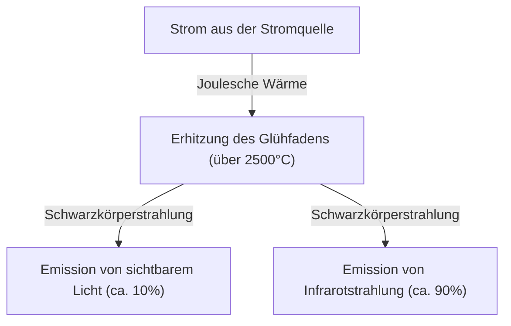
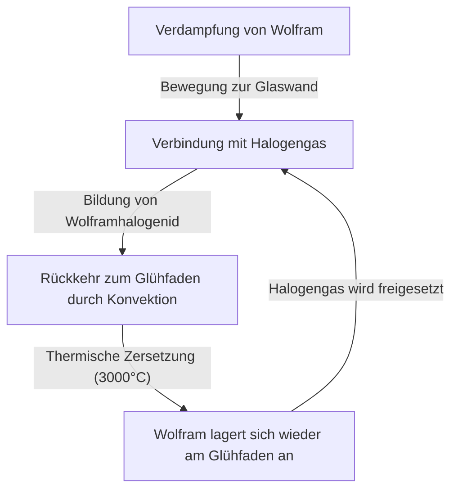

Die Glühlampe (Glühbirne) ist eine großartige Erfindung, die die Geschichte der menschlichen Nächte grundlegend verändert hat. Sie wurde von Thomas Edison, Joseph Swan und anderen praxistauglich gemacht und beleuchtete die Welt mehr als ein Jahrhundert lang. Obwohl sie heute zunehmend durch hocheffiziente Beleuchtung wie LEDs ersetzt wird, ist der Mechanismus, durch den die Glühbirne Licht aussendet, äußerst faszinierend, um die Grundlagen der Physik und Materialwissenschaften zu erlernen, und besitzt zudem eine wunderschöne Mechanik.

In diesem Artikel erklären wir detailliert, wie der Glühfaden einer Glühbirne Licht ausstrahlt, die dahinterliegende Physik der Jouleschen Wärme und der Hohlraumstrahlung (Schwarzkörperstrahlung) sowie das Rätsel, warum sie das Ende ihrer Lebensdauer erreicht.

## 1. Das Prinzip der Lichterzeugung: Joulesche Wärme und Schwarzkörperstrahlung

Das grundlegendste Prinzip der Glühbirne besteht darin, die Hitze (Joulesche Wärme) zu nutzen, die entsteht, wenn elektrischer Strom durch ein Material fließt, um das Material auf hohe Temperaturen zu erhitzen, sodass es Licht aussendet (Schwarzkörperstrahlung).

### Die Entstehung von Joulescher Wärme

Wenn ein Strom durch einen Leiter wie Metall fließt, kollidieren die sich bewegenden Elektronen mit den Atomen im Leiter, und ihre kinetische Energie wird in Wärmeenergie umgewandelt. Das ist die Joulesche Wärme.
Die erzeugte Wärmemenge $Q$ wird durch das folgende Joulesche Gesetz unter Verwendung von Strom $I$, Widerstand $R$ und Zeit $t$ ausgedrückt.

$Q = I^2 R t$

Der Glühfaden einer Glühbirne ist absichtlich sehr dünn gemacht, um einen hohen elektrischen Widerstand zu haben. Wenn Strom durch ihn fließt, erhitzt er sich schnell und erreicht eine extrem hohe Temperatur von 2.000°C bis 3.000°C.

### Lichtemission durch Schwarzkörperstrahlung (Wärmestrahlung)

Wenn ein Objekt hohe Temperaturen erreicht, strahlt es elektromagnetische Wellen entsprechend dieser Temperatur ab. Dies wird als Schwarzkörperstrahlung (oder Wärmestrahlung) bezeichnet. Es ist das gleiche Prinzip wie bei Eisen, das zuerst rot glüht, wenn es erhitzt wird, und bei weiterer Temperaturerhöhung weiß leuchtet.

Die Spitzenwellenlänge $\lambda_{max}$ der Energie, die von einem schwarzen Körper der Temperatur $T$ ausgestrahlt wird, wird durch das Wiensche Verschiebungsgesetz wie folgt ausgedrückt:

$\lambda_{max} = \frac{b}{T}$ （$b$ ist die Wiensche Verschiebungskonstante, etwa $2.898 \times 10^{-3} \text{ m}\cdot\text{K}$）

Wenn die Temperatur des Glühfadens etwa 2.500°C (etwa 2.773K) erreicht, fällt ein Teil der abgestrahlten elektromagnetischen Wellen in den Bereich des "sichtbaren Lichts", das für das menschliche Auge sichtbar ist, und wird als Licht wahrgenommen. Da jedoch der Großteil der Energie (über 90%) als Infrarotstrahlung (Wärme) abgestrahlt wird, ist die Energieeffizienz der Glühbirne als Beleuchtung nicht sehr hoch. Das ist der Grund, warum "Glühbirnen heiß sind".

## 2. Materialwissenschaft des Glühfadens: Warum Wolfram?

Frühe Glühbirnen (wie die von Edison entwickelten) verwendeten einen "Kohlefaden", der aus karbonisiertem Bambus hergestellt wurde, welcher in Yawata, Kyoto in Japan, geerntet wurde. Kohlenstoff hatte jedoch eine kurze Lebensdauer, und um ein helleres Licht zu erzeugen, wurde ein Material benötigt, das höheren Temperaturen standhalten konnte.

Daher wird in modernen Glühbirnen **Wolfram (Tungsten, chemisches Symbol: W)** verwendet. Es gibt klare physikalische und chemische Gründe, warum Wolfram gewählt wurde:

1. **Extrem hoher Schmelzpunkt**: Der Schmelzpunkt von Wolfram liegt bei 3.422°C und ist damit der höchste aller Metalle. Der Glühfaden einer Glühbirne erreicht fast 3.000°C, sodass Wolfram, das bei dieser Temperatur nicht schmilzt, optimal ist.
2. **Niedriger Dampfdruck**: Es hat die Eigenschaft, auch bei hohen Temperaturen schwer zu verdampfen (sublimieren). Wenn es schnell verdampfen würde, würde der Glühfaden bald dünn werden und brechen (durchbrennen).
3. **Verarbeitbarkeit**: Es kann zu einem dünnen Draht (Wire) gezogen werden. Durch das Aufwickeln zu einer Spule (z.B. Doppelwendel) kann ein langer Glühfaden in einem begrenzten Raum untergebracht werden, was die Oberfläche vergrößert und die Helligkeit erhöht.

## 3. Das Gas im Inneren der Birne und das Rätsel der Lebensdauer

Wie sieht es im Inneren des Glaskolbens einer Glühbirne aus? Man denkt oft, es sei ein einfaches Vakuum, aber das Innere einer typischen modernen Glühbirne ist mit **Inertgas (wie Argon oder Stickstoff)** gefüllt.

### Der Kampf gegen die Verdampfung und Inertgas

Wenn im Glaskolben ein perfektes Vakuum herrschen würde, würde das heiß gewordene Wolfram immer schneller verdampfen (sublimieren). Das verdampfte Wolfram lagert sich an der Innenseite des Glases ab, macht es schwarz und trüb (Schwärzungsphänomen), und der Glühfaden selbst wird dünner und reißt schließlich (Lebensdauerende).

Um dies zu verhindern, wird der Glaskolben mit einem Inertgas wie Argon oder einer kleinen Menge Stickstoff gefüllt, das nicht chemisch mit Wolfram reagiert. Der Druck des Gases unterdrückt physikalisch die Verdampfung der Wolframatome und verlängert so die Lebensdauer.

### Die Innovation der Halogenlampe: Der Halogenkreislauf

Eine Weiterentwicklung der Glühbirne ist die "Halogenlampe". Hierbei wird eine winzige Menge Halogengas (wie Jod oder Brom) in den Glaskolben gefüllt.
In der Halogenlampe findet ein wunderbares chemisches Recycling statt, das als "Halogenkreislauf" bezeichnet wird:

1. Wolfram verdampft bei hohen Temperaturen aus dem Glühfaden.
2. Das verdampfte Wolfram verbindet sich in den relativ kühleren Bereichen nahe der Glaswand mit dem Halogengas zu Wolframhalogenid.
3. Dieses gasförmige Wolframhalogenid wird durch Konvektion wieder in die Nähe des heißen Glühfadens transportiert.
4. Aufgrund der hohen Temperatur zersetzt sich das Wolframhalogenid; das Wolfram kehrt auf den Glühfaden zurück (Ablagerung), und das Halogengas wird wieder freigesetzt.

Durch diesen Zyklus wird die Schwärzung des Glases verhindert und gleichzeitig der Verschleiß des Glühfadens verringert. Dies ermöglicht es, ihn bei höheren Temperaturen leuchten zu lassen, was zu einer helleren Lampe mit längerer Lebensdauer als bei einer normalen Glühbirne führt.

## 4. Wie wird die Lebensdauer einer Glühbirne bestimmt?

Die Lebensdauer einer Glühbirne endet in dem Moment, in dem der Glühfaden durchbrennt. Aber warum brennt er durch?

Es ist unmöglich, die Dicke des Glühfadens bei der Herstellung vollkommen gleichmäßig zu machen. Es gibt immer winzige "dünnere Stellen" oder "Kratzer".
Wenn Strom fließt, steigt der elektrische Widerstand an diesen "dünnen Stellen" lokal an, sodass dort mehr Joulesche Wärme als an anderen Stellen erzeugt wird und die Temperatur lokal steigt (Hot Spot).

Wenn die Temperatur steigt, verdampft das Wolfram an diesem Teil schneller als an anderen. Mit fortschreitender Verdampfung wird dieser Teil noch dünner. Wenn er dünner wird, steigt der Widerstand weiter an, es wird noch heißer ... und ein positives Feedback (Teufelskreis) entsteht.
Schließlich kann dieser Hot Spot nicht mehr standhalten und schmilzt durch (brennt durch). Dies ist der Mechanismus, durch den das Ende der Lebensdauer der Glühbirne erreicht wird.

Dass Glühbirnen oft in dem Moment durchbrennen, in dem sie eingeschaltet werden, liegt daran, dass kaltes Wolfram einen niedrigeren elektrischen Widerstand hat. Im Moment des Einschaltens fließt ein sehr großer Strom (Einschaltstrom), der ein Vielfaches des normalen Betriebsstroms betragen kann, und belastet die Hot Spots schlagartig.

## 5. Von der Glühbirne zur LED und ihr Vermächtnis

Derzeit werden Produktion und Verkauf von Glühbirnen weltweit aus Gründen der Energieeffizienz reguliert, und sie werden zunehmend durch LED-Beleuchtung (Leuchtdioden) ersetzt, die bei geringerem Stromverbrauch dieselbe Helligkeit bietet. Da LEDs Licht durch die Rekombination von Elektronen und Defektelektronen (Löchern) in Halbleitern erzeugen, anstatt durch Wärmestrahlung, ist der Energieverlust als Wärme extrem gering und sie sind sehr effizient.

Das charakteristische warme Licht (niedrige Farbtemperatur) und die natürliche Farbwiedergabe (ähnlich dem Sonnenlicht) durch das kontinuierliche Spektrum der Glühbirne haben jedoch eine entspannende Wirkung auf Räume, und sie erfreut sich nach wie vor großer Beliebtheit als dekorative Beleuchtung in Restaurants und Wohnzimmern. In den letzten Jahren haben sich auch "LED-Fadenlampen" (Filament-LEDs) weit verbreitet, die das Aussehen und die Leuchtweise des Glühfadens einer Glühbirne nachahmen, obwohl es sich um LEDs handelt.

## Zusammenfassung

Auf den ersten Blick ist eine Glühbirne nur eine "leuchtende Glaskugel", aber in ihr steckt die Quintessenz von Physik und Chemie, wie Joulesche Wärme, Schwarzkörperstrahlung, Materialwissenschaft und Thermodynamik von Gasen. Diese Technologie, die vor über 100 Jahren perfektioniert wurde, war die treibende Kraft, die das Leben der Menschen aus der Dunkelheit befreite und die Modernisierung beschleunigte.

Wenn Sie das nächste Mal die Gelegenheit haben, das warme Licht einer Glühbirne zu betrachten, denken Sie an die heftigen Kollisionen der Elektronen im Inneren dieses dünnen Wolframs und an die universellen Gesetze der Wärmestrahlung, die von dort ausgehen.
