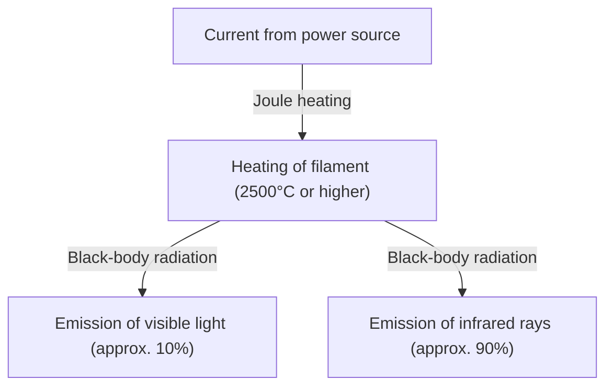
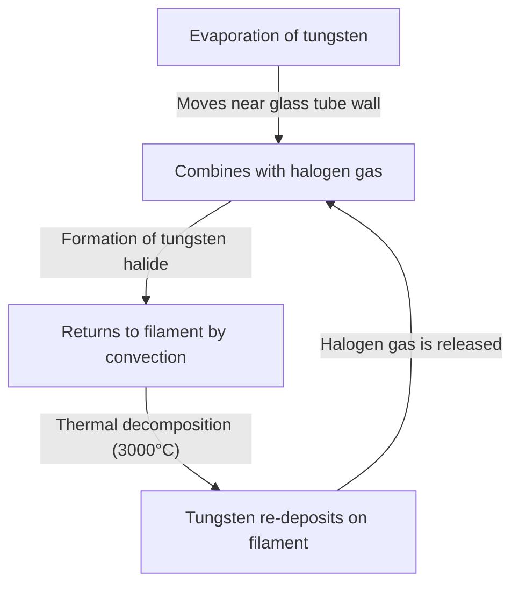

The incandescent light bulb is a great invention that fundamentally changed the history of human nights. Commercialized by Thomas Edison, Joseph Swan, and others, it has continued to illuminate the world for over a century. Today, it is giving way to highly efficient lighting such as LEDs, but the mechanism by which incandescent light bulbs emit light is extremely interesting for learning the basics of physics and materials science, and possesses a beautiful mechanism.

In this article, we will explain in detail how the filament of an incandescent light bulb emits light, the physics of Joule heating and black-body radiation behind it, and the mystery of why it reaches the end of its lifespan.

## 1. The Principle of Creating Light: Joule Heating and Black-Body Radiation

The most basic principle of an incandescent light bulb is to utilize the heat generated when an electric current flows through a substance (Joule heating) to heat the substance to a high temperature and cause it to emit light (black-body radiation).

### Generation of Joule Heating

When an electric current is passed through a conductor such as a metal, moving electrons collide with atoms within the conductor, and their kinetic energy is converted into thermal energy. This is Joule heating.
The amount of heat generated $Q$ is expressed by Joule's law using current $I$, resistance $R$, and time $t$ as follows:

$Q = I^2 R t$

The filament of an incandescent light bulb is intentionally made very thin so that its electrical resistance becomes large, and by passing a current through it, it is rapidly heated to an ultra-high temperature of 2,000°C to 3,000°C.

### Light Emission by Black-Body Radiation (Thermal Radiation)

When an object becomes high in temperature, it radiates electromagnetic waves according to its temperature. This is called black-body radiation (or thermal radiation). It is the same principle as when iron is heated, it first glows red, and as the temperature is raised further, it shines white.

The peak wavelength $\lambda_{max}$ of the energy radiated by a black body at temperature $T$ is expressed by Wien's displacement law as follows:

$\lambda_{max} = \frac{b}{T}$ (where $b$ is Wien's displacement constant, approximately $2.898 \times 10^{-3} \text{ m}\cdot\text{K}$)

When the temperature of the filament reaches about 2,500°C (about 2,773K), part of the radiated electromagnetic waves enters the "visible light" range visible to the human eye and is recognized as light. However, since most of the energy (over 90%) is radiated as infrared rays (heat), the incandescent light bulb is not very energy efficient as lighting. This is the reason why "light bulbs are hot."

## 2. Materials Science of the Filament: Why Tungsten?

Early light bulbs (such as those developed by Edison) used "carbon filaments," which were made by carbonizing bamboo harvested in Yawata, Kyoto, Japan. However, carbon had a short lifespan, and a material that could withstand higher temperatures was needed to make it even brighter.

Therefore, **Tungsten (W)** is adopted for modern incandescent light bulbs. There are clear physical and chemical reasons why tungsten was chosen:

1. **Extremely high melting point**: Tungsten has a melting point of 3,422°C, the highest of all metals. Since the filament of an incandescent light bulb reaches nearly 3,000°C, tungsten, which does not melt off even at this temperature, is optimal.
2. **Low vapor pressure**: It has the characteristic of being hard to vaporize (evaporate) even at high temperatures. If evaporation is fast, the filament quickly becomes thin and breaks.
3. **Workability**: It can be stretched into a thin wire, and by winding it into a coil shape (such as a double coil), a long filament can be accommodated in a limited space, increasing the surface area and gaining brightness.

## 3. Gas Inside the Bulb and the Mystery of Lifespan

What is it like inside the glass bulb of an incandescent light bulb? It is often thought to be a simple vacuum, but the inside of a typical modern incandescent bulb is filled with an **inert gas (such as argon or nitrogen)**.

### The Battle with Evaporation and Inert Gas

If the inside of the glass bulb is a perfect vacuum, the tungsten, which has reached a high temperature, will rapidly evaporate (sublimate). The evaporated tungsten adheres to the inside of the glass, turning the glass black (blackening phenomenon), and the filament itself becomes thinner and eventually breaks (lifespan).

To prevent this, an inert gas such as argon or a small amount of nitrogen, which does not chemically react with tungsten, is sealed inside the glass bulb. The pressure of the gas physically suppresses the vaporization of tungsten atoms, thereby extending its lifespan.

### Innovation of the Halogen Lamp: The Halogen Cycle

An evolutionary form of the incandescent light bulb is the "halogen lamp." This is a glass bulb filled with a trace amount of halogen gas (such as iodine or bromine).
In a halogen lamp, a brilliant chemical recycling process called the "halogen cycle" occurs as follows:

1. Tungsten evaporates from the filament at high temperatures.
2. The evaporated tungsten combines with halogen gas in the relatively low-temperature region near the glass tube wall to form tungsten halide.
3. This gaseous tungsten halide is carried back near the high-temperature filament by convection.
4. The high temperature causes the tungsten halide to decompose, the tungsten returns to the filament (deposition), and the halogen gas is released again.

By this cycle, it is possible to prevent the blackening of the glass and at the same time suppress the consumption of the filament, making it possible to emit light at a higher temperature, and as a result, it becomes brighter and has a longer life than a normal incandescent light bulb.

## 4. How is the Lifespan of an Incandescent Light Bulb Determined?

The lifespan of an incandescent light bulb is reached the moment the filament breaks. So why does it break?

It is impossible to make the thickness of the filament completely uniform during manufacturing. Minute "thin parts" and "scratches" always exist.
When a current is passed through, the electrical resistance of this "thin part" becomes locally large, so more Joule heat is generated than in other parts, and the temperature becomes locally high (hot spot).

As the temperature rises, the evaporation of tungsten in that part proceeds faster than in other parts. As evaporation progresses, that part becomes even thinner. As it gets thinner, the resistance rises further, and the temperature rises further... This positive feedback (vicious cycle) occurs.
Eventually, this hot spot can no longer withstand it and melts (burns out). This is the mechanism by which the life of a light bulb comes to an end.

The reason why light bulbs tend to burn out the moment they are switched on is that tungsten has a low electrical resistance when it is cold, and the moment the switch is turned on, a large current (inrush current) that is several to more than a dozen times larger than in the steady state flows, placing a sudden burden on the hot spot.

## 5. From Incandescent Bulbs to LEDs, and Their Legacy

Currently, from the perspective of energy efficiency, the production and sale of incandescent light bulbs are regulated in countries around the world, and they are being replaced by LED (light-emitting diode) lighting, which can obtain the same brightness with less power. LEDs produce light by using energy emission caused by the recombination of electrons and holes in a semiconductor rather than thermal radiation, so energy loss as heat is extremely small, making them highly efficient.

However, the unique warm light (low color temperature) and natural color rendering with a continuous spectrum (how colors look close to sunlight) of incandescent light bulbs have the effect of relaxing a space, and they are still deeply popular as decorative lighting in restaurants and living rooms. In recent years, "filament LED bulbs" that reproduce the appearance and light emission of incandescent light bulb filaments despite being LEDs have also become widely popular.

## Conclusion

An incandescent light bulb may look like a simple "glowing glass ball" at first glance, but inside it is packed with the essence of physics and chemistry, such as Joule heating, black-body radiation, materials science, and the thermodynamics of gases. This technology, perfected over 100 years ago, freed human life from darkness and became the driving force that accelerated modernization.

The next time you have the opportunity to gaze at the warm light of an incandescent bulb, please think about the fierce collisions of electrons occurring within that thin tungsten and the universal laws of thermal radiation emitted from it.
