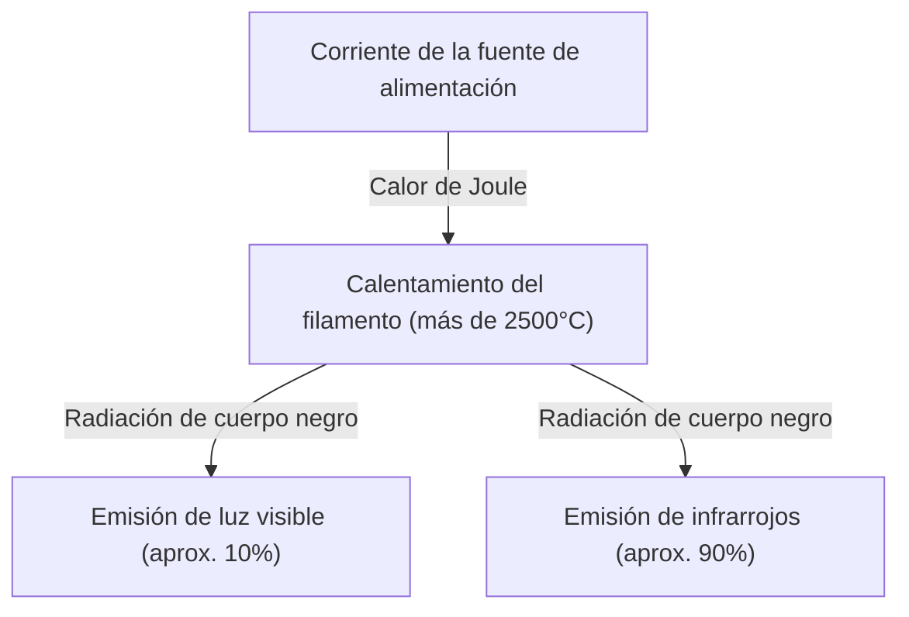
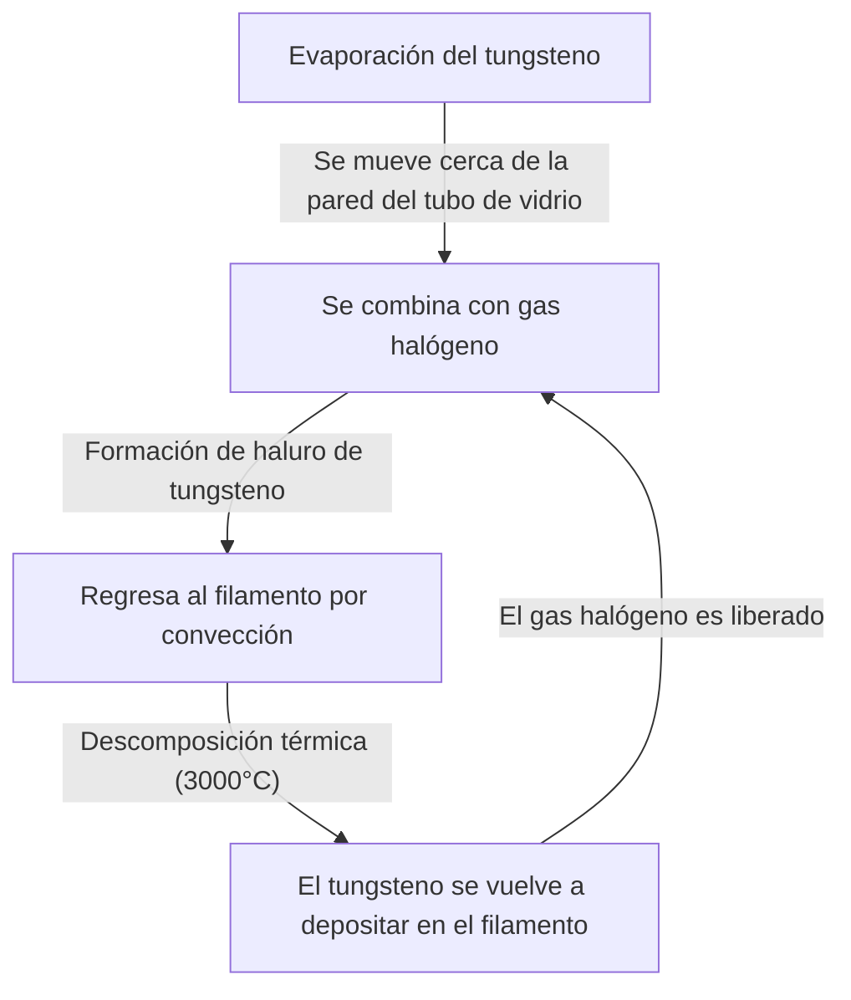

La bombilla incandescente es un gran invento que cambió fundamentalmente la historia de las noches de la humanidad. Comercializada por Thomas Edison, Joseph Swan y otros, ha seguido iluminando el mundo durante más de un siglo. Aunque en la actualidad está cediendo su lugar a iluminaciones de alta eficiencia como el LED, el mecanismo por el cual la bombilla incandescente emite luz es fascinante para aprender los fundamentos de la física y la ciencia de los materiales, y posee un mecanismo hermoso.

En este artículo, explicaremos en detalle cómo el filamento de una bombilla incandescente emite luz, la física del calor de Joule y la radiación de cuerpo negro que hay detrás, y el misterio de por qué llega al final de su vida útil.

## 1. El principio de generación de luz: calor de Joule y radiación de cuerpo negro

El principio más básico de una bombilla incandescente es utilizar el calor (calor de Joule) generado cuando la corriente eléctrica fluye a través de un material, calentándolo a alta temperatura para que emita luz (radiación de cuerpo negro).

### Generación de calor de Joule

Cuando una corriente eléctrica fluye a través de un conductor como un metal, los electrones en movimiento chocan con los átomos dentro del conductor, y esa energía cinética se convierte en energía térmica. Esto es el calor de Joule.
La cantidad de calor generado $Q$ se expresa mediante la siguiente Ley de Joule utilizando la corriente $I$, la resistencia $R$ y el tiempo $t$.

$Q = I^2 R t$

El filamento de una bombilla incandescente se hace intencionalmente muy delgado para que su resistencia eléctrica sea alta, y al pasar corriente eléctrica, se calienta rápidamente, alcanzando temperaturas ultra altas de 2.000°C a 3.000°C.

### Emisión de luz por radiación de cuerpo negro (radiación térmica)

Cuando un objeto alcanza altas temperaturas, emite ondas electromagnéticas correspondientes a esa temperatura. Esto se llama radiación de cuerpo negro (o radiación térmica). Es el mismo principio por el cual el hierro brilla de color rojo al principio cuando se calienta, y brilla de color blanco si la temperatura aumenta aún más.

La longitud de onda pico $\lambda_{max}$ de la energía irradiada por un cuerpo negro a temperatura $T$ se expresa mediante la ley de desplazamiento de Wien de la siguiente manera.

$\lambda_{max} = \frac{b}{T}$ (donde $b$ es la constante de desplazamiento de Wien, aproximadamente $2.898 \times 10^{-3} \text{ m}\cdot\text{K}$)

Cuando la temperatura del filamento alcanza unos 2.500°C (aproximadamente 2.773K), parte de las ondas electromagnéticas radiadas entra en el espectro de la "luz visible" que los ojos humanos pueden ver, y se percibe como luz. Sin embargo, dado que la mayor parte de la energía (más del 90%) se irradia como infrarrojos (calor), las bombillas incandescentes no son muy eficientes energéticamente como iluminación. Esta es la razón por la que "las bombillas están calientes".

## 2. Ciencia de los materiales del filamento: ¿Por qué tungsteno?

Las primeras bombillas (como las desarrolladas por Edison) utilizaban un "filamento de carbono" hecho carbonizando bambú cosechado en Yawata, Kioto, Japón. Sin embargo, el carbono tenía una vida útil corta, y para hacerlas más brillantes se requería un material que pudiera soportar temperaturas más altas.

Por lo tanto, las bombillas incandescentes modernas emplean **tungsteno (Tungsten, símbolo químico: W)**. Hay claras razones físicas y químicas por las que se eligió el tungsteno:

1. **Punto de fusión extremadamente alto**: El punto de fusión del tungsteno es de 3.422°C, el más alto de todos los metales. Dado que el filamento de una bombilla incandescente alcanza casi 3.000°C, el tungsteno es ideal porque no se funde incluso a esta temperatura.
2. **Baja presión de vapor**: Tiene la característica de ser difícil de vaporizar (evaporar) incluso a altas temperaturas. Si la evaporación es rápida, el filamento se adelgazaría rápidamente y se rompería.
3. **Trabajabilidad**: Se puede estirar en alambres finos y, además, enrollarlo en forma de bobina (como una doble bobina) permite alojar un filamento largo en un espacio limitado, aumentando la superficie para ganar luminosidad.

## 3. El gas dentro de la bombilla y el misterio de su vida útil

¿Cómo es el interior del bulbo de vidrio de una bombilla incandescente? A menudo se piensa que es un simple vacío, pero el interior de una bombilla incandescente general moderna está lleno de un **gas inerte (como argón o nitrógeno)**.

### La batalla contra la evaporación y el gas inerte

Si el interior del bulbo de vidrio fuera un vacío perfecto, el tungsteno calentado a alta temperatura se evaporaría (sublimaría) rápidamente. El tungsteno evaporado se adheriría al interior del vidrio, oscureciéndolo (fenómeno de ennegrecimiento), y el filamento mismo se volvería más delgado, terminando por romperse (vida útil).

Para evitar esto, se encierra un gas inerte, como argón o una pequeña cantidad de nitrógeno, que no causa reacciones químicas con el tungsteno dentro del bulbo de vidrio. La presión del gas suprime físicamente la vaporización de los átomos de tungsteno, prolongando su vida útil.

### La innovación de la lámpara halógena: El ciclo halógeno

Una forma evolucionada de la bombilla incandescente es la "lámpara halógena". Esta contiene una cantidad traza de gas halógeno (como yodo o bromo) dentro del bulbo de vidrio.
En una lámpara halógena tiene lugar un brillante reciclaje químico llamado "ciclo halógeno", como se describe a continuación:

1. El tungsteno se evapora del filamento a altas temperaturas.
2. El tungsteno evaporado se combina con el gas halógeno en la región relativamente más fría cerca de la pared del tubo de vidrio para convertirse en un haluro de tungsteno.
3. Este haluro de tungsteno en estado gaseoso es transportado de vuelta cerca del filamento de alta temperatura por convección.
4. Las altas temperaturas hacen que el haluro de tungsteno se descomponga, el tungsteno regrese al filamento (deposición), y el gas halógeno se libere nuevamente.

Este ciclo previene el ennegrecimiento del vidrio y al mismo tiempo reduce el consumo del filamento, lo que permite que emita luz a temperaturas más altas, resultando en una vida útil más brillante y larga que una bombilla incandescente normal.

## 4. ¿Cómo se determina la vida útil de una bombilla incandescente?

La vida útil de una bombilla incandescente termina en el momento en que se rompe el filamento. Entonces, ¿por qué se rompe?

Es imposible que el grosor del filamento sea perfectamente uniforme durante la fabricación. Siempre existen minúsculas "partes delgadas" o "rayaduras".
Cuando fluye corriente eléctrica, la resistencia eléctrica aumenta localmente en estas "partes delgadas", generando un calor de Joule adicional en comparación con otras partes, provocando un aumento de temperatura localizado (punto caliente).

Cuando la temperatura aumenta, la evaporación del tungsteno en esa parte procede más rápido que en otras. A medida que avanza la evaporación, esa parte se vuelve aún más delgada. Cuando se vuelve más delgada, la resistencia aumenta aún más, lo que provoca temperaturas más altas... ocurriendo así una retroalimentación positiva (círculo vicioso).
Finalmente, este punto caliente no puede soportarlo y se funde (se quema y se rompe). Este es el mecanismo por el cual termina la vida de una bombilla.

La razón por la que las bombillas se rompen a menudo en el instante en que se encienden es porque el tungsteno en estado frío tiene una baja resistencia eléctrica, y en el instante en que se enciende, fluye una gran corriente (corriente de irrupción) que es varias veces a decenas de veces mayor que en estado estacionario, poniendo una carga repentina en el punto caliente.

## 5. De la bombilla incandescente al LED, y su legado

En la actualidad, desde el punto de vista de la eficiencia energética, la producción y venta de bombillas incandescentes están reguladas en todo el mundo, y están siendo reemplazadas por iluminación LED (diodo emisor de luz), que puede obtener el mismo brillo con menos consumo de energía. Debido a que el LED produce luz utilizando la liberación de energía por la recombinación de electrones y huecos en un semiconductor en lugar de la radiación térmica, la pérdida de energía en forma de calor es extremadamente pequeña, haciéndolo altamente eficiente.

Sin embargo, la luz peculiarmente cálida (baja temperatura de color) y la reproducción de color natural con un espectro continuo (apariencia de color cercana a la luz solar) que tienen las bombillas incandescentes, tienen un efecto relajante en los espacios, y siguen siendo muy populares como iluminación decorativa en restaurantes y salas de estar. En los últimos años, las "bombillas LED de filamento", que reproducen el aspecto y la forma de brillar del filamento de una bombilla incandescente mientras son LEDs, también se han vuelto muy populares.

## Resumen

Una bombilla incandescente, a primera vista, es solo una "bola de vidrio brillante", pero en su interior contiene lo mejor de la física y la química, como el calor de Joule, la radiación de cuerpo negro, la ciencia de los materiales y la termodinámica de gases. Esta tecnología, perfeccionada hace más de 100 años, liberó la vida humana de la oscuridad y se convirtió en la fuerza motriz que aceleró la modernización.

La próxima vez que tengas la oportunidad de contemplar la cálida luz de una bombilla incandescente, tómate un momento para pensar en las violentas colisiones de electrones que ocurren dentro de ese delgado tungsteno y las leyes cósmicas de radiación térmica que emanan de él.
