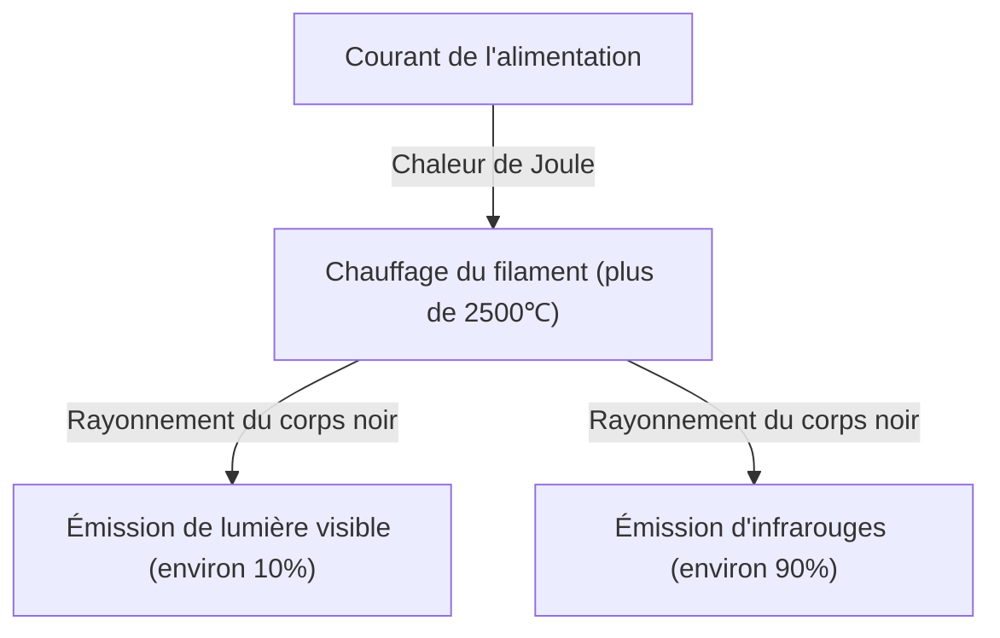
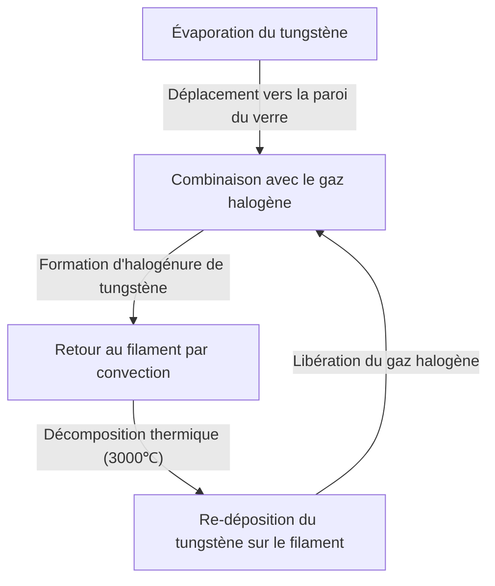

L'ampoule à incandescence est une grande invention qui a fondamentalement changé l'histoire des nuits de l'humanité. Mise en pratique par Thomas Edison, Joseph Swan et d'autres, elle a éclairé le monde entier pendant plus d'un siècle. Bien qu'elle cède aujourd'hui sa place à des éclairages à haute efficacité comme les LED, le mécanisme par lequel l'ampoule à incandescence émet de la lumière est extrêmement intéressant pour l'apprentissage des bases de la physique et de la science des matériaux, et possède une belle mécanique.

Dans cet article, nous expliquerons en détail comment le filament d'une ampoule à incandescence émet de la lumière, la physique de la chaleur de Joule et du rayonnement du corps noir qui se cache derrière, ainsi que le mystère de sa durée de vie.

## 1. Le principe de création de la lumière : chaleur de Joule et rayonnement du corps noir

Le principe le plus fondamental de l'ampoule à incandescence est d'utiliser la chaleur générée lorsqu'un courant électrique traverse une matière (chaleur de Joule) pour porter cette matière à haute température et la faire émettre de la lumière (rayonnement du corps noir).

### Génération de la chaleur de Joule

Lorsqu'un courant électrique traverse un conducteur comme un métal, les électrons en mouvement entrent en collision avec les atomes du conducteur, et leur énergie cinétique est convertie en énergie thermique. C'est la chaleur de Joule.
La quantité de chaleur générée $Q$ est exprimée par la loi de Joule suivante, en utilisant le courant $I$, la résistance $R$ et le temps $t$.

$Q = I^2 R t$

Le filament d'une ampoule à incandescence est intentionnellement rendu très fin pour que sa résistance électrique soit importante. En y faisant passer un courant, il chauffe rapidement et atteint une température ultra-haute de 2 000 ℃ à 3 000 ℃.

### Émission par rayonnement du corps noir (rayonnement thermique)

Lorsqu'un objet atteint une température élevée, il émet des ondes électromagnétiques correspondant à cette température. C'est ce qu'on appelle le rayonnement du corps noir (ou rayonnement thermique). C'est le même principe que le fer qui brille d'abord en rouge lorsqu'on le chauffe, puis d'un éclat blanc à mesure que la température augmente.

La longueur d'onde de pointe $\lambda_{max}$ de l'énergie rayonnée par un corps noir à la température $T$ est exprimée par la loi du déplacement de Wien comme suit :

$\lambda_{max} = \frac{b}{T}$ ($b$ est la constante de déplacement de Wien, environ $2,898 \times 10^{-3} \text{ m}\cdot\text{K}$)

Lorsque la température du filament atteint environ 2 500 ℃ (environ 2 773 K), une partie des ondes électromagnétiques émises entre dans le domaine de la "lumière visible" que l'œil humain peut percevoir, et est reconnue comme de la lumière. Cependant, la grande majorité de l'énergie (plus de 90 %) étant rayonnée sous forme d'infrarouges (chaleur), l'ampoule à incandescence n'a pas une très bonne efficacité énergétique en tant qu'éclairage. C'est la raison pour laquelle "l'ampoule est chaude".

## 2. Science des matériaux du filament : Pourquoi le tungstène ?

Dans les premières ampoules (comme celles développées par Edison), on utilisait un "filament de carbone" fabriqué à partir de bambou carbonisé, récolté à Yawata, Kyoto, au Japon. Cependant, le carbone avait une courte durée de vie, et pour obtenir plus de luminosité, il fallait un matériau capable de résister à des températures encore plus élevées.

C'est pourquoi le **tungstène (Tungsten, symbole chimique : W)** est utilisé dans les ampoules à incandescence modernes. Le choix du tungstène repose sur les raisons physiques et chimiques claires suivantes :

1. **Point de fusion extrêmement élevé** : Le point de fusion du tungstène est de 3 422 ℃, le plus élevé de tous les métaux. Le filament de l'ampoule atteignant près de 3 000 ℃, le tungstène, qui ne fond pas à cette température, est optimal.
2. **Faible pression de vapeur** : Il a la caractéristique d'être difficile à vaporiser (évaporer) même à haute température. Si l'évaporation est rapide, le filament s'amincit rapidement et se rompt.
3. **Maniabilité** : Il peut être étiré en un fil fin, qui peut ensuite être enroulé en forme de bobine (comme une double bobine). Cela permet de loger un long filament dans un espace restreint, d'augmenter la surface et de gagner en luminosité.

## 3. Le gaz dans l'ampoule et le mystère de sa durée de vie

Que se passe-t-il à l'intérieur du globe de verre d'une ampoule à incandescence ? On pense souvent qu'il s'agit d'un simple vide, mais à l'intérieur d'une ampoule moderne ordinaire se trouve un **gaz inerte (comme l'argon ou l'azote)**.

### La lutte contre l'évaporation et le gaz inerte

Si l'intérieur du globe de verre était complètement vide, le tungstène à haute température s'évaporerait (se sublimerait) rapidement. Le tungstène évaporé se déposerait à l'intérieur du verre, le rendant noir et opaque (phénomène de noircissement), et le filament lui-même s'amincirait pour finalement se rompre (fin de vie).

Pour éviter cela, on enferme dans le globe un gaz inerte qui ne réagit pas chimiquement avec le tungstène, comme l'argon ou une petite quantité d'azote. La pression du gaz réprime physiquement la vaporisation des atomes de tungstène, prolongeant ainsi sa durée de vie.

### L'innovation des lampes halogènes : Le cycle halogène

Il existe une forme évoluée de l'ampoule à incandescence : la "lampe halogène". Elle contient une infime quantité de gaz halogène (comme l'iode ou le brome) à l'intérieur de son globe.
Dans une lampe halogène se produit un remarquable recyclage chimique appelé "cycle halogène" :

1. Le tungstène s'évapore du filament à haute température.
2. Le tungstène évaporé se combine au gaz halogène dans la zone relativement plus froide près de la paroi du tube de verre pour former un halogénure de tungstène.
3. Cet halogénure de tungstène gazeux est ramené près du filament à haute température par convection.
4. En raison de la haute température, l'halogénure de tungstène se décompose ; le tungstène retourne (se dépose) sur le filament et le gaz halogène est de nouveau libéré.

Grâce à ce cycle, il est possible de prévenir le noircissement du verre tout en limitant l'usure du filament. Cela permet de le faire briller à une température plus élevée, ce qui donne au final une lumière plus vive et une plus longue durée de vie qu'une ampoule à incandescence classique.

## 4. Comment se détermine la durée de vie d'une ampoule à incandescence ?

La fin de vie d'une ampoule à incandescence survient au moment où le filament se rompt. Mais pourquoi se rompt-il ?

Il est impossible de rendre l'épaisseur du filament parfaitement uniforme lors de la fabrication. Il y a toujours de minuscules "parties fines" ou des "défauts".
Lorsqu'un courant circule, la résistance électrique de ces "parties fines" devient localement plus élevée. Ainsi, elles génèrent plus de chaleur de Joule que les autres parties et leur température augmente localement (point chaud).

Lorsque la température augmente, l'évaporation du tungstène à cet endroit progresse plus rapidement qu'ailleurs. À mesure que l'évaporation se poursuit, cette partie devient encore plus fine. Plus elle est fine, plus la résistance augmente, ce qui élève encore plus la température... créant ainsi une boucle de rétroaction positive (un cercle vicieux).
Finalement, ce point chaud ne peut plus résister et fond (grille). C'est le mécanisme par lequel l'ampoule arrive en fin de vie.

Si l'ampoule a tendance à griller au moment exact où on l'allume, c'est parce que le tungstène froid a une faible résistance électrique. À l'instant de l'allumage, un courant (courant d'appel) plusieurs fois à une douzaine de fois supérieur au courant de régime normal circule, surchargeant d'un coup le point chaud.

## 5. De l'ampoule à incandescence à la LED, et son héritage

Aujourd'hui, pour des raisons d'efficacité énergétique, la production et la vente d'ampoules à incandescence sont réglementées dans le monde entier. Elles sont progressivement remplacées par des éclairages LED (diodes électroluminescentes) qui offrent la même luminosité pour une consommation électrique bien moindre. Comme la LED produit de la lumière grâce à la recombinaison d'électrons et de trous dans un semi-conducteur plutôt que par rayonnement thermique, la perte d'énergie sous forme de chaleur est extrêmement faible, ce qui la rend très efficace.

Cependant, la lumière chaleureuse si particulière de l'ampoule à incandescence (faible température de couleur) et son rendu des couleurs naturel au spectre continu (apparence des couleurs proche de la lumière du soleil) ont un effet relaxant sur l'espace. Elle reste donc très prisée comme éclairage décoratif dans les restaurants et les salons. Ces dernières années, les "ampoules LED à filament", qui sont des LED mais reproduisent l'apparence et le mode d'éclairage du filament des ampoules à incandescence, se sont largement répandues.

## Conclusion

L'ampoule à incandescence n'est à première vue qu'une "boule de verre lumineuse", mais elle renferme le summum de la physique et de la chimie : chaleur de Joule, rayonnement du corps noir, science des matériaux et thermodynamique des gaz. Cette technologie, perfectionnée il y a plus de 100 ans, a libéré la vie humaine de l'obscurité et a été le moteur accélérant la modernisation.

La prochaine fois que vous aurez l'occasion de contempler la douce lumière d'une ampoule à incandescence, pensez aux violentes collisions d'électrons qui se produisent dans son fin fil de tungstène et aux lois cosmiques du rayonnement thermique qui s'en dégagent.
