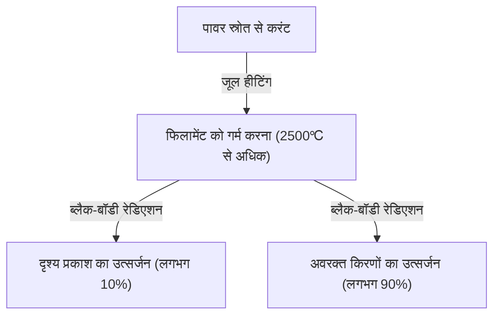
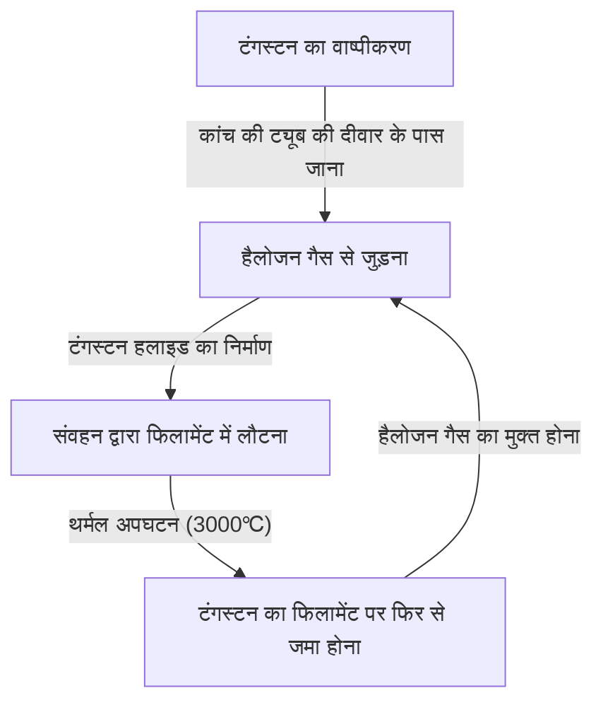

इनकैंडेसेंट लाइट बल्ब (Incandescent light bulb) एक महान आविष्कार है जिसने मानव जाति के रात के इतिहास को मौलिक रूप से बदल दिया। थॉमस एडिसन और जोसेफ स्वान जैसे लोगों द्वारा इसे व्यावहारिक बनाया गया और एक सदी से भी अधिक समय तक इसने दुनिया भर में रोशनी फैलाई है। वर्तमान में, यद्यपि इसकी जगह एलईडी (LED) जैसी उच्च दक्षता वाली रोशनी ले रही है, लेकिन इनकैंडेसेंट बल्ब के प्रकाश उत्सर्जित करने का तंत्र भौतिकी और सामग्री विज्ञान के मूल सिद्धांतों को जानने के लिए बहुत ही रोचक है और इसका एक सुंदर तंत्र है।

इस लेख में, हम विस्तार से बताएंगे कि इनकैंडेसेंट बल्ब का फिलामेंट कैसे प्रकाश उत्सर्जित करता है, इसके पीछे जूल हीटिंग (Joule heating) और ब्लैक-बॉडी रेडिएशन (black-body radiation) की भौतिकी, और इसके जीवनकाल के समाप्त होने का रहस्य क्या है।

## 1. प्रकाश उत्पन्न करने का सिद्धांत: जूल हीटिंग और ब्लैक-बॉडी रेडिएशन

इनकैंडेसेंट बल्ब का सबसे बुनियादी सिद्धांत उस ऊष्मा (जूल हीटिंग) का उपयोग करना है जो तब उत्पन्न होती है जब करंट किसी पदार्थ से प्रवाहित होता है, और पदार्थ को उच्च तापमान पर गर्म करके प्रकाश (ब्लैक-बॉडी रेडिएशन) उत्सर्जित करना है।

### जूल हीटिंग की उत्पत्ति

जब धातु जैसे कंडक्टर के माध्यम से करंट प्रवाहित होता है, तो गतिमान इलेक्ट्रॉन कंडक्टर के भीतर परमाणुओं से टकराते हैं, और उनकी गतिज ऊर्जा ऊष्मीय ऊर्जा में परिवर्तित हो जाती है। इसे जूल हीटिंग कहा जाता है।
उत्पन्न ऊष्मा की मात्रा $Q$ को करंट $I$, प्रतिरोध $R$ और समय $t$ का उपयोग करके जूल के नियम द्वारा इस प्रकार व्यक्त किया जाता है:

$Q = I^2 R t$

इनकैंडेसेंट बल्ब के फिलामेंट को जानबूझकर बहुत पतला बनाया जाता है ताकि विद्युत प्रतिरोध अधिक हो, और करंट प्रवाहित करने से यह तेजी से गर्म हो जाता है, जिससे 2,000℃ से 3,000℃ का अति-उच्च तापमान पहुँचता है।

### ब्लैक-बॉडी रेडिएशन (थर्मल रेडिएशन) द्वारा प्रकाश उत्सर्जन

जब कोई वस्तु उच्च तापमान पर पहुँचती है, तो वह अपने तापमान के अनुसार विद्युत चुम्बकीय तरंगें उत्सर्जित करती है। इसे ब्लैक-बॉडी रेडिएशन (या थर्मल रेडिएशन) कहा जाता है। यह उसी सिद्धांत पर काम करता है जैसे लोहे को गर्म करने पर पहले वह लाल चमकता है, और जब तापमान और अधिक बढ़ाया जाता है, तो वह सफेद चमकने लगता है।

तापमान $T$ के ब्लैक-बॉडी द्वारा उत्सर्जित ऊर्जा की पीक वेवलेंथ $\lambda_{max}$, वीन के विस्थापन नियम (Wien's displacement law) द्वारा इस प्रकार व्यक्त की जाती है:

$\lambda_{max} = \frac{b}{T}$ ($b$ वीन का विस्थापन स्थिरांक है, लगभग $2.898 \times 10^{-3} \text{ m}\cdot\text{K}$)

जब फिलामेंट का तापमान लगभग 2,500℃ (लगभग 2,773K) तक पहुँच जाता है, तो उत्सर्जित विद्युत चुम्बकीय तरंगों का एक हिस्सा मानव आंख को दिखाई देने वाले "दृश्य प्रकाश" क्षेत्र में प्रवेश करता है, और इसे प्रकाश के रूप में पहचाना जाता है। हालांकि, अधिकांश ऊर्जा (लगभग 90% से अधिक) अवरक्त किरणों (ऊष्मा) के रूप में उत्सर्जित होती है, इसलिए रोशनी के रूप में इनकैंडेसेंट बल्ब की ऊर्जा दक्षता बहुत अधिक नहीं है। यही कारण है कि "बल्ब गर्म होता है"।

## 2. फिलामेंट का सामग्री विज्ञान: टंगस्टन ही क्यों?

शुरुआती बल्बों (जैसे कि एडिसन द्वारा विकसित) में जापान के क्योटो के यवाता से प्राप्त बांस को कार्बोनाइज करके "कार्बन फिलामेंट" का उपयोग किया गया था। हालांकि, कार्बन का जीवनकाल छोटा था, और इसे और अधिक चमकीला बनाने के लिए ऐसी सामग्री की आवश्यकता थी जो उच्च तापमान का सामना कर सके।

इसलिए, आधुनिक इनकैंडेसेंट बल्बों में **टंगस्टन (Tungsten, रासायनिक प्रतीक: W)** का उपयोग किया जाता है। टंगस्टन को चुनने के निम्नलिखित स्पष्ट भौतिक और रासायनिक कारण हैं:

1. **अत्यंत उच्च गलनांक**: टंगस्टन का गलनांक 3,422℃ है, जो सभी धातुओं में सबसे अधिक है। चूँकि इनकैंडेसेंट बल्ब का फिलामेंट लगभग 3,000℃ तक पहुँच जाता है, टंगस्टन, जो इस तापमान पर भी नहीं पिघलता, सबसे उपयुक्त है।
2. **कम वाष्प दबाव**: इसमें उच्च तापमान पर भी वाष्पीकृत (वाष्पीकरण) न होने का गुण होता है। यदि वाष्पीकरण तेज होता है, तो फिलामेंट जल्दी पतला हो जाएगा और टूट जाएगा।
3. **व्यावहारिकता**: इसे एक पतले तार (वायर) में खींचा जा सकता है, और इसे कुंडलित आकार (जैसे डबल कॉइल) में लपेटकर एक सीमित स्थान में लंबे फिलामेंट को रखा जा सकता है, जिससे सतह का क्षेत्रफल बढ़ जाता है और अधिक चमक प्राप्त होती है।

## 3. बल्ब के अंदर गैस और जीवनकाल का रहस्य

इनकैंडेसेंट बल्ब के कांच के गोले के अंदर क्या है? अक्सर इसे केवल निर्वात (vacuum) माना जाता है, लेकिन आधुनिक सामान्य इनकैंडेसेंट बल्बों के अंदर **अक्रिय गैस (जैसे आर्गन या नाइट्रोजन)** भरी जाती है।

### वाष्पीकरण के साथ लड़ाई और अक्रिय गैस

यदि कांच के गोले के अंदर पूरी तरह से निर्वात होता, तो उच्च तापमान वाला टंगस्टन तेजी से वाष्पीकृत (ऊर्ध्वपातन) हो जाता। वाष्पीकृत टंगस्टन कांच के अंदर चिपक जाता है और कांच को काला (ब्लैकनिंग घटना) कर देता है, और फिलामेंट स्वयं भी पतला हो जाता है और अंततः टूट जाता है (जीवनकाल)।

इसे रोकने के लिए, कांच के गोले में आर्गन या थोड़ी मात्रा में नाइट्रोजन जैसी अक्रिय गैसें भरी जाती हैं, जो टंगस्टन के साथ रासायनिक प्रतिक्रिया नहीं करती हैं। गैस का दबाव भौतिक रूप से टंगस्टन परमाणुओं को वाष्पीकृत होने से रोकता है, जिससे जीवनकाल बढ़ता है।

### हैलोजन लैंप का नवाचार: हैलोजन चक्र

इनकैंडेसेंट बल्ब का एक उन्नत रूप "हैलोजन लैंप" है। इसमें कांच के गोले के अंदर थोड़ी मात्रा में हैलोजन गैस (जैसे आयोडीन या ब्रोमीन) भरी जाती है।
हैलोजन लैंप में, "हैलोजन चक्र" नामक एक उत्कृष्ट रासायनिक रीसाइक्लिंग होती है, जैसा कि नीचे बताया गया है:

1. टंगस्टन उच्च तापमान पर फिलामेंट से वाष्पीकृत हो जाता है।
2. वाष्पीकृत टंगस्टन कांच की ट्यूब की दीवार के पास अपेक्षाकृत कम तापमान वाले क्षेत्र में हैलोजन गैस के साथ जुड़ जाता है और टंगस्टन हलाइड बन जाता है।
3. यह गैसीय टंगस्टन हलाइड संवहन द्वारा वापस उच्च तापमान वाले फिलामेंट के पास लाया जाता है।
4. उच्च तापमान के कारण टंगस्टन हलाइड विघटित हो जाता है, और टंगस्टन फिलामेंट (जमाव) पर वापस आ जाता है, और हैलोजन गैस फिर से अलग हो जाती है।

इस चक्र के माध्यम से, कांच को काला होने से रोका जा सकता है और साथ ही फिलामेंट की खपत को भी कम किया जा सकता है, जिससे इसे उच्च तापमान पर प्रकाश उत्सर्जित करना संभव हो जाता है। परिणामस्वरूप, यह सामान्य इनकैंडेसेंट बल्बों की तुलना में अधिक चमकीला होता है और इसका जीवनकाल लंबा होता है।

## 4. इनकैंडेसेंट बल्ब का जीवनकाल कैसे तय होता है?

इनकैंडेसेंट बल्ब का जीवनकाल उस क्षण समाप्त होता है जब फिलामेंट टूट जाता है। तो, यह क्यों टूटता है?

निर्माण के दौरान फिलामेंट की मोटाई को पूरी तरह से एक समान बनाना असंभव है। हमेशा सूक्ष्म "पतले हिस्से" या "खरोंच" होते हैं।
जब करंट प्रवाहित होता है, तो इन "पतले हिस्सों" का विद्युत प्रतिरोध स्थानीय रूप से बढ़ जाता है, जिससे अन्य हिस्सों की तुलना में अधिक जूल हीटिंग उत्पन्न होती है और स्थानीय रूप से तापमान अधिक हो जाता है (हॉट स्पॉट)।

जैसे-जैसे तापमान बढ़ता है, उस हिस्से में टंगस्टन का वाष्पीकरण अन्य हिस्सों की तुलना में तेजी से होता है। जैसे-जैसे वाष्पीकरण आगे बढ़ता है, वह हिस्सा और भी पतला हो जाता है। जब यह पतला हो जाता है, तो प्रतिरोध और बढ़ जाता है, यह और भी गर्म हो जाता है... और इस प्रकार एक सकारात्मक प्रतिक्रिया (दुष्चक्र) उत्पन्न होती है।
अंततः, यह हॉट स्पॉट इसे सहन नहीं कर पाता और पिघल कर टूट जाता है (बर्न आउट)। यही बल्ब का जीवनकाल समाप्त होने का तंत्र है।

स्विच चालू करते ही बल्ब के टूटने की संभावना अधिक होती है क्योंकि ठंडी अवस्था में टंगस्टन का विद्युत प्रतिरोध कम होता है, और स्विच चालू करते ही सामान्य से कई गुना से लेकर दर्जनों गुना अधिक (इनरश करंट) प्रवाहित होता है, जिससे हॉट स्पॉट पर अचानक भार पड़ता है।

## 5. इनकैंडेसेंट बल्ब से एलईडी तक, और इसकी विरासत

वर्तमान में, ऊर्जा दक्षता के दृष्टिकोण से, इनकैंडेसेंट बल्बों के उत्पादन और बिक्री को दुनिया भर में विनियमित किया जा रहा है, और इन्हें एलईडी (प्रकाश उत्सर्जक डायोड) प्रकाश व्यवस्था से बदला जा रहा है, जो कम बिजली के साथ समान चमक प्रदान कर सकते हैं। एलईडी ऊष्मीय विकिरण के बजाय अर्धचालक के इलेक्ट्रॉन और होल के पुनर्संयोजन से ऊर्जा उत्सर्जन का उपयोग करके प्रकाश उत्पन्न करते हैं, इसलिए ऊष्मा के रूप में ऊर्जा की हानि बहुत कम होती है और यह अत्यधिक कुशल है।

हालांकि, इनकैंडेसेंट बल्बों की विशिष्ट गर्म रोशनी (कम रंग का तापमान) और निरंतर स्पेक्ट्रम के साथ प्राकृतिक रंग प्रतिपादन (सूर्य के प्रकाश के समान रंग का दिखना) अंतरिक्ष को आराम देने वाला प्रभाव डालता है, और वे अभी भी रेस्तरां और लिविंग रूम में सजावटी रोशनी के रूप में बहुत लोकप्रिय हैं। हाल के वर्षों में, "फिलामेंट एलईडी बल्ब", जो एलईडी होने के बावजूद इनकैंडेसेंट बल्ब के फिलामेंट की उपस्थिति और चमक को फिर से बनाते हैं, व्यापक रूप से लोकप्रिय हो गए हैं।

## निष्कर्ष

इनकैंडेसेंट बल्ब पहली नज़र में एक साधारण "चमकता हुआ कांच का गोला" लग सकता है, लेकिन यह जूल हीटिंग, ब्लैक-बॉडी रेडिएशन, सामग्री विज्ञान और गैस थर्मोडायनामिक्स जैसे भौतिकी और रसायन विज्ञान के उत्कृष्ट तत्वों से भरा हुआ है। 100 से अधिक साल पहले पूरी हुई इस तकनीक ने मानव जीवन को अंधेरे से मुक्त किया और आधुनिकीकरण में तेजी लाने वाली प्रेरक शक्ति बन गई।

अगली बार जब आपको इनकैंडेसेंट बल्ब की गर्म रोशनी को देखने का अवसर मिले, तो कृपया उस पतले टंगस्टन के अंदर हो रहे इलेक्ट्रॉनों की तीव्र टक्कर और उससे निकलने वाले ऊष्मीय विकिरण के ब्रह्मांडीय नियमों पर विचार करें।
