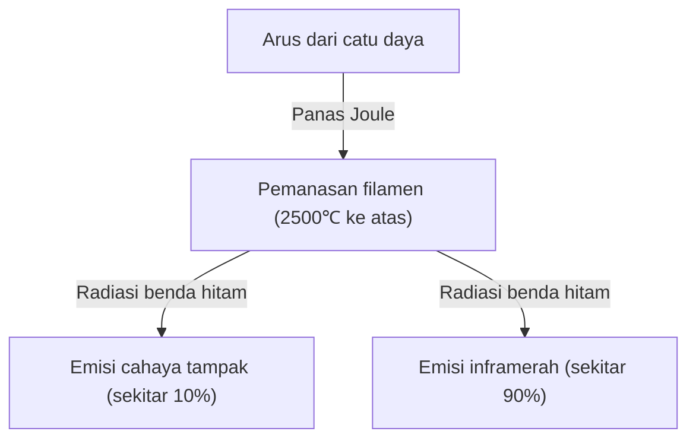
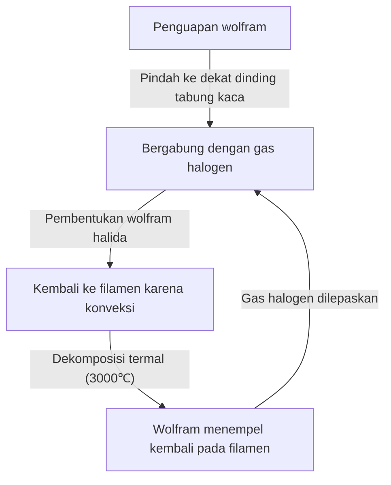

Bola lampu pijar adalah penemuan luar biasa yang secara fundamental mengubah sejarah malam hari umat manusia. Dipraktikkan oleh Thomas Edison dan Joseph Swan, lampu ini terus menerangi dunia selama lebih dari satu abad. Meskipun saat ini posisinya mulai digantikan oleh pencahayaan efisiensi tinggi seperti LED, mekanisme bola lampu pijar memancarkan cahaya sangat menarik dan memiliki mekanisme yang indah untuk mempelajari dasar-dasar fisika dan ilmu material.

Dalam artikel ini, kami akan menjelaskan secara rinci bagaimana filamen bola lampu pijar memancarkan cahaya, fisika panas Joule dan radiasi benda hitam di baliknya, dan misteri mengapa lampu tersebut memiliki umur pakai.

## 1. Prinsip Menghasilkan Cahaya: Panas Joule dan Radiasi Benda Hitam

Prinsip paling dasar dari bola lampu pijar adalah menggunakan panas (panas Joule) yang dihasilkan ketika arus listrik mengalir melalui suatu material untuk memanaskan material tersebut ke suhu tinggi sehingga memancarkan cahaya (radiasi benda hitam).

### Menghasilkan Panas Joule

Ketika arus listrik dialirkan melalui konduktor seperti logam, elektron yang bergerak bertabrakan dengan atom di dalam konduktor, dan energi kinetiknya diubah menjadi energi panas. Ini adalah panas Joule.
Jumlah panas yang dihasilkan $Q$ dinyatakan oleh Hukum Joule berikut menggunakan arus $I$, resistansi $R$, dan waktu $t$.

$Q = I^2 R t$

Filamen bola lampu pijar sengaja dibuat sangat tipis agar resistansi listriknya menjadi tinggi. Dengan mengalirkan arus listrik, filamen memanas dengan cepat, mencapai suhu ultra-tinggi yaitu 2.000℃ hingga 3.000℃.

### Emisi Cahaya dari Radiasi Benda Hitam (Radiasi Termal)

Ketika suatu benda menjadi panas, benda tersebut memancarkan gelombang elektromagnetik sesuai dengan suhunya. Ini disebut radiasi benda hitam (atau radiasi termal). Prinsipnya sama seperti saat besi dipanaskan, awalnya akan bersinar merah, dan saat suhu dinaikkan lebih lanjut, besi akan bersinar putih.

Panjang gelombang puncak $\lambda_{max}$ dari energi yang dipancarkan oleh benda hitam bersuhu $T$ dinyatakan oleh Hukum Pergeseran Wien sebagai berikut.

$\lambda_{max} = \frac{b}{T}$ ($b$ adalah konstanta pergeseran Wien, sekitar $2.898 \times 10^{-3} \text{ m}\cdot\text{K}$)

Ketika suhu filamen mencapai sekitar 2.500℃ (sekitar 2.773K), sebagian gelombang elektromagnetik yang dipancarkan memasuki rentang "cahaya tampak" yang dapat dilihat oleh mata manusia, dan diakui sebagai cahaya. Namun, sebagian besar energinya (lebih dari sekitar 90%) dipancarkan sebagai inframerah (panas), sehingga bola lampu pijar memiliki efisiensi energi yang tidak terlalu tinggi sebagai penerangan. Inilah alasan mengapa "bola lampu itu panas".

## 2. Ilmu Material Filamen: Mengapa Wolfram?

Bola lampu awal (seperti yang dikembangkan oleh Edison) menggunakan "filamen karbon" yang terbuat dari bambu berkarbonisasi yang dipanen di Yawata, Kyoto, Jepang. Namun, karbon memiliki umur pakai yang pendek, dan material yang tahan terhadap suhu yang lebih tinggi diperlukan agar bisa lebih terang.

Oleh karena itu, bola lampu pijar modern menggunakan **Wolfram (Tungsten, simbol unsur: W)**. Ada alasan fisik dan kimia yang jelas mengapa wolfram dipilih.

1. **Titik lebur yang sangat tinggi**: Titik lebur wolfram adalah 3.422℃, menjadikannya titik lebur tertinggi dari semua logam. Karena filamen bola lampu pijar mencapai hampir 3.000℃, wolfram sangat ideal karena tidak akan meleleh bahkan pada suhu ini.
2. **Tekanan uap rendah**: Wolfram memiliki sifat sulit menguap meskipun berada pada suhu tinggi. Jika penguapan berlangsung cepat, filamen akan segera menipis dan putus.
3. **Kemudahan dibentuk**: Wolfram dapat ditarik menjadi kawat halus, dan kemudian digulung menjadi bentuk kumparan (seperti kumparan ganda) untuk menempatkan filamen panjang di ruang terbatas, meningkatkan luas permukaan untuk mendapatkan lebih banyak kecerahan.

## 3. Gas di Dalam Bola Lampu dan Misteri Umur Pakai

Bagaimana kondisi di dalam bola kaca lampu pijar? Meskipun sering dikira hampa udara biasa, sebagian besar bola lampu pijar modern umumnya berisi **gas mulia (seperti argon atau nitrogen)**.

### Pertarungan Melawan Penguapan dan Gas Mulia

Jika bagian dalam bola kaca benar-benar hampa udara, wolfram yang bersuhu tinggi akan menguap (menyublim) dengan cepat. Wolfram yang menguap akan menempel di bagian dalam kaca dan membuat kaca menjadi hitam (fenomena penghitaman), dan filamen itu sendiri akan menjadi lebih tipis dan akhirnya putus (habis umur pakai).

Untuk mencegah hal ini, gas mulia yang tidak bereaksi secara kimia dengan wolfram, seperti argon atau sedikit nitrogen, disegel di dalam bola kaca. Tekanan gas secara fisik menekan atom-atom wolfram agar tidak menguap, sehingga memperpanjang umur pakainya.

### Inovasi Lampu Halogen: Siklus Halogen

"Lampu halogen" adalah evolusi dari bola lampu pijar. Ini adalah bola kaca yang diisi dengan sejumlah kecil gas halogen (seperti yodium atau brom).
Dalam lampu halogen, terjadi daur ulang kimiawi yang luar biasa yang disebut "siklus halogen" sebagai berikut.

1. Wolfram menguap dari filamen pada suhu tinggi.
2. Wolfram yang menguap bergabung dengan gas halogen di area bersuhu relatif rendah di dekat dinding tabung kaca untuk menjadi wolfram halida.
3. Wolfram halida dalam wujud gas ini dibawa kembali ke sekitar filamen yang bersuhu tinggi melalui konveksi.
4. Wolfram halida terurai karena suhu tinggi, wolfram kembali (mengendap) ke filamen, dan gas halogen terlepas kembali.

Siklus ini mencegah penghitaman kaca dan sekaligus mengurangi konsumsi filamen, memungkinkannya memancarkan cahaya pada suhu yang lebih tinggi, menghasilkan bola lampu yang lebih terang dan berumur lebih panjang dibandingkan bola lampu pijar biasa.

## 4. Bagaimana Umur Pakai Bola Lampu Pijar Ditentukan?

Umur bola lampu pijar berakhir tepat pada saat filamen putus. Lalu, mengapa bisa putus?

Ketebalan filamen tidak mungkin dibuat benar-benar seragam selama proses produksi. Pasti selalu ada "bagian tipis" kecil atau "cacat".
Ketika arus dialirkan, hambatan listrik secara lokal meningkat di "bagian tipis" ini, sehingga menghasilkan lebih banyak panas Joule daripada bagian lain, dan suhu menjadi sangat tinggi secara lokal (titik panas atau *hot spot*).

Ketika suhu meningkat, penguapan wolfram di area tersebut berlangsung lebih cepat daripada di area lain. Seiring dengan berlanjutnya penguapan, area tersebut menjadi semakin tipis. Saat semakin tipis, resistansi akan meningkat lebih jauh dan suhu akan naik lebih jauh pula... Terjadilah umpan balik positif (lingkaran setan) ini.
Pada akhirnya, *hot spot* ini tidak dapat menahan beban lagi dan meleleh (terbakar hingga putus). Inilah mekanisme berakhirnya umur pakai bola lampu.

Bola lampu cenderung putus saat sakelar dihidupkan karena wolfram yang dalam keadaan dingin memiliki hambatan listrik yang rendah, dan arus yang sangat besar (arus masuk), beberapa kali hingga puluhan kali lipat dari arus saat keadaan stabil, mengalir secara instan saat sakelar dihidupkan, dan *hot spot* secara tiba-tiba terbebani.

## 5. Dari Bola Lampu Pijar ke LED, dan Warisannya

Saat ini, dari sudut pandang efisiensi energi, produksi dan penjualan bola lampu pijar telah dibatasi di banyak negara di dunia, dan transisi sedang dilakukan menuju pencahayaan LED (Dioda Pancaran Cahaya), yang dapat menghasilkan kecerahan yang sama dengan daya yang lebih kecil. Karena LED menghasilkan cahaya menggunakan pelepasan energi akibat rekombinasi elektron dan lubang (*hole*) dalam semikonduktor, bukan radiasi termal, energi yang terbuang sebagai panas sangat minim dan sangat efisien.

Namun, cahaya hangat (suhu warna rendah) yang unik pada bola lampu pijar dan renderasi warna alaminya (tampilan warna yang mendekati sinar matahari) dengan spektrum kontinu memiliki efek yang menenangkan ruangan, dan masih sangat populer sebagai penerangan dekoratif untuk restoran dan ruang keluarga. Baru-baru ini, "bola lampu LED filamen" yang merupakan LED tetapi mereproduksi penampilan dan cara memancarkan cahaya yang mirip dengan filamen bola lampu pijar juga telah tersebar luas.

## Kesimpulan

Pada pandangan pertama, bola lampu pijar mungkin hanya terlihat seperti "bola kaca yang bersinar", tetapi di dalamnya terkandung inti dari fisika dan kimia, seperti panas Joule, radiasi benda hitam, ilmu material, dan termodinamika gas. Teknologi yang disempurnakan lebih dari 100 tahun yang lalu ini merupakan kekuatan pendorong yang membebaskan kehidupan manusia dari kegelapan dan mempercepat modernisasi.

Di kesempatan berikutnya saat Anda melihat cahaya hangat dari bola lampu pijar, silakan pikirkan tentang benturan dahsyat elektron-elektron yang terjadi di dalam kawat wolfram tipis itu dan hukum-hukum kosmik radiasi termal yang dipancarkan darinya.
