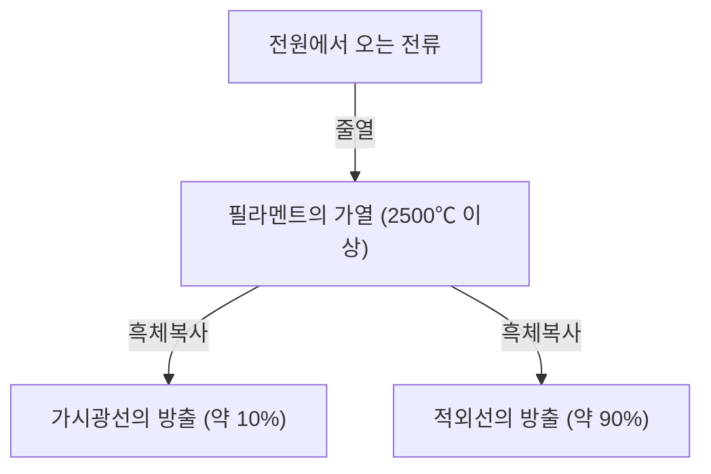
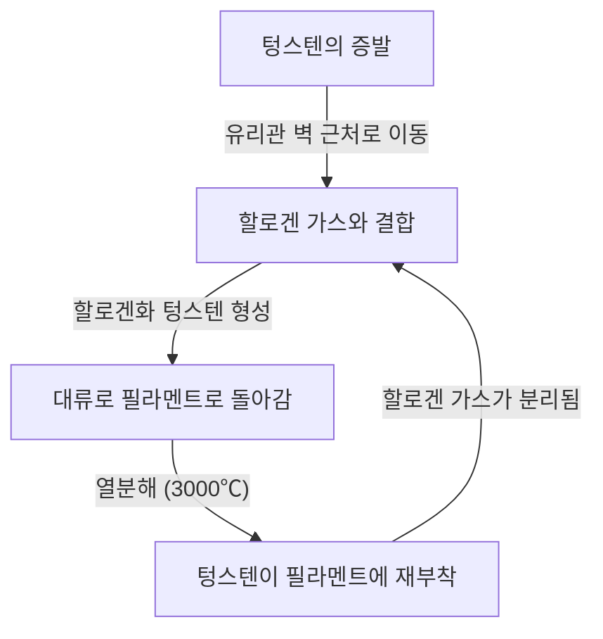

백열전구(白熱電球)는 인류의 밤의 역사를 근본적으로 바꾼 위대한 발명품입니다. 토머스 에디슨과 조지프 스완 등에 의해 실용화되어, 1세기 이상에 걸쳐 전 세계를 계속해서 밝혀왔습니다. 현재는 LED 등 고효율 조명에 그 자리를 내어주고 있지만, 백열전구가 빛을 발하는 원리는 물리학과 재료과학의 기초를 배우는 데 있어 매우 흥미롭고 아름다운 메커니즘을 가지고 있습니다.

본 기사에서는 백열전구의 필라멘트가 어떻게 빛을 내는지, 그 이면에 있는 줄열과 흑체복사의 물리, 그리고 왜 수명이 다하는 것인지에 대한 수수께끼를 자세히 해설합니다.

## 1. 빛을 만들어내는 원리: 줄열과 흑체복사

백열전구의 가장 기본적인 원리는 전류가 물질을 흐를 때 발생하는 열(줄열)을 이용해, 물질을 고온으로 만들어 빛을 방출하게 하는(흑체복사) 것입니다.

### 줄열의 발생

금속과 같은 도체에 전류를 흘려보내면, 이동하는 전자가 도체 내부의 원자와 충돌하고 그 운동 에너지가 열에너지로 변환됩니다. 이것이 줄열입니다.
발생하는 열량 $Q$는 전류 $I$, 저항 $R$, 시간 $t$를 사용하여 다음의 줄의 법칙으로 나타냅니다.

$Q = I^2 R t$

백열전구의 필라멘트는 의도적으로 전기 저항이 커지도록 매우 가늘게 만들어져 있어, 전류를 흘리면 급속히 가열되어 2,000℃~3,000℃라는 초고온에 도달하게 됩니다.

### 흑체복사(열복사)에 의한 발광

물체가 고온이 되면 그 온도에 상응하는 전자기파를 방출합니다. 이를 흑체복사(또는 열복사)라고 부릅니다. 철을 가열하면 처음에는 붉게 빛나고, 온도를 더 올리면 하얗게 빛나게 되는 것과 같은 원리입니다.

온도 $T$의 흑체가 방출하는 에너지의 최대 파장 $\lambda_{max}$는 빈의 변위 법칙에 의해 다음과 같이 나타납니다.

$\lambda_{max} = \frac{b}{T}$ ($b$는 빈의 변위 상수, 약 $2.898 \times 10^{-3} \text{ m}\cdot\text{K}$)

필라멘트의 온도가 약 2,500℃(약 2,773K)에 도달하면 방출되는 전자기파의 일부가 인간의 눈에 보이는 '가시광선' 영역에 들어오게 되어 빛으로 인식됩니다. 단, 에너지의 대부분(약 90% 이상)은 적외선(열)으로 방출되기 때문에 백열전구는 조명으로서의 에너지 효율이 그리 높지 않습니다. 이것이 "전구가 뜨거운" 이유입니다.

## 2. 필라멘트의 재료과학: 왜 텅스텐인가?

초기 전구(에디슨이 개발한 것 등)에는 일본 교토 야와타에서 채취한 대나무를 탄화시킨 '탄소(카본) 필라멘트'가 사용되었습니다. 하지만 탄소는 수명이 짧았고, 더 밝게 만들기 위해서는 보다 고온을 견딜 수 있는 소재가 필요했습니다.

그래서 현대의 백열전구에 채택된 것이 **텅스텐(Tungsten, 원소기호: W)** 입니다. 텅스텐이 선택된 데에는 다음과 같은 명확한 물리적, 화학적 이유가 있습니다.

1. **극히 높은 녹는점**: 텅스텐의 녹는점은 3,422℃로 모든 금속 중에서 가장 높습니다. 백열전구의 필라멘트는 3,000℃ 가까이 도달하므로 이 온도에서도 녹아내리지 않는 텅스텐이 최적입니다.
2. **낮은 증기압**: 고온이 되어도 기화(증발)하기 어렵다는 특성이 있습니다. 증발이 빠르면 필라멘트가 금방 가늘어져 단선되고 맙니다.
3. **가공성**: 가는 선(와이어)으로 늘리는 것이 가능하며, 나아가 그것을 코일 모양(이중 코일 등)으로 감음으로써 제한된 공간에 긴 필라멘트를 수납하여 표면적을 넓혀 밝기를 확보할 수 있습니다.

## 3. 전구 내부의 가스와 수명의 비밀

백열전구의 유리구 내부는 어떻게 되어 있을까요? 단순한 진공이라고 생각하기 쉽지만, 현대의 일반적인 백열전구 내부에는 **불활성 가스(아르곤이나 질소 등)** 가 주입되어 있습니다.

### 증발과의 싸움과 불활성 가스

만약 유리구 내부가 완전한 진공이라면, 고온이 된 텅스텐이 계속해서 증발(승화)해 버립니다. 증발한 텅스텐은 유리 내부에 달라붙어 유리를 검게 흐리게 만들고(흑화 현상), 필라멘트 자체도 가늘어져 결국 끊어지게 됩니다(수명이 다함).

이를 막기 위해 유리구 내부에 아르곤이나 소량의 질소 등 텅스텐과 화학반응을 일으키지 않는 불활성 가스를 주입합니다. 가스의 압력으로 텅스텐 원자가 기화하는 것을 물리적으로 억제하여 수명을 연장하는 것입니다.

### 할로겐 램프의 혁신: 할로겐 사이클

백열전구의 진화형으로 '할로겐 램프'가 있습니다. 이것은 유리구 내부에 미량의 할로겐 가스(요오드나 브롬 등)를 주입한 것입니다.
할로겐 램프에서는 다음과 같은 '할로겐 사이클'이라 불리는 멋진 화학적 재활용이 이루어지고 있습니다.

1. 필라멘트에서 텅스텐이 고온으로 증발한다.
2. 증발한 텅스텐이 유리관 벽 근처의 비교적 저온 영역에서 할로겐 가스와 결합하여 할로겐화 텅스텐이 된다.
3. 이 기체 상태의 할로겐화 텅스텐이 대류에 의해 다시 고온의 필라멘트 부근으로 운반된다.
4. 고온에 의해 할로겐화 텅스텐이 분해되어, 텅스텐이 필라멘트로 돌아가고(석출), 할로겐 가스는 다시 떨어져 나간다.

이 사이클에 의해 유리의 흑화를 방지함과 동시에 필라멘트의 소모를 억제할 수 있기 때문에 더 높은 온도에서 발광시킬 수 있게 되며, 결과적으로 일반 백열전구보다 밝고 수명이 길어집니다.

## 4. 백열전구의 수명은 어떻게 결정되는가?

백열전구의 수명은 필라멘트가 단선된 순간에 찾아옵니다. 그렇다면 왜 단선되는 것일까요?

필라멘트의 굵기를 제조 시에 완전히 균일하게 만드는 것은 불가능합니다. 미세하게 '가는 부분'이나 '상처'가 반드시 존재합니다.
전류를 흘리면 이 '가는 부분'은 전기 저항이 국소적으로 커지기 때문에 다른 부분보다 여분의 줄열이 발생하여 국소적으로 온도가 높아집니다(핫스팟).

온도가 높아지면 그 부분의 텅스텐 증발이 다른 부분보다 빠르게 진행됩니다. 증발이 진행되면 그 부분은 더욱 가늘어집니다. 가늘어지면 저항이 더욱 올라가고, 더 고온이 되는... 정적 피드백(악순환)이 발생합니다.
결국 이 핫스팟이 견디지 못하고 끊어지게(용단) 됩니다. 이것이 전구의 수명이 다하는 메커니즘입니다.

스위치를 켜는 순간에 전구가 끊어지기 쉬운 이유는, 차가워진 상태의 텅스텐은 전기 저항이 낮아 스위치를 켜는 순간 정상 시의 수 배에서 십수 배나 되는 큰 전류(돌입 전류)가 흘러 핫스팟에 단번에 부담이 가해지기 때문입니다.

## 5. 백열전구에서 LED로, 그리고 그 유산

현재 에너지 효율의 관점에서 백열전구의 생산과 판매는 세계 각국에서 규제되고 있으며, 더 적은 전력으로 같은 밝기를 얻을 수 있는 LED(발광 다이오드) 조명으로의 대체가 진행되고 있습니다. LED는 열복사가 아니라 반도체의 전자와 정공의 재결합에 의한 에너지 방출을 이용해 빛을 만들어내기 때문에 열로서의 에너지 손실이 극히 적어 매우 효율적입니다.

하지만 백열전구가 가진 특유의 따뜻한 빛(낮은 색온도)이나 연속적인 스펙트럼을 가진 자연스러운 연색성(태양광에 가까운 색 보임)은 공간을 편안하게 하는 효과가 있어 지금도 레스토랑이나 거실의 장식 조명으로서 뿌리 깊은 인기를 누리고 있습니다. 최근에는 LED이면서도 백열전구의 필라멘트와 같은 외형과 빛나는 방식을 재현한 '필라멘트 LED 전구'도 널리 보급되고 있습니다.

## 요약

백열전구는 언뜻 보면 단순한 '빛나는 유리구슬'이지만, 그 안에는 줄열, 흑체복사, 재료과학, 그리고 기체의 열역학 등 물리학과 화학의 정수가 담겨 있습니다. 100년도 더 전에 완성된 이 기술은 인류의 생활을 어둠에서 해방시키고 근대화를 가속시키는 원동력이 되었습니다.

다음에 백열전구의 따뜻한 빛을 바라볼 기회가 있다면, 그 얇은 텅스텐 안에서 일어나고 있는 전자의 격렬한 충돌과 그곳에서 뿜어져 나오는 열복사의 우주적 법칙에 꼭 한 번 생각을 기울여 보시길 바랍니다.
