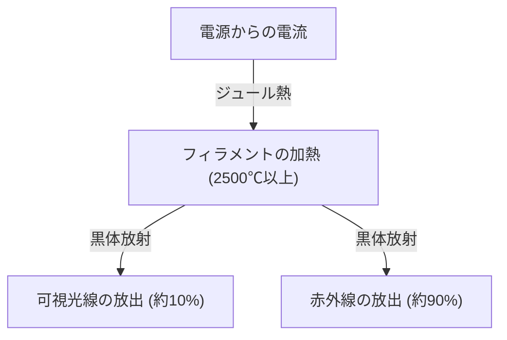
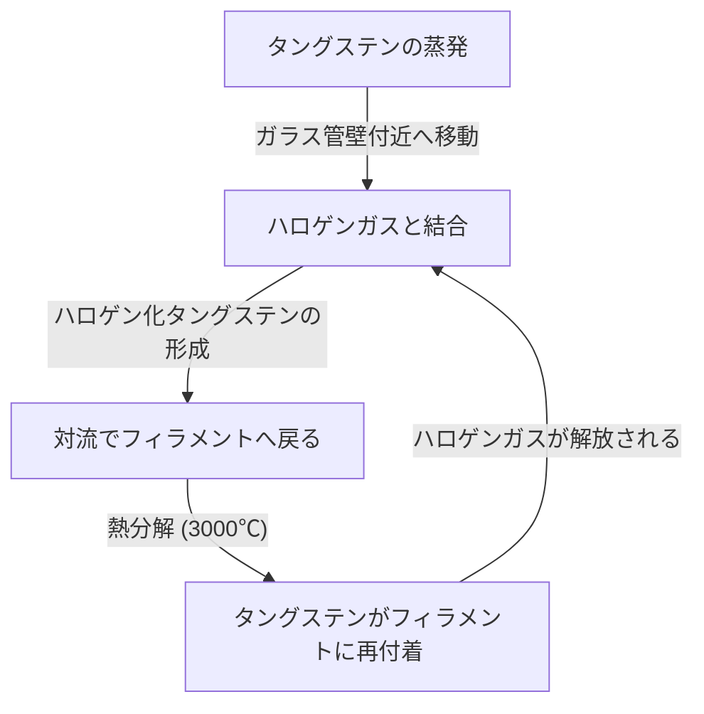

白熱電球（はくねつでんきゅう）は、人類の夜の歴史を根本から変えた偉大な発明です。トーマス・エジソンやジョセフ・スワンらによって実用化され、1世紀以上にわたって世界中を照らし続けてきました。現在ではLEDなどの高効率な照明にその座を譲りつつありますが、白熱電球が光を放つ仕組みは、物理学や材料科学の基礎を学ぶ上で非常に興味深く、また美しいメカニズムを持っています。

本記事では、白熱電球のフィラメントがどのようにして光を放つのか、その背後にあるジュール熱や黒体放射の物理、そしてなぜ寿命が来るのかという謎について、詳細に解説します。

## 1. 光を生み出す原理：ジュール熱と黒体放射

白熱電球の最も基本的な原理は、電流が物質を流れる際に発生する熱（ジュール熱）を利用し、物質を高温にして光を放たせる（黒体放射）というものです。

### ジュール熱の発生

金属などの導体に電流を流すと、移動する電子が導体内の原子と衝突し、その運動エネルギーが熱エネルギーに変換されます。これがジュール熱です。
発生する熱量 $Q$ は、電流 $I$、抵抗 $R$、時間 $t$ を用いて以下のジュールの法則で表されます。

$Q = I^2 R t$

白熱電球のフィラメントは、意図的に電気抵抗が大きくなるように非常に細く作られており、電流を流すことで急速に加熱され、2,000℃〜3,000℃という超高温に達します。

### 黒体放射（熱放射）による発光

物体が高温になると、その温度に応じた電磁波を放射します。これを黒体放射（または熱放射）と呼びます。鉄を熱すると最初は赤く光り、さらに温度を上げると白く輝くようになるのと同じ原理です。

温度 $T$ の黒体が放射するエネルギーのピーク波長 $\lambda_{max}$ は、ウィーンの変位則によって次のように表されます。

$\lambda_{max} = \frac{b}{T}$ （$b$ はウィーンの変位定数、約 $2.898 \times 10^{-3} \text{ m}\cdot\text{K}$）

フィラメントの温度が約2,500℃（約2,773K）に達すると、放射される電磁波の一部が人間の目に見える「可視光線」の領域に入り、光として認識されるようになります。ただし、エネルギーの大部分（約90％以上）は赤外線（熱）として放射されるため、白熱電球は照明としてのエネルギー効率はあまり高くありません。これが「電球は熱い」理由です。

## 2. フィラメントの材料科学：なぜタングステンなのか？

初期の電球（エジソンが開発したものなど）には、日本の京都・八幡で採れた竹を炭化した「カーボンフィラメント」が使われていました。しかし、カーボンは寿命が短く、さらに明るくするためにはより高温に耐えられる素材が必要でした。

そこで現代の白熱電球に採用されているのが **タングステン（Tungsten, 元素記号: W）** です。タングステンが選ばれたのには、以下の明確な物理的・化学的理由があります。

1. **極めて高い融点**: タングステンの融点は3,422℃であり、すべての金属の中で最も高い融点を持ちます。白熱電球のフィラメントは3,000℃近くに達するため、この温度でも溶け落ちないタングステンが最適です。
2. **低い蒸気圧**: 高温になっても気化（蒸発）しにくいという特性があります。蒸発が早いとフィラメントがすぐに細くなり、断線してしまいます。
3. **加工性**: 細い線（ワイヤー）に引き伸ばすことが可能であり、さらにそれをコイル状（二重コイルなど）に巻くことで、限られた空間に長いフィラメントを収め、表面積を増やして明るさを稼ぐことができます。

## 3. 電球内のガスと寿命の謎

白熱電球のガラス球の内部はどうなっているのでしょうか？ 単なる真空だと思われがちですが、現代の一般的な白熱電球の内部には **不活性ガス（アルゴンや窒素など）** が封入されています。

### 蒸発との戦いと不活性ガス

もしガラス球内が完全な真空だと、高温になったタングステンがどんどん蒸発（昇華）してしまいます。蒸発したタングステンはガラスの内側に付着してガラスを黒く濁らせ（黒化現象）、さらにフィラメント自身も細くなって最終的には切れてしまいます（寿命）。

これを防ぐために、ガラス球内にアルゴンや少量の窒素といった、タングステンと化学反応を起こさない不活性ガスを封入します。ガスの圧力によってタングステン原子が気化するのを物理的に抑え込み、寿命を延ばしているのです。

### ハロゲンランプの革新：ハロゲンサイクル

白熱電球の進化形に「ハロゲンランプ」があります。これはガラス球内に微量のハロゲンガス（ヨウ素や臭素など）を封入したものです。
ハロゲンランプでは、以下のような「ハロゲンサイクル」と呼ばれる見事な化学的リサイクルが行われています。

1. フィラメントからタングステンが高温で蒸発する。
2. 蒸発したタングステンが、ガラス管壁近くの比較的低温の領域でハロゲンガスと結合し、ハロゲン化タングステンになる。
3. この気体状態のハロゲン化タングステンが対流によって再び高温のフィラメント付近に運ばれる。
4. 高温によりハロゲン化タングステンが分解し、タングステンがフィラメントに戻り（析出）、ハロゲンガスは再び離脱する。

このサイクルにより、ガラスの黒化を防ぐと同時にフィラメントの消耗を抑えることができるため、より高温で発光させることが可能となり、結果として通常の白熱電球よりも明るく、長寿命になります。

## 4. 白熱電球の寿命はどのように決まるのか？

白熱電球の寿命は、フィラメントが断線した瞬間に訪れます。では、なぜ断線するのでしょうか？

フィラメントの太さは、製造時に完全に均一にすることは不可能です。微小な「細い部分」や「傷」が必ず存在します。
電流を流すと、この「細い部分」は電気抵抗が局所的に大きくなるため、他の部分よりも余計にジュール熱が発生し、局所的に温度が高くなります（ホットスポット）。

温度が高くなると、その部分のタングステンの蒸発が他の部分よりも早く進みます。蒸発が進むと、その部分はさらに細くなります。細くなると抵抗がさらに上がり、さらに高温になり……という正のフィードバック（悪循環）が発生します。
最終的に、このホットスポットが耐えきれなくなり、溶断（焼き切れ）してしまうのです。これが電球の寿命が尽きるメカニズムです。

スイッチを入れた瞬間に電球が切れやすいのは、冷えている状態のタングステンは電気抵抗が低く、スイッチを入れた瞬間に定常時の数倍〜十数倍もの大きな電流（突入電流）が流れ、ホットスポットに一気に負担がかかるためです。

## 5. 白熱電球からLEDへ、そしてその遺産

現在、エネルギー効率の観点から、白熱電球の生産と販売は世界各国で規制され、より少ない電力で同じ明るさを得られるLED（発光ダイオード）照明への置き換えが進んでいます。LEDは、熱放射ではなく半導体の電子と正孔の再結合によるエネルギー放出を利用して光を生み出すため、熱としてのエネルギー損失が極めて少なく、非常に効率的です。

しかし、白熱電球が持つ独特の温かみのある光（低い色温度）や、連続的なスペクトルを持つ自然な演色性（太陽光に近い色の見え方）は、空間をリラックスさせる効果があり、今でもレストランやリビングルームの装飾照明として根強い人気があります。近年では、LEDでありながら白熱電球のフィラメントのような見た目と光り方を再現した「フィラメントLED電球」も広く普及しています。

## まとめ

白熱電球は、一見すると単なる「光るガラス玉」ですが、その中にはジュール熱、黒体放射、材料科学、そして気体の熱力学といった、物理学と化学の粋が詰まっています。100年以上前に完成されたこの技術は、人類の生活を暗闇から解放し、近代化を加速させる原動力となりました。

次に白熱電球の温かい光を見つめる機会があれば、その細いタングステンの中で起きている電子の激しい衝突と、そこから放たれる熱放射の宇宙的な法則に、ぜひ思いを馳せてみてください。
