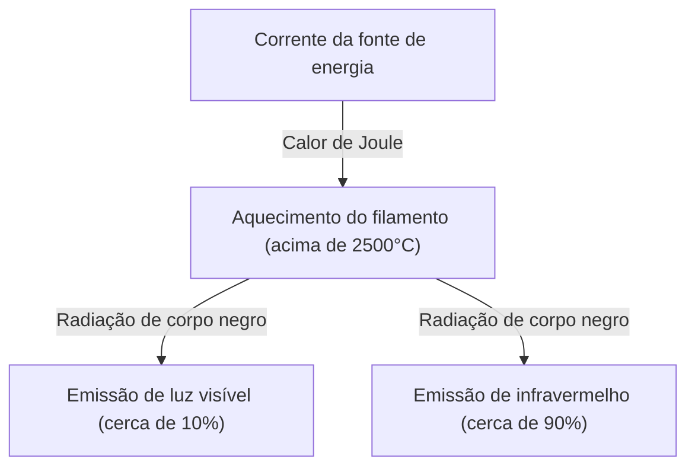
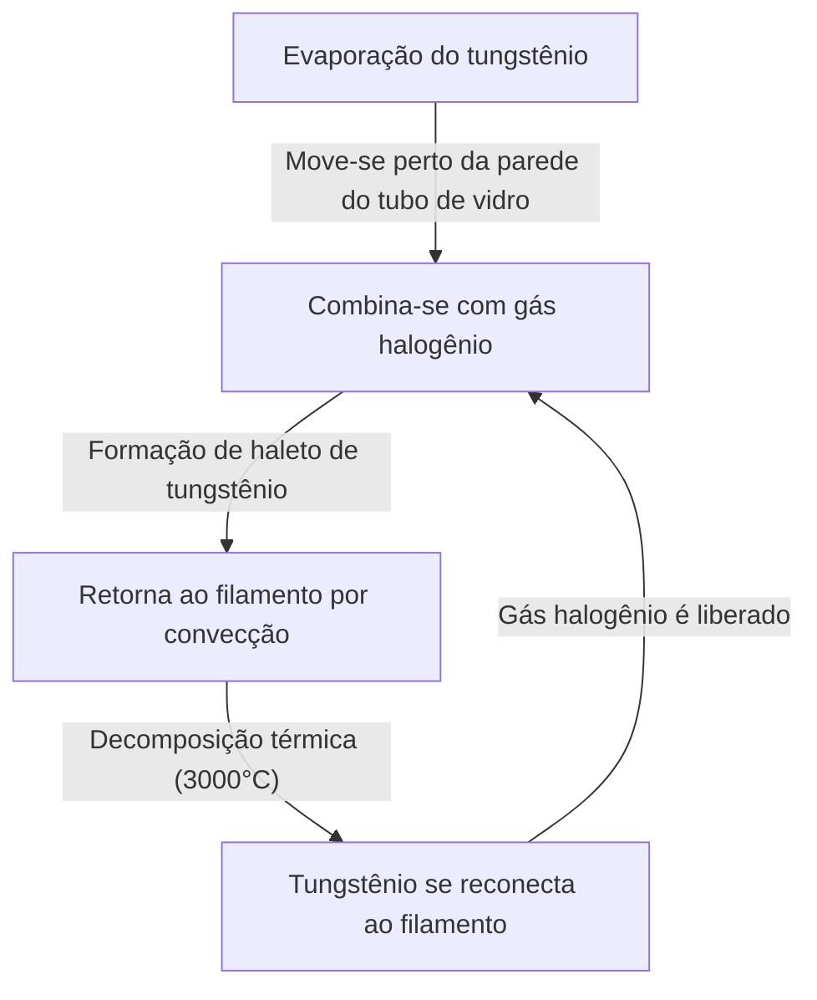

A lâmpada incandescente é uma invenção magnífica que mudou fundamentalmente a história das noites da humanidade. Praticada por Thomas Edison e Joseph Swan, ela continuou a iluminar o mundo por mais de um século. Hoje em dia, está cedendo seu lugar a opções de iluminação de alta eficiência como os LEDs, mas o mecanismo pelo qual a lâmpada incandescente emite luz possui um mecanismo belo e extremamente interessante para aprender os fundamentos da física e da ciência dos materiais.

Neste artigo, explicaremos detalhadamente como o filamento de uma lâmpada incandescente emite luz, a física do calor de Joule e da radiação de corpo negro por trás disso, e o mistério de por que elas chegam ao fim de sua vida útil.

## 1. O Princípio da Geração de Luz: Calor de Joule e Radiação de Corpo Negro

O princípio mais fundamental de uma lâmpada incandescente utiliza o calor gerado quando a corrente elétrica flui através de uma substância (calor de Joule) para aquecer a substância a uma temperatura alta e emitir luz (radiação de corpo negro).

### Geração de Calor de Joule

Quando uma corrente elétrica passa por um condutor, como um metal, os elétrons em movimento colidem com os átomos dentro do condutor, e sua energia cinética é convertida em energia térmica. Isso é o calor de Joule.
A quantidade de calor gerada $Q$ é expressa pela Lei de Joule usando a corrente $I$, a resistência $R$ e o tempo $t$:

$Q = I^2 R t$

O filamento de uma lâmpada incandescente é feito intencionalmente muito fino para ter uma alta resistência elétrica e, ao passar corrente, ele se aquece rapidamente, atingindo temperaturas ultra-altas de 2.000°C a 3.000°C.

### Emissão de Luz por Radiação de Corpo Negro (Radiação Térmica)

Quando um objeto atinge uma alta temperatura, ele emite ondas eletromagnéticas correspondentes a essa temperatura. Isso é chamado de radiação de corpo negro (ou radiação térmica). É o mesmo princípio pelo qual o ferro esquentado brilha em vermelho inicialmente e, à medida que a temperatura sobe ainda mais, brilha em branco.

O pico do comprimento de onda $\lambda_{max}$ da energia irradiada por um corpo negro na temperatura $T$ é expresso pela lei do deslocamento de Wien da seguinte forma:

$\lambda_{max} = \frac{b}{T}$ (onde $b$ é a constante de deslocamento de Wien, cerca de $2.898 \times 10^{-3} \text{ m}\cdot\text{K}$)

Quando a temperatura do filamento atinge cerca de 2.500°C (cerca de 2.773K), parte das ondas eletromagnéticas emitidas entra no espectro da "luz visível", que pode ser vista pelos olhos humanos e é reconhecida como luz. No entanto, como a maior parte da energia (mais de 90%) é emitida como infravermelho (calor), as lâmpadas incandescentes não são muito eficientes em termos de energia para iluminação. É por isso que "as lâmpadas são quentes".

## 2. Ciência dos Materiais do Filamento: Por que Tungstênio?

As primeiras lâmpadas (como a desenvolvida por Edison) usavam um "filamento de carbono" feito de bambu carbonizado de Yawata, Quioto, Japão. No entanto, o carbono tinha uma vida útil curta e um material que pudesse suportar temperaturas ainda mais altas era necessário para torná-lo mais brilhante.

Portanto, as lâmpadas incandescentes modernas adotaram o **Tungstênio (Tungsten, Símbolo químico: W)**. Existem razões físicas e químicas claras para a escolha do tungstênio:

1. **Ponto de fusão extremamente alto**: O ponto de fusão do tungstênio é 3.422°C, o mais alto entre todos os metais. O filamento de uma lâmpada incandescente chega a quase 3.000°C, então o tungstênio, que não derrete a essa temperatura, é o ideal.
2. **Baixa pressão de vapor**: Possui a característica de não vaporizar (evaporar) facilmente, mesmo em altas temperaturas. Se a evaporação for rápida, o filamento afinará rapidamente e se romperá.
3. **Trabalhabilidade**: Pode ser esticado em um fio fino, e ao enrolá-lo em uma bobina (como uma bobina dupla), um filamento longo pode ser alojado em um espaço limitado, aumentando a área de superfície e ganhando brilho.

## 3. O Gás Dentro da Lâmpada e o Mistério de Sua Vida Útil

O que há dentro do bulbo de vidro de uma lâmpada incandescente? Muitas vezes, pensa-se que seja um mero vácuo, mas as lâmpadas incandescentes modernas comuns têm **gás inerte (como argônio ou nitrogênio)** selado dentro delas.

### A Batalha contra a Evaporação e o Gás Inerte

Se o interior do bulbo de vidro fosse um vácuo perfeito, o tungstênio de alta temperatura evaporaria (sublimaria) rapidamente. O tungstênio evaporado adere ao interior do vidro, tornando-o escuro e turvo (fenômeno de escurecimento), e o próprio filamento afina e, eventualmente, se rompe (fim da vida útil).

Para evitar isso, gases inertes que não reagem quimicamente com o tungstênio, como argônio ou uma pequena quantidade de nitrogênio, são introduzidos no bulbo de vidro. A pressão do gás suprime fisicamente a vaporização dos átomos de tungstênio, prolongando sua vida útil.

### A Inovação das Lâmpadas Halógenas: O Ciclo Halógeno

Uma evolução da lâmpada incandescente é a "lâmpada halógena". Ela possui uma pequena quantidade de gás halogênio (como iodo ou bromo) dentro do bulbo de vidro.
Nas lâmpadas halógenas, ocorre uma incrível reciclagem química chamada de "ciclo halógeno", como se segue:

1. O tungstênio evapora do filamento em altas temperaturas.
2. O tungstênio evaporado combina-se com o gás halogênio em uma área de temperatura relativamente mais baixa perto da parede do tubo de vidro, formando o haleto de tungstênio.
3. Este haleto de tungstênio no estado gasoso é transportado de volta para as proximidades do filamento de alta temperatura por convecção.
4. Devido à alta temperatura, o haleto de tungstênio se decompõe, o tungstênio retorna ao filamento (deposição) e o gás halogênio é liberado novamente.

Este ciclo evita o escurecimento do vidro e suprime o consumo do filamento ao mesmo tempo, possibilitando emitir luz a uma temperatura mais alta, resultando em uma vida útil mais brilhante e mais longa que as lâmpadas incandescentes comuns.

## 4. Como é Determinada a Vida Útil de Uma Lâmpada Incandescente?

O fim da vida útil de uma lâmpada incandescente chega no momento em que o filamento se rompe. Então, por que ele se rompe?

É impossível tornar a espessura do filamento perfeitamente uniforme durante a fabricação. Sempre existirão "partes finas" ou "arranhões" microscópicos.
Quando uma corrente flui, a resistência elétrica aumenta localmente nessas "partes finas", gerando calor de Joule adicional e elevando a temperatura localmente (hot spot).

À medida que a temperatura aumenta, a evaporação do tungstênio nessa parte avança mais rapidamente do que nas outras partes. Com o avanço da evaporação, a parte fica ainda mais fina. Ao ficar mais fina, a resistência aumenta ainda mais, a temperatura sobe ainda mais... gerando um feedback positivo (círculo vicioso).
Eventualmente, esse hot spot não suporta e derrete (queima). Este é o mecanismo do fim da vida útil de uma lâmpada.

O motivo pelo qual a lâmpada é mais propensa a queimar no momento em que é ligada é que o tungstênio em estado frio tem baixa resistência elétrica, e uma grande corrente (corrente de pico) várias a mais de dez vezes maior que o estado estacionário flui instantaneamente, sobrecarregando o hot spot de uma vez.

## 5. Das Lâmpadas Incandescentes aos LEDs e Seu Legado

Hoje, do ponto de vista da eficiência energética, a produção e venda de lâmpadas incandescentes são regulamentadas globalmente, e elas estão sendo substituídas pela iluminação LED (diodo emissor de luz), que oferece o mesmo brilho com menos eletricidade. O LED gera luz não através de radiação térmica, mas pela emissão de energia através da recombinação de elétrons e lacunas de semicondutores, de modo que a perda de energia na forma de calor é extremamente baixa, tornando-o muito eficiente.

No entanto, a luz exclusivamente quente (baixa temperatura de cor) das lâmpadas incandescentes e seu alto índice de reprodução de cor natural (aparência de cor próxima à da luz do sol) têm o efeito de relaxar o ambiente, e ainda são muito populares como iluminação decorativa em restaurantes e salas de estar. Nos últimos anos, "lâmpadas LED de filamento", que reproduzem a aparência e o brilho do filamento de uma lâmpada incandescente com tecnologia LED, também se tornaram populares.

## Resumo

As lâmpadas incandescentes podem parecer apenas "bolas de vidro que brilham", mas são repletas da essência da física e da química, incluindo calor de Joule, radiação de corpo negro, ciência dos materiais e termodinâmica de gases. Essa tecnologia, aperfeiçoada há mais de 100 anos, tornou-se a força motriz que libertou a vida humana da escuridão e acelerou a modernização.

Da próxima vez que tiver a oportunidade de olhar para a luz quente de uma lâmpada incandescente, reserve um momento para refletir sobre as violentas colisões de elétrons ocorrendo dentro daquele fino tungstênio e as leis universais da radiação térmica emitidas de lá.
