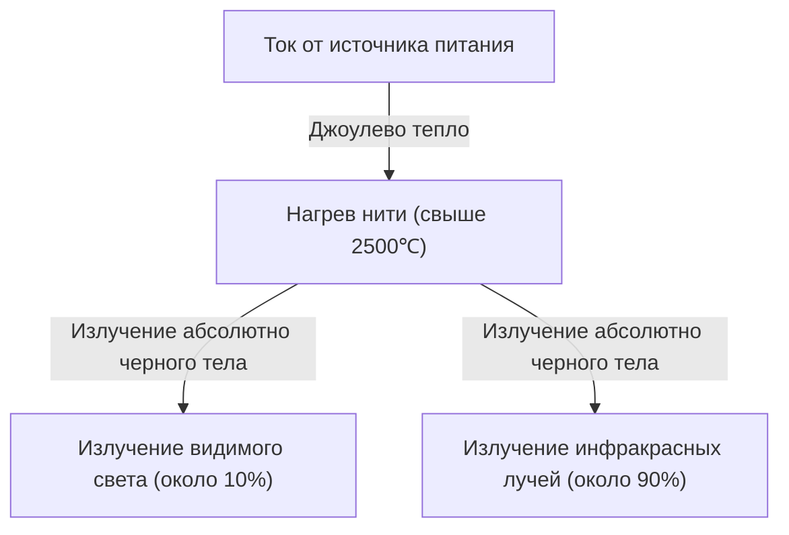
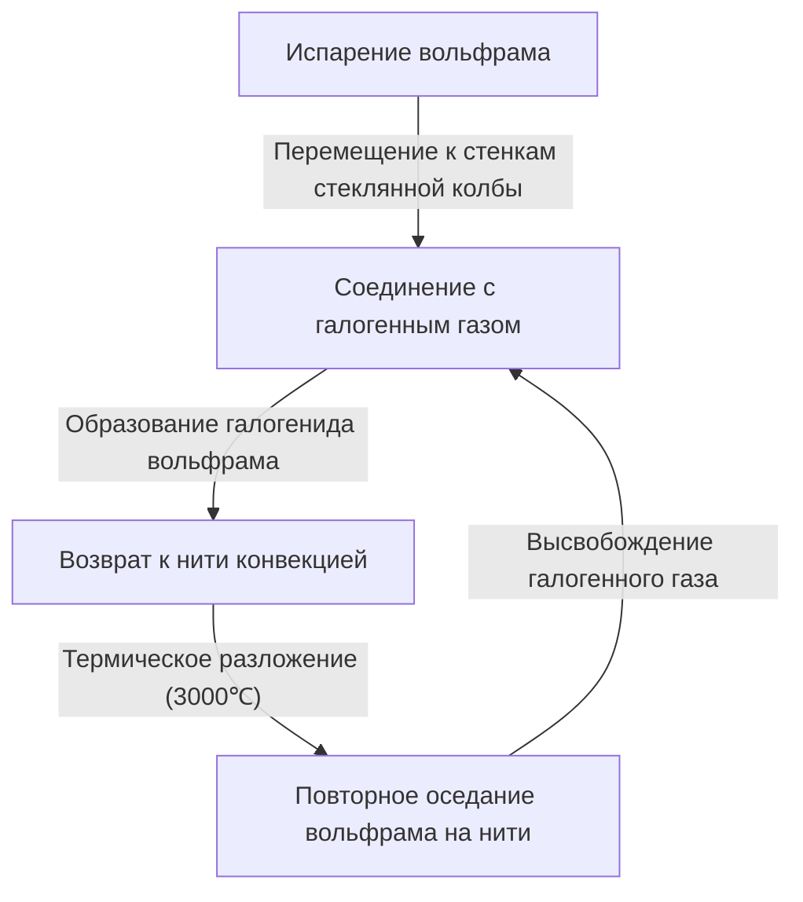

Лампа накаливания — это великое изобретение, которое в корне изменило историю ночи человечества. Практическое применение она получила благодаря Томасу Эдисону и Джозефу Суону и освещала мир на протяжении более века. В настоящее время она уступает место высокоэффективному освещению, такому как LED, но механизм излучения света лампой накаливания очень интересен для изучения основ физики и материаловедения, а также обладает красивой механикой.

В этой статье подробно объясняется, как нить лампы накаливания излучает свет, физика джоулева тепла и излучения абсолютно черного тела, лежащие в основе этого, а также загадка того, почему наступает конец срока службы.

## 1. Принцип возникновения света: джоулево тепло и излучение абсолютно черного тела

Самый фундаментальный принцип лампы накаливания заключается в использовании тепла, выделяющегося при протекании электрического тока через вещество (джоулево тепло), для нагревания вещества до высоких температур, что заставляет его излучать свет (излучение абсолютно черного тела).

### Возникновение джоулева тепла

Когда ток проходит через проводник, такой как металл, движущиеся электроны сталкиваются с атомами в проводнике, и их кинетическая энергия преобразуется в тепловую энергию. Это и есть джоулево тепло.
Количество выделяемого тепла $Q$ выражается законом Джоуля с использованием тока $I$, сопротивления $R$ и времени $t$:

$Q = I^2 R t$

Нить лампы накаливания намеренно сделана очень тонкой, чтобы иметь высокое электрическое сопротивление, и при пропускании тока быстро нагревается, достигая сверхвысокой температуры 2,000℃–3,000℃.

### Излучение света посредством излучения абсолютно черного тела (теплового излучения)

Когда объект достигает высокой температуры, он излучает электромагнитные волны, соответствующие этой температуре. Это называется излучением абсолютно черного тела (или тепловым излучением). Тот же принцип работает, когда железо при нагревании сначала светится красным, а при дальнейшем повышении температуры становится белым.

Пиковая длина волны $\lambda_{max}$ энергии, излучаемой абсолютно черным телом при температуре $T$, выражается законом смещения Вина следующим образом:

$\lambda_{max} = \frac{b}{T}$ （где $b$ — постоянная смещения Вина, около $2.898 \times 10^{-3} \text{ m}\cdot\text{K}$）

Когда температура нити достигает около 2,500℃ (около 2,773K), часть излучаемых электромагнитных волн попадает в диапазон "видимого света", видимого человеческому глазу, и воспринимается как свет. Однако, поскольку большая часть энергии (более 90%) излучается в виде инфракрасных лучей (тепла), энергетическая эффективность лампы накаливания как источника освещения не очень высока. Вот почему «лампа горячая».

## 2. Материаловедение нити накаливания: почему именно вольфрам?

В первых лампах (например, разработанных Эдисоном) использовалась "угольная нить", изготовленная из карбонизированного бамбука, собранного в Явата, Киото, Япония. Однако углерод имел короткий срок службы, а для большей яркости требовался материал, способный выдерживать более высокие температуры.

Поэтому в современных лампах накаливания используется **вольфрам (Tungsten, символ элемента: W)**. Вольфрам был выбран по следующим четким физическим и химическим причинам:

1. **Чрезвычайно высокая температура плавления**: Температура плавления вольфрама составляет 3,422℃, это самая высокая температура плавления среди всех металлов. Поскольку нить лампы накаливания достигает почти 3,000℃, вольфрам, который не плавится при этой температуре, является идеальным.
2. **Низкое давление пара**: Обладает свойством трудно испаряться (возгоняться) даже при высоких температурах. Если испарение происходит быстро, нить быстро истончается и обрывается.
3. **Обрабатываемость**: Его можно вытянуть в тонкую проволоку (нить), а затем скрутить в катушку (например, двойную спираль), что позволяет разместить длинную нить в ограниченном пространстве и увеличить площадь поверхности для повышения яркости.

## 3. Газ внутри лампы и загадка срока службы

Что находится внутри стеклянной колбы лампы накаливания? Часто думают, что это просто вакуум, но внутри современных обычных ламп накаливания содержится **инертный газ (например, аргон или азот)**.

### Борьба с испарением и инертный газ

Если внутри стеклянной колбы будет полный вакуум, вольфрам, достигший высокой температуры, будет быстро испаряться (сублимироваться). Испарившийся вольфрам прилипает к внутренней поверхности стекла, делая его мутным и черным (явление почернения), а сама нить истончается и в конце концов обрывается (срок службы).

Чтобы предотвратить это, стеклянная колба заполняется инертными газами, такими как аргон и небольшое количество азота, которые не вступают в химическую реакцию с вольфрамом. Давление газа физически подавляет испарение атомов вольфрама, продлевая срок службы.

### Инновация галогенных ламп: галогенный цикл

Эволюцией лампы накаливания является "галогенная лампа". Это лампа, в стеклянную колбу которой добавлено небольшое количество галогенного газа (йод, бром и т.д.).
В галогенных лампах происходит превосходный химический процесс переработки, называемый "галогенным циклом":

1. Вольфрам испаряется с нити при высокой температуре.
2. Испарившийся вольфрам соединяется с галогенным газом в относительно холодной зоне у стенок стеклянной трубки, образуя галогенид вольфрама.
3. Этот газообразный галогенид вольфрама конвекцией переносится обратно в зону высокой температуры вблизи нити.
4. Из-за высокой температуры галогенид вольфрама разлагается, вольфрам возвращается (оседает) на нить, а галогенный газ снова высвобождается.

Благодаря этому циклу можно предотвратить почернение стекла и одновременно уменьшить износ нити, что позволяет излучать свет при более высоких температурах. В результате получается более яркая лампа с более длительным сроком службы, чем обычная лампа накаливания.

## 4. Как определяется срок службы лампы накаливания?

Срок службы лампы накаливания заканчивается в момент обрыва нити. Но почему она обрывается?

Невозможно сделать толщину нити абсолютно однородной при производстве. Обязательно присутствуют микроскопические "тонкие участки" и "царапины".
Когда протекает ток, электрическое сопротивление в этих "тонких участках" локально увеличивается, поэтому там выделяется больше джоулева тепла, чем в других частях, и температура локально повышается (горячая точка).

Когда температура повышается, испарение вольфрама в этой части происходит быстрее, чем в других частях. По мере испарения этот участок становится еще тоньше. Когда он становится тоньше, сопротивление снова возрастает, температура становится еще выше... Возникает положительная обратная связь (порочный круг).
В конце концов, эта горячая точка не выдерживает и перегорает (расплавляется и обрывается). Это и есть механизм окончания срока службы лампы.

Лампочка легко перегорает в момент включения переключателя из-за того, что холодный вольфрам имеет низкое электрическое сопротивление. В момент включения протекает ток в несколько или даже более десяти раз превышающий обычный (пусковой ток), что создает огромную нагрузку на горячие точки.

## 5. От лампы накаливания к LED, и ее наследие

В настоящее время из соображений энергоэффективности производство и продажа ламп накаливания регулируются во всем мире, и их заменяют светодиоды (LED), которые обеспечивают ту же яркость при меньшем энергопотреблении. LED создает свет за счет излучения энергии от рекомбинации электронов и дырок в полупроводнике, а не за счет теплового излучения, поэтому потери энергии в виде тепла крайне малы, и он очень эффективен.

Однако теплый свет с низкой цветовой температурой, характерный для ламп накаливания, и естественная цветопередача с непрерывным спектром (цвета, близкие к солнечному свету) создают расслабляющий эффект в пространстве, поэтому они до сих пор пользуются большой популярностью в качестве декоративного освещения в ресторанах и гостиных. В последние годы широкое распространение получили "филаментные LED лампы", которые, будучи светодиодными, воспроизводят внешний вид и свечение нити накаливания.

## Заключение

На первый взгляд лампа накаливания — это просто "светящийся стеклянный шар", но в ней заключена суть физики и химии: джоулево тепло, излучение абсолютно черного тела, материаловедение и термодинамика газов. Эта технология, доведенная до совершенства более 100 лет назад, освободила жизнь человечества от тьмы и стала движущей силой ускорения модернизации.

В следующий раз, когда у вас будет возможность посмотреть на теплый свет лампы накаливания, подумайте об интенсивном столкновении электронов, происходящем в этом тонком вольфраме, и о космических законах теплового излучения, исходящего от него.
