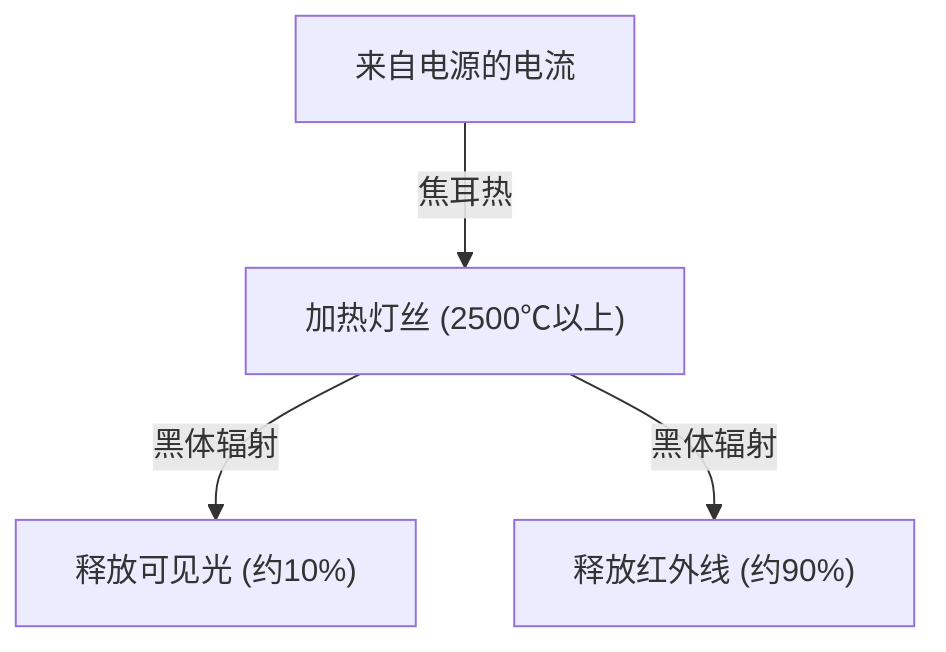
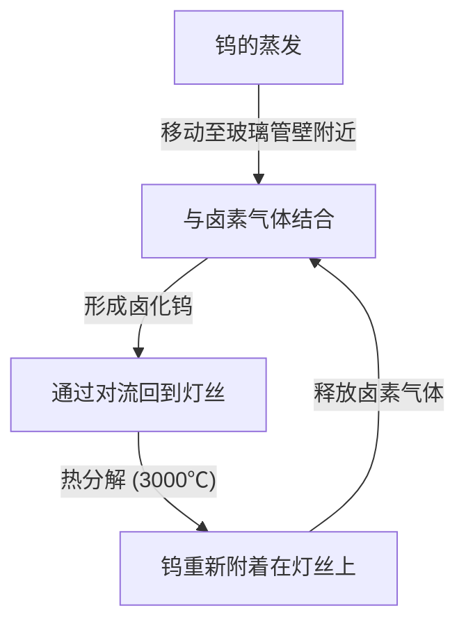

白炽灯（Incandescent light bulb）是一项彻底改变人类夜晚历史的伟大发明。它由托马斯·爱迪生（Thomas Edison）和约瑟夫·斯旺（Joseph Swan）等人投入实用，一个多世纪以来持续照亮着整个世界。尽管如今它正逐渐将地位让给LED等高能效照明设备，但白炽灯发光的原理，在学习物理学和材料科学基础时，依然非常有趣且具备优美的机制。

本文将详细解析白炽灯灯丝是如何发光的，其背后的焦耳热与黑体辐射物理学，以及为什么它会迎来寿命终点的谜题。

## 1. 产生光的原理：焦耳热与黑体辐射

白炽灯最基本的原理是利用电流流过物质时产生的热量（焦耳热），使物质达到高温从而发光（黑体辐射）。

### 焦耳热的产生

当电流流过金属等导体时，移动的电子与导体内的原子发生碰撞，其动能转化为热能。这就是焦耳热。
产生的热量 $Q$ 可以用电流 $I$、电阻 $R$、时间 $t$ 通过以下焦耳定律来表示：

$Q = I^2 R t$

白炽灯的灯丝被有意制造得非常细，以使其电阻变大。通过通电，它会迅速被加热，达到 2,000℃ 至 3,000℃ 的超高温。

### 黑体辐射（热辐射）发光

当物体处于高温时，会辐射出与其温度相对应的电磁波。这被称为黑体辐射（或热辐射）。这与加热铁块时它最初发出红光，温度进一步升高后闪耀白光的原理相同。

温度为 $T$ 的黑体辐射的能量峰值波长 $\lambda_{max}$，由维恩位移定律表示如下：

$\lambda_{max} = \frac{b}{T}$ （$b$ 是维恩位移常数，约 $2.898 \times 10^{-3} \text{ m}\cdot\text{K}$）

当灯丝温度达到约 2,500℃（约 2,773K）时，辐射出的电磁波的一部分进入人类肉眼可见的“可见光”区域，从而被识别为光。但是，由于大部分能量（约90%以上）以红外线（热）的形式辐射，因此白炽灯作为照明设备的能源效率并不高。这就是“灯泡很烫”的原因。

## 2. 灯丝的材料科学：为什么是钨？

早期的灯泡（如爱迪生开发的灯泡）使用的是将日本京都八幡产的竹子碳化后制成的“碳灯丝”。然而，碳的寿命较短，为了变得更亮，需要能耐受更高温度的材料。

因此，现代白炽灯采用的是 **钨（Tungsten, 元素符号: W）**。选择钨有以下明确的物理和化学原因：

1. **极高的熔点**: 钨的熔点为 3,422℃，是所有金属中熔点最高的。白炽灯的灯丝会达到接近 3,000℃ 的温度，在这样的温度下也不会熔断的钨是最理想的选择。
2. **低蒸汽压**: 具有即使在高温下也难以气化（蒸发）的特性。如果蒸发过快，灯丝会迅速变细并断裂。
3. **可加工性**: 能够被拉伸成细线，而且通过将其卷成线圈状（如双螺旋），可以在有限的空间内容纳很长的灯丝，从而增加表面积以提高亮度。

## 3. 灯泡内的气体与寿命之谜

白炽灯的玻璃泡内部是怎样的呢？人们往往以为里面只是真空，但现代普通白炽灯的内部充入了**惰性气体（如氩气或氮气）**。

### 与蒸发的斗争及惰性气体

如果玻璃泡内是完全真空，高温下的钨就会不断蒸发（升华）。蒸发出的钨会附着在玻璃内侧，使玻璃变黑变浊（发黑现象），而且灯丝自身也会变细，最终烧断（寿命终结）。

为了防止这种情况，玻璃泡内充入了氩气或少量氮气等不会与钨发生化学反应的惰性气体。通过气体的压力在物理上抑制钨原子的气化，从而延长了使用寿命。

### 卤素灯的革新：卤素循环

白炽灯的进化形态之一是“卤素灯”。这是在玻璃泡内充入微量卤素气体（如碘、溴等）的产物。
在卤素灯中，进行着被称为“卤素循环”的绝妙化学循环过程，如下所示：

1. 钨在高温下从灯丝上蒸发。
2. 蒸发的钨在靠近玻璃管壁较冷区域与卤素气体结合，形成卤化钨。
3. 这种气态的卤化钨通过对流再次被输送到高温的灯丝附近。
4. 高温使卤化钨分解，钨重新回到灯丝上（沉积），卤素气体再次被释放。

通过这个循环，不仅能防止玻璃发黑，还能抑制灯丝的消耗，因此可以在更高的温度下发光。结果，它比普通的白炽灯更亮，寿命也更长。

## 4. 白炽灯的寿命是如何决定的？

白炽灯的寿命，在灯丝断裂的瞬间就宣告结束了。那么，为什么会断裂呢？

在制造时，要使灯丝的粗细完全均匀是不可能的。必定会存在微小的“较细部分”或“瑕疵”。
当电流通过时，这些“较细部分”的局部电阻会变大，因此会比其他部分产生更多的焦耳热，局部温度升高（热点）。

温度升高后，该部分钨的蒸发会比其他部分进行得更快。随着蒸发的进行，该部分会变得更细。变细后电阻进一步增加，温度更高……从而产生了正反馈（恶性循环）。
最终，这个热点无法承受而熔断（烧断）。这就是灯泡寿命耗尽的机制。

在打开开关的瞬间灯泡容易烧坏，是因为处于冷却状态的钨电阻较低，打开开关的瞬间会流过正常状态下几倍甚至十几倍的巨大电流（浪涌电流），给热点一下子带来了很大的负担。

## 5. 从白炽灯到LED，及其遗产

如今，出于能源效率的考虑，世界各国都在限制白炽灯的生产和销售，并逐渐被能够以更少电力获得相同亮度的LED（发光二极管）照明所取代。LED不是利用热辐射，而是利用半导体中电子和空穴复合释放的能量来产生光，因此作为热量流失的能量损失极少，非常高效。

然而，白炽灯那种独特的温暖光线（低色温）以及具有连续光谱的自然显色性（接近太阳光的色彩表现），具有让人在空间中放松的效果，至今作为餐厅或客厅的装饰照明依然深受喜爱。近年来，再现了白炽灯灯丝外观和发光方式的“灯丝型LED灯泡”也得到了广泛普及。

## 总结

白炽灯乍看之下只是一个“发光的玻璃球”，但其中蕴含了焦耳热、黑体辐射、材料科学以及气体热力学等物理学和化学的精华。这项在100多年前就已成熟的技术，将人类的生活从黑暗中解放出来，成为了加速现代化的原动力。

如果下次有机会注视白炽灯温暖的光芒，请务必回想一下在那细细的钨丝中发生的电子的剧烈碰撞，以及从中释放出来的热辐射这种宇宙级的法则。
