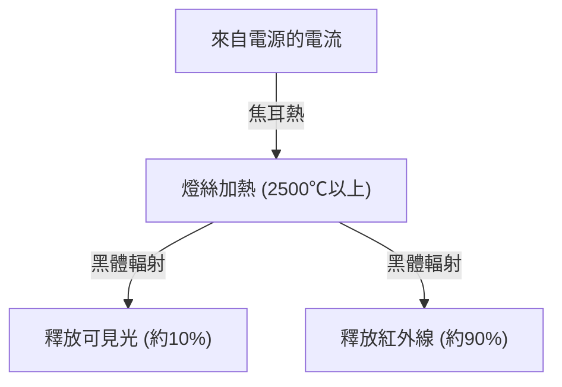
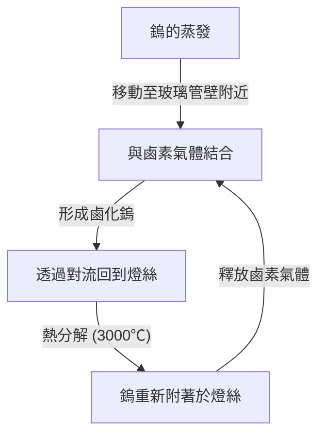

白熾燈泡（Incandescent light bulb）是從根本上改變了人類夜晚歷史的偉大發明。由湯瑪斯·愛迪生（Thomas Edison）和約瑟夫·斯旺（Joseph Swan）等人實用化，一個多世紀以來持續照亮著世界。雖然現在正逐漸將地位讓給 LED 等高效率照明，但白熾燈泡發光的機制，在學習物理學與材料科學的基礎上非常有趣，並具有美麗的機制。

本文將詳細解說白熾燈泡的燈絲是如何發光的、其背後的焦耳熱與黑體輻射的物理學，以及為什麼會有壽命限制的謎團。

## 1. 產生光的原理：焦耳熱與黑體輻射

白熾燈泡最基本的原理是，利用電流流經物質時產生的熱（焦耳熱），使物質達到高溫並發出光芒（黑體輻射）。

### 焦耳熱的產生

當電流流過金屬等導體時，移動的電子會與導體內的原子碰撞，其動能會轉換為熱能。這就是焦耳熱。
產生的熱量 $Q$ 可以用電流 $I$、電阻 $R$、時間 $t$ 透過以下的焦耳定律來表示：

$Q = I^2 R t$

白熾燈泡的燈絲被刻意做得非常細以增加電阻，透過通電能使其迅速加熱，達到 2,000℃～3,000℃ 的超高溫。

### 透過黑體輻射（熱輻射）發光

當物體達到高溫時，會放射出對應其溫度的電磁波。這被稱為黑體輻射（或熱輻射）。這與加熱鐵塊時，一開始會發出紅光，溫度再升高則會發出白光的原理相同。

溫度為 $T$ 的黑體所放射出的能量峰值波長 $\lambda_{max}$，根據維恩位移定律（Wien's displacement law）可表示如下：

$\lambda_{max} = \frac{b}{T}$ （$b$ 為維恩位移常數，約為 $2.898 \times 10^{-3} \text{ m}\cdot\text{K}$）

當燈絲溫度達到約 2,500℃（約 2,773K）時，放射出的一部分電磁波會進入人類肉眼可見的「可見光」範圍，進而被認知為光。然而，大部分的能量（約 90% 以上）是作為紅外線（熱）放射出來，因此白熾燈泡作為照明的能源效率並不高。這也是「燈泡會燙」的原因。

## 2. 燈絲的材料科學：為什麼是鎢？

早期的燈泡（如愛迪生開發的燈泡）使用的是將日本京都八幡產的竹子碳化後製成的「碳燈絲」。然而，碳的壽命較短，為了使其更亮，需要能夠承受更高溫的材料。

因此，現代白熾燈泡採用的是 **鎢（Tungsten, 元素符號: W）**。選擇鎢有以下明確的物理與化學理由：

1. **極高的熔點**: 鎢的熔點高達 3,422℃，是所有金屬中熔點最高的。白熾燈泡的燈絲溫度會接近 3,000℃，在這種溫度下也不會熔化的鎢是最佳選擇。
2. **低蒸氣壓**: 具有即使在高溫下也不易氣化（蒸發）的特性。如果蒸發過快，燈絲很快就會變細並斷裂。
3. **加工性**: 可以拉伸成細線（金屬絲），並將其捲成線圈狀（如雙重線圈），從而在有限的空間內容納很長的燈絲，增加表面積以提高亮度。

## 3. 燈泡內的氣體與壽命之謎

白熾燈泡的玻璃球內部是什麼情況呢？人們常以為那是單純的真空，但現代一般的白熾燈泡內部其實封入了 **惰性氣體（如氬氣或氮氣等）**。

### 與蒸發的對抗與惰性氣體

如果玻璃球內部是完全的真空，高溫的鎢就會不斷蒸發（昇華）。蒸發的鎢會附著在玻璃內側使玻璃變黑（黑化現象），而且燈絲本身也會變細，最終斷裂（壽命終結）。

為了防止這種情況，玻璃球內會封入氬氣或少量的氮氣等不會與鎢發生化學反應的惰性氣體。藉由氣體的壓力在物理上抑制鎢原子的氣化，進而延長壽命。

### 鹵素燈的革新：鹵素循環

白熾燈泡的進化版是「鹵素燈」。這是在玻璃球內封入微量鹵素氣體（如碘或溴等）的燈泡。
在鹵素燈中，會進行被稱為「鹵素循環」的巧妙化學回收過程，如下所示：

1. 鎢在高溫下從燈絲蒸發。
2. 蒸發的鎢在靠近玻璃管壁較低溫的區域與鹵素氣體結合，形成鹵化鎢。
3. 這種氣態的鹵化鎢透過對流再次被運送到高溫的燈絲附近。
4. 高溫使鹵化鎢分解，鎢重新回到燈絲上（沉積），鹵素氣體則再次釋放。

透過這個循環，可以防止玻璃黑化的同時減少燈絲的消耗，因此能夠以更高溫發光，結果就是比普通的白熾燈泡更亮、壽命更長。

## 4. 白熾燈泡的壽命是如何決定的？

白熾燈泡的壽命在燈絲斷裂的瞬間就宣告結束。那麼，為什麼會斷裂呢？

燈絲的粗細在製造時是不可能做到完全均勻的。必定會存在微小的「較細的部分」或「瑕疵」。
當電流流過時，這些「較細的部分」的電阻會局部變大，因此會產生比其他部分更多的焦耳熱，導致局部溫度升高（熱點）。

溫度升高後，該部分的鎢蒸發速度會比其他部分更快。隨著蒸發進行，該部分會變得更細。變細後電阻進一步增加，溫度更高……形成這樣的正回饋（惡性循環）。
最終，這個熱點無法承受而熔斷（燒毀）。這就是燈泡壽命終結的機制。

在打開開關的瞬間燈泡容易燒毀，是因為處於冷卻狀態的鎢電阻較低，打開開關的瞬間會流過平常數倍至十幾倍的大電流（湧入電流），讓熱點瞬間承受巨大負荷。

## 5. 從白熾燈泡到 LED，及其遺產

現在，從能源效率的觀點來看，白熾燈泡的生產與銷售在世界各國受到限制，正逐漸被只需較少電力就能獲得相同亮度的 LED（發光二極體）照明所取代。LED 不是利用熱輻射，而是利用半導體的電子與電洞復合所釋放的能量來產生光，因此作為熱的能量損失極少，非常有效率。

然而，白熾燈泡獨特的溫暖光線（較低的色溫），以及具有連續光譜的自然演色性（接近太陽光的顏色呈現），有著讓空間放鬆的效果，至今在餐廳或客廳的裝飾照明中仍享有根深蒂固的人氣。近年來，重現白熾燈泡燈絲外觀與發光方式的「燈絲型 LED 燈泡」也已經廣泛普及。

## 總結

白熾燈泡乍看之下只是單純的「發光玻璃球」，但其中卻蘊含了焦耳熱、黑體輻射、材料科學以及氣體熱力學等物理學與化學的精華。這項在 100 多年前完成的技術，將人類生活從黑暗中解放出來，成為加速現代化的原動力。

下次如果有機會凝視白熾燈泡溫暖的光芒時，不妨想像一下在那細細的鎢絲中正在發生的劇烈電子碰撞，以及從中釋放出的熱輻射等充滿宇宙法則的美妙過程。
