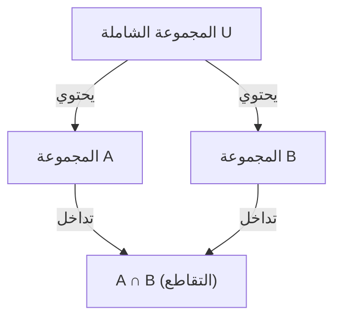

## 1. مقدمة

في الرياضيات وعلوم الحاسوب، نواجه كثيراً مواقف نحتاج فيها إلى عد العناصر التي تستوفي شروطاً متعددة. ومع ذلك، عندما تكون هناك شروط متعددة، فإن مجموعات العناصر التي تستوفي كل شرط غالباً ما تتداخل (لها تقاطعات). جمعها ببساطة سيؤدي إلى عد العناصر أكثر من مرة.

الطريقة الفعالة لإزالة هذه التداخلات بدقة واستنتاج العدد الصحيح للعناصر هي **مبدأ التضمين والإقصاء** (Inclusion-Exclusion Principle).

في هذه المقالة، سنشرح مبدأ التضمين والإقصاء بالتفصيل، من مفاهيمه الأساسية إلى الصيغ الرياضية المعممة، والبراهين الرياضية، وأمثلة التطبيق الملموسة (مثل مؤشر أويلر والاضطرابات). علاوة على ذلك، سنقدم أمثلة على التنفيذ البرمجي لتعميق فهمك من المنظورين النظري والعملي.

## 2. أساسيات المجموعات والعدد الأصلي

قبل تعلم مبدأ التضمين والإقصاء، دعونا نراجع الترميز الأساسي للمجموعات.

- $A, B$ : مجموعات
- $|A|$ : عدد العناصر (العدد الأصلي) للمجموعة $A$
- $A \cup B$ : اتحاد المجموعة $A$ والمجموعة $B$ (العناصر التي تنتمي إلى واحدة على الأقل)
- $A \cap B$ : تقاطع المجموعة $A$ والمجموعة $B$ (العناصر التي تنتمي إلى كلتيهما)

ما نريد إيجاده هو العدد الأصلي لاتحاد مجموعات متعددة، أي $|A \cup B \cup \dots|$.

## 3. مبدأ التضمين والإقصاء لمجموعتين

دعونا نفكر في الحالة الأبسط مع مجموعتين، $A$ و $B$.

### 3.1 الصيغة

$$
|A \cup B| = |A| + |B| - |A \cap B|
$$

### 3.2 الفهم الحدسي

عندما تجمع عدد العناصر في المجموعة $A$ ($|A|$) والمجموعة $B$ ($|B|$)، فإن العناصر التي تنتمي إلى كلتا المجموعتين، أي العناصر في التقاطع $A \cap B$، تتم إضافتها **مرتين**.
لذلك، بطرح الجزء الذي تم عده مرتين $|A \cap B|$ مرة واحدة بالضبط، تحصل على العدد الأصلي الصحيح للاتحاد $|A \cup B|$.



## 4. مبدأ التضمين والإقصاء لـ 3 مجموعات

عندما تكون هناك ثلاث مجموعات، يصبح الأمر أكثر تعقيداً قليلاً. نعتبر المجموعات $A, B, C$.

### 4.1 الصيغة

$$
|A \cup B \cup C| = |A| + |B| + |C| - |A \cap B| - |B \cap C| - |C \cap A| + |A \cap B \cap C|
$$

### 4.2 الفهم الحدسي والبرهان

1. أولاً، اجمع كل الأعداد الأصلية الفردية: $|A| + |B| + |C|$
2. بالقيام بذلك، تتم إضافة تقاطعات أي مجموعتين مرتين، لذا اطرحها: $- |A \cap B| - |B \cap C| - |C \cap A|$
3. أخيراً، فكر في تقاطع المجموعات الثلاث بأكملها $A \cap B \cap C$. تمت إضافته 3 مرات في الخطوة 1، وتم طرحه 3 مرات في الخطوة 2، مما جعل عدده الحالي $0$. لذلك، نعيده مرة واحدة في النهاية: $+ |A \cap B \cap C|$

### 4.3 مثال ملموس: عدد الأعداد الصحيحة من 1 إلى 100 التي تقبل القسمة على 2 أو 3 أو 5

- المجموعة الشاملة: $U = \{1, 2, \dots, 100\}$
- مجموعة مضاعفات العدد 2: $A$
- مجموعة مضاعفات العدد 3: $B$
- مجموعة مضاعفات العدد 5: $C$

لنجد كل عدد أصلي (حيث تمثل $\lfloor x \rfloor$ دالة التقريب للأدنى).

- $|A| = \lfloor 100 / 2 \rfloor = 50$
- $|B| = \lfloor 100 / 3 \rfloor = 33$
- $|C| = \lfloor 100 / 5 \rfloor = 20$
- $|A \cap B|$ (مضاعفات الـ 6) $= \lfloor 100 / 6 \rfloor = 16$
- $|B \cap C|$ (مضاعفات الـ 15) $= \lfloor 100 / 15 \rfloor = 6$
- $|C \cap A|$ (مضاعفات الـ 10) $= \lfloor 100 / 10 \rfloor = 10$
- $|A \cap B \cap C|$ (مضاعفات الـ 30) $= \lfloor 100 / 30 \rfloor = 3$

بتطبيق هذا على الصيغة:
$$
|A \cup B \cup C| = 50 + 33 + 20 - 16 - 6 - 10 + 3 = 74
$$
لذلك، هناك **74** عدداً يقبل القسمة على 2 أو 3 أو 5.

## 5. مبدأ التضمين والإقصاء العام لـ $n$ مجموعة

تعميم هذا على $n$ مجموعات $A_1, A_2, \dots, A_n$ يعطي الصيغة الجميلة التالية.

### 5.1 الصيغة

$$
\left| \bigcup_{i=1}^n A_i \right| = \sum_{k=1}^n (-1)^{k-1} \left( \sum_{1 \le i_1 < i_2 < \dots < i_k \le n} \left| A_{i_1} \cap A_{i_2} \cap \dots \cap A_{i_k} \right| \right)
$$

بالكلمات، تكرر العملية "إضافة الأعداد الأصلية لتقاطعات عدد فردي من المجموعات، وطرح الأعداد الأصلية لتقاطعات عدد زوجي من المجموعات".

### 5.2 مخطط البرهان الرياضي

سنوضح أن أي عنصر $x \in \bigcup_{i=1}^n A_i$ يتم عده مرة واحدة بالضبط في الحساب على الجانب الأيمن.

لنفترض أن عنصراً معيناً $x$ موجود في $m$ مجموعات بالضبط ($1 \le m \le n$).
يمكن التعبير عن عدد المرات التي يتم فيها عد $x$ على الجانب الأيمن باستخدام المعاملات ذات الحدين كما يلي:

$$
\text{عدد المرات} = \binom{m}{1} - \binom{m}{2} + \binom{m}{3} - \dots + (-1)^{m-1} \binom{m}{m}
$$

بواسطة نظرية ذات الحدين، يُعرف أن $(1 - 1)^m = \binom{m}{0} - \binom{m}{1} + \binom{m}{2} - \dots + (-1)^m \binom{m}{m} = 0$.
بإعادة ترتيب هذا:

$$
\binom{m}{0} - \left( \binom{m}{1} - \binom{m}{2} + \dots + (-1)^{m-1} \binom{m}{m} \right) = 0
$$

بما أن $\binom{m}{0} = 1$، فإن التعبير داخل الأقواس (وهو عدد المرات التي يتم فيها عد $x$) يساوي $1$ بالضبط.
هذا يثبت أن كل عنصر يتم عده مرة واحدة بالضبط دون تكرار.

## 6. مثال تطبيقي 1: مؤشر أويلر

يمثل مؤشر أويلر (Euler's totient function) $\varphi(N)$ عدد الأعداد الصحيحة من $1$ إلى $N$ التي هي أعداد أولية نسبياً مع $N$. يمكن أيضاً حساب هذا باستخدام مبدأ التضمين والإقصاء.

لتكن العوامل الأولية لـ $N$ هي $p_1, p_2, \dots, p_k$.
لتكن المجموعة الشاملة $U = \{1, 2, \dots, N\}$، ولتكن $A_i$ "مجموعة مضاعفات $p_i$".
ما نريد إيجاده هو عدد العناصر التي لا تنتمي إلى أي $A_i$.

$$
\varphi(N) = N - \left| \bigcup_{i=1}^k A_i \right|
$$

يؤدي تطبيق مبدأ التضمين والإقصاء وتبسيطه إلى هذه الصيغة الشهيرة:

$$
\varphi(N) = N \left(1 - \frac{1}{p_1}\right) \left(1 - \frac{1}{p_2}\right) \dots \left(1 - \frac{1}{p_k}\right)
$$

## 7. مثال تطبيقي 2: الاضطرابات (Derangements)

الاضطراب هو تبديل للأرقام من $1$ إلى $n$ بحيث لا يكون هناك أي رقم $i$ في الموضع $i$. على سبيل المثال، يعادل إجمالي عدد الطرق لتوزيع الهدايا في تبادل الهدايا بحيث لا يتلقى أي شخص هديته الخاصة.

لتكن $A_i$ "مجموعة التبديلات حيث يوجد $i$ في الموضع $i$". العدد الأصلي للمجموعة الشاملة هو $n!$.
نحن نريد إيجاد $n! - |A_1 \cup A_2 \cup \dots \cup A_n|$.

العدد الأصلي لتقاطع أي مجموعات $k$ هو $(n-k)!$، وهناك $\binom{n}{k}$ طريقة لاختيار مثل هذه المجموعات $k$. بتطبيق مبدأ التضمين والإقصاء، يتم الحصول على عدد الاضطرابات $D_n$ كما يلي:

$$
D_n = n! \sum_{k=0}^n \frac{(-1)^k}{k!}
$$

## 8. الحساب والتنفيذ عبر البرمجة

يعد مبدأ التضمين والإقصاء مفيداً للغاية في البرمجة. خاصة عندما يقترن بالبحث الشامل على مستوى البت (bitwise exhaustive search)، يمكن تنفيذ مبدأ التضمين والإقصاء لـ $n$ شروط بإيجاز.

فيما يلي كود Python لإيجاد "عدد الأعداد الصحيحة من 1 إلى $M$ التي تقبل القسمة على أي من الأعداد الأولية في قائمة معطاة".

```python
def count_multiples(M: int, primes: list[int]) -> int:
    n = len(primes)
    total_count = 0
    
    # استكشاف جميع المجموعات الفرعية باستخدام أقنعة البت (bitmasks) من 1 إلى 2^n - 1
    for i in range(1, 1 << n):
        lcm = 1
        set_bits = 0
        
        # حساب حاصل ضرب (المضاعف المشترك الأصغر LCM) للأعداد الأولية المحددة
        for j in range(n):
            if (i >> j) & 1:
                lcm *= primes[j]
                set_bits += 1
                
        # أضف إذا تم اختيار عدد فردي من الأعداد الأولية، اطرح إذا كان زوجياً (مبدأ التضمين والإقصاء)
        if set_bits % 2 == 1:
            total_count += M // lcm
        else:
            total_count -= M // lcm
            
    return total_count

# مثال على التنفيذ
M = 100
primes = [2, 3, 5]
# المخرجات المتوقعة: 74
print(f"النتيجة: {count_multiples(M, primes)}")
```

التعقيد الزمني لهذه الخوارزمية هو $O(n \cdot 2^n)$، والتي تعمل بسرعة كافية إذا كان $n$ يصل إلى حوالي 20.

## 9. الخاتمة

مبدأ التضمين والإقصاء هو صيغة رياضية سحرية تقسم التداخلات المعقدة ظاهرياً للمجموعات إلى تكرار بسيط وميكانيكي للجمع والطرح.

نطاق تطبيقه واسع بشكل استثنائي، ويمتد من مشاكل الاحتمالات الأساسية إلى البرمجة التنافسية المتقدمة، وحساب مؤشر أويلر المرتبط بالتشفير.
إن إتقان هذه التقنية القوية سيحسن بشكل كبير من قدراتك على حل المشكلات في الرياضيات والخوارزميات. بكل الوسائل، حاول تطبيقها على مشاكل مختلفة واختبر قوتها.
