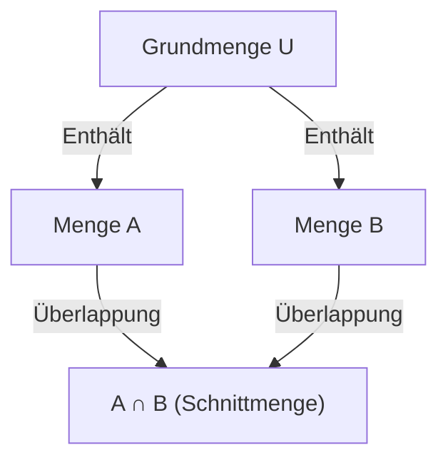

## 1. Einführung

In der Mathematik und Informatik begegnen wir häufig Situationen, in denen wir die Anzahl der Elemente zählen müssen, die mehrere Bedingungen erfüllen. Wenn es jedoch mehrere Bedingungen gibt, überlappen sich die Mengen von Elementen, die jede Bedingung erfüllen, häufig (haben Schnittmengen). Ein einfaches Addieren führt dazu, dass Elemente mehrfach gezählt werden.

Eine leistungsstarke Methode, um diese Überlappungen genau zu eliminieren und die korrekte Anzahl von Elementen abzuleiten, ist das **Inklusions-Exklusions-Prinzip**.

In diesem Artikel werden wir das Inklusions-Exklusions-Prinzip von den grundlegenden Konzepten über verallgemeinerte mathematische Formeln und mathematische Beweise bis hin zu konkreten Anwendungsbeispielen (wie Eulersche Phi-Funktion und Derangements) im Detail erklären. Darüber hinaus werden wir Programmierimplementierungsbeispiele vorstellen, um Ihr Verständnis sowohl aus theoretischer als auch aus praktischer Sicht zu vertiefen.

## 2. Grundlagen von Mengen und Mächtigkeit

Bevor wir das Inklusions-Exklusions-Prinzip erlernen, lassen Sie uns die grundlegende Mengennotation wiederholen.

- $A, B$ : Mengen
- $|A|$ : Anzahl der Elemente (Mächtigkeit) der Menge $A$
- $A \cup B$ : Vereinigung von Menge $A$ und Menge $B$ (Elemente, die zu mindestens einer gehören)
- $A \cap B$ : Schnittmenge von Menge $A$ und Menge $B$ (Elemente, die zu beiden gehören)

Was wir finden wollen, ist die Mächtigkeit der Vereinigung mehrerer Mengen, nämlich $|A \cup B \cup \dots|$.

## 3. Inklusions-Exklusions-Prinzip für 2 Mengen

Betrachten wir den einfachsten Fall mit zwei Mengen, $A$ und $B$.

### 3.1 Formel

$$
|A \cup B| = |A| + |B| - |A \cap B|
$$

### 3.2 Intuitives Verständnis

Wenn Sie die Anzahl der Elemente in Menge $A$ ($|A|$) und Menge $B$ ($|B|$) addieren, werden die Elemente, die zu beiden Mengen gehören, also Elemente in der Schnittmenge $A \cap B$, **zweimal** addiert.
Daher erhalten Sie durch genau einmaliges Subtrahieren des doppelt gezählten Teils $|A \cap B|$ die korrekte Mächtigkeit der Vereinigung $|A \cup B|$.



## 4. Inklusions-Exklusions-Prinzip für 3 Mengen

Bei drei Mengen wird es etwas komplexer. Betrachten wir die Mengen $A, B, C$.

### 4.1 Formel

$$
|A \cup B \cup C| = |A| + |B| + |C| - |A \cap B| - |B \cap C| - |C \cap A| + |A \cap B \cap C|
$$

### 4.2 Intuitives Verständnis und Beweis

1. Addieren Sie zuerst alle einzelnen Mächtigkeiten: $|A| + |B| + |C|$
2. Dadurch werden die Schnittmengen von jeweils zwei Mengen zweimal addiert, also subtrahieren Sie diese: $- |A \cap B| - |B \cap C| - |C \cap A|$
3. Betrachten Sie schließlich die Schnittmenge aller drei Mengen $A \cap B \cap C$. Sie wurde in Schritt 1 3-mal addiert und in Schritt 2 3-mal subtrahiert, so dass ihre aktuelle Zählung bei $0$ liegt. Deshalb addieren wir sie am Ende noch einmal: $+ |A \cap B \cap C|$

### 4.3 Konkretes Beispiel: Die Anzahl der ganzen Zahlen von 1 bis 100, die durch 2, 3 oder 5 teilbar sind

- Grundmenge: $U = \{1, 2, \dots, 100\}$
- Menge der Vielfachen von 2: $A$
- Menge der Vielfachen von 3: $B$
- Menge der Vielfachen von 5: $C$

Finden wir jede Mächtigkeit (wobei $\lfloor x \rfloor$ die Abrundungsfunktion darstellt).

- $|A| = \lfloor 100 / 2 \rfloor = 50$
- $|B| = \lfloor 100 / 3 \rfloor = 33$
- $|C| = \lfloor 100 / 5 \rfloor = 20$
- $|A \cap B|$ (Vielfache von 6) $= \lfloor 100 / 6 \rfloor = 16$
- $|B \cap C|$ (Vielfache von 15) $= \lfloor 100 / 15 \rfloor = 6$
- $|C \cap A|$ (Vielfache von 10) $= \lfloor 100 / 10 \rfloor = 10$
- $|A \cap B \cap C|$ (Vielfache von 30) $= \lfloor 100 / 30 \rfloor = 3$

Wenden wir dies auf die Formel an:
$$
|A \cup B \cup C| = 50 + 33 + 20 - 16 - 6 - 10 + 3 = 74
$$
Daher gibt es **74** Zahlen, die durch 2, 3 oder 5 teilbar sind.

## 5. Allgemeines Inklusions-Exklusions-Prinzip für $n$ Mengen

Die Verallgemeinerung auf $n$ Mengen $A_1, A_2, \dots, A_n$ ergibt die folgende schöne Formel.

### 5.1 Formel

$$
\left| \bigcup_{i=1}^n A_i \right| = \sum_{k=1}^n (-1)^{k-1} \left( \sum_{1 \le i_1 < i_2 < \dots < i_k \le n} \left| A_{i_1} \cap A_{i_2} \cap \dots \cap A_{i_k} \right| \right)
$$

In Worten wiederholt die Operation das "Addieren der Mächtigkeiten der Schnittmengen einer ungeraden Anzahl von Mengen und das Subtrahieren der Mächtigkeiten der Schnittmengen einer geraden Anzahl von Mengen."

### 5.2 Skizze des mathematischen Beweises

Wir werden zeigen, dass jedes Element $x \in \bigcup_{i=1}^n A_i$ in der Berechnung auf der rechten Seite genau einmal gezählt wird.

Angenommen, ein bestimmtes Element $x$ ist in genau $m$ Mengen enthalten ($1 \le m \le n$).
Die Anzahl, wie oft $x$ auf der rechten Seite gezählt wird, kann unter Verwendung von Binomialkoeffizienten wie folgt ausgedrückt werden:

$$
\text{Gezählte Male} = \binom{m}{1} - \binom{m}{2} + \binom{m}{3} - \dots + (-1)^{m-1} \binom{m}{m}
$$

Nach dem Binomischen Lehrsatz ist bekannt, dass $(1 - 1)^m = \binom{m}{0} - \binom{m}{1} + \binom{m}{2} - \dots + (-1)^m \binom{m}{m} = 0$.
Durch Umstellen erhalten wir:

$$
\binom{m}{0} - \left( \binom{m}{1} - \binom{m}{2} + \dots + (-1)^{m-1} \binom{m}{m} \right) = 0
$$

Da $\binom{m}{0} = 1$, wertet sich der Ausdruck innerhalb der Klammern (der die Häufigkeit darstellt, wie oft $x$ gezählt wird) genau zu $1$ aus.
Dies beweist, dass jedes Element genau einmal ohne Duplikate gezählt wird.

## 6. Anwendungsbeispiel 1: Eulersche Phi-Funktion

Die Eulersche Phi-Funktion $\varphi(N)$ repräsentiert die Anzahl der ganzen Zahlen von $1$ bis $N$, die zu $N$ teilerfremd sind. Dies kann auch mit dem Inklusions-Exklusions-Prinzip berechnet werden.

Seien die Primfaktoren von $N$ $p_1, p_2, \dots, p_k$.
Sei die Grundmenge $U = \{1, 2, \dots, N\}$, und $A_i$ die "Menge der Vielfachen von $p_i$".
Was wir finden wollen, ist die Anzahl der Elemente, die zu keinem $A_i$ gehören.

$$
\varphi(N) = N - \left| \bigcup_{i=1}^k A_i \right|
$$

Die Anwendung des Inklusions-Exklusions-Prinzips und die Vereinfachung führen zu dieser berühmten Formel:

$$
\varphi(N) = N \left(1 - \frac{1}{p_1}\right) \left(1 - \frac{1}{p_2}\right) \dots \left(1 - \frac{1}{p_k}\right)
$$

## 7. Anwendungsbeispiel 2: Derangements (Fixpunktfreie Permutationen)

Ein Derangement ist eine Permutation der Zahlen von $1$ bis $n$, so dass sich keine $i$-te Zahl an der $i$-ten Position befindet. Es entspricht beispielsweise der Gesamtzahl der Möglichkeiten, Geschenke bei einem Wichteln so zu verteilen, dass niemand sein eigenes Geschenk erhält.

Sei $A_i$ "die Menge der Permutationen, bei denen $i$ an der $i$-ten Position steht". Die Mächtigkeit der Grundmenge ist $n!$.
Wir wollen $n! - |A_1 \cup A_2 \cup \dots \cup A_n|$ finden.

Die Mächtigkeit der Schnittmenge von beliebigen $k$ Mengen ist $(n-k)!$, und es gibt $\binom{n}{k}$ Möglichkeiten, solche $k$ Mengen auszuwählen. Wendet man das Inklusions-Exklusions-Prinzip an, erhält man die Anzahl der Derangements $D_n$ wie folgt:

$$
D_n = n! \sum_{k=0}^n \frac{(-1)^k}{k!}
$$

## 8. Berechnung und Implementierung durch Programmierung

Das Inklusions-Exklusions-Prinzip ist in der Programmierung äußerst nützlich. Insbesondere in Kombination mit der bitweisen erschöpfenden Suche kann das Inklusions-Exklusions-Prinzip für $n$ Bedingungen prägnant implementiert werden.

Nachfolgend finden Sie Python-Code, um "die Anzahl der ganzen Zahlen von 1 bis $M$, die durch eine der Primzahlen in einer gegebenen Liste teilbar sind", zu finden.

```python
def count_multiples(M: int, primes: list[int]) -> int:
    n = len(primes)
    total_count = 0
    
    # Durchsuche alle Teilmengen mit Bitmasken von 1 bis 2^n - 1
    for i in range(1, 1 << n):
        lcm = 1
        set_bits = 0
        
        # Berechne das Produkt (KGV) der ausgewählten Primzahlen
        for j in range(n):
            if (i >> j) & 1:
                lcm *= primes[j]
                set_bits += 1
                
        # Addieren, wenn eine ungerade Anzahl von Primzahlen gewählt wurde, subtrahieren, wenn gerade (Inklusions-Exklusions-Prinzip)
        if set_bits % 2 == 1:
            total_count += M // lcm
        else:
            total_count -= M // lcm
            
    return total_count

# Ausführungsbeispiel
M = 100
primes = [2, 3, 5]
# Erwartete Ausgabe: 74
print(f"Ergebnis: {count_multiples(M, primes)}")
```

Die Zeitkomplexität dieses Algorithmus beträgt $O(n \cdot 2^n)$, was ausreichend schnell läuft, wenn $n$ bis zu etwa 20 beträgt.

## 9. Fazit

Das Inklusions-Exklusions-Prinzip ist eine magische mathematische Formel, die scheinbar komplexe Überlappungen von Mengen in eine einfache und mechanische Wiederholung von Addition und Subtraktion zerlegt.

Ihr Anwendungsbereich ist außergewöhnlich breit und reicht von grundlegenden Wahrscheinlichkeitsproblemen über fortgeschrittenes kompetitives Programmieren bis hin zur Berechnung der Eulerschen Phi-Funktion in der Kryptographie.
Die Beherrschung dieser mächtigen Technik wird Ihre Problemlösungsfähigkeiten in Mathematik und Algorithmen drastisch verbessern. Versuchen Sie auf jeden Fall, es auf verschiedene Probleme anzuwenden und seine Leistungsfähigkeit zu erleben.
