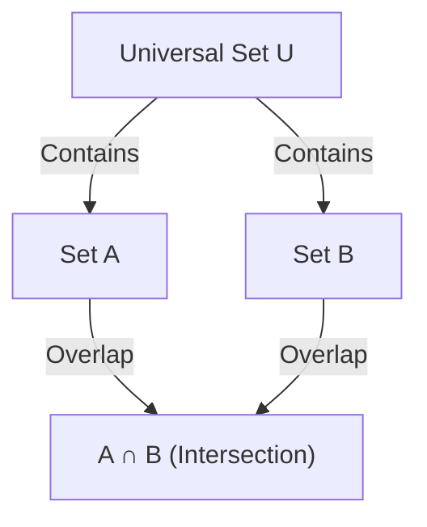

## 1. Introduction

In mathematics and computer science, we frequently encounter situations where we need to count the number of elements that satisfy multiple conditions. However, when there are multiple conditions, the sets of elements satisfying each condition often overlap (have intersections). Simply adding them up will result in counting elements multiple times.

A powerful method to accurately eliminate these overlaps and derive the correct number of elements is the **[Inclusion-Exclusion Principle](https://kenji.blog/en/p/inclusion-exclusion-principle/)**.

In this article, we will comprehensively explain the [Inclusion-Exclusion Principle](https://kenji.blog/en/p/inclusion-exclusion-principle/) in detail, from its basic concepts to generalized mathematical formulas, mathematical proofs, and concrete application examples (such as Euler's totient function and derangements). Furthermore, we will introduce programming implementation examples to deepen your understanding from both theoretical and practical perspectives.

## 2. Basics of Sets and Cardinality

Before learning the [Inclusion-Exclusion Principle](https://kenji.blog/en/p/inclusion-exclusion-principle/), let's review basic set notation.

- $A, B$ : Sets
- $|A|$ : Number of elements (cardinality) of set $A$
- $A \cup B$ : Union of set $A$ and set $B$ (elements belonging to at least one)
- $A \cap B$ : Intersection of set $A$ and set $B$ (elements belonging to both)

What we want to find is the cardinality of the union of multiple sets, namely $|A \cup B \cup \dots|$.

## 3. [Inclusion-Exclusion Principle](https://kenji.blog/en/p/inclusion-exclusion-principle/) for 2 Sets

Let's consider the simplest case with two sets, $A$ and $B$.

### 3.1 Formula

$$
|A \cup B| = |A| + |B| - |A \cap B|
$$

### 3.2 Intuitive Understanding

When you add the number of elements in set $A$ ($|A|$) and set $B$ ($|B|$), the elements that belong to both sets, i.e., elements in the intersection $A \cap B$, are added **twice**.
Therefore, by subtracting the overcounted portion $|A \cap B|$ exactly once, you obtain the correct cardinality of the union $|A \cup B|$.



## 4. [Inclusion-Exclusion Principle](https://kenji.blog/en/p/inclusion-exclusion-principle/) for 3 Sets

When there are three sets, it gets slightly more complex. Consider sets $A, B, C$.

### 4.1 Formula

$$
|A \cup B \cup C| = |A| + |B| + |C| - |A \cap B| - |B \cap C| - |C \cap A| + |A \cap B \cap C|
$$

### 4.2 Intuitive Understanding and Proof

1. First, add all the individual cardinalities: $|A| + |B| + |C|$
2. By doing this, the intersections of any two sets are added twice, so subtract them: $- |A \cap B| - |B \cap C| - |C \cap A|$
3. Finally, consider the intersection of all three sets $A \cap B \cap C$. It was added 3 times in step 1, and subtracted 3 times in step 2, leaving its current count at $0$. Therefore, we add it back once at the end: $+ |A \cap B \cap C|$

### 4.3 Concrete Example: The number of integers from 1 to 100 divisible by 2, 3, or 5

- Universal set: $U = \{1, 2, \dots, 100\}$
- Set of multiples of 2: $A$
- Set of multiples of 3: $B$
- Set of multiples of 5: $C$

Let's find each cardinality (where $\lfloor x \rfloor$ represents the floor function).

- $|A| = \lfloor 100 / 2 \rfloor = 50$
- $|B| = \lfloor 100 / 3 \rfloor = 33$
- $|C| = \lfloor 100 / 5 \rfloor = 20$
- $|A \cap B|$ (Multiples of 6) $= \lfloor 100 / 6 \rfloor = 16$
- $|B \cap C|$ (Multiples of 15) $= \lfloor 100 / 15 \rfloor = 6$
- $|C \cap A|$ (Multiples of 10) $= \lfloor 100 / 10 \rfloor = 10$
- $|A \cap B \cap C|$ (Multiples of 30) $= \lfloor 100 / 30 \rfloor = 3$

Applying this to the formula:
$$
|A \cup B \cup C| = 50 + 33 + 20 - 16 - 6 - 10 + 3 = 74
$$
Therefore, there are **74** numbers divisible by 2, 3, or 5.

## 5. General [Inclusion-Exclusion Principle](https://kenji.blog/en/p/inclusion-exclusion-principle/) for $n$ Sets

Generalizing this to $n$ sets $A_1, A_2, \dots, A_n$ gives the following beautiful formula.

### 5.1 Formula

$$
\left| \bigcup_{i=1}^n A_i \right| = \sum_{k=1}^n (-1)^{k-1} \left( \sum_{1 \le i_1 < i_2 < \dots < i_k \le n} \left| A_{i_1} \cap A_{i_2} \cap \dots \cap A_{i_k} \right| \right)
$$

In words, the operation repeats "adding the cardinalities of intersections of an odd number of sets, and subtracting the cardinalities of intersections of an even number of sets."

### 5.2 Outline of Mathematical Proof

We will show that any element $x \in \bigcup_{i=1}^n A_i$ is counted exactly once in the calculation on the right-hand side.

Assume a certain element $x$ is contained in exactly $m$ sets ($1 \le m \le n$).
The number of times $x$ is counted on the right-hand side can be expressed using binomial coefficients as follows:

$$
\text{Times Counted} = \binom{m}{1} - \binom{m}{2} + \binom{m}{3} - \dots + (-1)^{m-1} \binom{m}{m}
$$

By the binomial theorem, it is known that $(1 - 1)^m = \binom{m}{0} - \binom{m}{1} + \binom{m}{2} - \dots + (-1)^m \binom{m}{m} = 0$.
Rearranging this:

$$
\binom{m}{0} - \left( \binom{m}{1} - \binom{m}{2} + \dots + (-1)^{m-1} \binom{m}{m} \right) = 0
$$

Since $\binom{m}{0} = 1$, the expression inside the parentheses (which is the number of times $x$ is counted) evaluates to exactly $1$.
This proves that every element is counted exactly once without duplication.

## 6. Application Example 1: Euler's Totient Function

Euler's totient function $\varphi(N)$ represents the number of integers from $1$ to $N$ that are coprime to $N$. This can also be calculated using the [Inclusion-Exclusion Principle](https://kenji.blog/en/p/inclusion-exclusion-principle/).

Let the prime factors of $N$ be $p_1, p_2, \dots, p_k$.
Let the universal set be $U = \{1, 2, \dots, N\}$, and $A_i$ be "the set of multiples of $p_i$".
What we want to find is the number of elements that do not belong to any $A_i$.

$$
\varphi(N) = N - \left| \bigcup_{i=1}^k A_i \right|
$$

Applying the [Inclusion-Exclusion Principle](https://kenji.blog/en/p/inclusion-exclusion-principle/) and simplifying leads to this famous formula:

$$
\varphi(N) = N \left(1 - \frac{1}{p_1}\right) \left(1 - \frac{1}{p_2}\right) \dots \left(1 - \frac{1}{p_k}\right)
$$

## 7. Application Example 2: Derangements

A derangement is a permutation of the numbers $1$ to $n$ such that no $i$-th number is in the $i$-th position. For example, it is equivalent to the total number of ways to distribute gifts in a gift exchange such that no one receives their own gift.

Let $A_i$ be "the set of permutations where $i$ is in the $i$-th position". The cardinality of the universal set is $n!$.
We want to find $n! - |A_1 \cup A_2 \cup \dots \cup A_n|$.

The cardinality of the intersection of any $k$ sets is $(n-k)!$, and there are $\binom{n}{k}$ ways to choose such $k$ sets. Applying the [Inclusion-Exclusion Principle](https://kenji.blog/en/p/inclusion-exclusion-principle/), the number of derangements $D_n$ is obtained as follows:

$$
D_n = n! \sum_{k=0}^n \frac{(-1)^k}{k!}
$$

## 8. Calculation and Implementation via Programming

The [Inclusion-Exclusion Principle](https://kenji.blog/en/p/inclusion-exclusion-principle/) is extremely useful in programming. Especially when combined with bitwise exhaustive search, the [Inclusion-Exclusion Principle](https://kenji.blog/en/p/inclusion-exclusion-principle/) for $n$ conditions can be implemented concisely.

Below is Python code to find "the number of integers from 1 to $M$ that are divisible by any of the prime numbers in a given list".

```python
def count_multiples(M: int, primes: list[int]) -> int:
    n = len(primes)
    total_count = 0
    
    # Explore all subsets using bitmasks from 1 to 2^n - 1
    for i in range(1, 1 << n):
        lcm = 1
        set_bits = 0
        
        # Calculate the product (LCM) of the selected primes
        for j in range(n):
            if (i >> j) & 1:
                lcm *= primes[j]
                set_bits += 1
                
        # Add if an odd number of primes were chosen, subtract if even (Inclusion-Exclusion Principle)
        if set_bits % 2 == 1:
            total_count += M // lcm
        else:
            total_count -= M // lcm
            
    return total_count

# Execution example
M = 100
primes = [2, 3, 5]
# Expected output: 74
print(f"Result: {count_multiples(M, primes)}")
```

The time complexity of this algorithm is $O(n \cdot 2^n)$, which runs sufficiently fast if $n$ is up to about 20.

## 9. Conclusion

The [Inclusion-Exclusion Principle](https://kenji.blog/en/p/inclusion-exclusion-principle/) is a magical mathematical formula that breaks down seemingly complex overlaps of sets into a simple and mechanical repetition of addition and subtraction.

Its range of application is exceptionally broad, spanning from basic probability problems to advanced competitive programming, and the calculation of Euler's totient function related to cryptography.
Mastering this powerful technique will dramatically improve your problem-solving abilities in mathematics and algorithms. By all means, try applying it to various problems and experience its power.
