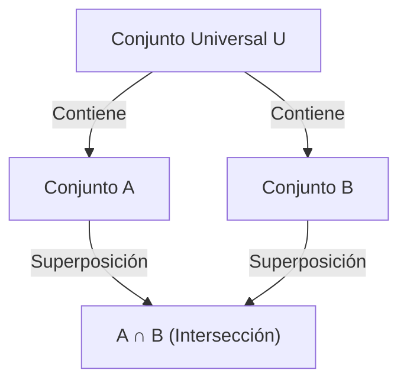

## 1. Introducción

En matemáticas y ciencias de la computación, frecuentemente encontramos situaciones donde necesitamos contar el número de elementos que satisfacen múltiples condiciones. Sin embargo, cuando hay múltiples condiciones, los conjuntos de elementos que satisfacen cada condición a menudo se superponen (tienen intersecciones). Simplemente sumarlos resultará en contar elementos múltiples veces.

Un método poderoso para eliminar con precisión estas superposiciones y derivar el número correcto de elementos es el **[Principio de Inclusión-Exclusión](https://kenji.blog/es/p/inclusion-exclusion-principle/)**.

En este artículo, explicaremos exhaustivamente el [Principio de Inclusión-Exclusión](https://kenji.blog/es/p/inclusion-exclusion-principle/) en detalle, desde sus conceptos básicos hasta fórmulas matemáticas generalizadas, demostraciones matemáticas y ejemplos concretos de aplicación (como la función indicatriz de Euler y los desarreglos). Además, introduciremos ejemplos de implementación en programación para profundizar su comprensión desde perspectivas teóricas y prácticas.

## 2. Conceptos básicos de conjuntos y cardinalidad

Antes de aprender el [Principio de Inclusión-Exclusión](https://kenji.blog/es/p/inclusion-exclusion-principle/), repasemos la notación básica de conjuntos.

- $A, B$ : Conjuntos
- $|A|$ : Número de elementos (cardinalidad) del conjunto $A$
- $A \cup B$ : Unión del conjunto $A$ y el conjunto $B$ (elementos que pertenecen a al menos uno)
- $A \cap B$ : Intersección del conjunto $A$ y el conjunto $B$ (elementos que pertenecen a ambos)

Lo que queremos encontrar es la cardinalidad de la unión de múltiples conjuntos, es decir, $|A \cup B \cup \dots|$.

## 3. [Principio de Inclusión-Exclusión](https://kenji.blog/es/p/inclusion-exclusion-principle/) para 2 conjuntos

Consideremos el caso más simple con dos conjuntos, $A$ y $B$.

### 3.1 Fórmula

$$
|A \cup B| = |A| + |B| - |A \cap B|
$$

### 3.2 Comprensión intuitiva

Cuando sumas el número de elementos en el conjunto $A$ ($|A|$) y en el conjunto $B$ ($|B|$), los elementos que pertenecen a ambos conjuntos, es decir, elementos en la intersección $A \cap B$, se suman **dos veces**.
Por lo tanto, al restar la porción contada de más $|A \cap B|$ exactamente una vez, obtienes la cardinalidad correcta de la unión $|A \cup B|$.



## 4. [Principio de Inclusión-Exclusión](https://kenji.blog/es/p/inclusion-exclusion-principle/) para 3 conjuntos

Cuando hay tres conjuntos, se vuelve un poco más complejo. Consideremos los conjuntos $A, B, C$.

### 4.1 Fórmula

$$
|A \cup B \cup C| = |A| + |B| + |C| - |A \cap B| - |B \cap C| - |C \cap A| + |A \cap B \cap C|
$$

### 4.2 Comprensión intuitiva y demostración

1. Primero, suma todas las cardinalidades individuales: $|A| + |B| + |C|$
2. Al hacer esto, las intersecciones de dos conjuntos cualesquiera se suman dos veces, así que réstalas: $- |A \cap B| - |B \cap C| - |C \cap A|$
3. Finalmente, considera la intersección de los tres conjuntos $A \cap B \cap C$. Se sumó 3 veces en el paso 1 y se restó 3 veces en el paso 2, dejando su conteo actual en $0$. Por lo tanto, lo sumamos de nuevo una vez al final: $+ |A \cap B \cap C|$

### 4.3 Ejemplo concreto: El número de enteros del 1 al 100 divisibles por 2, 3 o 5

- Conjunto universal: $U = \{1, 2, \dots, 100\}$
- Conjunto de múltiplos de 2: $A$
- Conjunto de múltiplos de 3: $B$
- Conjunto de múltiplos de 5: $C$

Encontremos cada cardinalidad (donde $\lfloor x \rfloor$ representa la función piso).

- $|A| = \lfloor 100 / 2 \rfloor = 50$
- $|B| = \lfloor 100 / 3 \rfloor = 33$
- $|C| = \lfloor 100 / 5 \rfloor = 20$
- $|A \cap B|$ (Múltiplos de 6) $= \lfloor 100 / 6 \rfloor = 16$
- $|B \cap C|$ (Múltiplos de 15) $= \lfloor 100 / 15 \rfloor = 6$
- $|C \cap A|$ (Múltiplos de 10) $= \lfloor 100 / 10 \rfloor = 10$
- $|A \cap B \cap C|$ (Múltiplos de 30) $= \lfloor 100 / 30 \rfloor = 3$

Aplicando esto a la fórmula:
$$
|A \cup B \cup C| = 50 + 33 + 20 - 16 - 6 - 10 + 3 = 74
$$
Por lo tanto, hay **74** números divisibles por 2, 3 o 5.

## 5. Principio General de Inclusión-Exclusión para $n$ conjuntos

Generalizar esto a $n$ conjuntos $A_1, A_2, \dots, A_n$ da la siguiente hermosa fórmula.

### 5.1 Fórmula

$$
\left| \bigcup_{i=1}^n A_i \right| = \sum_{k=1}^n (-1)^{k-1} \left( \sum_{1 \le i_1 < i_2 < \dots < i_k \le n} \left| A_{i_1} \cap A_{i_2} \cap \dots \cap A_{i_k} \right| \right)
$$

En palabras, la operación repite "sumar las cardinalidades de las intersecciones de un número impar de conjuntos, y restar las cardinalidades de las intersecciones de un número par de conjuntos."

### 5.2 Esquema de la demostración matemática

Demostraremos que cualquier elemento $x \in \bigcup_{i=1}^n A_i$ se cuenta exactamente una vez en el cálculo del lado derecho.

Supongamos que un cierto elemento $x$ está contenido en exactamente $m$ conjuntos ($1 \le m \le n$).
El número de veces que se cuenta $x$ en el lado derecho se puede expresar usando coeficientes binomiales de la siguiente manera:

$$
\text{Veces Contadas} = \binom{m}{1} - \binom{m}{2} + \binom{m}{3} - \dots + (-1)^{m-1} \binom{m}{m}
$$

Por el teorema del binomio, se sabe que $(1 - 1)^m = \binom{m}{0} - \binom{m}{1} + \binom{m}{2} - \dots + (-1)^m \binom{m}{m} = 0$.
Reorganizando esto:

$$
\binom{m}{0} - \left( \binom{m}{1} - \binom{m}{2} + \dots + (-1)^{m-1} \binom{m}{m} \right) = 0
$$

Dado que $\binom{m}{0} = 1$, la expresión dentro de los paréntesis (que es el número de veces que se cuenta $x$) se evalúa a exactamente $1$.
Esto demuestra que cada elemento se cuenta exactamente una vez sin duplicación.

## 6. Ejemplo de Aplicación 1: Función indicatriz de Euler

La función indicatriz de Euler $\varphi(N)$ representa el número de enteros de $1$ a $N$ que son coprimos con $N$. Esto también se puede calcular usando el [Principio de Inclusión-Exclusión](https://kenji.blog/es/p/inclusion-exclusion-principle/).

Sean los factores primos de $N$ $p_1, p_2, \dots, p_k$.
Sea el conjunto universal $U = \{1, 2, \dots, N\}$, y $A_i$ sea "el conjunto de múltiplos de $p_i$".
Lo que queremos encontrar es el número de elementos que no pertenecen a ningún $A_i$.

$$
\varphi(N) = N - \left| \bigcup_{i=1}^k A_i \right|
$$

Aplicando el [Principio de Inclusión-Exclusión](https://kenji.blog/es/p/inclusion-exclusion-principle/) y simplificando se llega a esta famosa fórmula:

$$
\varphi(N) = N \left(1 - \frac{1}{p_1}\right) \left(1 - \frac{1}{p_2}\right) \dots \left(1 - \frac{1}{p_k}\right)
$$

## 7. Ejemplo de Aplicación 2: Desarreglos

Un desarreglo es una permutación de los números de $1$ a $n$ tal que ningún $i$-ésimo número está en la $i$-ésima posición. Por ejemplo, es equivalente al número total de formas de distribuir regalos en un intercambio de regalos de tal forma que nadie reciba su propio regalo.

Sea $A_i$ "el conjunto de permutaciones donde $i$ está en la $i$-ésima posición". La cardinalidad del conjunto universal es $n!$.
Queremos encontrar $n! - |A_1 \cup A_2 \cup \dots \cup A_n|$.

La cardinalidad de la intersección de cualquier $k$ conjuntos es $(n-k)!$, y hay $\binom{n}{k}$ formas de elegir dichos $k$ conjuntos. Aplicando el [Principio de Inclusión-Exclusión](https://kenji.blog/es/p/inclusion-exclusion-principle/), el número de desarreglos $D_n$ se obtiene de la siguiente manera:

$$
D_n = n! \sum_{k=0}^n \frac{(-1)^k}{k!}
$$

## 8. Cálculo e Implementación a través de Programación

El [Principio de Inclusión-Exclusión](https://kenji.blog/es/p/inclusion-exclusion-principle/) es extremadamente útil en la programación. Especialmente cuando se combina con la búsqueda exhaustiva a nivel de bits, el [Principio de Inclusión-Exclusión](https://kenji.blog/es/p/inclusion-exclusion-principle/) para $n$ condiciones se puede implementar de manera concisa.

A continuación, se muestra el código en Python para encontrar "el número de enteros del 1 a $M$ que son divisibles por cualquiera de los números primos en una lista dada".

```python
def count_multiples(M: int, primes: list[int]) -> int:
    n = len(primes)
    total_count = 0
    
    # Explorar todos los subconjuntos usando máscaras de bits del 1 al 2^n - 1
    for i in range(1, 1 << n):
        lcm = 1
        set_bits = 0
        
        # Calcular el producto (MCM) de los primos seleccionados
        for j in range(n):
            if (i >> j) & 1:
                lcm *= primes[j]
                set_bits += 1
                
        # Sumar si se eligió un número impar de primos, restar si es par (Principio de Inclusión-Exclusión)
        if set_bits % 2 == 1:
            total_count += M // lcm
        else:
            total_count -= M // lcm
            
    return total_count

# Ejemplo de ejecución
M = 100
primes = [2, 3, 5]
# Salida esperada: 74
print(f"Resultado: {count_multiples(M, primes)}")
```

La complejidad temporal de este algoritmo es $O(n \cdot 2^n)$, lo cual se ejecuta lo suficientemente rápido si $n$ es de hasta aproximadamente 20.

## 9. Conclusión

El [Principio de Inclusión-Exclusión](https://kenji.blog/es/p/inclusion-exclusion-principle/) es una fórmula matemática mágica que descompone superposiciones de conjuntos aparentemente complejas en una repetición simple y mecánica de sumas y restas.

Su rango de aplicación es excepcionalmente amplio, abarcando desde problemas de probabilidad básica hasta programación competitiva avanzada, y el cálculo de la función indicatriz de Euler relacionada con la criptografía.
Dominar esta poderosa técnica mejorará dramáticamente sus habilidades de resolución de problemas en matemáticas y algoritmos. Sin duda, intente aplicarlo a varios problemas y experimente su poder.
