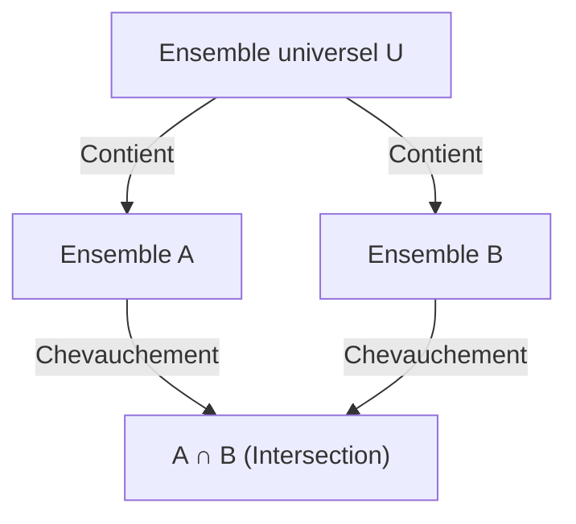

## 1. Introduction

En mathématiques et en informatique, nous rencontrons fréquemment des situations où nous devons compter le nombre d'éléments qui satisfont à de multiples conditions. Cependant, lorsqu'il y a plusieurs conditions, les ensembles d'éléments satisfaisant chaque condition se chevauchent souvent (ont des intersections). Les additionner simplement reviendrait à compter les éléments plusieurs fois.

Une méthode puissante pour éliminer précisément ces chevauchements et obtenir le nombre correct d'éléments est le **Principe d'inclusion-exclusion**.

Dans cet article, nous expliquerons de manière exhaustive le principe d'inclusion-exclusion en détail, de ses concepts de base aux formules mathématiques généralisées, aux preuves mathématiques et aux exemples d'applications concrets (comme l'indicatrice d'Euler et les dérangements). De plus, nous introduirons des exemples d'implémentation en programmation pour approfondir votre compréhension sous des angles à la fois théoriques et pratiques.

## 2. Bases des ensembles et de la cardinalité

Avant d'apprendre le principe d'inclusion-exclusion, passons en revue la notation de base des ensembles.

- $A, B$ : Ensembles
- $|A|$ : Nombre d'éléments (cardinalité) de l'ensemble $A$
- $A \cup B$ : Union de l'ensemble $A$ et de l'ensemble $B$ (éléments appartenant à au moins l'un d'eux)
- $A \cap B$ : Intersection de l'ensemble $A$ et de l'ensemble $B$ (éléments appartenant aux deux)

Ce que nous cherchons à trouver est la cardinalité de l'union de plusieurs ensembles, à savoir $|A \cup B \cup \dots|$.

## 3. Principe d'inclusion-exclusion pour 2 ensembles

Considérons le cas le plus simple avec deux ensembles, $A$ et $B$.

### 3.1 Formule

$$
|A \cup B| = |A| + |B| - |A \cap B|
$$

### 3.2 Compréhension intuitive

Lorsque vous additionnez le nombre d'éléments de l'ensemble $A$ ($|A|$) et de l'ensemble $B$ ($|B|$), les éléments qui appartiennent aux deux ensembles, c'est-à-dire les éléments de l'intersection $A \cap B$, sont comptés **deux fois**.
Par conséquent, en soustrayant la partie comptée en trop $|A \cap B|$ exactement une fois, vous obtenez la cardinalité correcte de l'union $|A \cup B|$.



## 4. Principe d'inclusion-exclusion pour 3 ensembles

Lorsqu'il y a trois ensembles, cela devient un peu plus complexe. Considérons les ensembles $A, B, C$.

### 4.1 Formule

$$
|A \cup B \cup C| = |A| + |B| + |C| - |A \cap B| - |B \cap C| - |C \cap A| + |A \cap B \cap C|
$$

### 4.2 Compréhension intuitive et preuve

1. Tout d'abord, additionnez toutes les cardinalités individuelles : $|A| + |B| + |C|$
2. En faisant cela, les intersections de deux ensembles quelconques sont ajoutées deux fois, donc soustrayez-les : $- |A \cap B| - |B \cap C| - |C \cap A|$
3. Enfin, considérez l'intersection des trois ensembles $A \cap B \cap C$. Elle a été ajoutée 3 fois à l'étape 1, et soustraite 3 fois à l'étape 2, laissant son décompte actuel à $0$. Par conséquent, nous l'ajoutons une fois à la fin : $+ |A \cap B \cap C|$

### 4.3 Exemple concret : Le nombre d'entiers de 1 à 100 divisibles par 2, 3 ou 5

- Ensemble universel : $U = \{1, 2, \dots, 100\}$
- Ensemble des multiples de 2 : $A$
- Ensemble des multiples de 3 : $B$
- Ensemble des multiples de 5 : $C$

Trouvons chaque cardinalité (où $\lfloor x \rfloor$ représente la fonction partie entière).

- $|A| = \lfloor 100 / 2 \rfloor = 50$
- $|B| = \lfloor 100 / 3 \rfloor = 33$
- $|C| = \lfloor 100 / 5 \rfloor = 20$
- $|A \cap B|$ (Multiples de 6) $= \lfloor 100 / 6 \rfloor = 16$
- $|B \cap C|$ (Multiples de 15) $= \lfloor 100 / 15 \rfloor = 6$
- $|C \cap A|$ (Multiples de 10) $= \lfloor 100 / 10 \rfloor = 10$
- $|A \cap B \cap C|$ (Multiples de 30) $= \lfloor 100 / 30 \rfloor = 3$

En appliquant cela à la formule :
$$
|A \cup B \cup C| = 50 + 33 + 20 - 16 - 6 - 10 + 3 = 74
$$
Par conséquent, il y a **74** nombres divisibles par 2, 3 ou 5.

## 5. Principe général d'inclusion-exclusion pour $n$ ensembles

Généraliser cela à $n$ ensembles $A_1, A_2, \dots, A_n$ donne la belle formule suivante.

### 5.1 Formule

$$
\left| \bigcup_{i=1}^n A_i \right| = \sum_{k=1}^n (-1)^{k-1} \left( \sum_{1 \le i_1 < i_2 < \dots < i_k \le n} \left| A_{i_1} \cap A_{i_2} \cap \dots \cap A_{i_k} \right| \right)
$$

En mots, l'opération répète "ajouter les cardinalités des intersections d'un nombre impair d'ensembles, et soustraire les cardinalités des intersections d'un nombre pair d'ensembles."

### 5.2 Aperçu de la preuve mathématique

Nous allons montrer que tout élément $x \in \bigcup_{i=1}^n A_i$ est compté exactement une fois dans le calcul du côté droit.

Supposons qu'un certain élément $x$ soit contenu dans exactement $m$ ensembles ($1 \le m \le n$).
Le nombre de fois que $x$ est compté du côté droit peut être exprimé en utilisant des coefficients binomiaux comme suit :

$$
\text{Fois compté} = \binom{m}{1} - \binom{m}{2} + \binom{m}{3} - \dots + (-1)^{m-1} \binom{m}{m}
$$

Par le théorème du binôme, il est connu que $(1 - 1)^m = \binom{m}{0} - \binom{m}{1} + \binom{m}{2} - \dots + (-1)^m \binom{m}{m} = 0$.
En réorganisant cela :

$$
\binom{m}{0} - \left( \binom{m}{1} - \binom{m}{2} + \dots + (-1)^{m-1} \binom{m}{m} \right) = 0
$$

Puisque $\binom{m}{0} = 1$, l'expression à l'intérieur des parenthèses (qui est le nombre de fois que $x$ est compté) vaut exactement $1$.
Cela prouve que chaque élément est compté exactement une fois sans duplication.

## 6. Exemple d'application 1 : Indicatrice d'Euler

L'indicatrice d'Euler $\varphi(N)$ représente le nombre d'entiers de $1$ à $N$ qui sont premiers avec $N$. Cela peut également être calculé en utilisant le principe d'inclusion-exclusion.

Soient les facteurs premiers de $N$ : $p_1, p_2, \dots, p_k$.
Soit l'ensemble universel $U = \{1, 2, \dots, N\}$, et $A_i$ "l'ensemble des multiples de $p_i$".
Ce que nous voulons trouver est le nombre d'éléments qui n'appartiennent à aucun $A_i$.

$$
\varphi(N) = N - \left| \bigcup_{i=1}^k A_i \right|
$$

Appliquer le principe d'inclusion-exclusion et simplifier conduit à cette célèbre formule :

$$
\varphi(N) = N \left(1 - \frac{1}{p_1}\right) \left(1 - \frac{1}{p_2}\right) \dots \left(1 - \frac{1}{p_k}\right)
$$

## 7. Exemple d'application 2 : Dérangements

Un dérangement est une permutation des nombres de $1$ à $n$ telle qu'aucun $i$-ème nombre n'est à la $i$-ème position. Par exemple, cela équivaut au nombre total de façons de distribuer des cadeaux dans un échange de cadeaux de telle sorte que personne ne reçoive son propre cadeau.

Soit $A_i$ "l'ensemble des permutations où $i$ est à la $i$-ème position". La cardinalité de l'ensemble universel est $n!$.
Nous voulons trouver $n! - |A_1 \cup A_2 \cup \dots \cup A_n|$.

La cardinalité de l'intersection de n'importe quels $k$ ensembles est $(n-k)!$, et il y a $\binom{n}{k}$ façons de choisir ces $k$ ensembles. En appliquant le principe d'inclusion-exclusion, le nombre de dérangements $D_n$ est obtenu comme suit :

$$
D_n = n! \sum_{k=0}^n \frac{(-1)^k}{k!}
$$

## 8. Calcul et implémentation via la programmation

Le principe d'inclusion-exclusion est extrêmement utile en programmation. Surtout lorsqu'il est combiné avec une recherche exhaustive au niveau des bits, le principe d'inclusion-exclusion pour $n$ conditions peut être implémenté de manière concise.

Ci-dessous se trouve un code Python pour trouver "le nombre d'entiers de 1 à $M$ qui sont divisibles par n'importe lequel des nombres premiers dans une liste donnée".

```python
def count_multiples(M: int, primes: list[int]) -> int:
    n = len(primes)
    total_count = 0
    
    # Explorer tous les sous-ensembles en utilisant des masques de bits de 1 à 2^n - 1
    for i in range(1, 1 << n):
        lcm = 1
        set_bits = 0
        
        # Calculer le produit (PPCM) des nombres premiers sélectionnés
        for j in range(n):
            if (i >> j) & 1:
                lcm *= primes[j]
                set_bits += 1
                
        # Ajouter si un nombre impair de nombres premiers a été choisi, soustraire si pair (Principe d'inclusion-exclusion)
        if set_bits % 2 == 1:
            total_count += M // lcm
        else:
            total_count -= M // lcm
            
    return total_count

# Exemple d'exécution
M = 100
primes = [2, 3, 5]
# Sortie attendue : 74
print(f"Résultat : {count_multiples(M, primes)}")
```

La complexité temporelle de cet algorithme est $O(n \cdot 2^n)$, ce qui s'exécute suffisamment rapidement si $n$ va jusqu'à environ 20.

## 9. Conclusion

Le principe d'inclusion-exclusion est une formule mathématique magique qui décompose des chevauchements d'ensembles apparemment complexes en une répétition simple et mécanique d'additions et de soustractions.

Son domaine d'application est exceptionnellement large, allant des problèmes de probabilité de base à la programmation compétitive avancée, et au calcul de l'indicatrice d'Euler liée à la cryptographie.
Maîtriser cette technique puissante améliorera considérablement vos capacités de résolution de problèmes en mathématiques et en algorithmique. N'hésitez pas à l'essayer sur divers problèmes et à expérimenter sa puissance.
