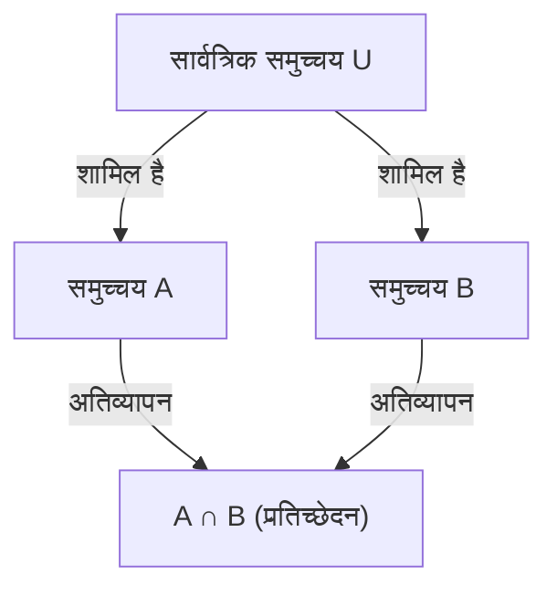

## 1. परिचय

गणित और कंप्यूटर विज्ञान में, हम अक्सर ऐसी स्थितियों का सामना करते हैं जहाँ हमें उन तत्वों की संख्या गिनने की आवश्यकता होती है जो कई शर्तों को पूरा करते हैं। हालाँकि, जब कई शर्तें होती हैं, तो प्रत्येक शर्त को पूरा करने वाले तत्वों के समुच्चय अक्सर अतिव्यापी (प्रतिच्छेदन) होते हैं। बस उन्हें जोड़ने से तत्वों की गिनती कई बार हो जाएगी।

इन अतिव्याप्तियों को सटीक रूप से समाप्त करने और तत्वों की सही संख्या प्राप्त करने की एक शक्तिशाली विधि **[समावेशन-अपवर्जन सिद्धांत](https://kenji.blog/hi/p/inclusion-exclusion-principle/)** ([Inclusion-Exclusion Principle](https://kenji.blog/hi/p/inclusion-exclusion-principle/)) है।

इस लेख में, हम [समावेशन-अपवर्जन सिद्धांत](https://kenji.blog/hi/p/inclusion-exclusion-principle/) को विस्तार से समझाएंगे, इसकी बुनियादी अवधारणाओं से लेकर सामान्यीकृत गणितीय सूत्रों, गणितीय प्रमाणों और ठोस अनुप्रयोग उदाहरणों (जैसे यूलर का टोटिएंट फ़ंक्शन और डिरेंजमेंट) तक। इसके अलावा, हम सैद्धांतिक और व्यावहारिक दोनों दृष्टिकोणों से आपकी समझ को गहरा करने के लिए प्रोग्रामिंग कार्यान्वयन के उदाहरण पेश करेंगे।

## 2. समुच्चय और कार्डिनलिटी के मूल सिद्धांत

[समावेशन-अपवर्जन सिद्धांत](https://kenji.blog/hi/p/inclusion-exclusion-principle/) को सीखने से पहले, आइए बुनियादी समुच्चय संकेतन की समीक्षा करें।

- $A, B$ : समुच्चय (Sets)
- $|A|$ : समुच्चय $A$ के तत्वों की संख्या (कार्डिनलिटी)
- $A \cup B$ : समुच्चय $A$ और समुच्चय $B$ का संघ (Union - वे तत्व जो कम से कम किसी एक से संबंधित हैं)
- $A \cap B$ : समुच्चय $A$ और समुच्चय $B$ का प्रतिच्छेदन (Intersection - वे तत्व जो दोनों से संबंधित हैं)

हम जो खोजना चाहते हैं वह कई समुच्चयों के संघ की कार्डिनलिटी है, अर्थात् $|A \cup B \cup \dots|$।

## 3. 2 समुच्चयों के लिए [समावेशन-अपवर्जन सिद्धांत](https://kenji.blog/hi/p/inclusion-exclusion-principle/)

आइए दो समुच्चयों $A$ और $B$ के साथ सबसे सरल मामले पर विचार करें।

### 3.1 सूत्र

$$
|A \cup B| = |A| + |B| - |A \cap B|
$$

### 3.2 सहज समझ

जब आप समुच्चय $A$ ($|A|$) और समुच्चय $B$ ($|B|$) में तत्वों की संख्या जोड़ते हैं, तो वे तत्व जो दोनों समुच्चयों से संबंधित हैं, अर्थात् प्रतिच्छेदन $A \cap B$ में तत्व, **दो बार** जोड़े जाते हैं।
इसलिए, अधिक गिनी गई भाग $|A \cap B|$ को ठीक एक बार घटाकर, आप संघ की सही कार्डिनलिटी $|A \cup B|$ प्राप्त करते हैं।



## 4. 3 समुच्चयों के लिए [समावेशन-अपवर्जन सिद्धांत](https://kenji.blog/hi/p/inclusion-exclusion-principle/)

जब तीन समुच्चय होते हैं, तो यह थोड़ा अधिक जटिल हो जाता है। समुच्चय $A, B, C$ पर विचार करें।

### 4.1 सूत्र

$$
|A \cup B \cup C| = |A| + |B| + |C| - |A \cap B| - |B \cap C| - |C \cap A| + |A \cap B \cap C|
$$

### 4.2 सहज समझ और प्रमाण

1. सबसे पहले, सभी व्यक्तिगत कार्डिनलिटीज को जोड़ें: $|A| + |B| + |C|$
2. ऐसा करने से, किन्हीं दो समुच्चयों के प्रतिच्छेदन दो बार जुड़ जाते हैं, इसलिए उन्हें घटाएं: $- |A \cap B| - |B \cap C| - |C \cap A|$
3. अंत में, सभी तीन समुच्चयों के प्रतिच्छेदन $A \cap B \cap C$ पर विचार करें। इसे चरण 1 में 3 बार जोड़ा गया था, और चरण 2 में 3 बार घटाया गया था, जिससे इसकी वर्तमान गिनती $0$ हो गई। इसलिए, हम इसे अंत में एक बार वापस जोड़ते हैं: $+ |A \cap B \cap C|$

### 4.3 ठोस उदाहरण: 1 से 100 तक के पूर्णांकों की संख्या जो 2, 3 या 5 से विभाज्य हैं

- सार्वत्रिक समुच्चय: $U = \{1, 2, \dots, 100\}$
- 2 के गुणजों का समुच्चय: $A$
- 3 के गुणजों का समुच्चय: $B$
- 5 के गुणजों का समुच्चय: $C$

आइए प्रत्येक कार्डिनलिटी ज्ञात करें (जहाँ $\lfloor x \rfloor$ फ्लोर फ़ंक्शन का प्रतिनिधित्व करता है)।

- $|A| = \lfloor 100 / 2 \rfloor = 50$
- $|B| = \lfloor 100 / 3 \rfloor = 33$
- $|C| = \lfloor 100 / 5 \rfloor = 20$
- $|A \cap B|$ (6 के गुणज) $= \lfloor 100 / 6 \rfloor = 16$
- $|B \cap C|$ (15 के गुणज) $= \lfloor 100 / 15 \rfloor = 6$
- $|C \cap A|$ (10 के गुणज) $= \lfloor 100 / 10 \rfloor = 10$
- $|A \cap B \cap C|$ (30 के गुणज) $= \lfloor 100 / 30 \rfloor = 3$

इसे सूत्र में लागू करने पर:
$$
|A \cup B \cup C| = 50 + 33 + 20 - 16 - 6 - 10 + 3 = 74
$$
इसलिए, 2, 3 या 5 से विभाज्य **74** संख्याएँ हैं।

## 5. $n$ समुच्चयों के लिए सामान्य [समावेशन-अपवर्जन सिद्धांत](https://kenji.blog/hi/p/inclusion-exclusion-principle/)

इसे $n$ समुच्चयों $A_1, A_2, \dots, A_n$ के लिए सामान्यीकृत करने पर निम्नलिखित सुंदर सूत्र प्राप्त होता है।

### 5.1 सूत्र

$$
\left| \bigcup_{i=1}^n A_i \right| = \sum_{k=1}^n (-1)^{k-1} \left( \sum_{1 \le i_1 < i_2 < \dots < i_k \le n} \left| A_{i_1} \cap A_{i_2} \cap \dots \cap A_{i_k} \right| \right)
$$

शब्दों में, यह संक्रिया "समुच्चयों की विषम संख्या के प्रतिच्छेदनों की कार्डिनलिटीज को जोड़ने, और समुच्चयों की सम संख्या के प्रतिच्छेदनों की कार्डिनलिटीज को घटाने" को दोहराती है।

### 5.2 गणितीय प्रमाण की रूपरेखा

हम दिखाएंगे कि कोई भी तत्व $x \in \bigcup_{i=1}^n A_i$ दाईं ओर की गणना में ठीक एक बार गिना जाता है।

मान लें कि एक निश्चित तत्व $x$ ठीक $m$ समुच्चयों में निहित है ($1 \le m \le n$)।
दाईं ओर $x$ को कितनी बार गिना जाता है, इसे द्विपद गुणांक का उपयोग करके निम्नानुसार व्यक्त किया जा सकता है:

$$
\text{गिने जाने की संख्या} = \binom{m}{1} - \binom{m}{2} + \binom{m}{3} - \dots + (-1)^{m-1} \binom{m}{m}
$$

द्विपद प्रमेय से, यह ज्ञात है कि $(1 - 1)^m = \binom{m}{0} - \binom{m}{1} + \binom{m}{2} - \dots + (-1)^m \binom{m}{m} = 0$।
इसे पुनर्व्यवस्थित करने पर:

$$
\binom{m}{0} - \left( \binom{m}{1} - \binom{m}{2} + \dots + (-1)^{m-1} \binom{m}{m} \right) = 0
$$

चूंकि $\binom{m}{0} = 1$ है, कोष्ठक के अंदर की अभिव्यक्ति (जो कि $x$ को गिने जाने की संख्या है) का मूल्यांकन ठीक $1$ होता है।
यह प्रमाणित करता है कि प्रत्येक तत्व को बिना दोहराव के ठीक एक बार गिना जाता है।

## 6. अनुप्रयोग उदाहरण 1: यूलर का टोटिएंट फ़ंक्शन (Euler's Totient Function)

यूलर का टोटिएंट फ़ंक्शन $\varphi(N)$ $1$ से $N$ तक के पूर्णांकों की संख्या का प्रतिनिधित्व करता है जो $N$ के सह-अभाज्य (coprime) हैं। इसकी गणना [समावेशन-अपवर्जन सिद्धांत](https://kenji.blog/hi/p/inclusion-exclusion-principle/) का उपयोग करके भी की जा सकती है।

मान लें कि $N$ के अभाज्य गुणनखंड $p_1, p_2, \dots, p_k$ हैं।
मान लें कि सार्वत्रिक समुच्चय $U = \{1, 2, \dots, N\}$ है, और $A_i$ "$p_i$ के गुणजों का समुच्चय" है।
हम जो खोजना चाहते हैं वह उन तत्वों की संख्या है जो किसी भी $A_i$ से संबंधित नहीं हैं।

$$
\varphi(N) = N - \left| \bigcup_{i=1}^k A_i \right|
$$

[समावेशन-अपवर्जन सिद्धांत](https://kenji.blog/hi/p/inclusion-exclusion-principle/) को लागू करने और सरल बनाने से इस प्रसिद्ध सूत्र की ओर जाता है:

$$
\varphi(N) = N \left(1 - \frac{1}{p_1}\right) \left(1 - \frac{1}{p_2}\right) \dots \left(1 - \frac{1}{p_k}\right)
$$

## 7. अनुप्रयोग उदाहरण 2: डिरेंजमेंट्स (Derangements)

डिरेंजमेंट $1$ से $n$ तक की संख्याओं का एक क्रमचय (permutation) है जिसमें कोई भी $i$-वाँ नंबर $i$-वें स्थान पर नहीं होता है। उदाहरण के लिए, यह उपहार विनिमय में उपहार वितरित करने के कुल तरीकों की संख्या के बराबर है ताकि कोई भी अपना स्वयं का उपहार प्राप्त न करे।

मान लें $A_i$ "उन क्रमचयों का समुच्चय है जहाँ $i$, $i$-वें स्थान पर है"। सार्वत्रिक समुच्चय की कार्डिनलिटी $n!$ है।
हम $n! - |A_1 \cup A_2 \cup \dots \cup A_n|$ खोजना चाहते हैं।

किन्हीं भी $k$ समुच्चयों के प्रतिच्छेदन की कार्डिनलिटी $(n-k)!$ है, और ऐसे $k$ समुच्चयों को चुनने के $\binom{n}{k}$ तरीके हैं। [समावेशन-अपवर्जन सिद्धांत](https://kenji.blog/hi/p/inclusion-exclusion-principle/) को लागू करने पर, डिरेंजमेंट की संख्या $D_n$ निम्नानुसार प्राप्त होती है:

$$
D_n = n! \sum_{k=0}^n \frac{(-1)^k}{k!}
$$

## 8. प्रोग्रामिंग के माध्यम से गणना और कार्यान्वयन

प्रोग्रामिंग में [समावेशन-अपवर्जन सिद्धांत](https://kenji.blog/hi/p/inclusion-exclusion-principle/) अत्यंत उपयोगी है। विशेष रूप से जब बिटवाइज़ संपूर्ण खोज के साथ जोड़ा जाता है, तो $n$ शर्तों के लिए [समावेशन-अपवर्जन सिद्धांत](https://kenji.blog/hi/p/inclusion-exclusion-principle/) को संक्षेप में लागू किया जा सकता है।

नीचे "1 से $M$ तक के पूर्णांकों की संख्या ज्ञात करने के लिए पायथन (Python) कोड दिया गया है जो दी गई सूची में किसी भी अभाज्य संख्या से विभाज्य हैं"।

```python
def count_multiples(M: int, primes: list[int]) -> int:
    n = len(primes)
    total_count = 0
    
    # 1 से 2^n - 1 तक बिटमास्क का उपयोग करके सभी उपसमुच्चयों का अन्वेषण करें
    for i in range(1, 1 << n):
        lcm = 1
        set_bits = 0
        
        # चयनित अभाज्य संख्याओं के गुणनफल (LCM) की गणना करें
        for j in range(n):
            if (i >> j) & 1:
                lcm *= primes[j]
                set_bits += 1
                
        # यदि विषम संख्या में अभाज्य संख्याएँ चुनी गई हों तो जोड़ें, सम होने पर घटाएँ (समावेशन-अपवर्जन सिद्धांत)
        if set_bits % 2 == 1:
            total_count += M // lcm
        else:
            total_count -= M // lcm
            
    return total_count

# निष्पादन उदाहरण
M = 100
primes = [2, 3, 5]
# अपेक्षित आउटपुट: 74
print(f"परिणाम: {count_multiples(M, primes)}")
```

इस एल्गोरिथ्म की समय जटिलता $O(n \cdot 2^n)$ है, जो काफी तेज़ी से चलता है यदि $n$ लगभग 20 तक है।

## 9. निष्कर्ष

[समावेशन-अपवर्जन सिद्धांत](https://kenji.blog/hi/p/inclusion-exclusion-principle/) एक जादुई गणितीय सूत्र है जो समुच्चयों के प्रतीत होने वाले जटिल अतिव्यापन को जोड़ और घटाव के एक सरल और यांत्रिक दोहराव में तोड़ देता है।

इसके अनुप्रयोग की सीमा असाधारण रूप से विस्तृत है, बुनियादी संभावना समस्याओं से लेकर उन्नत प्रतिस्पर्धी प्रोग्रामिंग और क्रिप्टोग्राफी से संबंधित यूलर के टोटिएंट फ़ंक्शन की गणना तक।
इस शक्तिशाली तकनीक में महारत हासिल करने से [गणित और एल्गोरिदम](/hi/p/reading-hard-tech-books/) में आपकी समस्या-समाधान क्षमताओं में नाटकीय रूप से सुधार होगा। हर तरह से, इसे विभिन्न समस्याओं पर लागू करने का प्रयास करें और इसकी शक्ति का अनुभव करें।
