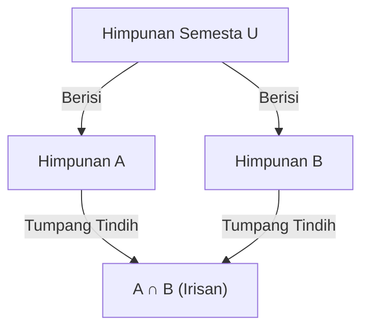

## 1. Pendahuluan

Dalam matematika dan ilmu komputer, kita sering menjumpai situasi di mana kita perlu menghitung jumlah elemen yang memenuhi beberapa kondisi. Namun, ketika terdapat beberapa kondisi, himpunan elemen yang memenuhi masing-masing kondisi sering kali tumpang tindih (memiliki irisan). Menjumlahkannya secara langsung akan menyebabkan elemen dihitung berkali-kali.

Metode yang ampuh untuk menghilangkan tumpang tindih ini secara akurat dan mendapatkan jumlah elemen yang benar adalah **[Prinsip Inklusi-Eksklusi](https://kenji.blog/id/p/inclusion-exclusion-principle/)**.

Dalam artikel ini, kami akan menjelaskan [Prinsip Inklusi-Eksklusi](https://kenji.blog/id/p/inclusion-exclusion-principle/) secara mendetail, mulai dari konsep dasarnya hingga rumus matematika umum, bukti matematika, dan contoh penerapan konkret (seperti fungsi totient Euler dan derangement). Selain itu, kami akan memperkenalkan contoh implementasi pemrograman untuk memperdalam pemahaman Anda dari perspektif teoretis dan praktis.

## 2. Dasar-dasar Himpunan dan Kardinalitas

Sebelum mempelajari [Prinsip Inklusi-Eksklusi](https://kenji.blog/id/p/inclusion-exclusion-principle/), mari kita tinjau kembali notasi dasar himpunan.

- $A, B$ : Himpunan
- $|A|$ : Jumlah elemen (kardinalitas) dari himpunan $A$
- $A \cup B$ : Gabungan himpunan $A$ dan himpunan $B$ (elemen yang termasuk ke dalam setidaknya salah satu himpunan)
- $A \cap B$ : Irisan himpunan $A$ dan himpunan $B$ (elemen yang termasuk ke dalam keduanya)

Yang ingin kita cari adalah kardinalitas gabungan dari beberapa himpunan, yaitu $|A \cup B \cup \dots|$.

## 3. [Prinsip Inklusi-Eksklusi](https://kenji.blog/id/p/inclusion-exclusion-principle/) untuk 2 Himpunan

Mari kita pertimbangkan kasus paling sederhana dengan dua himpunan, $A$ dan $B$.

### 3.1 Rumus

$$
|A \cup B| = |A| + |B| - |A \cap B|
$$

### 3.2 Pemahaman Intuitif

Ketika Anda menjumlahkan jumlah elemen dalam himpunan $A$ ($|A|$) dan himpunan $B$ ($|B|$), elemen yang termasuk dalam kedua himpunan, yaitu elemen-elemen dalam irisan $A \cap B$, ditambahkan **dua kali**.
Oleh karena itu, dengan mengurangkan bagian yang terhitung ganda $|A \cap B|$ tepat satu kali, Anda mendapatkan kardinalitas gabungan yang benar $|A \cup B|$.



## 4. [Prinsip Inklusi-Eksklusi](https://kenji.blog/id/p/inclusion-exclusion-principle/) untuk 3 Himpunan

Ketika terdapat tiga himpunan, perhitungannya menjadi sedikit lebih kompleks. Pertimbangkan himpunan $A, B, C$.

### 4.1 Rumus

$$
|A \cup B \cup C| = |A| + |B| + |C| - |A \cap B| - |B \cap C| - |C \cap A| + |A \cap B \cap C|
$$

### 4.2 Pemahaman Intuitif dan Bukti

1. Pertama, tambahkan semua kardinalitas masing-masing himpunan: $|A| + |B| + |C|$
2. Dengan melakukan ini, irisan dari dua himpunan mana pun ditambahkan dua kali, jadi kurangkan mereka: $- |A \cap B| - |B \cap C| - |C \cap A|$
3. Terakhir, pertimbangkan irisan dari ketiga himpunan $A \cap B \cap C$. Irisan ini telah ditambahkan 3 kali pada langkah 1, dan dikurangkan 3 kali pada langkah 2, sehingga jumlah saat ini adalah $0$. Oleh karena itu, kita menambahkannya kembali satu kali di akhir: $+ |A \cap B \cap C|$

### 4.3 Contoh Konkret: Jumlah bilangan bulat dari 1 hingga 100 yang habis dibagi 2, 3, atau 5

- Himpunan semesta: $U = \{1, 2, \dots, 100\}$
- Himpunan kelipatan 2: $A$
- Himpunan kelipatan 3: $B$
- Himpunan kelipatan 5: $C$

Mari kita cari masing-masing kardinalitas (di mana $\lfloor x \rfloor$ mewakili fungsi pembulatan ke bawah).

- $|A| = \lfloor 100 / 2 \rfloor = 50$
- $|B| = \lfloor 100 / 3 \rfloor = 33$
- $|C| = \lfloor 100 / 5 \rfloor = 20$
- $|A \cap B|$ (Kelipatan 6) $= \lfloor 100 / 6 \rfloor = 16$
- $|B \cap C|$ (Kelipatan 15) $= \lfloor 100 / 15 \rfloor = 6$
- $|C \cap A|$ (Kelipatan 10) $= \lfloor 100 / 10 \rfloor = 10$
- $|A \cap B \cap C|$ (Kelipatan 30) $= \lfloor 100 / 30 \rfloor = 3$

Dengan menerapkannya ke dalam rumus:
$$
|A \cup B \cup C| = 50 + 33 + 20 - 16 - 6 - 10 + 3 = 74
$$
Oleh karena itu, terdapat **74** bilangan yang habis dibagi 2, 3, atau 5.

## 5. [Prinsip Inklusi-Eksklusi](https://kenji.blog/id/p/inclusion-exclusion-principle/) Umum untuk $n$ Himpunan

Generalisasi dari prinsip ini untuk $n$ himpunan $A_1, A_2, \dots, A_n$ menghasilkan rumus indah berikut.

### 5.1 Rumus

$$
\left| \bigcup_{i=1}^n A_i \right| = \sum_{k=1}^n (-1)^{k-1} \left( \sum_{1 \le i_1 < i_2 < \dots < i_k \le n} \left| A_{i_1} \cap A_{i_2} \cap \dots \cap A_{i_k} \right| \right)
$$

Dengan kata lain, operasi ini mengulangi "penambahan kardinalitas irisan dari himpunan berjumlah ganjil, dan pengurangan kardinalitas irisan dari himpunan berjumlah genap."

### 5.2 Garis Besar Bukti Matematika

Kita akan menunjukkan bahwa setiap elemen $x \in \bigcup_{i=1}^n A_i$ dihitung tepat satu kali dalam perhitungan di sisi kanan.

Asumsikan bahwa elemen tertentu $x$ berada tepat di dalam $m$ himpunan ($1 \le m \le n$).
Berapa kali $x$ dihitung pada sisi kanan dapat dinyatakan menggunakan koefisien binomial sebagai berikut:

$$
\text{Berapa Kali Dihitung} = \binom{m}{1} - \binom{m}{2} + \binom{m}{3} - \dots + (-1)^{m-1} \binom{m}{m}
$$

Menurut teorema binomial, diketahui bahwa $(1 - 1)^m = \binom{m}{0} - \binom{m}{1} + \binom{m}{2} - \dots + (-1)^m \binom{m}{m} = 0$.
Dengan menyusun ulang rumus ini:

$$
\binom{m}{0} - \left( \binom{m}{1} - \binom{m}{2} + \dots + (-1)^{m-1} \binom{m}{m} \right) = 0
$$

Karena $\binom{m}{0} = 1$, ekspresi di dalam kurung (yaitu jumlah berapa kali $x$ dihitung) bernilai tepat $1$.
Ini membuktikan bahwa setiap elemen dihitung tepat satu kali tanpa duplikasi.

## 6. Contoh Penerapan 1: Fungsi Totient Euler

Fungsi totient Euler $\varphi(N)$ merepresentasikan jumlah bilangan bulat dari $1$ hingga $N$ yang saling prima (coprime) dengan $N$. Hal ini juga dapat dihitung menggunakan [Prinsip Inklusi-Eksklusi](https://kenji.blog/id/p/inclusion-exclusion-principle/).

Misalkan faktor prima dari $N$ adalah $p_1, p_2, \dots, p_k$.
Misalkan himpunan semesta $U = \{1, 2, \dots, N\}$, dan $A_i$ adalah "himpunan kelipatan $p_i$".
Yang ingin kita cari adalah jumlah elemen yang tidak termasuk dalam himpunan $A_i$ mana pun.

$$
\varphi(N) = N - \left| \bigcup_{i=1}^k A_i \right|
$$

Menerapkan [Prinsip Inklusi-Eksklusi](https://kenji.blog/id/p/inclusion-exclusion-principle/) dan menyederhanakannya mengarah pada rumus terkenal ini:

$$
\varphi(N) = N \left(1 - \frac{1}{p_1}\right) \left(1 - \frac{1}{p_2}\right) \dots \left(1 - \frac{1}{p_k}\right)
$$

## 7. Contoh Penerapan 2: Derangement (Pengacauan)

Derangement adalah permutasi dari bilangan $1$ hingga $n$ di mana tidak ada bilangan ke-$i$ yang berada di posisi ke-$i$. Sebagai contoh, hal ini setara dengan total cara untuk mendistribusikan hadiah dalam pertukaran kado sehingga tidak ada seorang pun yang menerima hadiahnya sendiri.

Misalkan $A_i$ adalah "himpunan permutasi di mana $i$ berada pada posisi ke-$i$". Kardinalitas himpunan semesta adalah $n!$.
Kita ingin mencari $n! - |A_1 \cup A_2 \cup \dots \cup A_n|$.

Kardinalitas dari irisan himpunan $k$ mana pun adalah $(n-k)!$, dan ada $\binom{n}{k}$ cara untuk memilih $k$ himpunan tersebut. Dengan menerapkan [Prinsip Inklusi-Eksklusi](https://kenji.blog/id/p/inclusion-exclusion-principle/), jumlah derangement $D_n$ diperoleh sebagai berikut:

$$
D_n = n! \sum_{k=0}^n \frac{(-1)^k}{k!}
$$

## 8. Perhitungan dan Implementasi Melalui Pemrograman

[Prinsip Inklusi-Eksklusi](https://kenji.blog/id/p/inclusion-exclusion-principle/) sangat berguna dalam pemrograman. Khususnya bila dikombinasikan dengan pencarian bitwise exhaustif (bitwise exhaustive search), [Prinsip Inklusi-Eksklusi](https://kenji.blog/id/p/inclusion-exclusion-principle/) untuk kondisi $n$ dapat diimplementasikan secara ringkas.

Di bawah ini adalah kode Python untuk mencari "jumlah bilangan bulat dari 1 hingga $M$ yang habis dibagi oleh bilangan prima mana pun dalam daftar yang diberikan".

```python
def count_multiples(M: int, primes: list[int]) -> int:
    n = len(primes)
    total_count = 0
    
    # Jelajahi semua subhimpunan menggunakan bitmask dari 1 hingga 2^n - 1
    for i in range(1, 1 << n):
        lcm = 1
        set_bits = 0
        
        # Hitung hasil kali (KPK) dari bilangan prima yang dipilih
        for j in range(n):
            if (i >> j) & 1:
                lcm *= primes[j]
                set_bits += 1
                
        # Tambahkan jika bilangan prima ganjil dipilih, kurangi jika genap (Prinsip Inklusi-Eksklusi)
        if set_bits % 2 == 1:
            total_count += M // lcm
        else:
            total_count -= M // lcm
            
    return total_count

# Contoh eksekusi
M = 100
primes = [2, 3, 5]
# Keluaran yang diharapkan: 74
print(f"Hasil: {count_multiples(M, primes)}")
```

Kompleksitas waktu algoritma ini adalah $O(n \cdot 2^n)$, yang berjalan cukup cepat jika nilai $n$ hingga sekitar 20.

## 9. Kesimpulan

[Prinsip Inklusi-Eksklusi](https://kenji.blog/id/p/inclusion-exclusion-principle/) adalah rumus matematika ajaib yang memecah tumpang tindih dari himpunan yang tampaknya kompleks menjadi pengulangan penjumlahan dan pengurangan yang sederhana dan mekanis.

Rentang penerapannya sangat luas, mulai dari masalah probabilitas dasar hingga pemrograman kompetitif tingkat lanjut, serta penghitungan fungsi totient Euler yang berkaitan dengan kriptografi.
Menguasai teknik yang ampuh ini akan secara dramatis meningkatkan kemampuan pemecahan masalah Anda dalam matematika dan algoritma. Oleh karena itu, cobalah menerapkannya ke berbagai masalah dan rasakan kekuatannya.
