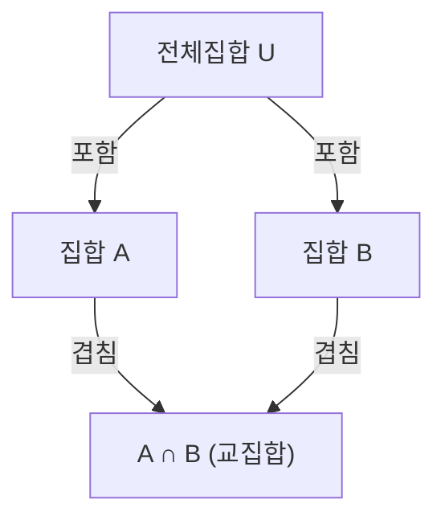

## 1. 서론

수학이나 컴퓨터 과학 분야에서는 여러 조건을 만족하는 원소의 개수를 세어야 하는 상황이 자주 발생합니다. 그러나 여러 조건이 있을 때, 각각의 조건을 만족하는 원소들의 집합은 서로 겹치는(교집합을 갖는) 경우가 많아 단순히 합산하면 원소를 중복해서 세게 됩니다.

이러한 중복을 정확하게 제거하고 올바른 원소의 수를 도출하기 위한 강력한 방법이 **[포함-배제의 원리](https://kenji.blog/ko/p/inclusion-exclusion-principle/)** ([Inclusion-Exclusion Principle](https://kenji.blog/ko/p/inclusion-exclusion-principle/))입니다.

이 글에서는 포함-배제 원리의 기본 개념부터 일반화된 수학적 공식, 수학적 증명, 그리고 구체적인 응용 사례(오일러의 파이 함수나 완전순열 등)까지 상세하게 설명할 것입니다. 나아가 프로그래밍을 활용한 구현 예제도 소개하여 이론과 실무 양면에서 이해를 깊게 하는 것을 목표로 합니다.

## 2. 집합과 원소 개수의 기본

포함-배제 원리를 배우기 전에 집합론의 기본 표기법을 확인해 보겠습니다.

- $A, B$ : 집합
- $|A|$ : 집합 $A$ 의 원소의 개수(기수)
- $A \cup B$ : 집합 $A$ 와 집합 $B$ 의 합집합(적어도 한쪽에 속하는 원소들의 집합)
- $A \cap B$ : 집합 $A$ 와 집합 $B$ 의 교집합(양쪽 모두에 속하는 원소들의 집합)

우리가 구하고자 하는 것은 여러 집합의 합집합의 원소의 개수, 즉 $|A \cup B \cup \dots|$ 입니다.

## 3. 2개의 집합에서의 포함-배제 원리

가장 단순한 2개의 집합 $A$ 와 $B$ 의 경우를 생각해 보겠습니다.

### 3.1 공식

$$
|A \cup B| = |A| + |B| - |A \cap B|
$$

### 3.2 직관적인 이해

집합 $A$ 의 원소 개수 $|A|$ 와 집합 $B$ 의 원소 개수 $|B|$ 를 더하면, 양쪽 집합에 모두 속하는 원소, 즉 교집합 $A \cap B$ 에 포함된 원소가 **2번** 더해지게 됩니다.
따라서 중복해서 센 부분인 $|A \cap B|$ 를 정확히 1번 빼줌으로써, 올바른 합집합의 원소 개수 $|A \cup B|$ 를 얻을 수 있습니다.



## 4. 3개의 집합에서의 포함-배제 원리

집합이 3개가 되면 조금 더 복잡해집니다. 집합 $A, B, C$ 를 생각합니다.

### 4.1 공식

$$
|A \cup B \cup C| = |A| + |B| + |C| - |A \cap B| - |B \cap C| - |C \cap A| + |A \cap B \cap C|
$$

### 4.2 직관적인 이해와 증명

1. 먼저, 각각의 원소 개수를 모두 더합니다: $|A| + |B| + |C|$
2. 이렇게 하면, 두 집합의 교집합이 두 번씩 더해졌으므로 이를 빼줍니다: $- |A \cap B| - |B \cap C| - |C \cap A|$
3. 마지막으로 세 집합 모두의 교집합 $A \cap B \cap C$ 를 고려합니다. 이 부분은 1단계에서 3번 더해졌고, 2단계에서 3번 빠졌기 때문에 현재 횟수가 $0$ 이 되었습니다. 따라서 마지막에 1번 다시 더해줍니다: $+ |A \cap B \cap C|$

### 4.3 구체적 예제: 1부터 100까지의 정수 중 2, 3, 5 중 어느 하나로 나누어 떨어지는 수의 개수

- 전체집합: $U = \{1, 2, \dots, 100\}$
- 2의 배수의 집합: $A$
- 3의 배수의 집합: $B$
- 5의 배수의 집합: $C$

각각의 원소 개수를 구합니다( $\lfloor x \rfloor$ 는 내림 함수를 나타냅니다).

- $|A| = \lfloor 100 / 2 \rfloor = 50$
- $|B| = \lfloor 100 / 3 \rfloor = 33$
- $|C| = \lfloor 100 / 5 \rfloor = 20$
- $|A \cap B|$ (6의 배수) $= \lfloor 100 / 6 \rfloor = 16$
- $|B \cap C|$ (15의 배수) $= \lfloor 100 / 15 \rfloor = 6$
- $|C \cap A|$ (10의 배수) $= \lfloor 100 / 10 \rfloor = 10$
- $|A \cap B \cap C|$ (30의 배수) $= \lfloor 100 / 30 \rfloor = 3$

공식에 대입합니다:
$$
|A \cup B \cup C| = 50 + 33 + 20 - 16 - 6 - 10 + 3 = 74
$$
따라서 2, 3, 5 중 어느 하나로 나누어 떨어지는 수는 **74개** 존재합니다.

## 5. 일반적인 $n$ 개의 집합에서의 포함-배제 원리

이를 $n$ 개의 집합 $A_1, A_2, \dots, A_n$ 으로 일반화하면 다음과 같은 아름다운 공식을 얻을 수 있습니다.

### 5.1 공식

$$
\left| \bigcup_{i=1}^n A_i \right| = \sum_{k=1}^n (-1)^{k-1} \left( \sum_{1 \le i_1 < i_2 < \dots < i_k \le n} \left| A_{i_1} \cap A_{i_2} \cap \dots \cap A_{i_k} \right| \right)
$$

말로 표현하자면 "홀수 개 집합의 교집합의 원소 개수를 더하고, 짝수 개 집합의 교집합의 원소 개수를 뺀다"라는 연산을 반복하는 것입니다.

### 5.2 수학적 증명의 개요

임의의 원소 $x \in \bigcup_{i=1}^n A_i$ 가 우변의 계산식에서 정확히 1번만 세어짐을 보입니다.

어떤 원소 $x$ 가 정확히 $m$ 개의 집합에 포함되어 있다고 가정합니다( $1 \le m \le n$ ).
우변의 계산에서 $x$ 가 세어지는 횟수는 이항계수를 사용하여 다음과 같이 표현할 수 있습니다.

$$
\text{세어지는 횟수} = \binom{m}{1} - \binom{m}{2} + \binom{m}{3} - \dots + (-1)^{m-1} \binom{m}{m}
$$

이항정리에 의해 $(1 - 1)^m = \binom{m}{0} - \binom{m}{1} + \binom{m}{2} - \dots + (-1)^m \binom{m}{m} = 0$ 임이 알려져 있습니다.
이를 변형하면:

$$
\binom{m}{0} - \left( \binom{m}{1} - \binom{m}{2} + \dots + (-1)^{m-1} \binom{m}{m} \right) = 0
$$

$\binom{m}{0} = 1$ 이므로 괄호 안의 식(즉 $x$ 가 세어지는 횟수)은 정확히 $1$ 이 됩니다.
이를 통해 어느 원소든 중복 없이 정확히 한 번씩만 세어진다는 것이 증명되었습니다.

## 6. 응용 사례 1: 오일러의 파이 함수

오일러의 파이 함수 $\varphi(N)$ 은 $1$ 부터 $N$ 까지의 정수 중 $N$ 과 서로소인 수의 개수를 나타냅니다. 이 또한 포함-배제 원리를 사용하여 계산할 수 있습니다.

$N$ 의 소인수를 $p_1, p_2, \dots, p_k$ 라고 합시다.
전체집합을 $U = \{1, 2, \dots, N\}$ 으로 두고, $A_i$ 를 " $p_i$ 의 배수의 집합"으로 정의합니다.
구하고자 하는 것은 어느 $A_i$ 에도 속하지 않는 원소의 개수입니다.

$$
\varphi(N) = N - \left| \bigcup_{i=1}^k A_i \right|
$$

[포함-배제의 원리](https://kenji.blog/ko/p/inclusion-exclusion-principle/)를 적용하여 정리하면 다음의 유명한 공식이 유도됩니다.

$$
\varphi(N) = N \left(1 - \frac{1}{p_1}\right) \left(1 - \frac{1}{p_2}\right) \dots \left(1 - \frac{1}{p_k}\right)
$$

## 7. 응용 사례 2: 완전순열 (교란순열)

완전순열이란 $1$ 부터 $n$ 까지의 숫자를 배열한 순열 중, 어느 $i$ 번째 숫자도 자기 위치인 $i$ 가 아닌 순열을 말합니다. 예를 들어, 선물 교환에서 아무도 자신의 선물을 받지 않는 경우의 수에 해당합니다.

$A_i$ 를 " $i$ 번째 위치에 $i$ 가 오는 순열의 집합"이라고 합니다. 전체집합의 원소 개수는 $n!$ 입니다.
우리가 구하는 것은 $n! - |A_1 \cup A_2 \cup \dots \cup A_n|$ 입니다.

임의의 $k$ 개 집합의 교집합의 원소 개수는 $(n-k)!$ 이며, 그러한 $k$ 개 집합을 고르는 방법은 $\binom{n}{k}$ 가지이므로 [포함-배제의 원리](https://kenji.blog/ko/p/inclusion-exclusion-principle/)를 적용하면 완전순열의 수 $D_n$ 은 다음과 같이 구해집니다.

$$
D_n = n! \sum_{k=0}^n \frac{(-1)^k}{k!}
$$

## 8. 프로그래밍을 통한 계산과 구현

[포함-배제의 원리](https://kenji.blog/ko/p/inclusion-exclusion-principle/)는 프로그래밍에서도 매우 유용합니다. 특히 비트마스킹을 활용한 완전탐색과 결합하면 $n$ 개의 조건에 대한 포함-배제 원리를 간결하게 구현할 수 있습니다.

아래는 파이썬(Python)을 사용하여 "1부터 $M$ 까지의 정수 중, 주어진 소수 리스트의 어느 하나로 나누어 떨어지는 수의 개수"를 구하는 코드입니다.

```python
def count_multiples(M: int, primes: list[int]) -> int:
    n = len(primes)
    total_count = 0
    
    # 1부터 2^n - 1까지의 비트마스크로 모든 부분집합을 탐색
    for i in range(1, 1 << n):
        lcm = 1
        set_bits = 0
        
        # 선택된 소수들의 곱(최소공배수)을 계산
        for j in range(n):
            if (i >> j) & 1:
                lcm *= primes[j]
                set_bits += 1
                
        # 홀수 개가 선택된 경우 더하고, 짝수 개인 경우 뺌 (포함-배제 원리)
        if set_bits % 2 == 1:
            total_count += M // lcm
        else:
            total_count -= M // lcm
            
    return total_count

# 실행 예제
M = 100
primes = [2, 3, 5]
# 기대되는 출력: 74
print(f"결과: {count_multiples(M, primes)}")
```

이 알고리즘의 시간 복잡도는 $O(n \cdot 2^n)$ 이 되며, $n$ 이 20 정도까지라면 충분히 빠르게 동작합니다.

## 9. 결론

[포함-배제의 원리](https://kenji.blog/ko/p/inclusion-exclusion-principle/)는 언뜻 복잡해 보이는 집합의 겹침을 단순하고 기계적인 덧셈과 뺄셈의 반복으로 분해해 주는 마법과 같은 수식입니다.

기초적인 확률 문제부터 고도의 경쟁 프로그래밍, 암호학과 관련된 오일러의 파이 함수 계산에 이르기까지 그 응용 범위는 실로 광범위합니다.
이 강력한 기법을 마스터함으로써 수학과 알고리즘 분야에서의 문제 해결 능력이 비약적으로 향상될 것입니다. 부디 다양한 문제에 적용하여 그 위력을 실감해 보시기 바랍니다.
