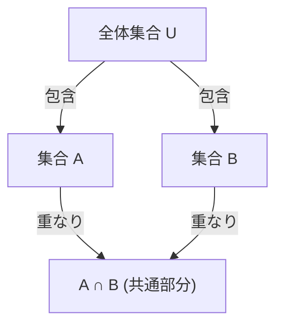

## 1. はじめに

数学やコンピュータサイエンスの分野において、複数の条件を満たす要素の数を数え上げる場面は頻繁に登場します。しかし、条件が複数ある場合、それぞれの条件を満たす要素の集合が互いに重なり合う（共通部分を持つ）ことが多く、単純に足し合わせるだけでは要素を重複して数えてしまいます。

このような状況で、重複を正確に排除し、正しい要素数を導き出すための強力な手法が **包除原理** （Inclusion-Exclusion Principle）です。

本記事では、包除原理の基本的な考え方から、一般化された数式表現、数学的な証明、そして具体的な応用例（オイラーの $\varphi$ 関数や完全順列など）まで、幅広くかつ詳細に解説していきます。さらに、プログラミングを用いた実装例も紹介し、理論と実践の両面から理解を深めることを目指します。

## 2. 集合と要素数の基本

包除原理を学ぶ前に、集合論の基本的な記法を確認しておきましょう。

- $A, B$ ：集合
- $|A|$ ：集合 $A$ の要素数（濃度）
- $A \cup B$ ：集合 $A$ と集合 $B$ の和集合（少なくとも一方に属する要素の集合）
- $A \cap B$ ：集合 $A$ と集合 $B$ の積集合（両方に属する要素の集合）

私たちが求めたいのは、複数の集合の和集合の要素数、すなわち $|A \cup B \cup \dots|$ です。

## 3. 2つの集合における包除原理

最も単純な、2つの集合 $A$ と $B$ の場合を考えてみましょう。

### 3.1 公式

$$
|A \cup B| = |A| + |B| - |A \cap B|
$$

### 3.2 直感的な理解

集合 $A$ の要素数 $|A|$ と集合 $B$ の要素数 $|B|$ を足し合わせると、両方の集合に属する要素、つまり積集合 $A \cap B$ に含まれる要素が **2回** 足されてしまいます。
そのため、重複して数えてしまった分である $|A \cap B|$ を1回だけ引き算することで、正しい和集合の要素数 $|A \cup B|$ が得られます。



## 4. 3つの集合における包除原理

集合が3つになると、少し複雑になります。集合 $A, B, C$ を考えます。

### 4.1 公式

$$
|A \cup B \cup C| = |A| + |B| + |C| - |A \cap B| - |B \cap C| - |C \cap A| + |A \cap B \cap C|
$$

### 4.2 直感的な理解と証明

1. まず、それぞれの要素数をすべて足し合わせます： $|A| + |B| + |C|$
2. これだと、2つの集合の共通部分が2回足されているため、引き算します： $- |A \cap B| - |B \cap C| - |C \cap A|$
3. 最後に、3つの集合すべての共通部分 $A \cap B \cap C$ について考えます。ステップ1で3回足され、ステップ2で3回引かれたため、現在のカウントは $0$ になってしまっています。そこで、最後に1回足し戻します： $+ |A \cap B \cap C|$

### 4.3 具体例：1から100までの整数のうち、2, 3, 5のいずれかで割り切れる数の個数

- 全体集合： $U = \{1, 2, \dots, 100\}$
- 2の倍数の集合： $A$
- 3の倍数の集合： $B$
- 5の倍数の集合： $C$

それぞれの要素数を求めます（ $\lfloor x \rfloor$ は切り捨てを表します）。

- $|A| = \lfloor 100 / 2 \rfloor = 50$
- $|B| = \lfloor 100 / 3 \rfloor = 33$
- $|C| = \lfloor 100 / 5 \rfloor = 20$
- $|A \cap B|$ (6の倍数) $= \lfloor 100 / 6 \rfloor = 16$
- $|B \cap C|$ (15の倍数) $= \lfloor 100 / 15 \rfloor = 6$
- $|C \cap A|$ (10の倍数) $= \lfloor 100 / 10 \rfloor = 10$
- $|A \cap B \cap C|$ (30の倍数) $= \lfloor 100 / 30 \rfloor = 3$

公式に当てはめます：
$$
|A \cup B \cup C| = 50 + 33 + 20 - 16 - 6 - 10 + 3 = 74
$$
したがって、2, 3, 5のいずれかで割り切れる数は **74個** 存在します。

## 5. 一般の $n$ 個の集合における包除原理

これを $n$ 個の集合 $A_1, A_2, \dots, A_n$ に一般化すると、次のような美しい公式が得られます。

### 5.1 公式

$$
\left| \bigcup_{i=1}^n A_i \right| = \sum_{k=1}^n (-1)^{k-1} \left( \sum_{1 \le i_1 < i_2 < \dots < i_k \le n} \left| A_{i_1} \cap A_{i_2} \cap \dots \cap A_{i_k} \right| \right)
$$

言葉で表すと、「奇数個の集合の共通部分の要素数を足し、偶数個の集合の共通部分の要素数を引く」という操作を繰り返すことになります。

### 5.2 数学的な証明の概略

任意の要素 $x \in \bigcup_{i=1}^n A_i$ が、この右辺の計算式において正確に1回だけ数えられていることを示します。

ある要素 $x$ がちょうど $m$ 個の集合に含まれていると仮定します（ $1 \le m \le n$ ）。
右辺の計算において、$x$ が数えられる回数は、二項係数を用いて次のように表されます。

$$
\text{数えられる回数} = \binom{m}{1} - \binom{m}{2} + \binom{m}{3} - \dots + (-1)^{m-1} \binom{m}{m}
$$

二項定理により、 $(1 - 1)^m = \binom{m}{0} - \binom{m}{1} + \binom{m}{2} - \dots + (-1)^m \binom{m}{m} = 0$ であることが知られています。
これを変形すると：

$$
\binom{m}{0} - \left( \binom{m}{1} - \binom{m}{2} + \dots + (-1)^{m-1} \binom{m}{m} \right) = 0
$$

$\binom{m}{0} = 1$ であるため、カッコ内の式（つまり $x$ が数えられる回数）は正確に $1$ となります。
これにより、どの要素も重複なくちょうど1回ずつ数えられることが証明されました。

## 6. 応用例1：オイラーの $\varphi$ 関数

オイラーの $\varphi$ 関数 $\varphi(N)$ は、$1$ から $N$ までの整数のうち、$N$ と互いに素である数の個数を表します。これも包除原理を用いて計算できます。

$N$ の素因数を $p_1, p_2, \dots, p_k$ とします。
全体集合を $U = \{1, 2, \dots, N\}$ とし、$A_i$ を「 $p_i$ の倍数の集合」とします。
求めるのは、どの $A_i$ にも属さない要素の数です。

$$
\varphi(N) = N - \left| \bigcup_{i=1}^k A_i \right|
$$

包除原理を適用して整理すると、次の有名な公式が導かれます。

$$
\varphi(N) = N \left(1 - \frac{1}{p_1}\right) \left(1 - \frac{1}{p_2}\right) \dots \left(1 - \frac{1}{p_k}\right)
$$

## 7. 応用例2：完全順列（撹乱順列）

完全順列とは、$1$ から $n$ までの数字を並べ替えた順列のうち、どの $i$ 番目の数字も $i$ ではないような順列のことです。例えば、プレゼント交換で誰も自分のプレゼントを受け取らないような配り方の総数に相当します。

$A_i$ を「 $i$ 番目の位置に $i$ が来る順列の集合」とします。全体集合の要素数は $n!$ です。
求めるのは $n! - |A_1 \cup A_2 \cup \dots \cup A_n|$ です。

任意の $k$ 個の集合の共通部分の要素数は $(n-k)!$ であり、そのような $k$ 個の集合の選び方は $\binom{n}{k}$ 通りあるため、包除原理を適用すると完全順列の数 $D_n$ は次のように求まります。

$$
D_n = n! \sum_{k=0}^n \frac{(-1)^k}{k!}
$$

## 8. プログラミングによる計算と実装

包除原理はプログラミングにおいても非常に有用です。特に、ビット全探索と組み合わせることで、$n$ 個の条件に対する包除原理を簡潔に実装できます。

以下は、Pythonを用いて「1から $M$ までの整数のうち、与えられた素数リストのいずれかで割り切れる数の個数」を求めるコードです。

```python
def count_multiples(M: int, primes: list[int]) -> int:
    n = len(primes)
    total_count = 0
    
    # 1から2^n - 1までのビットマスクで全部分集合を探索
    for i in range(1, 1 << n):
        lcm = 1
        set_bits = 0
        
        # 選ばれた素数の積（最小公倍数）を計算
        for j in range(n):
            if (i >> j) & 1:
                lcm *= primes[j]
                set_bits += 1
                
        # 奇数個選ばれた場合は足し、偶数個の場合は引く（包除原理）
        if set_bits % 2 == 1:
            total_count += M // lcm
        else:
            total_count -= M // lcm
            
    return total_count

# 実行例
M = 100
primes = [2, 3, 5]
# 期待される出力: 74
print(f"結果: {count_multiples(M, primes)}")
```

このアルゴリズムの計算量は $O(n \cdot 2^n)$ となり、$n$ が20程度までであれば十分に高速に動作します。

## 9. まとめ

包除原理は、一見複雑に見える集合の重なり合いを、シンプルかつ機械的な足し算と引き算の繰り返しに分解してくれる魔法のような数式です。

基礎的な確率の問題から、高度な競技プログラミング、暗号理論に関わるオイラーの $\varphi$ 関数の計算まで、その応用範囲は非常に多岐にわたります。
この強力なテクニックをマスターすることで、数学やアルゴリズムの分野における問題解決能力が飛躍的に向上するでしょう。ぜひ、様々な問題に適用してその威力を実感してみてください。
