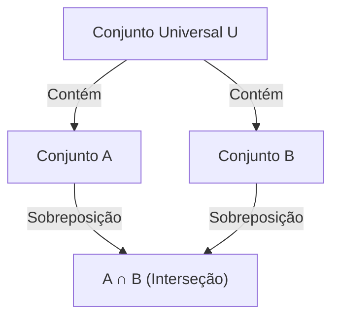

## 1. Introdução

Na matemática e na ciência da computação, frequentemente encontramos situações em que precisamos contar o número de elementos que satisfazem várias condições. No entanto, quando existem várias condições, os conjuntos de elementos que satisfazem cada condição frequentemente se sobrepõem (têm interseções). Simplesmente somá-los resultará em contar os elementos várias vezes.

Um método poderoso para eliminar com precisão essas sobreposições e derivar o número correto de elementos é o **[Princípio da Inclusão-Exclusão](https://kenji.blog/pt/p/inclusion-exclusion-principle/)**.

Neste artigo, explicaremos de forma abrangente o [Princípio da Inclusão-Exclusão](https://kenji.blog/pt/p/inclusion-exclusion-principle/) em detalhes, desde seus conceitos básicos até fórmulas matemáticas generalizadas, provas matemáticas e exemplos concretos de aplicação (como a função totiente de Euler e desarranjos). Além disso, apresentaremos exemplos de implementação de programação para aprofundar sua compreensão sob perspectivas teóricas e práticas.

## 2. Noções básicas de Conjuntos e Cardinalidade

Antes de aprender o [Princípio da Inclusão-Exclusão](https://kenji.blog/pt/p/inclusion-exclusion-principle/), vamos rever a notação básica de conjuntos.

- $A, B$ : Conjuntos
- $|A|$ : Número de elementos (cardinalidade) do conjunto $A$
- $A \cup B$ : União do conjunto $A$ e do conjunto $B$ (elementos que pertencem a pelo menos um)
- $A \cap B$ : Interseção do conjunto $A$ e do conjunto $B$ (elementos que pertencem a ambos)

O que queremos encontrar é a cardinalidade da união de vários conjuntos, ou seja, $|A \cup B \cup \dots|$.

## 3. [Princípio da Inclusão-Exclusão](https://kenji.blog/pt/p/inclusion-exclusion-principle/) para 2 Conjuntos

Consideremos o caso mais simples com dois conjuntos, $A$ e $B$.

### 3.1 Fórmula

$$
|A \cup B| = |A| + |B| - |A \cap B|
$$

### 3.2 Compreensão Intuitiva

Ao adicionar o número de elementos no conjunto $A$ ($|A|$) e no conjunto $B$ ($|B|$), os elementos que pertencem a ambos os conjuntos, ou seja, elementos na interseção $A \cap B$, são adicionados **duas vezes**.
Portanto, subtraindo a parte contada a mais $|A \cap B|$ exatamente uma vez, obtém-se a cardinalidade correta da união $|A \cup B|$.



## 4. [Princípio da Inclusão-Exclusão](https://kenji.blog/pt/p/inclusion-exclusion-principle/) para 3 Conjuntos

Quando há três conjuntos, torna-se um pouco mais complexo. Considere os conjuntos $A, B, C$.

### 4.1 Fórmula

$$
|A \cup B \cup C| = |A| + |B| + |C| - |A \cap B| - |B \cap C| - |C \cap A| + |A \cap B \cap C|
$$

### 4.2 Compreensão Intuitiva e Prova

1. Primeiro, adicione todas as cardinalidades individuais: $|A| + |B| + |C|$
2. Ao fazer isso, as interseções de quaisquer dois conjuntos são adicionadas duas vezes, então subtraia-as: $- |A \cap B| - |B \cap C| - |C \cap A|$
3. Finalmente, considere a interseção de todos os três conjuntos $A \cap B \cap C$. Ela foi adicionada 3 vezes no passo 1, e subtraída 3 vezes no passo 2, deixando sua contagem atual em $0$. Portanto, adicionamos de volta uma vez no final: $+ |A \cap B \cap C|$

### 4.3 Exemplo Concreto: O número de inteiros de 1 a 100 divisíveis por 2, 3 ou 5

- Conjunto universal: $U = \{1, 2, \dots, 100\}$
- Conjunto de múltiplos de 2: $A$
- Conjunto de múltiplos de 3: $B$
- Conjunto de múltiplos de 5: $C$

Vamos encontrar cada cardinalidade (onde $\lfloor x \rfloor$ representa a função piso).

- $|A| = \lfloor 100 / 2 \rfloor = 50$
- $|B| = \lfloor 100 / 3 \rfloor = 33$
- $|C| = \lfloor 100 / 5 \rfloor = 20$
- $|A \cap B|$ (Múltiplos de 6) $= \lfloor 100 / 6 \rfloor = 16$
- $|B \cap C|$ (Múltiplos de 15) $= \lfloor 100 / 15 \rfloor = 6$
- $|C \cap A|$ (Múltiplos de 10) $= \lfloor 100 / 10 \rfloor = 10$
- $|A \cap B \cap C|$ (Múltiplos de 30) $= \lfloor 100 / 30 \rfloor = 3$

Aplicando isso à fórmula:
$$
|A \cup B \cup C| = 50 + 33 + 20 - 16 - 6 - 10 + 3 = 74
$$
Portanto, existem **74** números divisíveis por 2, 3 ou 5.

## 5. Princípio Geral da Inclusão-Exclusão para $n$ Conjuntos

Generalizando isso para $n$ conjuntos $A_1, A_2, \dots, A_n$ temos a seguinte bela fórmula.

### 5.1 Fórmula

$$
\left| \bigcup_{i=1}^n A_i \right| = \sum_{k=1}^n (-1)^{k-1} \left( \sum_{1 \le i_1 < i_2 < \dots < i_k \le n} \left| A_{i_1} \cap A_{i_2} \cap \dots \cap A_{i_k} \right| \right)
$$

Em palavras, a operação repete "adicionar as cardinalidades das interseções de um número ímpar de conjuntos e subtrair as cardinalidades das interseções de um número par de conjuntos".

### 5.2 Esboço da Prova Matemática

Mostraremos que qualquer elemento $x \in \bigcup_{i=1}^n A_i$ é contado exatamente uma vez no cálculo do lado direito.

Suponha que um certo elemento $x$ esteja contido em exatamente $m$ conjuntos ($1 \le m \le n$).
O número de vezes que $x$ é contado no lado direito pode ser expresso usando coeficientes binomiais da seguinte forma:

$$
\text{Vezes Contadas} = \binom{m}{1} - \binom{m}{2} + \binom{m}{3} - \dots + (-1)^{m-1} \binom{m}{m}
$$

Pelo teorema binomial, sabe-se que $(1 - 1)^m = \binom{m}{0} - \binom{m}{1} + \binom{m}{2} - \dots + (-1)^m \binom{m}{m} = 0$.
Reorganizando isso:

$$
\binom{m}{0} - \left( \binom{m}{1} - \binom{m}{2} + \dots + (-1)^{m-1} \binom{m}{m} \right) = 0
$$

Uma vez que $\binom{m}{0} = 1$, a expressão dentro dos parênteses (que é o número de vezes que $x$ é contado) é avaliada exatamente como $1$.
Isso prova que cada elemento é contado exatamente uma vez, sem duplicação.

## 6. Exemplo de Aplicação 1: Função Totiente de Euler

A função totiente de Euler $\varphi(N)$ representa o número de inteiros de $1$ a $N$ que são coprimos com $N$. Isso também pode ser calculado usando o [Princípio da Inclusão-Exclusão](https://kenji.blog/pt/p/inclusion-exclusion-principle/).

Sejam os fatores primos de $N$ representados por $p_1, p_2, \dots, p_k$.
Seja o conjunto universal $U = \{1, 2, \dots, N\}$, e $A_i$ seja "o conjunto de múltiplos de $p_i$".
O que queremos encontrar é o número de elementos que não pertencem a nenhum $A_i$.

$$
\varphi(N) = N - \left| \bigcup_{i=1}^k A_i \right|
$$

A aplicação do [Princípio da Inclusão-Exclusão](https://kenji.blog/pt/p/inclusion-exclusion-principle/) e sua simplificação leva a esta famosa fórmula:

$$
\varphi(N) = N \left(1 - \frac{1}{p_1}\right) \left(1 - \frac{1}{p_2}\right) \dots \left(1 - \frac{1}{p_k}\right)
$$

## 7. Exemplo de Aplicação 2: Desarranjos

Um desarranjo é uma permutação dos números de $1$ a $n$ tal que nenhum $i$-ésimo número esteja na $i$-ésima posição. Por exemplo, é equivalente ao número total de maneiras de distribuir presentes em uma troca de presentes de modo que ninguém receba o próprio presente.

Seja $A_i$ "o conjunto de permutações onde $i$ está na $i$-ésima posição". A cardinalidade do conjunto universal é $n!$.
Queremos encontrar $n! - |A_1 \cup A_2 \cup \dots \cup A_n|$.

A cardinalidade da interseção de quaisquer $k$ conjuntos é $(n-k)!$, e existem $\binom{n}{k}$ maneiras de escolher tais $k$ conjuntos. Aplicando o [Princípio da Inclusão-Exclusão](https://kenji.blog/pt/p/inclusion-exclusion-principle/), o número de desarranjos $D_n$ é obtido da seguinte forma:

$$
D_n = n! \sum_{k=0}^n \frac{(-1)^k}{k!}
$$

## 8. Cálculo e Implementação via Programação

O [Princípio da Inclusão-Exclusão](https://kenji.blog/pt/p/inclusion-exclusion-principle/) é extremamente útil na programação. Especialmente quando combinado com pesquisa exaustiva bit a bit, o [Princípio da Inclusão-Exclusão](https://kenji.blog/pt/p/inclusion-exclusion-principle/) para $n$ condições pode ser implementado de forma concisa.

Abaixo está o código Python para encontrar "o número de inteiros de 1 a $M$ que são divisíveis por qualquer um dos números primos em uma determinada lista".

```python
def count_multiples(M: int, primes: list[int]) -> int:
    n = len(primes)
    total_count = 0
    
    # Explora todos os subconjuntos usando máscaras de bits de 1 a 2^n - 1
    for i in range(1, 1 << n):
        lcm = 1
        set_bits = 0
        
        # Calcula o produto (MMC) dos primos selecionados
        for j in range(n):
            if (i >> j) & 1:
                lcm *= primes[j]
                set_bits += 1
                
        # Adiciona se um número ímpar de primos for escolhido, subtrai se for par (Princípio da Inclusão-Exclusão)
        if set_bits % 2 == 1:
            total_count += M // lcm
        else:
            total_count -= M // lcm
            
    return total_count

# Exemplo de execução
M = 100
primes = [2, 3, 5]
# Saída esperada: 74
print(f"Resultado: {count_multiples(M, primes)}")
```

A complexidade de tempo desse algoritmo é $O(n \cdot 2^n)$, que é executado com rapidez suficiente se $n$ for até cerca de 20.

## 9. Conclusão

O [Princípio da Inclusão-Exclusão](https://kenji.blog/pt/p/inclusion-exclusion-principle/) é uma fórmula matemática mágica que divide as sobreposições de conjuntos aparentemente complexas em uma repetição simples e mecânica de adição e subtração.

Sua gama de aplicações é excepcionalmente ampla, abrangendo desde problemas básicos de probabilidade a programação competitiva avançada e o cálculo da função totiente de Euler relacionada à criptografia.
Dominar essa técnica poderosa melhorará drasticamente suas habilidades de resolução de problemas em matemática e algoritmos. Não deixe de tentar aplicá-lo a vários problemas e experimentar o seu poder.
