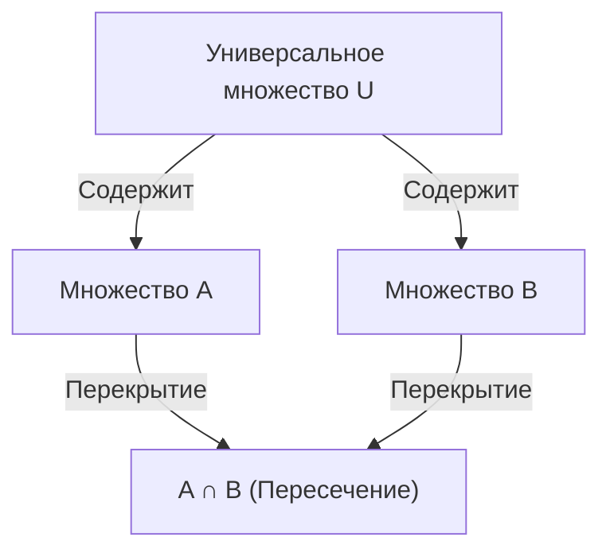

## 1. Введение

В математике и информатике мы часто сталкиваемся с ситуациями, когда нам нужно подсчитать количество элементов, удовлетворяющих нескольким условиям. Однако, когда существует несколько условий, множества элементов, удовлетворяющих каждому условию, часто перекрываются (имеют пересечения). Простое сложение приведет к многократному подсчету элементов.

Мощный метод для точного устранения этих перекрытий и получения правильного количества элементов — это **[Формула включений-исключений](https://kenji.blog/ru/p/inclusion-exclusion-principle/)** (Принцип включений-исключений).

В этой статье мы подробно объясним формулу включений-исключений, от ее базовых концепций до обобщенных математических формул, математических доказательств и конкретных примеров применения (таких как функция Эйлера и беспорядки). Кроме того, мы представим примеры реализации в программировании, чтобы углубить ваше понимание как с теоретической, так и с практической точек зрения.

## 2. Основы множеств и мощности

Прежде чем изучать формулу включений-исключений, давайте вспомним основные обозначения теории множеств.

- $A, B$ : Множества
- $|A|$ : Количество элементов (мощность) множества $A$
- $A \cup B$ : Объединение множества $A$ и множества $B$ (элементы, принадлежащие хотя бы одному из них)
- $A \cap B$ : Пересечение множества $A$ и множества $B$ (элементы, принадлежащие обоим)

То, что мы хотим найти, — это мощность объединения нескольких множеств, а именно $|A \cup B \cup \dots|$.

## 3. [Формула включений-исключений](https://kenji.blog/ru/p/inclusion-exclusion-principle/) для 2 множеств

Рассмотрим простейший случай с двумя множествами, $A$ и $B$.

### 3.1 Формула

$$
|A \cup B| = |A| + |B| - |A \cap B|
$$

### 3.2 Интуитивное понимание

Когда вы складываете количество элементов в множестве $A$ ($|A|$) и множестве $B$ ($|B|$), элементы, принадлежащие обоим множествам, то есть элементы в пересечении $A \cap B$, прибавляются **дважды**.
Поэтому, вычитая дважды подсчитанную часть $|A \cap B|$ ровно один раз, вы получаете правильную мощность объединения $|A \cup B|$.



## 4. [Формула включений-исключений](https://kenji.blog/ru/p/inclusion-exclusion-principle/) для 3 множеств

Когда есть три множества, все становится немного сложнее. Рассмотрим множества $A, B, C$.

### 4.1 Формула

$$
|A \cup B \cup C| = |A| + |B| + |C| - |A \cap B| - |B \cap C| - |C \cap A| + |A \cap B \cap C|
$$

### 4.2 Интуитивное понимание и доказательство

1. Сначала сложите все индивидуальные мощности: $|A| + |B| + |C|$
2. При этом пересечения любых двух множеств складываются дважды, поэтому вычтите их: $- |A \cap B| - |B \cap C| - |C \cap A|$
3. Наконец, рассмотрим пересечение всех трех множеств $A \cap B \cap C$. Оно было прибавлено 3 раза на шаге 1 и вычтено 3 раза на шаге 2, в результате чего его текущий счетчик равен $0$. Поэтому мы прибавляем его обратно один раз в конце: $+ |A \cap B \cap C|$

### 4.3 Конкретный пример: Количество целых чисел от 1 до 100, делящихся на 2, 3 или 5

- Универсальное множество: $U = \{1, 2, \dots, 100\}$
- Множество кратных 2: $A$
- Множество кратных 3: $B$
- Множество кратных 5: $C$

Давайте найдем каждую мощность (где $\lfloor x \rfloor$ означает округление вниз).

- $|A| = \lfloor 100 / 2 \rfloor = 50$
- $|B| = \lfloor 100 / 3 \rfloor = 33$
- $|C| = \lfloor 100 / 5 \rfloor = 20$
- $|A \cap B|$ (Кратные 6) $= \lfloor 100 / 6 \rfloor = 16$
- $|B \cap C|$ (Кратные 15) $= \lfloor 100 / 15 \rfloor = 6$
- $|C \cap A|$ (Кратные 10) $= \lfloor 100 / 10 \rfloor = 10$
- $|A \cap B \cap C|$ (Кратные 30) $= \lfloor 100 / 30 \rfloor = 3$

Применяя это к формуле:
$$
|A \cup B \cup C| = 50 + 33 + 20 - 16 - 6 - 10 + 3 = 74
$$
Таким образом, существует **74** числа, делящихся на 2, 3 или 5.

## 5. Общая формула включений-исключений для $n$ множеств

Обобщение этого на $n$ множеств $A_1, A_2, \dots, A_n$ дает следующую красивую формулу.

### 5.1 Формула

$$
\left| \bigcup_{i=1}^n A_i \right| = \sum_{k=1}^n (-1)^{k-1} \left( \sum_{1 \le i_1 < i_2 < \dots < i_k \le n} \left| A_{i_1} \cap A_{i_2} \cap \dots \cap A_{i_k} \right| \right)
$$

На словах операция повторяет «прибавление мощностей пересечений нечетного количества множеств и вычитание мощностей пересечений четного количества множеств».

### 5.2 Краткое изложение математического доказательства

Мы покажем, что любой элемент $x \in \bigcup_{i=1}^n A_i$ учитывается ровно один раз в вычислениях в правой части.

Предположим, некоторый элемент $x$ содержится ровно в $m$ множествах ($1 \le m \le n$).
То, сколько раз $x$ подсчитывается в правой части, можно выразить с помощью биномиальных коэффициентов следующим образом:

$$
\text{Количество раз} = \binom{m}{1} - \binom{m}{2} + \binom{m}{3} - \dots + (-1)^{m-1} \binom{m}{m}
$$

По биному Ньютона известно, что $(1 - 1)^m = \binom{m}{0} - \binom{m}{1} + \binom{m}{2} - \dots + (-1)^m \binom{m}{m} = 0$.
Преобразуя это:

$$
\binom{m}{0} - \left( \binom{m}{1} - \binom{m}{2} + \dots + (-1)^{m-1} \binom{m}{m} \right) = 0
$$

Поскольку $\binom{m}{0} = 1$, выражение в скобках (которое и есть количество раз, когда учитывается $x$) равно ровно $1$.
Это доказывает, что каждый элемент учитывается ровно один раз без дублирования.

## 6. Пример применения 1: Функция Эйлера

Функция Эйлера $\varphi(N)$ представляет количество целых чисел от $1$ до $N$, взаимно простых с $N$. Это также можно вычислить с помощью формулы включений-исключений.

Пусть простые множители числа $N$ равны $p_1, p_2, \dots, p_k$.
Пусть универсальное множество $U = \{1, 2, \dots, N\}$, а $A_i$ — «множество кратных $p_i$».
То, что мы хотим найти, — это количество элементов, не принадлежащих ни одному $A_i$.

$$
\varphi(N) = N - \left| \bigcup_{i=1}^k A_i \right|
$$

Применение формулы включений-исключений и упрощение приводит к этой знаменитой формуле:

$$
\varphi(N) = N \left(1 - \frac{1}{p_1}\right) \left(1 - \frac{1}{p_2}\right) \dots \left(1 - \frac{1}{p_k}\right)
$$

## 7. Пример применения 2: Беспорядки

Беспорядок — это перестановка чисел от $1$ до $n$, такая, что ни одно $i$-е число не находится на $i$-й позиции. Например, это эквивалентно общему количеству способов распределить подарки при обмене подарками так, чтобы никто не получил свой собственный подарок.

Пусть $A_i$ — «множество перестановок, где $i$ находится на $i$-й позиции». Мощность универсального множества равна $n!$.
Мы хотим найти $n! - |A_1 \cup A_2 \cup \dots \cup A_n|$.

Мощность пересечения любых $k$ множеств равна $(n-k)!$, и есть $\binom{n}{k}$ способов выбрать такие $k$ множеств. Применяя формулу включений-исключений, количество беспорядков $D_n$ вычисляется следующим образом:

$$
D_n = n! \sum_{k=0}^n \frac{(-1)^k}{k!}
$$

## 8. Вычисление и реализация с помощью программирования

[Формула включений-исключений](https://kenji.blog/ru/p/inclusion-exclusion-principle/) чрезвычайно полезна в программировании. Особенно в сочетании с побитовым полным перебором, принцип для $n$ условий может быть реализован лаконично.

Ниже приведен код Python для нахождения «количества целых чисел от 1 до $M$, которые делятся на любое из простых чисел в заданном списке».

```python
def count_multiples(M: int, primes: list[int]) -> int:
    n = len(primes)
    total_count = 0
    
    # Перебор всех подмножеств с использованием битовых масок от 1 до 2^n - 1
    for i in range(1, 1 << n):
        lcm = 1
        set_bits = 0
        
        # Вычисление произведения (НОК) выбранных простых чисел
        for j in range(n):
            if (i >> j) & 1:
                lcm *= primes[j]
                set_bits += 1
                
        # Прибавляем, если выбрано нечетное количество простых чисел, вычитаем, если четное (Формула включений-исключений)
        if set_bits % 2 == 1:
            total_count += M // lcm
        else:
            total_count -= M // lcm
            
    return total_count

# Пример выполнения
M = 100
primes = [2, 3, 5]
# Ожидаемый вывод: 74
print(f"Результат: {count_multiples(M, primes)}")
```

Временная сложность этого алгоритма составляет $O(n \cdot 2^n)$, что работает достаточно быстро, если $n$ составляет примерно до 20.

## 9. Заключение

[Формула включений-исключений](https://kenji.blog/ru/p/inclusion-exclusion-principle/) — это волшебная математическая формула, которая разбивает на первый взгляд сложные перекрытия множеств на простое и механическое повторение сложения и вычитания.

Ее диапазон применения исключительно широк: от базовых задач вероятности до продвинутого спортивного программирования и вычисления функции Эйлера, связанной с криптографией.
Овладение этим мощным методом значительно улучшит ваши навыки решения задач в математике и алгоритмах. Обязательно попробуйте применить его к различным проблемам и ощутите его силу.
