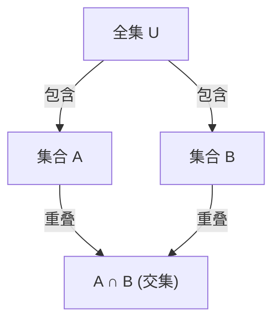

## 1. 引言

在数学和计算机科学中，我们经常会遇到需要计算满足多个条件的元素数量的情况。然而，当存在多个条件时，满足每个条件的元素集合通常会重叠（有交集）。简单地将它们相加会导致元素被多次计算。

一种能准确消除这些重叠并得出正确元素数量的强大方法是 **[容斥原理](https://kenji.blog/zh-cn/p/inclusion-exclusion-principle/)** （[Inclusion-Exclusion Principle](https://kenji.blog/zh-cn/p/inclusion-exclusion-principle/)）。

在本文中，我们将全面详细地解释[容斥原理](https://kenji.blog/zh-cn/p/inclusion-exclusion-principle/)，从其基本概念到一般化的数学公式、数学证明以及具体的应用实例（例如欧拉函数和错排问题）。此外，我们还将介绍编程实现示例，以从理论和实践两个角度加深您的理解。

## 2. 集合与元素数量的基础

在学习[容斥原理](https://kenji.blog/zh-cn/p/inclusion-exclusion-principle/)之前，让我们先回顾一下基本的集合符号。

- $A, B$ ：集合
- $|A|$ ：集合 $A$ 的元素数量（势）
- $A \cup B$ ：集合 $A$ 和集合 $B$ 的并集（属于至少其中一个的元素）
- $A \cap B$ ：集合 $A$ 和集合 $B$ 的交集（两者都属于的元素）

我们要寻找的是多个集合的并集的元素数量，即 $|A \cup B \cup \dots|$ 。

## 3. 2个集合的[容斥原理](https://kenji.blog/zh-cn/p/inclusion-exclusion-principle/)

让我们考虑最简单的包含两个集合 $A$ 和 $B$ 的情况。

### 3.1 公式

$$
|A \cup B| = |A| + |B| - |A \cap B|
$$

### 3.2 直观理解

当您将集合 $A$ 的元素数量（ $|A|$ ）和集合 $B$ 的元素数量（ $|B|$ ）相加时，同时属于两个集合的元素，即交集 $A \cap B$ 中的元素，被加了 **两次** 。
因此，通过减去被重复计算的部分 $|A \cap B|$ 恰好一次，您就可以获得正确的并集元素数量 $|A \cup B|$ 。



## 4. 3个集合的[容斥原理](https://kenji.blog/zh-cn/p/inclusion-exclusion-principle/)

当有三个集合时，它变得稍微复杂一些。考虑集合 $A, B, C$ 。

### 4.1 公式

$$
|A \cup B \cup C| = |A| + |B| + |C| - |A \cap B| - |B \cap C| - |C \cap A| + |A \cap B \cap C|
$$

### 4.2 直观理解与证明

1. 首先，将所有单独的元素数量相加： $|A| + |B| + |C|$
2. 这样做之后，任意两个集合的交集都被加了两次，因此将它们减去： $- |A \cap B| - |B \cap C| - |C \cap A|$
3. 最后，考虑所有三个集合的交集 $A \cap B \cap C$ 。它在步骤1中被加了3次，在步骤2中被减了3次，导致其当前的计算次数为 $0$ 。因此，我们在最后再把它加回来一次： $+ |A \cap B \cap C|$

### 4.3 具体示例：1到100中能被2、3或5整除的整数的数量

- 全集： $U = \{1, 2, \dots, 100\}$
- 2的倍数集合： $A$
- 3的倍数集合： $B$
- 5的倍数集合： $C$

让我们计算每个集合的元素数量（其中 $\lfloor x \rfloor$ 表示向下取整函数）。

- $|A| = \lfloor 100 / 2 \rfloor = 50$
- $|B| = \lfloor 100 / 3 \rfloor = 33$
- $|C| = \lfloor 100 / 5 \rfloor = 20$
- $|A \cap B|$ (6的倍数) $= \lfloor 100 / 6 \rfloor = 16$
- $|B \cap C|$ (15的倍数) $= \lfloor 100 / 15 \rfloor = 6$
- $|C \cap A|$ (10的倍数) $= \lfloor 100 / 10 \rfloor = 10$
- $|A \cap B \cap C|$ (30的倍数) $= \lfloor 100 / 30 \rfloor = 3$

将其代入公式：
$$
|A \cup B \cup C| = 50 + 33 + 20 - 16 - 6 - 10 + 3 = 74
$$
因此，能被2、3或5整除的数字有 **74** 个。

## 5. 一般 $n$ 个集合的[容斥原理](https://kenji.blog/zh-cn/p/inclusion-exclusion-principle/)

将其推广到 $n$ 个集合 $A_1, A_2, \dots, A_n$ ，我们得到以下优美的公式。

### 5.1 公式

$$
\left| \bigcup_{i=1}^n A_i \right| = \sum_{k=1}^n (-1)^{k-1} \left( \sum_{1 \le i_1 < i_2 < \dots < i_k \le n} \left| A_{i_1} \cap A_{i_2} \cap \dots \cap A_{i_k} \right| \right)
$$

用文字表达，该操作重复了“加上奇数个集合交集的元素数量，减去偶数个集合交集的元素数量”。

### 5.2 数学证明概要

我们将证明任何元素 $x \in \bigcup_{i=1}^n A_i$ 在右侧的计算中被准确计算了1次。

假设某个元素 $x$ 恰好包含在 $m$ 个集合中（ $1 \le m \le n$ ）。
元素 $x$ 在右侧被计算的次数可以使用二项式系数表示如下：

$$
\text{计算次数} = \binom{m}{1} - \binom{m}{2} + \binom{m}{3} - \dots + (-1)^{m-1} \binom{m}{m}
$$

根据二项式定理，已知 $(1 - 1)^m = \binom{m}{0} - \binom{m}{1} + \binom{m}{2} - \dots + (-1)^m \binom{m}{m} = 0$ 。
将其变形：

$$
\binom{m}{0} - \left( \binom{m}{1} - \binom{m}{2} + \dots + (-1)^{m-1} \binom{m}{m} \right) = 0
$$

由于 $\binom{m}{0} = 1$ ，括号内的表达式（即 $x$ 被计算的次数）的值正好是 $1$ 。
这证明了每个元素都恰好被计算一次，没有重复。

## 6. 应用示例1：欧拉函数

欧拉函数 $\varphi(N)$ 表示从 $1$ 到 $N$ 中与 $N$ 互质的整数的数量。这也可以使用[容斥原理](https://kenji.blog/zh-cn/p/inclusion-exclusion-principle/)来计算。

设 $N$ 的质因数为 $p_1, p_2, \dots, p_k$ 。
设全集为 $U = \{1, 2, \dots, N\}$ ， $A_i$ 为“ $p_i$ 的倍数的集合”。
我们要寻找的是不属于任何 $A_i$ 的元素数量。

$$
\varphi(N) = N - \left| \bigcup_{i=1}^k A_i \right|
$$

应用[容斥原理](https://kenji.blog/zh-cn/p/inclusion-exclusion-principle/)并进行化简可得出这个著名的公式：

$$
\varphi(N) = N \left(1 - \frac{1}{p_1}\right) \left(1 - \frac{1}{p_2}\right) \dots \left(1 - \frac{1}{p_k}\right)
$$

## 7. 应用示例2：错排问题

错排是指将数字 $1$ 到 $n$ 进行排列，使得没有任何第 $i$ 个数字在第 $i$ 个位置上。例如，这等同于在交换礼物时分配礼物的总方式，使得没有人在其中收到自己的礼物。

设 $A_i$ 为“ $i$ 在第 $i$ 个位置的排列的集合”。全集的元素数量为 $n!$ 。
我们想要求的是 $n! - |A_1 \cup A_2 \cup \dots \cup A_n|$ 。

任何 $k$ 个集合交集的元素数量是 $(n-k)!$ ，而选择这些 $k$ 个集合的方法有 $\binom{n}{k}$ 种。应用[容斥原理](https://kenji.blog/zh-cn/p/inclusion-exclusion-principle/)，错排的数量 $D_n$ 如下：

$$
D_n = n! \sum_{k=0}^n \frac{(-1)^k}{k!}
$$

## 8. 通过编程计算和实现

[容斥原理](https://kenji.blog/zh-cn/p/inclusion-exclusion-principle/)在编程中非常有用。特别是当结合位运算全排列搜索（二进制枚举）时，$n$ 个条件的[容斥原理](https://kenji.blog/zh-cn/p/inclusion-exclusion-principle/)可以被简洁地实现。

以下是使用 Python 来寻找“在1到 $M$ 之间能被给定列表中的任何素数整除的整数数量”的代码。

```python
def count_multiples(M: int, primes: list[int]) -> int:
    n = len(primes)
    total_count = 0
    
    # 使用从1到 2^n - 1 的位掩码遍历所有子集
    for i in range(1, 1 << n):
        lcm = 1
        set_bits = 0
        
        # 计算所选素数的乘积（最小公倍数）
        for j in range(n):
            if (i >> j) & 1:
                lcm *= primes[j]
                set_bits += 1
                
        # 如果选择了奇数个素数则相加，如果是偶数则相减（容斥原理）
        if set_bits % 2 == 1:
            total_count += M // lcm
        else:
            total_count -= M // lcm
            
    return total_count

# 执行示例
M = 100
primes = [2, 3, 5]
# 预期输出: 74
print(f"结果: {count_multiples(M, primes)}")
```

该算法的时间复杂度为 $O(n \cdot 2^n)$ ，如果 $n$ 最大为20左右，其运行速度足够快。

## 9. 结论

[容斥原理](https://kenji.blog/zh-cn/p/inclusion-exclusion-principle/)是一个神奇的数学公式，它将看似复杂的集合重叠分解为简单而机械的加减法重复。

它的应用范围异常广泛，从基本的概率问题到高级的竞赛编程，以及与密码学相关的欧拉函数计算。
掌握这门强大的技巧将大大提高您在数学和算法领域的解决问题的能力。请务必尝试将其应用于各种问题中，并体验其威力。
