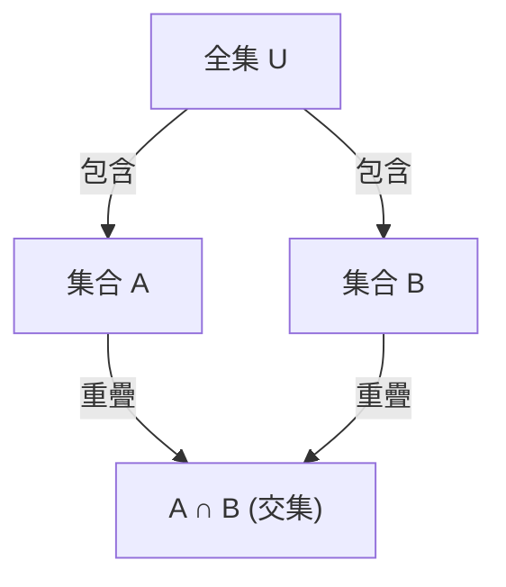

## 1. 引言

在數學和計算機科學中，我們經常會遇到需要計算滿足多個條件的元素數量的情況。然而，當存在多個條件時，滿足每個條件的元素集合通常會重疊（有交集）。簡單地將它們相加會導致元素被多次計算。

一種能準確消除這些重疊並得出正確元素數量的強大方法是 **排容原理** （Inclusion-Exclusion Principle）。

在本文中，我們將全面詳細地解釋排容原理，從其基本概念到一般化的數學公式、數學證明以及具體的應用實例（例如歐拉函數和錯排問題）。此外，我們還將介紹程式設計實作範例，以從理論和實務兩個角度加深您的理解。

## 2. 集合與元素數量的基礎

在學習排容原理之前，讓我們先回顧一下基本的集合符號。

- $A, B$ ：集合
- $|A|$ ：集合 $A$ 的元素數量（勢）
- $A \cup B$ ：集合 $A$ 和集合 $B$ 的聯集（屬於至少其中一個的元素）
- $A \cap B$ ：集合 $A$ 和集合 $B$ 的交集（兩者都屬於的元素）

我們要尋找的是多個集合的聯集的元素數量，即 $|A \cup B \cup \dots|$ 。

## 3. 2個集合的排容原理

讓我們考慮最簡單的包含兩個集合 $A$ 和 $B$ 的情況。

### 3.1 公式

$$
|A \cup B| = |A| + |B| - |A \cap B|
$$

### 3.2 直觀理解

當您將集合 $A$ 的元素數量（ $|A|$ ）和集合 $B$ 的元素數量（ $|B|$ ）相加時，同時屬於兩個集合的元素，即交集 $A \cap B$ 中的元素，被加了 **兩次** 。
因此，透過減去被重複計算的部分 $|A \cap B|$ 恰好一次，您就可以獲得正確的聯集元素數量 $|A \cup B|$ 。



## 4. 3個集合的排容原理

當有三個集合時，它變得稍微複雜一些。考慮集合 $A, B, C$ 。

### 4.1 公式

$$
|A \cup B \cup C| = |A| + |B| + |C| - |A \cap B| - |B \cap C| - |C \cap A| + |A \cap B \cap C|
$$

### 4.2 直觀理解與證明

1. 首先，將所有單獨的元素數量相加： $|A| + |B| + |C|$
2. 這樣做之後，任意兩個集合的交集都被加了兩次，因此將它們減去： $- |A \cap B| - |B \cap C| - |C \cap A|$
3. 最後，考慮所有三個集合的交集 $A \cap B \cap C$ 。它在步驟1中被加了3次，在步驟2中被減了3次，導致其目前的計算次數為 $0$ 。因此，我們在最後再把它加回來一次： $+ |A \cap B \cap C|$

### 4.3 具體範例：1到100中能被2、3或5整除的整數的數量

- 全集： $U = \{1, 2, \dots, 100\}$
- 2的倍數集合： $A$
- 3的倍數集合： $B$
- 5的倍數集合： $C$

讓我們計算每個集合的元素數量（其中 $\lfloor x \rfloor$ 表示向下取整函數）。

- $|A| = \lfloor 100 / 2 \rfloor = 50$
- $|B| = \lfloor 100 / 3 \rfloor = 33$
- $|C| = \lfloor 100 / 5 \rfloor = 20$
- $|A \cap B|$ (6的倍數) $= \lfloor 100 / 6 \rfloor = 16$
- $|B \cap C|$ (15的倍數) $= \lfloor 100 / 15 \rfloor = 6$
- $|C \cap A|$ (10的倍數) $= \lfloor 100 / 10 \rfloor = 10$
- $|A \cap B \cap C|$ (30的倍數) $= \lfloor 100 / 30 \rfloor = 3$

將其代入公式：
$$
|A \cup B \cup C| = 50 + 33 + 20 - 16 - 6 - 10 + 3 = 74
$$
因此，能被2、3或5整除的數字有 **74** 個。

## 5. 一般 $n$ 個集合的排容原理

將其推廣到 $n$ 個集合 $A_1, A_2, \dots, A_n$ ，我們得到以下優美的公式。

### 5.1 公式

$$
\left| \bigcup_{i=1}^n A_i \right| = \sum_{k=1}^n (-1)^{k-1} \left( \sum_{1 \le i_1 < i_2 < \dots < i_k \le n} \left| A_{i_1} \cap A_{i_2} \cap \dots \cap A_{i_k} \right| \right)
$$

用文字表達，該操作重複了「加上奇數個集合交集的元素數量，減去偶數個集合交集的元素數量」。

### 5.2 數學證明概要

我們將證明任何元素 $x \in \bigcup_{i=1}^n A_i$ 在右側的計算中被準確計算了1次。

假設某個元素 $x$ 恰好包含在 $m$ 個集合中（ $1 \le m \le n$ ）。
元素 $x$ 在右側被計算的次數可以使用二項式係數表示如下：

$$
\text{計算次數} = \binom{m}{1} - \binom{m}{2} + \binom{m}{3} - \dots + (-1)^{m-1} \binom{m}{m}
$$

根據二項式定理，已知 $(1 - 1)^m = \binom{m}{0} - \binom{m}{1} + \binom{m}{2} - \dots + (-1)^m \binom{m}{m} = 0$ 。
將其變形：

$$
\binom{m}{0} - \left( \binom{m}{1} - \binom{m}{2} + \dots + (-1)^{m-1} \binom{m}{m} \right) = 0
$$

由於 $\binom{m}{0} = 1$ ，括號內的表達式（即 $x$ 被計算的次數）的值正好是 $1$ 。
這證明了每個元素都恰好被計算一次，沒有重複。

## 6. 應用範例1：歐拉函數

歐拉函數 $\varphi(N)$ 表示從 $1$ 到 $N$ 中與 $N$ 互質的整數的數量。這也可以使用排容原理來計算。

設 $N$ 的質因數為 $p_1, p_2, \dots, p_k$ 。
設全集為 $U = \{1, 2, \dots, N\}$ ， $A_i$ 為「 $p_i$ 的倍數的集合」。
我們要尋找的是不屬於任何 $A_i$ 的元素數量。

$$
\varphi(N) = N - \left| \bigcup_{i=1}^k A_i \right|
$$

應用排容原理並進行化簡可得出這個著名的公式：

$$
\varphi(N) = N \left(1 - \frac{1}{p_1}\right) \left(1 - \frac{1}{p_2}\right) \dots \left(1 - \frac{1}{p_k}\right)
$$

## 7. 應用範例2：錯排問題

錯排是指將數字 $1$ 到 $n$ 進行排列，使得沒有任何第 $i$ 個數字在第 $i$ 個位置上。例如，這等同於在交換禮物時分配禮物的總方式，使得沒有人在其中收到自己的禮物。

設 $A_i$ 為「 $i$ 在第 $i$ 個位置的排列的集合」。全集的元素數量為 $n!$ 。
我們要求的是 $n! - |A_1 \cup A_2 \cup \dots \cup A_n|$ 。

任何 $k$ 個集合交集的元素數量是 $(n-k)!$ ，而選擇這些 $k$ 個集合的方法有 $\binom{n}{k}$ 種。應用排容原理，錯排的數量 $D_n$ 如下：

$$
D_n = n! \sum_{k=0}^n \frac{(-1)^k}{k!}
$$

## 8. 透過程式設計計算和實作

排容原理在程式設計中非常有用。特別是當結合位元運算全排列搜尋（二進制枚舉）時，$n$ 個條件的排容原理可以被簡潔地實作。

以下是使用 Python 來尋找「在1到 $M$ 之間能被給定列表中的任何質數整除的整數數量」的程式碼。

```python
def count_multiples(M: int, primes: list[int]) -> int:
    n = len(primes)
    total_count = 0
    
    # 使用從1到 2^n - 1 的位元遮罩遍歷所有子集
    for i in range(1, 1 << n):
        lcm = 1
        set_bits = 0
        
        # 計算所選質數的乘積（最小公倍數）
        for j in range(n):
            if (i >> j) & 1:
                lcm *= primes[j]
                set_bits += 1
                
        # 如果選擇了奇數個質數則相加，如果是偶數則相減（排容原理）
        if set_bits % 2 == 1:
            total_count += M // lcm
        else:
            total_count -= M // lcm
            
    return total_count

# 執行範例
M = 100
primes = [2, 3, 5]
# 預期輸出: 74
print(f"結果: {count_multiples(M, primes)}")
```

該演算法的時間複雜度為 $O(n \cdot 2^n)$ ，如果 $n$ 最大為20左右，其執行速度足夠快。

## 9. 結論

排容原理是一個神奇的數學公式，它將看似複雜的集合重疊分解為簡單而機械的加減法重複。

它的應用範圍異常廣泛，從基本的機率問題到高級的競賽程式設計，以及與密碼學相關的歐拉函數計算。
掌握這門強大的技巧將大大提高您在數學和演算法領域的解決問題的能力。請務必嘗試將其應用於各種問題中，並體驗其威力。
