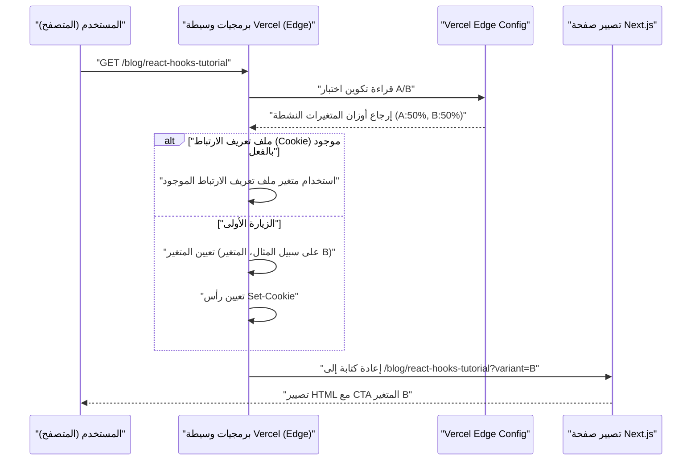

بعد إنشاء تطبيق رائع كمطور مستقل، العقبة الكبرى التي يواجهها الكثيرون هي الواقع القاسي بأن "لا أحد يعرف عن هذا التطبيق". مهما كانت قاعدة الأكواد البرمجية متطورة، ومهما كانت واجهة المستخدم/تجربة المستخدم (UI/UX) جميلة، إذا كانت استراتيجية الترويج مفقودة، فلن يراه المستخدمون أبدًا.

بالنسبة للمطورين المستقلين (Indie Hacker) في العصر الحالي، إحدى أقوى قنوات الترويج وأكثرها استدامة هي "المدونة التقنية". ليس كمجرد مذكرة للتطوير، بل كطريقة لتشغيل المدونة التقنية كمحرك استراتيجي للتسويق الداخلي (Inbound Marketing). في هذا المقال، سنشرح بعمق كبير بدءًا من التنفيذ التقني (تصميم البيانات الوصفية لتحسين محركات البحث، معمارية اختبارات A/B، والتتبع بواسطة GA4 و PostHog) وصولاً إلى النماذج الرياضية للتقييم.

## 1. استراتيجية SEO لتحويل المدونة التقنية إلى "جهاز جذب للعملاء"

تحسين محركات البحث (SEO) في المدونات التقنية ليس مجرد تناثر للكلمات المفتاحية. يتطلب الأمر نهجًا برمجيًا لنقل دلالات (معنى) المحتوى بدقة إلى محركات البحث (Googlebot) وعناكب وسائل التواصل الاجتماعي.

### 1.1 تحسين بروتوكول Open Graph (OGP)

لتعظيم نسبة النقر إلى الظهور (CTR) عند مشاركة المقالات التقنية على X (تويتر سابقًا)، و Hacker News، و Zenn، وغيرها، فإن التوليد الديناميكي لـ OGP يعد أمرًا ضروريًا. إذا كنت تستخدم App Router الخاص بـ Next.js، فاستخدم دالة `generateMetadata` لإخراج OGP مُحسَّن لكل مقال.

```typescript
// app/blog/[slug]/page.tsx
import { Metadata } from 'next';

export async function generateMetadata({ params }: { params: { slug: string } }): Promise<Metadata> {
  const post = await fetchPostBySlug(params.slug);
  
  return {
    title: `${post.title} | My Indie App Dev Blog`,
    description: post.excerpt,
    openGraph: {
      title: post.title,
      description: post.excerpt,
      url: `https://example.com/blog/${params.slug}`,
      siteName: 'Indie Dev Blog',
      images: [
        {
          url: `https://example.com/api/og?title=${encodeURIComponent(post.title)}`,
          width: 1200,
          height: 630,
          alt: post.title,
        },
      ],
      locale: 'ja_JP',
      type: 'article',
      authors: ['Kenji'],
    },
    twitter: {
      card: 'summary_large_image',
      title: post.title,
      description: post.excerpt,
      creator: '@kenjinote',
    },
  };
}
```

### 1.2 تنفيذ البيانات المنظمة باستخدام JSON-LD

من أجل نقل سياق لمحركات البحث بأن "هذا مقال تقني، وفي الوقت نفسه ترويج لتطبيق برمجي"، نقوم بتضمين البيانات المنظمة باستخدام JSON-LD (JavaScript Object Notation for Linked Data) في الصفحة. من خلال الجمع بين مخطط `SoftwareApplication` الذي يحتوي على روابط لصفحة الهبوط للتطبيق، بالإضافة إلى مخطط `Article`، نهدف إلى الحصول على النتائج المنسقة (Rich Results).

```tsx
// app/blog/[slug]/page.tsx (داخل المكون)
const jsonLd = {
  "@context": "https://schema.org",
  "@graph": [
    {
      "@type": "TechArticle",
      "headline": post.title,
      "image": [
        `https://example.com/api/og?title=${encodeURIComponent(post.title)}`
      ],
      "datePublished": post.publishedAt,
      "dateModified": post.updatedAt,
      "author": [{
          "@type": "Person",
          "name": "Kenji",
          "url": "https://example.com/about"
      }]
    },
    {
      "@type": "SoftwareApplication",
      "name": "My Awesome App",
      "operatingSystem": "Windows, macOS, Linux",
      "applicationCategory": "DeveloperApplication",
      "offers": {
        "@type": "Offer",
        "price": "0",
        "priceCurrency": "USD"
      }
    }
  ]
};

export default function BlogPost({ params }) {
  return (
    <article>
      <script
        type="application/ld+json"
        dangerouslySetInnerHTML={{ __html: JSON.stringify(jsonLd) }}
      />
      {/* يستمر نص المقال */}
    </article>
  );
}
```

بفضل هذا التنفيذ، لن يفسر Google الصفحة كمجرد بيانات نصية، بل كمجموعة من الكيانات (Entities)، وسيفهم أنه يتم تقديم أداة برمجية لحل مشكلة تقنية محددة.

## 2. تصميم قمع التحويل (Funnel) من البرنامج التعليمي إلى التحويل

يدخل قراء المدونات التقنية من خلال البحث عن رسائل خطأ معينة أو تحديات تقنية (مثل: "تحسين أداء React Context API"). من المهم وضع دعوة لاتخاذ إجراء (CTA) للتطبيق بشكل طبيعي مباشرة بعد تلبية "نية البحث" (Search Intent) الخاصة بهم.

### 2.1 تصور رحلة المستخدم

نوضح أدناه القمع (Funnel) المثالي للقارئ بدءًا من البحث العضوي إلى تثبيت التطبيق، ثم ليصبح مستخدمًا نشطًا.

```mermaid
flowchart LR
    A["البحث العضوي (Google)"] --> B["البرنامج التعليمي للمدونة التقنية"]
    B --> C["لحظة الإدراك (تم حل المشكلة)"]
    C --> D["النقر على CTA (جرب تطبيقي)"]
    D --> E["صفحة هبوط التطبيق"]
    E --> F["تحميل التطبيق / التسجيل"]
    F --> G["مستخدم نشط"]
    
    style A fill:#f9f,stroke:#333,stroke-width:2px
    style B fill:#bbf,stroke:#333,stroke-width:2px
    style D fill:#fbb,stroke:#333,stroke-width:2px
    style F fill:#bfb,stroke:#333,stroke-width:2px
```



على سبيل المثال، في نهاية مقال بعنوان "كيفية تقليل الأكواد المتكررة (Boilerplate) في Redux"، نضع CTA يتناسب مع السياق: "إذا كنت تعاني من تعقيد إدارة الحالة، يرجى تجربة أداة تصوير إدارة الحالة الجديدة 'StateViewer' التي قمت بتطويرها."

### 2.2 النموذج الرياضي لمعدل التحويل

يتم تقييم نتائج التسويق من خلال المدونة باستخدام معادلة معدل التحويل (Conversion Rate: $CR$) التالية.

$$ CR_{overall} = \frac{N_{active\_users}}{N_{blog\_visitors}} \times 100 $$

عند تفكيك القمع، يمكن التعبير عن معدل التحويل الإجمالي كحاصل ضرب معدلات الانتقال لكل خطوة.

$$ CR_{overall} = P(CTA|Visit) \times P(Install|CTA) \times P(Active|Install) $$

هنا، $P(CTA|Visit)$ هو احتمال نقر زائر المدونة على الـ CTA. النقطة المحورية الكبرى لزيادة معدل التحويل في المدونة التقنية تكمن في تعظيم هذا الـ $P(CTA|Visit)$. لتحسين ذلك، سنقوم بتقديم اختبارات A/B التي سنشرحها في القسم التالي.

## 3. تنفيذ اختبارات A/B على الحافة (Edge) باستخدام Vercel Edge Config

يجب ألا تعتمد على الحدس في تحديد نصوص وتصميمات وأماكن وضع الـ CTA. من أجل اتخاذ قرارات مبنية على البيانات، نجري اختبارات A/B. نظرًا لأن اختبارات A/B من جانب العميل (Client-side) في الواجهة الأمامية تتسبب في "ظاهرة الوميض" (Flicker Effect)، نعتمد بنية معمارية تقوم بتوزيع الطلبات بسرعة على شبكة الحافة باستخدام Vercel Edge Middleware و Edge Config.

### 3.1 معمارية اختبارات A/B على الحافة

يوضح مخطط التسلسل التالي تدفق اختبارات A/B بالاستفادة من البنية التحتية للحافة (Edge Infrastructure) الخاصة بـ Vercel.



### 3.2 كود تنفيذ Middleware

باستخدام Edge Config، من الممكن تبديل إشارات اختبار A/B في أجزاء من الألف من الثانية دون الحاجة إلى إعادة النشر.

```typescript
// middleware.ts
import { NextResponse } from 'next/server';
import type { NextRequest } from 'next/server';
import { get } from '@vercel/edge-config';

export const config = {
  matcher: '/blog/:slug*',
};

export async function middleware(request: NextRequest) {
  // الحصول على متغير اختبار A/B النشط حاليًا من Edge Config
  const ctaExperiment = await get('cta_experiment_v1');
  let variant = request.cookies.get('cta_variant')?.value;

  // إذا لم يتم تعيين المتغير، قم بتعيينه عشوائيًا
  if (!variant && ctaExperiment?.active) {
    variant = Math.random() < 0.5 ? 'A' : 'B';
  }

  // بناء عنوان URL لوجهة إعادة الكتابة (Rewrite)
  const url = request.nextUrl.clone();
  if (variant) {
    url.searchParams.set('variant', variant);
  }

  const response = NextResponse.rewrite(url);

  // الحفظ في ملف تعريف الارتباط لعرض نفس المتغير لنفس المستخدم
  if (variant && !request.cookies.has('cta_variant')) {
    response.cookies.set('cta_variant', variant, {
      maxAge: 60 * 60 * 24 * 30, // 30 days
      path: '/',
      sameSite: 'lax',
    });
  }

  return response;
}
```

في جانب مكون صفحة المدونة، نستقبل `searchParams.variant`، وبناءً عليه نقوم بتصيير إما "رابط نصي بسيط (A)" أو "لافتة رسومية بارزة (B)".

## 4. اختراق النمو (Growth Hacking) الموجه بالبيانات: تنفيذ GA4 و PostHog

بعد إجراء اختبارات A/B وتوجيه المستخدمين إلى صفحة هبوط التطبيق، يجب قياس التأثير بدقة. لقد انتهى عصر تتبع مشاهدات الصفحة (Pageviews) فقط. ما هو مطلوب الآن هو التتبع "المبني على الأحداث" (Event-based) وتحليلات المنتج التي تربط سلوك المستخدم داخل المنتج.

### 4.1 تتبع الأحداث بواسطة Google Analytics 4 (GA4)

انتقل GA4 من نموذج البيانات التقليدي القائم على الجلسات (Sessions) إلى النموذج القائم على الأحداث. لالتقاط اللحظة التي يتم فيها النقر فوق CTA معين داخل مقال المدونة، نقوم بإطلاق حدث مخصص (Custom Event).

```typescript
// components/CallToAction.tsx
'use client';

export default function CallToAction({ variant, appUrl }) {
  const handleCTAClick = () => {
    // دفع الحدث إلى dataLayer الخاص بـ GA4
    if (typeof window !== 'undefined' && window.gtag) {
      window.gtag('event', 'generate_lead', {
        event_category: 'engagement',
        event_label: 'blog_bottom_cta',
        value: 1,
        ab_variant: variant,
      });
    }
  };

  return (
    <div className={`cta-container ${variant}`}>
      <h3>هل ترغب في تجربة التطبيق الذي قمت بتطويره؟</h3>
      <a href={appUrl} onClick={handleCTAClick} className="btn-primary">
        حمل الآن
      </a>
    </div>
  );
}
```

### 4.2 تحليلات المنتج باستخدام PostHog

بينما يعتبر GA4 ممتازًا لتحليل حركة مرور موقع الويب، فإن تتبع "ما إذا كان المستخدم الذي جاء من المدونة قد قام فعليًا بتثبيت التطبيق، واستمر في استخدامه بعد أسبوع (الاحتفاظ أو Retention)"، يتطلب أداة تحليلات منتج مفتوحة المصدر مثل PostHog.

من خلال اعتماد PostHog، يمكنك تحليل سلسلة السلوكيات من الواجهة الأمامية (المدونة) إلى الواجهة الخلفية (واجهة برمجة تطبيقات التطبيق) بربطها بمعرف مستخدم واحد.

```typescript
// تهيئة PostHog ومثال على تتبع الأحداث
import posthog from 'posthog-js';

// التهيئة في جانب العميل
if (typeof window !== 'undefined') {
  posthog.init('phc_YOUR_PROJECT_API_KEY', {
    api_host: 'https://app.posthog.com',
    loaded: (posthog) => {
      if (process.env.NODE_ENV === 'development') posthog.debug();
    }
  });
}

// التتبع عند النقر على CTA
export const trackAppDownload = (sourceId: string, variant: string) => {
  posthog.capture('app_download_clicked', {
    source_article: sourceId,
    ab_test_variant: variant,
    timestamp: new Date().toISOString()
  });
};
```

باستخدام ميزة "القمع" (Funnel) القوية في PostHog، يمكنك تصور معدل التسرب (Drop-off rate) لكل خطوة: "تصفح المدونة -> النقر على CTA -> التسجيل -> تنفيذ الإجراء الأساسي الأول"، وفهم أين توجد الاختناقات بلمحة سريعة.

### 4.3 تقييم اقتصاديات الوحدة (LTV و CAC)

في النهاية، يجب أن تقيم رياضيًا ما إذا كانت تكلفة الوقت المستغرق في كتابة المدونة التقنية (أو تكلفة الاستعانة بكتاب خارجيين) مجدية كعمل تجاري. ما يهم هنا هو العلاقة بين تكلفة اكتساب العميل (CAC: Customer Acquisition Cost) والقيمة الدائمة للعميل (LTV: Lifetime Value).

يتم حساب CAC على النحو التالي. بالنسبة للمدونات التقنية، قد تكون تكلفة الإعلانات المباشرة صفرًا، ولكن يجب حساب "ساعات العمل × أجرك بالساعة" التي استغرقتها الكتابة كـ تكلفة.

$$ CAC = \frac{Total\_Cost\_of\_Content\_Creation}{Total\_Customers\_Acquired} $$

من ناحية أخرى، إذا كان تطبيقًا مستقلاً يعتمد على الاشتراك (Subscription)، فسيتم حساب LTV من متوسط الإيرادات لكل مستخدم (ARPU: Average Revenue Per User) ومعدل الإلغاء (Churn Rate). من خلال الضرب في هامش الربح الإجمالي (Gross Margin)، ستحصل على LTV أكثر دقة يعتمد على الأرباح.

$$ LTV = ARPU \times \frac{1}{Churn\_Rate} \times Gross\_Margin $$

القاعدة الذهبية (صحة اقتصاديات الوحدة) للحفاظ على نمو أعمال SaaS الصحية أو التطبيقات المستقلة هي تلبية المتباينة التالية.

$$ \frac{LTV}{CAC} > 3 $$

بمجرد فهرسة مقالات عالية الجودة في المدونة التقنية، فإنها ستستمر في توليد حركة مرور عضوية (Organic Traffic) من محركات البحث لفترة طويلة. بعبارة أخرى، مع مرور الوقت يزداد عدد المستخدمين المكتسبين (المقام)، و $CAC$ يقترب تدريجيًا من الصفر، وهو تأثير الفائدة المركبة القوي (الرافعة). هذا هو السبب الأكبر الذي يجعل المدونة التقنية أقوى سلاح ترويجي للمطورين المستقلين الذين يفتقرون إلى التمويل.

## 5. الخلاصة

في هذا المقال، شرحنا الاستراتيجية التقنية لتحويل المدونة التقنية من مجرد "مذكرات يومية" إلى "محرك آلي محسن بدرجة عالية لجذب العملاء للتطبيق".

1. **SEO والبيانات المنظمة**: استخدام OGP و JSON-LD لنقل القيمة الحقيقية للمحتوى بدقة إلى العناكب.
2. **تصميم القمع**: تقديم CTA الأكثر صلة مباشرة بعد حل نقاط الألم التقنية للقراء.
3. **اختبارات A/B على الحافة**: الاستفادة من Vercel Edge Config للبحث عن واجهة المستخدم المثلى دون التضحية بالأداء.
4. **تحليلات دقيقة**: الجمع بين GA4 و PostHog لتتبع "التحويل" (Conversion) و "الاحتفاظ" (Retention) بدلاً من مشاهدات الصفحة (PV)، والحفاظ على صحة نسبة LTV/CAC.

بناء منتج رائع لا يمثل سوى نصف النجاح. النصف الآخر هو "التسويق كهندسة" لإيصاله إلى الأشخاص الذين يحتاجون إليه. لا تدع مدونتك التقنية تنتهي كمجرد مساحة للإخراج، بل قم برعايتها لتصبح أعظم أصل يدعم النمو المستدام لتطبيقك.
