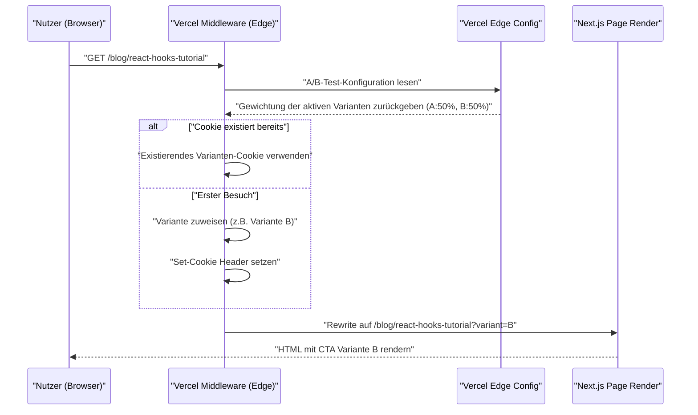

Nachdem man als Indie-Entwickler eine großartige Anwendung entwickelt hat, besteht die größte Hürde für viele in der grausamen Realität, dass "niemand die App kennt". Egal wie ausgefeilt die Codebasis ist, egal wie schön das UI/UX ist, ohne eine Promotionsstrategie wird sie niemals von Nutzern gesehen werden.

Für moderne Indie-Entwickler (Indie Hacker) ist ein "Tech-Blog" einer der stärksten und nachhaltigsten Promotionskanäle. In diesem Artikel werden wir tiefgehend erklären, wie man einen Tech-Blog nicht nur als Entwicklungsnotizbuch, sondern als strategischen Inbound-Marketing-Motor einsetzt. Dabei decken wir alles ab – von der technischen Implementierung (Design von SEO-Metadaten, Architektur von A/B-Tests, Tracking mit GA4 und PostHog) bis hin zu mathematischen Bewertungsmodellen.

## 1. SEO-Strategie, um den Tech-Blog in eine "Besuchermaschine" zu verwandeln

SEO (Suchmaschinenoptimierung) in einem Tech-Blog bedeutet nicht einfach nur, Schlüsselwörter einzustreuen. Es erfordert einen programmatischen Ansatz, um Suchmaschinen (Googlebot) und Social-Media-Crawlern die Semantik (Bedeutung) des Inhalts präzise zu vermitteln.

### 1.1 Optimierung des Open Graph Protocol (OGP)

Um die Click-Through-Rate (CTR) zu maximieren, wenn ein technischer Artikel auf X (ehemals Twitter), Hacker News, Zenn usw. geteilt wird, ist die dynamische Generierung von OGP unerlässlich. Wenn Sie den App Router von Next.js verwenden, nutzen Sie die Funktion `generateMetadata`, um für jeden Artikel ein optimiertes OGP auszugeben.

```typescript
// app/blog/[slug]/page.tsx
import { Metadata } from 'next';

export async function generateMetadata({ params }: { params: { slug: string } }): Promise<Metadata> {
  const post = await fetchPostBySlug(params.slug);
  
  return {
    title: `${post.title} | My Indie App Dev Blog`,
    description: post.excerpt,
    openGraph: {
      title: post.title,
      description: post.excerpt,
      url: `https://example.com/blog/${params.slug}`,
      siteName: 'Indie Dev Blog',
      images: [
        {
          url: `https://example.com/api/og?title=${encodeURIComponent(post.title)}`,
          width: 1200,
          height: 630,
          alt: post.title,
        },
      ],
      locale: 'de_DE',
      type: 'article',
      authors: ['Kenji'],
    },
    twitter: {
      card: 'summary_large_image',
      title: post.title,
      description: post.excerpt,
      creator: '@kenjinote',
    },
  };
}
```

### 1.2 Implementierung strukturierter Daten mit JSON-LD

Um den Suchmaschinen den Kontext zu vermitteln, dass "dies ein technischer Artikel und gleichzeitig eine Promotion für eine Software-App ist", werden strukturierte Daten mit JSON-LD (JavaScript Object Notation for Linked Data) in die Seite eingebettet. Durch die Kombination des `Article`-Schemas mit dem `SoftwareApplication`-Schema, das einen Link zur Landingpage der App enthält, zielen wir darauf ab, Rich Results zu erzielen.

```tsx
// app/blog/[slug]/page.tsx (In der Komponente)
const jsonLd = {
  "@context": "https://schema.org",
  "@graph": [
    {
      "@type": "TechArticle",
      "headline": post.title,
      "image": [
        `https://example.com/api/og?title=${encodeURIComponent(post.title)}`
      ],
      "datePublished": post.publishedAt,
      "dateModified": post.updatedAt,
      "author": [{
          "@type": "Person",
          "name": "Kenji",
          "url": "https://example.com/about"
      }]
    },
    {
      "@type": "SoftwareApplication",
      "name": "My Awesome App",
      "operatingSystem": "Windows, macOS, Linux",
      "applicationCategory": "DeveloperApplication",
      "offers": {
        "@type": "Offer",
        "price": "0",
        "priceCurrency": "USD"
      }
    }
  ]
};

export default function BlogPost({ params }) {
  return (
    <article>
      <script
        type="application/ld+json"
        dangerouslySetInnerHTML={{ __html: JSON.stringify(jsonLd) }}
      />
      {/* Der Text des Artikels folgt hier */}
    </article>
  );
}
```

Durch diese Implementierung interpretiert Google die Seite nicht nur als reine Textdaten, sondern als eine Sammlung von Entitäten und versteht, dass hier ein Software-Tool vorgestellt wird, das ein spezifisches technisches Problem löst.

## 2. Funnel-Design: Vom Tutorial zur Conversion

Leser eines Tech-Blogs kommen häufig über die Suche nach bestimmten Fehlermeldungen oder technischen Problemen (z.B. "React Context API Performance Optimierung") auf die Seite. Es ist wichtig, direkt nachdem ihre "Suchintention (Search Intent)" erfüllt wurde, auf natürliche Weise einen CTA (Call to Action) für die App zu platzieren.

### 2.1 Visualisierung der User Journey

Der ideale Funnel – von der organischen Suche des Lesers bis hin zur Installation der App und der Entwicklung zu einem aktiven Nutzer – wird unten dargestellt.

```mermaid
flowchart LR
    A["Organische Suche (Google)"] --> B["Tech-Blog-Tutorial"]
    B --> C["Aha-Moment (Problem gelöst)"]
    C --> D["CTA Klick (Meine App ausprobieren)"]
    D --> E["App Landingpage"]
    E --> F["App Download / Registrierung"]
    F --> G["Aktiver Nutzer"]
    
    style A fill:#f9f,stroke:#333,stroke-width:2px
    style B fill:#bbf,stroke:#333,stroke-width:2px
    style D fill:#fbb,stroke:#333,stroke-width:2px
    style F fill:#bfb,stroke:#333,stroke-width:2px
```



Zum Beispiel platzieren wir am Ende eines Artikels über "Wie man Redux-Boilerplate reduziert" einen kontextbezogenen CTA wie: "Wenn Sie mit der Komplexität des State-Managements zu kämpfen haben, probieren Sie mein neu entwickeltes Visualisierungstool für State-Management, StateViewer, aus."

### 2.2 Mathematisches Modell der Conversion-Rate

Der Erfolg des Marketings über den Blog wird durch die folgende Formel für die Conversion-Rate (Conversion Rate: $CR$) bewertet.

$$ CR_{overall} = \frac{N_{active\_users}}{N_{blog\_visitors}} \times 100 $$

Zerlegt man den Funnel, lässt sich die gesamte Conversion-Rate als Produkt der Übergangsraten jedes einzelnen Schritts darstellen.

$$ CR_{overall} = P(CTA|Visit) \times P(Install|CTA) \times P(Active|Install) $$

Hierbei ist $P(CTA|Visit)$ die Wahrscheinlichkeit, dass ein Blog-Besucher auf den CTA klickt. Der größte Hebelpunkt zur Steigerung der Conversion-Rate des Tech-Blogs liegt in der Maximierung dieses $P(CTA|Visit)$. Um dies zu optimieren, führen wir das A/B-Testing ein, das im nächsten Abschnitt erläutert wird.

## 3. Implementierung von A/B-Testing an der Edge mit Vercel Edge Config

Man sollte die Formulierung, das Design oder die Platzierung eines CTAs nicht aus dem Bauch heraus entscheiden. Um datengestützte Entscheidungen zu treffen, führen wir A/B-Tests durch. Da clientseitiges A/B-Testing im Frontend oft zum "Flicker-Effekt" (Bildschirmflimmern) führt, verwenden wir eine Architektur mit Vercel Edge Middleware und Edge Config, um Anfragen im Edge-Netzwerk mit hoher Geschwindigkeit umzuleiten.

### 3.1 Architektur des Edge A/B-Testings

Das folgende Sequenzdiagramm zeigt den Ablauf des A/B-Testings unter Nutzung der Edge-Infrastruktur von Vercel.



### 3.2 Implementierungscode der Middleware

Durch die Verwendung von Edge Config ist es möglich, A/B-Test-Flags in Millisekunden umzuschalten, ohne eine erneute Bereitstellung durchführen zu müssen.

```typescript
// middleware.ts
import { NextResponse } from 'next/server';
import type { NextRequest } from 'next/server';
import { get } from '@vercel/edge-config';

export const config = {
  matcher: '/blog/:slug*',
};

export async function middleware(request: NextRequest) {
  // Aktive A/B-Test-Variante aus der Edge Config abrufen
  const ctaExperiment = await get('cta_experiment_v1');
  let variant = request.cookies.get('cta_variant')?.value;

  // Wenn keine Variante zugewiesen ist, weise zufällig eine zu
  if (!variant && ctaExperiment?.active) {
    variant = Math.random() < 0.5 ? 'A' : 'B';
  }

  // Rewrite-URL aufbauen
  const url = request.nextUrl.clone();
  if (variant) {
    url.searchParams.set('variant', variant);
  }

  const response = NextResponse.rewrite(url);

  // In Cookie speichern, um demselben Nutzer die gleiche Variante anzuzeigen
  if (variant && !request.cookies.has('cta_variant')) {
    response.cookies.set('cta_variant', variant, {
      maxAge: 60 * 60 * 24 * 30, // 30 Tage
      path: '/',
      sameSite: 'lax',
    });
  }

  return response;
}
```

Auf der Seite der Blog-Seitenkomponente empfangen wir `searchParams.variant` und rendern je nachdem entweder einen "dezenteren Textlink (A)" oder ein "auffälliges grafisches Banner (B)".

## 4. Datengesteuertes Growth Hacking: Implementierung von GA4 und PostHog

Nachdem A/B-Tests durchgeführt und Nutzer auf die Landingpage der App geleitet wurden, ist es notwendig, deren Wirksamkeit präzise zu messen. Das Zeitalter, in dem man nur Seitenaufrufe verfolgte, ist vorbei. Was heute benötigt wird, ist ein "eventbasiertes" Tracking und eine Produktanalyse, die das Verhalten der Nutzer innerhalb des Produkts miteinander verknüpft.

### 4.1 Event-Tracking mit Google Analytics 4 (GA4)

GA4 ist vom traditionellen sitzungsbasierten auf ein eventbasiertes Datenmodell umgestiegen. Um den genauen Moment zu erfassen, in dem ein bestimmter CTA im Blogbeitrag geklickt wird, lösen wir ein benutzerdefiniertes Event aus.

```typescript
// components/CallToAction.tsx
'use client';

export default function CallToAction({ variant, appUrl }) {
  const handleCTAClick = () => {
    // Event an den dataLayer von GA4 pushen
    if (typeof window !== 'undefined' && window.gtag) {
      window.gtag('event', 'generate_lead', {
        event_category: 'engagement',
        event_label: 'blog_bottom_cta',
        value: 1,
        ab_variant: variant,
      });
    }
  };

  return (
    <div className={`cta-container ${variant}`}>
      <h3>Möchten Sie die von mir entwickelte App ausprobieren?</h3>
      <a href={appUrl} onClick={handleCTAClick} className="btn-primary">
        Jetzt herunterladen
      </a>
    </div>
  );
}
```

### 4.2 Produktanalyse mit PostHog

GA4 ist zwar hervorragend für die Analyse von Website-Traffic geeignet, aber um zu verfolgen, ob "ein Nutzer, der über den Blog kam, die App tatsächlich installiert hat und sie auch eine Woche später noch nutzt (Retention)", eignet sich ein auf Open Source basierendes Produktanalyse-Tool wie PostHog besser.

Durch die Einführung von PostHog können Sie die gesamte Reihe von Aktionen vom Frontend (Blog) bis zum Backend (App-API) durchgängig mit einer einzigen Nutzer-ID analysieren.

```typescript
// Initialisierung und Event-Tracking-Beispiel mit PostHog
import posthog from 'posthog-js';

// Clientseitige Initialisierung
if (typeof window !== 'undefined') {
  posthog.init('phc_YOUR_PROJECT_API_KEY', {
    api_host: 'https://app.posthog.com',
    loaded: (posthog) => {
      if (process.env.NODE_ENV === 'development') posthog.debug();
    }
  });
}

// Tracking beim CTA-Klick
export const trackAppDownload = (sourceId: string, variant: string) => {
  posthog.capture('app_download_clicked', {
    source_article: sourceId,
    ab_test_variant: variant,
    timestamp: new Date().toISOString()
  });
};
```

Mit der leistungsstarken "Funnel"-Funktion von PostHog lässt sich die Absprungrate für jeden Schritt – "Blog ansehen -> CTA Klick -> Registrierung -> Erste Kernaktion ausführen" – visualisieren, sodass man auf einen Blick erkennen kann, wo der Engpass liegt.

### 4.3 Bewertung der Unit Economics (LTV und CAC)

Letztendlich muss mathematisch bewertet werden, ob die Zeitkosten für das Schreiben des Tech-Blogs (oder die Kosten für das Outsourcing an externe Autoren) als Geschäftsmodell tragfähig sind. Hierbei ist die Beziehung zwischen den Kundenakquisitionskosten (CAC: Customer Acquisition Cost) und dem Customer Lifetime Value (LTV) entscheidend.

Die CAC werden wie folgt berechnet. Im Falle eines Tech-Blogs mögen die direkten Werbekosten null sein, jedoch sollten die für das Schreiben aufgewendeten "Arbeitsstunden × Ihr Stundenlohn" als Kosten verbucht werden.

$$ CAC = \frac{Total\_Cost\_of\_Content\_Creation}{Total\_Customers\_Acquired} $$

Andererseits wird bei einer abonnementbasierten Indie-App der LTV aus dem ARPU (Average Revenue Per User: durchschnittlicher Umsatz pro Nutzer) und der Churn-Rate (Abwanderungsrate) berechnet. Durch Multiplikation mit der Bruttomarge erhalten Sie einen präziseren, gewinnbasierten LTV.

$$ LTV = ARPU \times \frac{1}{Churn\_Rate} \times Gross\_Margin $$

Die goldene Regel (Gesundheit der Unit Economics), um ein gesundes SaaS-Geschäft oder das Wachstum einer Indie-App aufrechtzuerhalten, besteht darin, die folgende Ungleichung zu erfüllen.

$$ \frac{LTV}{CAC} > 3 $$

Ein Tech-Blog generiert, sobald ein qualitativ hochwertiger Artikel indiziert ist, über einen langen Zeitraum hinweg kontinuierlich organischen Traffic von Suchmaschinen. Das bedeutet, dass mit der Zeit die Anzahl der gewonnenen Nutzer (Nenner) steigt und sich die $CAC$ dem Nullpunkt annähern, was einen starken Zinseszinseffekt (Leverage) zur Folge hat. Dies ist der Hauptgrund, warum ein Tech-Blog die stärkste Promotionswaffe für Indie-Entwickler ohne großes Kapital ist.

## 5. Fazit

In diesem Artikel haben wir technische Strategien erläutert, um einen Tech-Blog von einem reinen "Tagebuch" in eine hochoptimierte "Automatisierungsmaschine zur App-Kundengewinnung" zu verwandeln.

1. **SEO und strukturierte Daten**: Nutzung von OGP und JSON-LD, um Crawlern den wahren Wert des Inhalts präzise zu vermitteln.
2. **Funnel-Design**: Präsentation des relevantesten CTAs direkt nachdem der technische Pain Point des Lesers gelöst wurde.
3. **Edge A/B-Testing**: Nutzung der Vercel Edge Config, um die optimale UI zu finden, ohne die Performance zu beeinträchtigen.
4. **Präzise Analyse**: Kombination von GA4 und PostHog, um nicht nur PVs, sondern "Conversion" und "Retention" zu verfolgen und das LTV/CAC-Verhältnis gesund zu halten.

Ein großartiges Produkt zu entwickeln, ist nur die halbe Miete. Die andere Hälfte ist "Marketing als Engineering", um sicherzustellen, dass es die Menschen erreicht, die es brauchen. Lassen Sie Ihren Tech-Blog nicht einfach nur als Plattform für Outputs enden, sondern bauen Sie ihn zum größten Kapital auf, das das nachhaltige Wachstum Ihrer App unterstützt.
