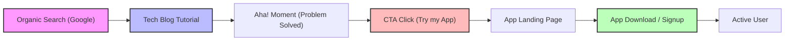
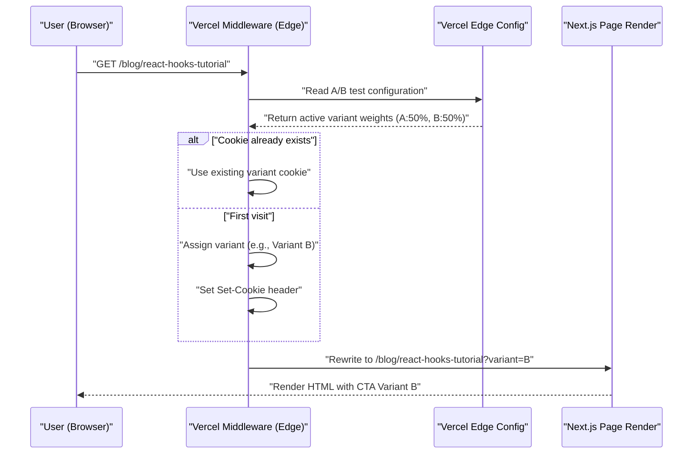

After building an amazing application as a solo developer, the biggest wall many face is the cruel reality that "nobody knows about the app." No matter how refined the codebase is, or how beautiful the UI/UX is, without a promotion strategy, it will never reach the eyes of users.

For modern indie developers (Indie Hackers), one of the most powerful and sustainable promotion channels is a "tech blog." In this article, we will explain in depth how to make a tech blog function not just as a development memo, but as a strategic inbound marketing engine, covering everything from technical implementation (SEO metadata design, A/B testing architecture, tracking with GA4 and PostHog) to mathematical evaluation models.

## 1. SEO Strategy to Turn Your Tech Blog into a "Traffic Generator"

SEO (Search Engine Optimization) for a tech blog is not simply about sprinkling keywords. It requires a programmatic approach to accurately convey the semantics (meaning) of the content to search engines (Googlebot) and social media crawlers.

### 1.1 Optimization of Open Graph Protocol (OGP)

When technical articles are shared on X (formerly Twitter), Hacker News, Zenn, etc., dynamically generating OGP is essential to maximize the click-through rate (CTR). If you are using the Next.js App Router, use the `generateMetadata` function to output optimized OGP for each article.

```typescript
// app/blog/[slug]/page.tsx
import { Metadata } from 'next';

export async function generateMetadata({ params }: { params: { slug: string } }): Promise<Metadata> {
  const post = await fetchPostBySlug(params.slug);
  
  return {
    title: `${post.title} | My Indie App Dev Blog`,
    description: post.excerpt,
    openGraph: {
      title: post.title,
      description: post.excerpt,
      url: `https://example.com/blog/${params.slug}`,
      siteName: 'Indie Dev Blog',
      images: [
        {
          url: `https://example.com/api/og?title=${encodeURIComponent(post.title)}`,
          width: 1200,
          height: 630,
          alt: post.title,
        },
      ],
      locale: 'ja_JP',
      type: 'article',
      authors: ['Kenji'],
    },
    twitter: {
      card: 'summary_large_image',
      title: post.title,
      description: post.excerpt,
      creator: '@kenjinote',
    },
  };
}
```

### 1.2 Implementation of Structured Data Using JSON-LD

To convey the context to search engines that "this is a technical article and at the same time a promotion for a software app," we embed structured data using JSON-LD (JavaScript Object Notation for Linked Data) into the page. By combining the `SoftwareApplication` schema, which has a link to the app's landing page, along with the `Article` schema, we aim to acquire rich results.

```tsx
// app/blog/[slug]/page.tsx (inside the component)
const jsonLd = {
  "@context": "https://schema.org",
  "@graph": [
    {
      "@type": "TechArticle",
      "headline": post.title,
      "image": [
        `https://example.com/api/og?title=${encodeURIComponent(post.title)}`
      ],
      "datePublished": post.publishedAt,
      "dateModified": post.updatedAt,
      "author": [{
          "@type": "Person",
          "name": "Kenji",
          "url": "https://example.com/about"
      }]
    },
    {
      "@type": "SoftwareApplication",
      "name": "My Awesome App",
      "operatingSystem": "Windows, macOS, Linux",
      "applicationCategory": "DeveloperApplication",
      "offers": {
        "@type": "Offer",
        "price": "0",
        "priceCurrency": "USD"
      }
    }
  ]
};

export default function BlogPost({ params }) {
  return (
    <article>
      <script
        type="application/ld+json"
        dangerouslySetInnerHTML={{ __html: JSON.stringify(jsonLd) }}
      />
      {/* The body of the article continues */}
    </article>
  );
}
```

Through this implementation, Google interprets the page not just as text data, but as a collection of entities, understanding that a software tool for solving specific technical challenges is being introduced.

## 2. Funnel Design from Tutorial to Conversion

Readers of a tech blog arrive by searching for specific error messages or technical challenges (e.g., "React Context API performance optimization"). It is important to place a CTA (Call to Action) for your app naturally right after satisfying their "Search Intent."

### 2.1 Visualization of the User Journey

The ideal funnel from when a reader comes from organic search to installing the app and becoming an active user is shown below.



For example, at the end of an article titled "How to Reduce Redux Boilerplate," you place a context-aligned CTA such as "If you are struggling with the complexity of state management, please try 'StateViewer', a new state management visualization tool I developed."

### 2.2 Mathematical Model of Conversion Rate

The marketing results through the blog are evaluated by the following Conversion Rate ($CR$) formula.

$$ CR_{overall} = \frac{N_{active\_users}}{N_{blog\_visitors}} \times 100 $$

Breaking down the funnel, the overall conversion rate can be expressed as the product of the transition rates of each step.

$$ CR_{overall} = P(CTA|Visit) \times P(Install|CTA) \times P(Active|Install) $$

Here, $P(CTA|Visit)$ is the probability that a blog visitor clicks the CTA. The biggest leverage point to increase the conversion rate of a tech blog lies in maximizing this $P(CTA|Visit)$. To optimize this, we introduce A/B testing, which is explained in the next section.

## 3. Implementation of Edge A/B Testing Using Vercel Edge Config

You should not decide the wording, design, and placement of a CTA by intuition. To make data-driven decisions, we conduct A/B testing. Client-side A/B testing on the frontend causes the "flicker phenomenon" (screen flickering), so we adopt an architecture that quickly routes requests on the edge network using Vercel Edge Middleware and Edge Config.

### 3.1 Edge A/B Testing Architecture

The following sequence diagram shows the A/B testing flow utilizing Vercel's edge infrastructure.



### 3.2 Middleware Implementation Code

By using Edge Config, it is possible to switch A/B testing flags in milliseconds without redeploying.

```typescript
// middleware.ts
import { NextResponse } from 'next/server';
import type { NextRequest } from 'next/server';
import { get } from '@vercel/edge-config';

export const config = {
  matcher: '/blog/:slug*',
};

export async function middleware(request: NextRequest) {
  // Fetch the currently active A/B test variant from Edge Config
  const ctaExperiment = await get('cta_experiment_v1');
  let variant = request.cookies.get('cta_variant')?.value;

  // If the variant is unassigned, assign it randomly
  if (!variant && ctaExperiment?.active) {
    variant = Math.random() < 0.5 ? 'A' : 'B';
  }

  // Build the URL for Rewrite
  const url = request.nextUrl.clone();
  if (variant) {
    url.searchParams.set('variant', variant);
  }

  const response = NextResponse.rewrite(url);

  // Save to Cookie to show the same variant to the same user
  if (variant && !request.cookies.has('cta_variant')) {
    response.cookies.set('cta_variant', variant, {
      maxAge: 60 * 60 * 24 * 30, // 30 days
      path: '/',
      sameSite: 'lax',
    });
  }

  return response;
}
```

On the blog page component side, it receives `searchParams.variant` and renders either a "modest text link (A)" or a "prominent graphical banner (B)" accordingly.

## 4. Data-Driven Growth Hacking: Implementation of GA4 and PostHog

After conducting A/B testing and guiding users to the app's landing page, it is necessary to precisely measure its effectiveness. The era of just tracking page views is over. What is required now is "event-based" tracking and product analytics that tie together user behavior within the product.

### 4.1 Event Tracking with Google Analytics 4 (GA4)

GA4 has transitioned from the traditional session-based data model to an event-based one. To capture the exact moment a specific CTA in a blog post is clicked, a custom event is fired.

```typescript
// components/CallToAction.tsx
'use client';

export default function CallToAction({ variant, appUrl }) {
  const handleCTAClick = () => {
    // Push event to GA4 dataLayer
    if (typeof window !== 'undefined' && window.gtag) {
      window.gtag('event', 'generate_lead', {
        event_category: 'engagement',
        event_label: 'blog_bottom_cta',
        value: 1,
        ab_variant: variant,
      });
    }
  };

  return (
    <div className={`cta-container ${variant}`}>
      <h3>Would you like to try the app I developed?</h3>
      <a href={appUrl} onClick={handleCTAClick} className="btn-primary">
        Download Now
      </a>
    </div>
  );
}
```

### 4.2 Product Analytics using PostHog

While GA4 excels at analyzing website traffic, an open-source based product analytics tool like PostHog is better suited for tracking whether "a user who flowed in from the blog actually installed the app and continues to use it a week later (retention)."

By introducing PostHog, a series of behaviors from the frontend (blog) to the backend (app's API) can be linked together and analyzed under a single user ID.

```typescript
// Example of PostHog initialization and event tracking
import posthog from 'posthog-js';

// Initialization on the client side
if (typeof window !== 'undefined') {
  posthog.init('phc_YOUR_PROJECT_API_KEY', {
    api_host: 'https://app.posthog.com',
    loaded: (posthog) => {
      if (process.env.NODE_ENV === 'development') posthog.debug();
    }
  });
}

// Tracking upon CTA click
export const trackAppDownload = (sourceId: string, variant: string) => {
  posthog.capture('app_download_clicked', {
    source_article: sourceId,
    ab_test_variant: variant,
    timestamp: new Date().toISOString()
  });
};
```

Using PostHog's powerful "Funnel" feature, you can visualize the drop-off rate for each step of "Blog View -> CTA Click -> Signup -> First Core Action Execution," and grasp where the bottlenecks are at a glance.

### 4.3 Evaluation of Unit Economics (LTV and CAC)

Ultimately, it is necessary to mathematically evaluate whether the time cost (or outsourcing fee to external writers) of writing a tech blog is viable as a business. What becomes important here is the relationship between Customer Acquisition Cost (CAC) and Customer Lifetime Value (LTV).

CAC is calculated as follows. For a tech blog, direct advertising costs might be zero, but the "hours of labor × your hourly rate" spent writing should be accounted for as a cost.

$$ CAC = \frac{Total\_Cost\_of\_Content\_Creation}{Total\_Customers\_Acquired} $$

On the other hand, for a subscription-based indie app, LTV is calculated from ARPU (Average Revenue Per User) and the Churn Rate. By multiplying the Gross Margin, you get a more accurate profit-based LTV.

$$ LTV = ARPU \times \frac{1}{Churn\_Rate} \times Gross\_Margin $$

The golden rule for maintaining the health of a SaaS business or the growth of an indie app (the health of unit economics) is to satisfy the following inequality.

$$ \frac{LTV}{CAC} > 3 $$

Once a high-quality article is indexed, a tech blog will continue to generate organic traffic from search engines for a long time. In other words, as time passes, the number of acquired users (denominator) increases, and the $CAC$ has a powerful compounding effect (leverage) that approaches zero to the limit. This is the biggest reason why a tech blog becomes the ultimate promotional weapon for solo developers without financial power.

## 5. Conclusion

In this article, we explained the technical strategies to elevate a tech blog from a mere "diary" into a highly optimized "automated engine for attracting app users."

1. **SEO and Structured Data**: Use OGP and JSON-LD to accurately convey the true value of your content to crawlers.
2. **Funnel Design**: Present the most relevant CTA immediately after solving the reader's technical pain points.
3. **Edge A/B Testing**: Utilize Vercel Edge Config to search for the optimal UI without sacrificing performance.
4. **Precise Analytics**: Combine GA4 and PostHog to track "conversion" and "retention" rather than PVs, keeping the LTV/CAC ratio healthy.

Creating a wonderful product is only half of the success. The other half is "marketing as engineering" to deliver it into the hands of those who need it. Do not let your tech blog end as just a place for output, but cultivate it into the greatest asset that supports the sustainable growth of your app.
