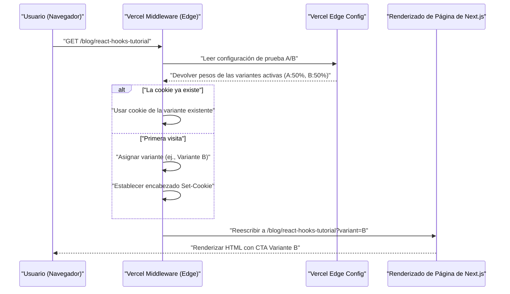

Después de crear una aplicación increíble como desarrollador independiente, el mayor muro al que muchos se enfrentan es la cruel realidad de que "nadie conoce esa aplicación". Por muy refinada que sea la base de código o por muy hermosa que sea la UI/UX, si falta una estrategia de promoción, los usuarios nunca la verán.

Para el desarrollador independiente (Indie Hacker) moderno, uno de los canales de promoción más poderosos y sostenibles es un "blog técnico". En este artículo, explicaremos muy a fondo cómo hacer que un blog técnico funcione no simplemente como un registro de desarrollo, sino como un motor de inbound marketing estratégico, desde la implementación técnica (diseño de metadatos SEO, arquitectura de pruebas A/B, seguimiento con GA4 y PostHog) hasta los modelos de evaluación matemática.

## 1. Estrategia SEO para convertir un blog técnico en una "máquina de atracción de clientes"

El SEO (Optimización de Motores de Búsqueda) en un blog técnico no se trata simplemente de esparcir palabras clave. Requiere un enfoque programático para transmitir con precisión la semántica (el significado) del contenido a los motores de búsqueda (Googlebot) y a los rastreadores de las redes sociales.

### 1.1 Optimización del Protocolo Open Graph (OGP)

Para maximizar la tasa de clics (CTR) cuando un artículo técnico se comparte en X (anteriormente Twitter), Hacker News, Zenn, etc., la generación dinámica de OGP es esencial. Si estás utilizando el App Router de Next.js, puedes usar la función `generateMetadata` para generar un OGP optimizado para cada artículo.

```typescript
// app/blog/[slug]/page.tsx
import { Metadata } from 'next';

export async function generateMetadata({ params }: { params: { slug: string } }): Promise<Metadata> {
  const post = await fetchPostBySlug(params.slug);
  
  return {
    title: `${post.title} | My Indie App Dev Blog`,
    description: post.excerpt,
    openGraph: {
      title: post.title,
      description: post.excerpt,
      url: `https://example.com/blog/${params.slug}`,
      siteName: 'Indie Dev Blog',
      images: [
        {
          url: `https://example.com/api/og?title=${encodeURIComponent(post.title)}`,
          width: 1200,
          height: 630,
          alt: post.title,
        },
      ],
      locale: 'ja_JP',
      type: 'article',
      authors: ['Kenji'],
    },
    twitter: {
      card: 'summary_large_image',
      title: post.title,
      description: post.excerpt,
      creator: '@kenjinote',
    },
  };
}
```

### 1.2 Implementación de datos estructurados usando JSON-LD

Para transmitir el contexto de que "este es un artículo técnico y al mismo tiempo una promoción para una aplicación de software" a los motores de búsqueda, incrustaremos datos estructurados en la página utilizando JSON-LD (JavaScript Object Notation for Linked Data). Al combinar no solo el esquema `Article`, sino también el esquema `SoftwareApplication` que tiene un enlace a la página de destino de la aplicación, nuestro objetivo es obtener resultados enriquecidos (rich results).

```tsx
// app/blog/[slug]/page.tsx (Dentro del componente)
const jsonLd = {
  "@context": "https://schema.org",
  "@graph": [
    {
      "@type": "TechArticle",
      "headline": post.title,
      "image": [
        `https://example.com/api/og?title=${encodeURIComponent(post.title)}`
      ],
      "datePublished": post.publishedAt,
      "dateModified": post.updatedAt,
      "author": [{
          "@type": "Person",
          "name": "Kenji",
          "url": "https://example.com/about"
      }]
    },
    {
      "@type": "SoftwareApplication",
      "name": "My Awesome App",
      "operatingSystem": "Windows, macOS, Linux",
      "applicationCategory": "DeveloperApplication",
      "offers": {
        "@type": "Offer",
        "price": "0",
        "priceCurrency": "USD"
      }
    }
  ]
};

export default function BlogPost({ params }) {
  return (
    <article>
      <script
        type="application/ld+json"
        dangerouslySetInnerHTML={{ __html: JSON.stringify(jsonLd) }}
      />
      {/* Continúa el cuerpo del artículo */}
    </article>
  );
}
```

Con esta implementación, Google interpreta la página no simplemente como datos de texto, sino como un conjunto de entidades, comprendiendo que se presenta una herramienta de software para resolver un problema técnico específico.

## 2. Diseño del embudo desde el tutorial hasta la conversión

Los lectores de un blog técnico llegan tras buscar un mensaje de error específico o un problema técnico (ej. "Optimización del rendimiento de React Context API"). Es crucial colocar una llamada a la acción (CTA, Call to Action) hacia tu aplicación de forma natural justo después de satisfacer su "Intención de búsqueda" (Search Intent).

### 2.1 Visualización del viaje del usuario (User Journey)

A continuación se muestra el embudo ideal desde que un lector realiza una búsqueda orgánica hasta que instala la aplicación y se convierte en un usuario activo.

```mermaid
flowchart LR
    A["Búsqueda Orgánica (Google)"] --> B["Tutorial de Blog Técnico"]
    B --> C["Momento ¡Ajá! (Problema Resuelto)"]
    C --> D["Clic en CTA (Prueba mi App)"]
    D --> E["Página de Destino de la App"]
    E --> F["Descarga / Registro de la App"]
    F --> G["Usuario Activo"]
    
    style A fill:#f9f,stroke:#333,stroke-width:2px
    style B fill:#bbf,stroke:#333,stroke-width:2px
    style D fill:#fbb,stroke:#333,stroke-width:2px
    style F fill:#bfb,stroke:#333,stroke-width:2px
```



Por ejemplo, al final de un artículo titulado "Cómo reducir el código boilerplate de Redux", colocarías un CTA contextualizado como: "Si estás luchando con la complejidad de la gestión de estados, prueba 'StateViewer', una nueva herramienta de visualización de gestión de estados que he desarrollado".

### 2.2 Modelo matemático de la tasa de conversión

El resultado del marketing a través de un blog se evalúa mediante la siguiente fórmula matemática para la tasa de conversión (Conversion Rate: $CR$).

$$ CR_{overall} = \frac{N_{active\_users}}{N_{blog\_visitors}} \times 100 $$

Al desglosar el embudo, la tasa de conversión global se puede expresar como el producto de las tasas de transición de cada paso.

$$ CR_{overall} = P(CTA|Visit) \times P(Install|CTA) \times P(Active|Install) $$

Aquí, $P(CTA|Visit)$ es la probabilidad de que un visitante del blog haga clic en el CTA. El mayor punto de apalancamiento para aumentar la tasa de conversión de un blog técnico es maximizar este $P(CTA|Visit)$. Para optimizar esto, introduciremos las pruebas A/B explicadas en la siguiente sección.

## 3. Implementación de pruebas A/B en el Edge usando Vercel Edge Config

No debes decidir el texto, diseño o ubicación del CTA basándote en la intuición. Para tomar decisiones basadas en datos, implementaremos pruebas A/B. Dado que las pruebas A/B en el lado del cliente (frontend) causan el "fenómeno de parpadeo" (flicker), adoptaremos una arquitectura que distribuya rápidamente las solicitudes en la red edge utilizando Vercel Edge Middleware y Edge Config.

### 3.1 Arquitectura de la prueba A/B en el Edge

El siguiente diagrama de secuencia muestra el flujo de una prueba A/B utilizando la infraestructura edge de Vercel.



### 3.2 Código de implementación del Middleware

Al utilizar Edge Config, es posible cambiar las banderas de las pruebas A/B en milisegundos sin tener que volver a desplegar.

```typescript
// middleware.ts
import { NextResponse } from 'next/server';
import type { NextRequest } from 'next/server';
import { get } from '@vercel/edge-config';

export const config = {
  matcher: '/blog/:slug*',
};

export async function middleware(request: NextRequest) {
  // Obtener la variante de la prueba A/B actualmente activa desde Edge Config
  const ctaExperiment = await get('cta_experiment_v1');
  let variant = request.cookies.get('cta_variant')?.value;

  // Si la variante no está asignada, asignarla aleatoriamente
  if (!variant && ctaExperiment?.active) {
    variant = Math.random() < 0.5 ? 'A' : 'B';
  }

  // Construir la URL de destino para el Rewrite
  const url = request.nextUrl.clone();
  if (variant) {
    url.searchParams.set('variant', variant);
  }

  const response = NextResponse.rewrite(url);

  // Guardar en Cookie para mostrar la misma variante al mismo usuario
  if (variant && !request.cookies.has('cta_variant')) {
    response.cookies.set('cta_variant', variant, {
      maxAge: 60 * 60 * 24 * 30, // 30 días
      path: '/',
      sameSite: 'lax',
    });
  }

  return response;
}
```

En el lado del componente de la página del blog, se recibe `searchParams.variant` y, en consecuencia, se renderiza un "enlace de texto discreto (A)" o un "banner gráfico destacado (B)".

## 4. Growth Hacking basado en datos: Implementación de GA4 y PostHog

Después de realizar pruebas A/B y guiar a los usuarios a la página de destino de la aplicación, es necesario medir su efecto con precisión. La era de solo rastrear las vistas de página ha terminado. Lo que se necesita ahora es el seguimiento "basado en eventos" y el análisis del producto (product analytics) que vincule el comportamiento de los usuarios dentro del producto.

### 4.1 Seguimiento de eventos con Google Analytics 4 (GA4)

GA4 ha pasado de un modelo de datos tradicional basado en sesiones a uno basado en eventos. Para capturar el momento exacto en que se hace clic en un CTA específico dentro de un artículo del blog, dispararemos un evento personalizado.

```typescript
// components/CallToAction.tsx
'use client';

export default function CallToAction({ variant, appUrl }) {
  const handleCTAClick = () => {
    // Empujar evento al dataLayer de GA4
    if (typeof window !== 'undefined' && window.gtag) {
      window.gtag('event', 'generate_lead', {
        event_category: 'engagement',
        event_label: 'blog_bottom_cta',
        value: 1,
        ab_variant: variant,
      });
    }
  };

  return (
    <div className={`cta-container ${variant}`}>
      <h3>¿Por qué no pruebas la aplicación que he desarrollado?</h3>
      <a href={appUrl} onClick={handleCTAClick} className="btn-primary">
        Descargar ahora
      </a>
    </div>
  );
}
```

### 4.2 Análisis del producto utilizando PostHog

Aunque GA4 es excelente para el análisis del tráfico del sitio web, para rastrear si "los usuarios que llegaron desde el blog realmente instalaron la aplicación y continúan usándola una semana después (retención)", una herramienta de análisis de producto de código abierto como PostHog es más adecuada.

Al introducir PostHog, puedes analizar una serie de comportamientos desde el frontend (blog) hasta el backend (API de la aplicación) vinculándolos transversalmente con un solo ID de usuario.

```typescript
// Ejemplo de inicialización de PostHog y seguimiento de eventos
import posthog from 'posthog-js';

// Inicialización en el lado del cliente
if (typeof window !== 'undefined') {
  posthog.init('phc_YOUR_PROJECT_API_KEY', {
    api_host: 'https://app.posthog.com',
    loaded: (posthog) => {
      if (process.env.NODE_ENV === 'development') posthog.debug();
    }
  });
}

// Seguimiento al hacer clic en el CTA
export const trackAppDownload = (sourceId: string, variant: string) => {
  posthog.capture('app_download_clicked', {
    source_article: sourceId,
    ab_test_variant: variant,
    timestamp: new Date().toISOString()
  });
};
```

Al usar la potente función de "Embudo" (Funnel) de PostHog, puedes visualizar la tasa de abandono en cada paso: "Vista del blog -> Clic en CTA -> Registro -> Ejecución de la primera acción principal", permitiéndote comprender de un vistazo dónde están los cuellos de botella.

### 4.3 Evaluación de la economía unitaria (LTV y CAC)

En última instancia, es necesario evaluar matemáticamente si el costo de tiempo invertido en escribir el blog técnico (o el costo de subcontratación a escritores externos) es viable como negocio. Aquí es donde cobra importancia la relación entre el Costo de Adquisición de Clientes (CAC) y el Valor del Tiempo de Vida del Cliente (LTV).

El CAC se calcula de la siguiente manera. En el caso de un blog técnico, los costos directos de publicidad pueden ser nulos, pero el "tiempo de trabajo × tu tarifa por hora" dedicado a escribir debe contabilizarse como un costo.

$$ CAC = \frac{Total\_Cost\_of\_Content\_Creation}{Total\_Customers\_Acquired} $$

Por otro lado, si es una aplicación independiente basada en suscripción, el LTV se calcula a partir del ARPU (Ingreso Promedio por Usuario) y la tasa de abandono (Churn Rate). Al multiplicarlo por el Margen Bruto (Gross Margin), se obtiene un LTV basado en beneficios más preciso.

$$ LTV = ARPU \times \frac{1}{Churn\_Rate} \times Gross\_Margin $$

La regla de oro (salud de la economía unitaria) para mantener el crecimiento de un negocio SaaS saludable, o una aplicación independiente, es satisfacer la siguiente desigualdad.

$$ \frac{LTV}{CAC} > 3 $$

Una vez que se indexan artículos de alta calidad, un blog técnico continuará generando tráfico orgánico de los motores de búsqueda durante un largo período de tiempo. Esto significa que con el tiempo, el número de usuarios adquiridos (el denominador) aumenta, y el $CAC$ tiene un poderoso efecto de interés compuesto (apalancamiento) que se acerca a cero a un límite. Esta es la razón principal por la que un blog técnico es la mejor arma de promoción para los desarrolladores independientes que carecen de fondos.

## 5. Conclusión

En este artículo, explicamos las estrategias técnicas para sublimar un blog técnico de un simple "diario" a un "motor automatizado de atracción de clientes para aplicaciones" altamente optimizado.

1. **SEO y datos estructurados**: Utilizar OGP y JSON-LD para transmitir con precisión el verdadero valor del contenido a los rastreadores.
2. **Diseño del embudo**: Presentar el CTA más relevante inmediatamente después de resolver el punto de dolor (pain point) técnico del lector.
3. **Pruebas A/B en el Edge**: Aprovechar Vercel Edge Config para buscar la UI óptima sin sacrificar el rendimiento.
4. **Análisis preciso**: Combinar GA4 y PostHog para rastrear "conversión" y "retención" en lugar de PV (Page Views), y mantener saludable la relación LTV/CAC.

Construir un producto asombroso es solo la mitad del éxito. La otra mitad es el "marketing como ingeniería" para entregarlo a las personas que lo necesitan. No dejes que tu blog técnico termine como un simple lugar de salida de información (output), sino conviértelo en el mayor activo que respalde el crecimiento sostenible de tu aplicación.
