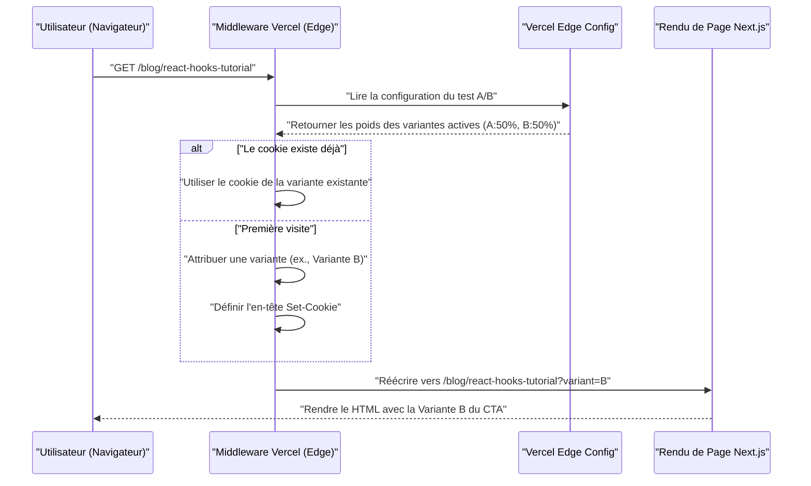

Après avoir créé une excellente application en tant que développeur indépendant, le plus grand obstacle auquel beaucoup sont confrontés est la cruelle réalité que "personne ne connaît cette application". Peu importe le niveau de sophistication de la base de code, ou la beauté de l'UI/UX, si une stratégie de promotion est absente, elle ne sera jamais vue par les utilisateurs.

Pour les développeurs indépendants modernes (Indie Hackers), l'un des canaux de promotion les plus puissants et les plus durables est le "blog technique". Dans cet article, nous allons expliquer en profondeur comment faire fonctionner un blog technique non pas comme un simple aide-mémoire de développement, mais comme un moteur stratégique d'inbound marketing, de l'implémentation technique (conception des métadonnées SEO, architecture de tests A/B, suivi avec GA4 et PostHog) jusqu'aux modèles d'évaluation mathématiques.

## 1. Stratégie SEO pour transformer votre blog technique en une "machine d'acquisition d'audience"

Le SEO (Search Engine Optimization) pour les blogs techniques ne consiste pas simplement à parsemer des mots-clés. Il nécessite une approche programmatique pour transmettre avec précision la sémantique (le sens) du contenu aux moteurs de recherche (Googlebot) et aux robots d'indexation des réseaux sociaux.

### 1.1 Optimisation du protocole Open Graph (OGP)

Lorsque des articles techniques sont partagés sur X (anciennement Twitter), Hacker News, Zenn, etc., la génération dynamique de l'OGP est essentielle pour maximiser le taux de clics (CTR). Si vous utilisez l'App Router de Next.js, vous pouvez utiliser la fonction `generateMetadata` pour générer un OGP optimisé pour chaque article.

```typescript
// app/blog/[slug]/page.tsx
import { Metadata } from 'next';

export async function generateMetadata({ params }: { params: { slug: string } }): Promise<Metadata> {
  const post = await fetchPostBySlug(params.slug);
  
  return {
    title: `${post.title} | My Indie App Dev Blog`,
    description: post.excerpt,
    openGraph: {
      title: post.title,
      description: post.excerpt,
      url: `https://example.com/blog/${params.slug}`,
      siteName: 'Indie Dev Blog',
      images: [
        {
          url: `https://example.com/api/og?title=${encodeURIComponent(post.title)}`,
          width: 1200,
          height: 630,
          alt: post.title,
        },
      ],
      locale: 'fr_FR',
      type: 'article',
      authors: ['Kenji'],
    },
    twitter: {
      card: 'summary_large_image',
      title: post.title,
      description: post.excerpt,
      creator: '@kenjinote',
    },
  };
}
```

### 1.2 Implémentation des données structurées à l'aide de JSON-LD

Pour communiquer aux moteurs de recherche le contexte selon lequel "il s'agit d'un article technique, mais aussi d'une promotion pour une application logicielle", nous intégrons des données structurées dans la page à l'aide de JSON-LD (JavaScript Object Notation for Linked Data). En combinant non seulement le schéma `Article`, mais aussi le schéma `SoftwareApplication` avec un lien vers la page de destination de l'application, nous visons à obtenir des résultats enrichis.

```tsx
// app/blog/[slug]/page.tsx (dans le composant)
const jsonLd = {
  "@context": "https://schema.org",
  "@graph": [
    {
      "@type": "TechArticle",
      "headline": post.title,
      "image": [
        `https://example.com/api/og?title=${encodeURIComponent(post.title)}`
      ],
      "datePublished": post.publishedAt,
      "dateModified": post.updatedAt,
      "author": [{
          "@type": "Person",
          "name": "Kenji",
          "url": "https://example.com/about"
      }]
    },
    {
      "@type": "SoftwareApplication",
      "name": "My Awesome App",
      "operatingSystem": "Windows, macOS, Linux",
      "applicationCategory": "DeveloperApplication",
      "offers": {
        "@type": "Offer",
        "price": "0",
        "priceCurrency": "USD"
      }
    }
  ]
};

export default function BlogPost({ params }) {
  return (
    <article>
      <script
        type="application/ld+json"
        dangerouslySetInnerHTML={{ __html: JSON.stringify(jsonLd) }}
      />
      {/* Le corps de l'article continue */}
    </article>
  );
}
```

Grâce à cette implémentation, Google interprétera la page non pas comme de simples données textuelles, mais comme un ensemble d'entités, et comprendra que des outils logiciels destinés à résoudre des problèmes techniques spécifiques y sont présentés.

## 2. Conception de l'entonnoir : du tutoriel à la conversion

Les lecteurs d'un blog technique y accèdent souvent en recherchant des messages d'erreur spécifiques ou des défis techniques (ex. : "Optimisation des performances de l'API React Context"). Il est important de placer naturellement un CTA (Call to Action) pour votre application juste après avoir satisfait leur "intention de recherche (Search Intent)".

### 2.1 Visualisation du parcours utilisateur

Voici l'entonnoir idéal allant de la recherche organique d'un lecteur jusqu'à l'installation de l'application, puis à sa transformation en utilisateur actif.

```mermaid
flowchart LR
    A["Recherche Organique (Google)"] --> B["Tutoriel sur le Blog Technique"]
    B --> C["Moment Eurêka (Problème Résolu)"]
    C --> D["Clic sur le CTA (Essayer mon App)"]
    D --> E["Page de Destination de l'App"]
    E --> F["Téléchargement de l'App / Inscription"]
    F --> G["Utilisateur Actif"]
    
    style A fill:#f9f,stroke:#333,stroke-width:2px
    style B fill:#bbf,stroke:#333,stroke-width:2px
    style D fill:#fbb,stroke:#333,stroke-width:2px
    style F fill:#bfb,stroke:#333,stroke-width:2px
```



Par exemple, à la fin d'un article intitulé "Comment réduire le code passe-partout de Redux", placez un CTA contextualisé tel que : "Si vous êtes frustré par la complexité de la gestion d'état, essayez 'StateViewer', un nouvel outil de visualisation de gestion d'état que j'ai développé".

### 2.2 Modèle mathématique du taux de conversion

Les résultats du marketing par le biais d'un blog sont évalués à l'aide de la formule mathématique suivante du taux de conversion (Conversion Rate : $CR$).

$$ CR_{overall} = \frac{N_{active\_users}}{N_{blog\_visitors}} \times 100 $$

En décomposant l'entonnoir, le taux de conversion global peut être exprimé comme le produit des taux de transition à chaque étape.

$$ CR_{overall} = P(CTA|Visit) \times P(Install|CTA) \times P(Active|Install) $$

Ici, $P(CTA|Visit)$ est la probabilité qu'un visiteur du blog clique sur le CTA. Le principal levier pour augmenter le taux de conversion d'un blog technique réside dans la maximisation de ce $P(CTA|Visit)$. Pour l'optimiser, nous allons introduire les tests A/B, expliqués dans la section suivante.

## 3. Implémentation des tests A/B à la périphérie (Edge) en utilisant Vercel Edge Config

Les textes, les designs et les emplacements de vos CTA ne doivent pas être décidés par intuition. Vous devez effectuer des tests A/B pour prendre des décisions basées sur les données. Étant donné que les tests A/B côté client dans le front-end provoquent un effet de "scintillement" (flicker), nous allons adopter une architecture qui achemine rapidement les requêtes sur le réseau Edge en utilisant Vercel Edge Middleware et Edge Config.

### 3.1 Architecture des tests A/B à l'Edge

Le diagramme de séquence ci-dessous montre le flux des tests A/B en utilisant l'infrastructure Edge de Vercel.



### 3.2 Code d'implémentation du Middleware

En utilisant Edge Config, vous pouvez basculer les flags de vos tests A/B en quelques millisecondes sans avoir à redéployer.

```typescript
// middleware.ts
import { NextResponse } from 'next/server';
import type { NextRequest } from 'next/server';
import { get } from '@vercel/edge-config';

export const config = {
  matcher: '/blog/:slug*',
};

export async function middleware(request: NextRequest) {
  // Obtenir la variante active du test A/B depuis Edge Config
  const ctaExperiment = await get('cta_experiment_v1');
  let variant = request.cookies.get('cta_variant')?.value;

  // Si la variante n'est pas assignée, l'attribuer aléatoirement
  if (!variant && ctaExperiment?.active) {
    variant = Math.random() < 0.5 ? 'A' : 'B';
  }

  // Construire l'URL de réécriture
  const url = request.nextUrl.clone();
  if (variant) {
    url.searchParams.set('variant', variant);
  }

  const response = NextResponse.rewrite(url);

  // Enregistrer dans un cookie pour afficher la même variante au même utilisateur
  if (variant && !request.cookies.has('cta_variant')) {
    response.cookies.set('cta_variant', variant, {
      maxAge: 60 * 60 * 24 * 30, // 30 days
      path: '/',
      sameSite: 'lax',
    });
  }

  return response;
}
```

Du côté du composant de page du blog, vous recevrez `searchParams.variant` et déciderez de rendre soit "un lien textuel discret (A)", soit "une bannière graphique attrayante (B)" en fonction de celui-ci.

## 4. Growth Hacking piloté par les données : Implémentation de GA4 et PostHog

Après avoir effectué des tests A/B et dirigé les utilisateurs vers la page de destination de votre application, vous devez mesurer les effets avec précision. L'époque où l'on ne suivait que les pages vues est révolue. Ce qui est requis aujourd'hui, c'est un suivi "basé sur les événements" et des analyses de produits (product analytics) qui lient le comportement de l'utilisateur à l'intérieur du produit.

### 4.1 Suivi des événements avec Google Analytics 4 (GA4)

GA4 a fait la transition d'un modèle de données basé sur les sessions à un modèle basé sur les événements. Afin de capturer le moment précis où un CTA spécifique dans un article de blog est cliqué, nous déclenchons un événement personnalisé.

```typescript
// components/CallToAction.tsx
'use client';

export default function CallToAction({ variant, appUrl }) {
  const handleCTAClick = () => {
    // Pousser l'événement dans le dataLayer de GA4
    if (typeof window !== 'undefined' && window.gtag) {
      window.gtag('event', 'generate_lead', {
        event_category: 'engagement',
        event_label: 'blog_bottom_cta',
        value: 1,
        ab_variant: variant,
      });
    }
  };

  return (
    <div className={`cta-container ${variant}`}>
      <h3>Voulez-vous essayer l'application que j'ai développée ?</h3>
      <a href={appUrl} onClick={handleCTAClick} className="btn-primary">
        Télécharger maintenant
      </a>
    </div>
  );
}
```

### 4.2 Analyses de produit avec PostHog

GA4 est excellent pour l'analyse du trafic d'un site web, mais pour suivre des éléments tels que "si un utilisateur venant du blog a réellement installé l'application et l'utilise toujours une semaine plus tard (rétention)", un outil d'analyse de produit open-source comme PostHog est plus approprié.

En introduisant PostHog, vous pouvez analyser l'ensemble des actions, du front-end (le blog) au back-end (l'API de l'application), de manière transversale en utilisant un seul identifiant utilisateur (user ID).

```typescript
// Exemple d'initialisation et de suivi d'événements avec PostHog
import posthog from 'posthog-js';

// Initialisation côté client
if (typeof window !== 'undefined') {
  posthog.init('phc_YOUR_PROJECT_API_KEY', {
    api_host: 'https://app.posthog.com',
    loaded: (posthog) => {
      if (process.env.NODE_ENV === 'development') posthog.debug();
    }
  });
}

// Suivi lors du clic sur le CTA
export const trackAppDownload = (sourceId: string, variant: string) => {
  posthog.capture('app_download_clicked', {
    source_article: sourceId,
    ab_test_variant: variant,
    timestamp: new Date().toISOString()
  });
};
```

La puissante fonctionnalité "Funnel" (Entonnoir) de PostHog vous permet de visualiser le taux d'abandon à chaque étape, de la "Consultation du blog -> Clic sur le CTA -> Inscription -> Exécution de la première action clé", et d'identifier rapidement où se trouve le goulot d'étranglement.

### 4.3 Évaluation de l'économie unitaire (LTV et CAC)

En fin de compte, vous devez évaluer mathématiquement si le coût en temps passé à écrire le blog technique (ou le coût d'externalisation à un rédacteur externe) est viable en tant qu'entreprise. L'élément important ici est la relation entre le Coût d'Acquisition Client (CAC) et la Valeur Vie Client (LTV : Lifetime Value).

Le CAC est calculé comme suit. Dans le cas d'un blog technique, les coûts publicitaires directs peuvent être nuls, mais le temps de travail consacré à la rédaction multiplié par votre taux horaire doit être pris en compte comme coût.

$$ CAC = \frac{Total\_Cost\_of\_Content\_Creation}{Total\_Customers\_Acquired} $$

D'un autre côté, pour une application indépendante basée sur l'abonnement, la LTV est calculée à partir de l'ARPU (Average Revenue Per User : revenu moyen par utilisateur) et du taux de désabonnement (Churn Rate). En la multipliant par la marge brute (Gross Margin), on obtient une LTV basée sur les bénéfices plus précise.

$$ LTV = ARPU \times \frac{1}{Churn\_Rate} \times Gross\_Margin $$

La règle d'or pour maintenir une activité SaaS saine ou la croissance d'une application indépendante (la santé de l'économie unitaire) est de satisfaire à l'inégalité suivante :

$$ \frac{LTV}{CAC} > 3 $$

Une fois qu'un article de haute qualité est indexé, un blog technique continuera de générer du trafic organique provenant des moteurs de recherche pendant une longue période. En d'autres termes, à mesure que le temps passe, le nombre d'utilisateurs acquis (le dénominateur) augmente, ce qui donne un effet composé puissant (effet de levier) où le CAC s'approche de zéro de manière asymptotique. C'est la principale raison pour laquelle les blogs techniques sont l'arme de promotion la plus redoutable pour les développeurs indépendants disposant de peu de ressources financières.

## 5. Conclusion

Dans cet article, nous avons expliqué la stratégie technique pour transformer un blog technique qui n'était qu'un simple "journal" en un "moteur d'acquisition automatique pour votre application" hautement optimisé.

1. **SEO et données structurées** : Utilisez OGP et JSON-LD pour transmettre avec précision la véritable valeur de votre contenu aux robots d'indexation.
2. **Conception de l'entonnoir** : Présentez le CTA le plus pertinent immédiatement après avoir résolu le problème technique du lecteur.
3. **Tests A/B Edge** : Tirez parti de Vercel Edge Config pour trouver l'UI optimale sans sacrifier les performances.
4. **Analytique de précision** : Combinez GA4 et PostHog pour suivre les "conversions" et la "rétention" plutôt que les pages vues, tout en gardant un ratio LTV/CAC sain.

Créer un excellent produit n'est que la moitié de la réussite. L'autre moitié est "le marketing en tant qu'ingénierie", afin de l'amener entre les mains des personnes qui en ont besoin. Ne laissez pas votre blog technique être un simple exutoire ; cultivez-le pour qu'il devienne votre plus grand atout soutenant la croissance durable de votre application.
