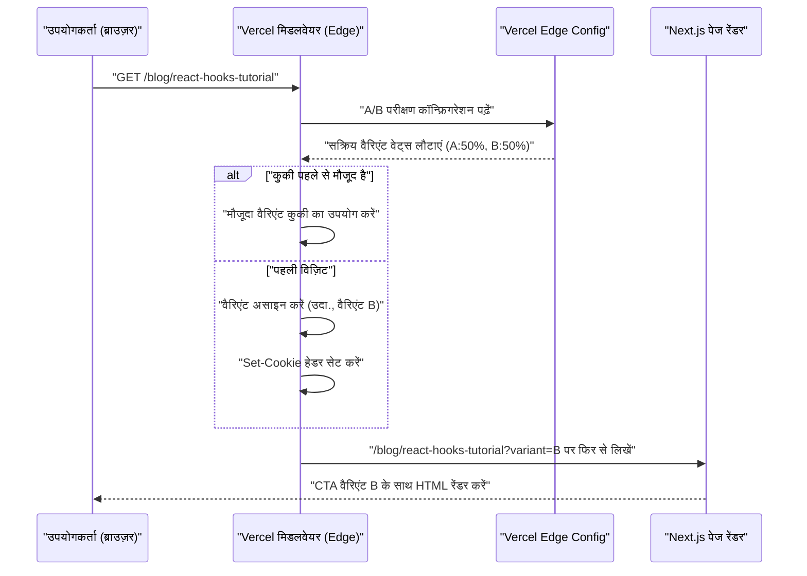

व्यक्तिगत डेवलपर (Indie Developer) के रूप में एक शानदार एप्लिकेशन बनाने के बाद, कई लोग जिस सबसे बड़ी बाधा का सामना करते हैं वह यह क्रूर वास्तविकता है कि "कोई भी उस ऐप को नहीं जानता है।" चाहे आपका कोडबेस कितना भी परिष्कृत क्यों न हो, चाहे UI/UX कितना भी सुंदर क्यों न हो, यदि प्रचार रणनीति का अभाव है, तो यह कभी भी उपयोगकर्ताओं की नज़र में नहीं आएगा।

आधुनिक इंडी डेवलपर्स (Indie Hackers) के लिए सबसे शक्तिशाली और टिकाऊ प्रचार चैनलों में से एक "तकनीकी ब्लॉग" (Tech Blog) है। इस लेख में, हम तकनीकी ब्लॉग को केवल विकास के नोट्स (memorandum) के बजाय एक रणनीतिक इनबाउंड मार्केटिंग इंजन के रूप में कार्य करने के तरीके के बारे में बहुत गहराई से बताएंगे। इसमें तकनीकी कार्यान्वयन (SEO का मेटाडेटा डिज़ाइन, A/B परीक्षण का आर्किटेक्चर, GA4 और PostHog द्वारा ट्रैकिंग) से लेकर गणितीय मूल्यांकन मॉडल तक सब कुछ शामिल है।

## 1. तकनीकी ब्लॉग को "ग्राहक अधिग्रहण मशीन" (Customer Acquisition Machine) में बदलने के लिए SEO रणनीति

तकनीकी ब्लॉग में SEO (Search Engine Optimization) का मतलब केवल कीवर्ड्स (keywords) बिखेरना नहीं है। सर्च इंजन (Googlebot) और सोशल मीडिया क्रॉलर्स को सामग्री के सिमेंटिक्स (अर्थ) को सटीक रूप से संप्रेषित करने के लिए एक प्रोग्रामेटिक दृष्टिकोण की आवश्यकता होती है।

### 1.1 Open Graph Protocol (OGP) का अनुकूलन

जब तकनीकी लेख X (पूर्व में Twitter), Hacker News, Zenn आदि पर साझा किए जाते हैं, तो क्लिक-थ्रू रेट (CTR) को अधिकतम करने के लिए OGP का डायनामिक जनरेशन आवश्यक है। यदि आप Next.js के App Router का उपयोग कर रहे हैं, तो प्रत्येक लेख के लिए अनुकूलित OGP आउटपुट करने के लिए `generateMetadata` फ़ंक्शन का उपयोग करें।

```typescript
// app/blog/[slug]/page.tsx
import { Metadata } from 'next';

export async function generateMetadata({ params }: { params: { slug: string } }): Promise<Metadata> {
  const post = await fetchPostBySlug(params.slug);
  
  return {
    title: `${post.title} | My Indie App Dev Blog`,
    description: post.excerpt,
    openGraph: {
      title: post.title,
      description: post.excerpt,
      url: `https://example.com/blog/${params.slug}`,
      siteName: 'Indie Dev Blog',
      images: [
        {
          url: `https://example.com/api/og?title=${encodeURIComponent(post.title)}`,
          width: 1200,
          height: 630,
          alt: post.title,
        },
      ],
      locale: 'ja_JP',
      type: 'article',
      authors: ['Kenji'],
    },
    twitter: {
      card: 'summary_large_image',
      title: post.title,
      description: post.excerpt,
      creator: '@kenjinote',
    },
  };
}
```

### 1.2 JSON-LD का उपयोग करके स्ट्रक्चर्ड डेटा का कार्यान्वयन

सर्च इंजन को यह संदर्भ बताने के लिए कि "यह एक तकनीकी लेख है और साथ ही एक सॉफ़्टवेयर ऐप का प्रचार भी है", JSON-LD (JavaScript Object Notation for Linked Data) का उपयोग करके स्ट्रक्चर्ड डेटा (Structured Data) को पृष्ठ में एम्बेड करें। केवल `Article` स्कीमा ही नहीं, बल्कि ऐप के लैंडिंग पृष्ठ के लिंक वाले `SoftwareApplication` स्कीमा को मिलाकर, हम रिच रिज़ल्ट्स (Rich Results) प्राप्त करने का लक्ष्य रखते हैं।

```tsx
// app/blog/[slug]/page.tsx (घटक के अंदर)
const jsonLd = {
  "@context": "https://schema.org",
  "@graph": [
    {
      "@type": "TechArticle",
      "headline": post.title,
      "image": [
        `https://example.com/api/og?title=${encodeURIComponent(post.title)}`
      ],
      "datePublished": post.publishedAt,
      "dateModified": post.updatedAt,
      "author": [{
          "@type": "Person",
          "name": "Kenji",
          "url": "https://example.com/about"
      }]
    },
    {
      "@type": "SoftwareApplication",
      "name": "My Awesome App",
      "operatingSystem": "Windows, macOS, Linux",
      "applicationCategory": "DeveloperApplication",
      "offers": {
        "@type": "Offer",
        "price": "0",
        "priceCurrency": "USD"
      }
    }
  ]
};

export default function BlogPost({ params }) {
  return (
    <article>
      <script
        type="application/ld+json"
        dangerouslySetInnerHTML={{ __html: JSON.stringify(jsonLd) }}
      />
      {/* लेख का मुख्य भाग (Body) इसके बाद आता है */}
    </article>
  );
}
```

इस कार्यान्वयन के साथ, Google पृष्ठ की व्याख्या केवल टेक्स्ट डेटा के रूप में नहीं, बल्कि एंटिटीज़ (entities) के संग्रह के रूप में करेगा और यह समझेगा कि विशिष्ट तकनीकी चुनौतियों को हल करने के लिए एक सॉफ़्टवेयर टूल पेश किया जा रहा है।

## 2. ट्यूटोरियल से रूपांतरण (Conversion) तक फ़नल डिज़ाइन

तकनीकी ब्लॉग के पाठक विशिष्ट त्रुटि संदेशों (error messages) या तकनीकी चुनौतियों (उदा: "React Context API प्रदर्शन अनुकूलन") को खोज कर आते हैं। उनके "खोज इरादे" (Search Intent) को पूरा करने के तुरंत बाद, ऐप के लिए CTA (Call to Action) को स्वाभाविक रूप से रखना महत्वपूर्ण है।

### 2.1 यूज़र जर्नी (User Journey) का विज़ुअलाइज़ेशन

ऑर्गेनिक सर्च से लेकर ऐप इंस्टॉल करने और फिर सक्रिय उपयोगकर्ता (Active User) बनने तक पाठकों के लिए आदर्श फ़नल नीचे दिखाया गया है।

```mermaid
flowchart LR
    A["ऑर्गेनिक सर्च (Google)"] --> B["टेक ब्लॉग ट्यूटोरियल"]
    B --> C["Aha! मोमेंट (समस्या हल)"]
    C --> D["CTA क्लिक (मेरा ऐप आज़माएं)"]
    D --> E["ऐप लैंडिंग पेज"]
    E --> F["ऐप डाउनलोड / साइन अप"]
    F --> G["सक्रिय उपयोगकर्ता"]
    
    style A fill:#f9f,stroke:#333,stroke-width:2px
    style B fill:#bbf,stroke:#333,stroke-width:2px
    style D fill:#fbb,stroke:#333,stroke-width:2px
    style F fill:#bfb,stroke:#333,stroke-width:2px
```



उदाहरण के लिए, "Redux के बॉयलरप्लेट को कैसे कम करें" नामक लेख के अंत में, हम एक प्रासंगिक CTA रखते हैं: "यदि आप स्टेट मैनेजमेंट की जटिलता से जूझ रहे हैं, तो मेरे द्वारा विकसित नए स्टेट मैनेजमेंट विज़ुअलाइज़ेशन टूल 'StateViewer' को आज़माएं।"

### 2.2 रूपांतरण दर (Conversion Rate) का गणितीय मॉडल

ब्लॉग के माध्यम से मार्केटिंग के परिणामों का मूल्यांकन निम्नलिखित रूपांतरण दर (Conversion Rate: $CR$) के सूत्र द्वारा किया जाता है।

$$ CR_{overall} = \frac{N_{active\_users}}{N_{blog\_visitors}} \times 100 $$

जब फ़नल को विभाजित किया जाता है, तो समग्र रूपांतरण दर को प्रत्येक चरण की संक्रमण दर (transition rate) के गुणनफल के रूप में व्यक्त किया जा सकता है।

$$ CR_{overall} = P(CTA|Visit) \times P(Install|CTA) \times P(Active|Install) $$

यहाँ, $P(CTA|Visit)$ ब्लॉग आगंतुक के CTA पर क्लिक करने की प्रायिकता (probability) है। तकनीकी ब्लॉग की रूपांतरण दर को बढ़ाने के लिए सबसे बड़ा लीवरेज पॉइंट (leverage point) इस $P(CTA|Visit)$ को अधिकतम करना है। इसे अनुकूलित करने के लिए, हम अगले भाग में वर्णित A/B परीक्षण पेश करते हैं।

## 3. Vercel Edge Config का उपयोग करके एज (Edge) पर A/B परीक्षण कार्यान्वयन

CTA के शब्दों (text), डिज़ाइन या प्लेसमेंट का निर्णय केवल अंतर्ज्ञान (intuition) से नहीं लिया जाना चाहिए। डेटा-आधारित निर्णय लेने के लिए, हम A/B परीक्षण करते हैं। चूँकि फ्रंट-एंड में क्लाइंट-साइड A/B परीक्षण से "फ़्लिकर इफ़ेक्ट (flicker phenomenon)" होता है, इसलिए हम Vercel Edge Middleware और Edge Config का उपयोग करके एक ऐसा आर्किटेक्चर अपनाते हैं जो एज नेटवर्क पर रिक्वेस्ट्स को तेज़ी से वितरित करता है।

### 3.1 एज A/B परीक्षण का आर्किटेक्चर

निम्नलिखित अनुक्रम आरेख (sequence diagram) Vercel के एज इंफ्रास्ट्रक्चर का उपयोग करके A/B परीक्षण के प्रवाह को दर्शाता है।



### 3.2 Middleware का कार्यान्वयन कोड

Edge Config का उपयोग करके, फिर से डिप्लॉय किए बिना मिलीसेकंड के भीतर A/B परीक्षण फ़्लैग को टॉगल करना संभव है।

```typescript
// middleware.ts
import { NextResponse } from 'next/server';
import type { NextRequest } from 'next/server';
import { get } from '@vercel/edge-config';

export const config = {
  matcher: '/blog/:slug*',
};

export async function middleware(request: NextRequest) {
  // Edge Config से वर्तमान में सक्रिय A/B परीक्षण का वैरिएंट प्राप्त करें
  const ctaExperiment = await get('cta_experiment_v1');
  let variant = request.cookies.get('cta_variant')?.value;

  // यदि वैरिएंट असाइन नहीं किया गया है, तो इसे बेतरतीब ढंग से (randomly) असाइन करें
  if (!variant && ctaExperiment?.active) {
    variant = Math.random() < 0.5 ? 'A' : 'B';
  }

  // Rewrite के लिए गंतव्य URL बनाएँ
  const url = request.nextUrl.clone();
  if (variant) {
    url.searchParams.set('variant', variant);
  }

  const response = NextResponse.rewrite(url);

  // कुकी में सहेजें ताकि एक ही उपयोगकर्ता को वही वैरिएंट दिखाया जा सके
  if (variant && !request.cookies.has('cta_variant')) {
    response.cookies.set('cta_variant', variant, {
      maxAge: 60 * 60 * 24 * 30, // 30 days
      path: '/',
      sameSite: 'lax',
    });
  }

  return response;
}
```

ब्लॉग के पेज कंपोनेंट साइड पर, हम `searchParams.variant` प्राप्त करते हैं, और उसके अनुसार यह रेंडर करते हैं कि क्या इसे "लो-प्रोफाइल टेक्स्ट लिंक (A)" या "आकर्षक ग्राफ़िकल बैनर (B)" बनाना है।

## 4. डेटा-संचालित ग्रोथ हैकिंग (Data-driven Growth Hacking): GA4 और PostHog का कार्यान्वयन

A/B परीक्षण करने और उपयोगकर्ताओं को ऐप के लैंडिंग पृष्ठ पर निर्देशित करने के बाद, इसके प्रभाव को सटीक रूप से मापना आवश्यक है। केवल पेज व्यूज़ (Page Views) को ट्रैक करने का युग अब समाप्त हो गया है। अब "इवेंट-आधारित" (Event-based) ट्रैकिंग और प्रोडक्ट एनालिटिक्स (Product Analytics) की आवश्यकता है, जो उत्पाद (Product) के भीतर उपयोगकर्ता के व्यवहार को जोड़ता है।

### 4.1 Google Analytics 4 (GA4) के माध्यम से इवेंट ट्रैकिंग

GA4 पारंपरिक सेशन-आधारित (session-based) मॉडल से इवेंट-आधारित डेटा मॉडल में स्थानांतरित हो गया है। ब्लॉग लेख के भीतर एक विशिष्ट CTA पर क्लिक किए जाने के सटीक क्षण को कैप्चर करने के crop-off rate को विज़ुअलाइज़ कर सकते हैं, और एक नज़र में देख सकते हैं कि बॉटलनेक (bottleneck) कहाँ है।

```typescript
// components/CallToAction.tsx
'use client';

export default function CallToAction({ variant, appUrl }) {
  const handleCTAClick = () => {
    // GA4 के dataLayer में इवेंट पुश करें
    if (typeof window !== 'undefined' && window.gtag) {
      window.gtag('event', 'generate_lead', {
        event_category: 'engagement',
        event_label: 'blog_bottom_cta',
        value: 1,
        ab_variant: variant,
      });
    }
  };

  return (
    <div className={`cta-container ${variant}`}>
      <h3>क्या आप मेरे द्वारा विकसित ऐप को आज़माना चाहेंगे?</h3>
      <a href={appUrl} onClick={handleCTAClick} className="btn-primary">
        अभी डाउनलोड करें
      </a>
    </div>
  );
}
```

### 4.2 PostHog का उपयोग करके प्रोडक्ट एनालिटिक्स

GA4 वेबसाइट ट्रैफ़िक विश्लेषण (traffic analysis) के लिए उत्कृष्ट है, लेकिन यह ट्रैक करने के लिए कि "क्या ब्लॉग के माध्यम से आने वाले उपयोगकर्ताओं ने वास्तव में ऐप इंस्टॉल किया और 1 सप्ताह के बाद भी इसका उपयोग करना जारी रखा (रिटेंशन/Retention)", PostHog जैसे ओपन-सोर्स आधारित प्रोडक्ट एनालिटिक्स टूल अधिक उपयुक्त हैं।

PostHog को लागू करके, आप एक ही उपयोगकर्ता आईडी (User ID) के साथ फ्रंट-एंड (ब्लॉग) से लेकर बैक-एंड (ऐप की API) तक के व्यवहार की एक श्रृंखला को जोड़ सकते हैं और उसका विश्लेषण कर सकते हैं।

```typescript
// PostHog का इनिशियलाइज़ेशन और इवेंट ट्रैकिंग का उदाहरण
import posthog from 'posthog-js';

// क्लाइंट साइड पर इनिशियलाइज़ेशन
if (typeof window !== 'undefined') {
  posthog.init('phc_YOUR_PROJECT_API_KEY', {
    api_host: 'https://app.posthog.com',
    loaded: (posthog) => {
      if (process.env.NODE_ENV === 'development') posthog.debug();
    }
  });
}

// CTA क्लिक पर ट्रैकिंग
export const trackAppDownload = (sourceId: string, variant: string) => {
  posthog.capture('app_download_clicked', {
    source_article: sourceId,
    ab_test_variant: variant,
    timestamp: new Date().toISOString()
  });
};
```

PostHog के शक्तिशाली "Funnel" (फ़नल) फ़ीचर का उपयोग करके, आप प्रत्येक चरण - "ब्लॉग विज़िट -> CTA क्लिक -> साइन अप -> पहला कोर एक्शन निष्पादन" के ड्रॉप-ऑफ़ रेट (drop-off rate) को विज़ुअलाइज़ कर सकते हैं, और एक नज़र में देख सकते हैं कि बॉटलनेक (bottleneck) कहाँ है।

### 4.3 यूनिट इकोनॉमिक्स (Unit Economics: LTV और CAC) का मूल्यांकन

अंततः, यह गणितीय रूप से मूल्यांकन करना आवश्यक है कि क्या तकनीकी ब्लॉग लिखने में लगने वाली समय की लागत (या बाहरी लेखकों के लिए आउटसोर्सिंग शुल्क) व्यवसाय के रूप में काम कर रही है। यहाँ जो महत्वपूर्ण है वह ग्राहक अधिग्रहण लागत (CAC: Customer Acquisition Cost) और ग्राहक के आजीवन मूल्य (LTV: Lifetime Value) के बीच का संबंध है।

CAC की गणना इस प्रकार की जाती है। तकनीकी ब्लॉग के मामले में, सीधी विज्ञापन लागत शून्य हो सकती है, लेकिन आपको लेखन में लगने वाले "काम के घंटे × आपकी प्रति घंटा दर (hourly rate)" को लागत (cost) के रूप में मानना चाहिए।

$$ CAC = \frac{Total\_Cost\_of\_Content\_Creation}{Total\_Customers\_Acquired} $$

दूसरी ओर, एक सदस्यता-आधारित (subscription-based) व्यक्तिगत ऐप के लिए, LTV की गणना ARPU (Average Revenue Per User: प्रति उपयोगकर्ता औसत राजस्व) और चर्न रेट (Churn Rate: रद्दीकरण दर) से की जाती है। ग्रॉस मार्जिन (Gross Margin: सकल लाभ मार्जिन) से गुणा करने पर अधिक सटीक लाभ-आधारित LTV प्राप्त होता है।

$$ LTV = ARPU \times \frac{1}{Churn\_Rate} \times Gross\_Margin $$

एक स्वस्थ SaaS व्यवसाय, या इंडी ऐप के विकास को बनाए रखने का सुनहरा नियम (यूनिट इकोनॉमिक्स का स्वास्थ्य) निम्नलिखित असमानता (inequality) को पूरा करना है।

$$ \frac{LTV}{CAC} > 3 $$

एक बार जब किसी उच्च-गुणवत्ता वाले लेख को इंडेक्स (index) कर लिया जाता है, तो एक तकनीकी ब्लॉग लंबे समय तक सर्च इंजनों से ऑर्गेनिक ट्रैफ़िक उत्पन्न करता रहेगा। दूसरे शब्दों में, इसके पास एक शक्तिशाली चक्रवृद्धि प्रभाव (compounding effect / leverage) है जहाँ अधिग्रहित उपयोगकर्ताओं (हर/denominator) की संख्या समय के साथ बढ़ती है, और $CAC$ अपनी सीमा में लगभग शून्य हो जाता है। यह सबसे बड़ा कारण है कि वित्तीय शक्ति के बिना व्यक्तिगत डेवलपर्स (Indie Developers) के लिए तकनीकी ब्लॉग सबसे शक्तिशाली प्रचार हथियार (promotion weapon) है।

## 5. निष्कर्ष

इस लेख में, हमने तकनीकी रणनीतियों पर चर्चा की है जो एक तकनीकी ब्लॉग को मात्र "डायरी" (diary) से हटाकर अत्यधिक अनुकूलित "ऐप ग्राहक अधिग्रहण स्वचालन इंजन" (App Customer Acquisition Automation Engine) में बदल देती हैं।

1. **SEO और स्ट्रक्चर्ड डेटा**: OGP और JSON-LD का उपयोग करके सामग्री के वास्तविक मूल्य को क्रॉलर्स तक सटीक रूप से पहुँचाएँ।
2. **फ़नल डिज़ाइन**: पाठकों के तकनीकी दर्द बिंदुओं (pain points) को हल करने के तुरंत बाद सबसे प्रासंगिक CTA प्रस्तुत करें।
3. **एज A/B परीक्षण**: प्रदर्शन (performance) से समझौता किए बिना इष्टतम UI का पता लगाने के लिए Vercel Edge Config का लाभ उठाएँ।
4. **सटीक एनालिटिक्स**: GA4 और PostHog को मिलाकर, PV के बजाय "रूपांतरण (Conversion)" और "रिटेंशन (Retention)" को ट्रैक करें, और LTV/CAC अनुपात को स्वस्थ बनाए रखें।

एक बेहतरीन उत्पाद बनाना सफलता का केवल आधा हिस्सा है। दूसरा आधा हिस्सा उन लोगों तक पहुँचाने के लिए "इंजीनियरिंग के रूप में मार्केटिंग" (Marketing as Engineering) है जिन्हें इसकी आवश्यकता है। तकनीकी ब्लॉग को केवल आउटपुट के लिए एक जगह के रूप में न छोड़ें, बल्कि इसे अपनी सबसे बड़ी संपत्ति (asset) के रूप में विकसित करें जो आपके ऐप के निरंतर विकास का समर्थन करेगी।
