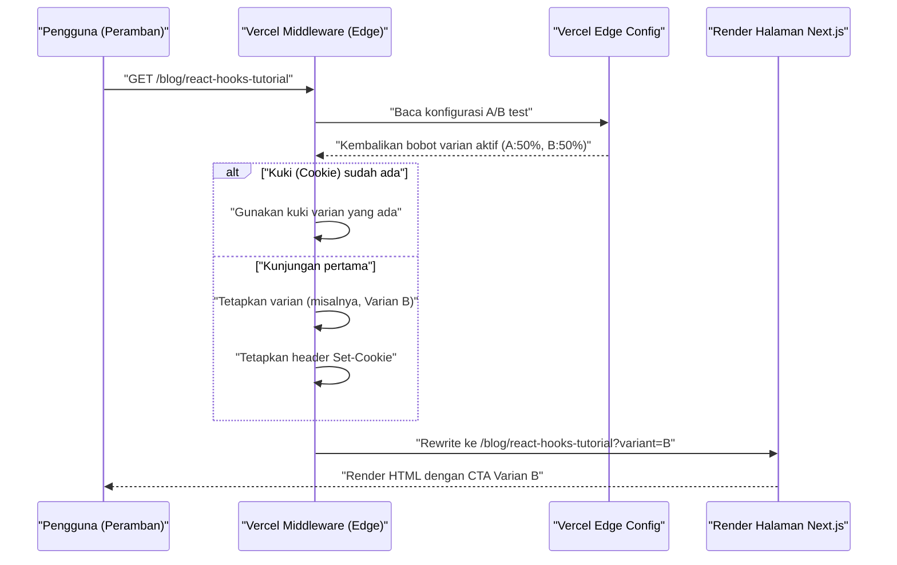

Setelah berhasil membuat aplikasi yang luar biasa sebagai pengembang independen, kenyataan pahit yang sering dihadapi banyak orang adalah dinding besar bernama "tidak ada yang tahu tentang aplikasi tersebut". Tidak peduli seberapa rapi basis kodenya, atau seberapa indah UI/UX-nya, tanpa strategi promosi, aplikasi tersebut tidak akan pernah terlihat oleh pengguna.

Bagi pengembang indie (Indie Hacker) modern, salah satu saluran promosi yang paling kuat dan berkelanjutan adalah "blog teknologi". Artikel ini akan membahas secara mendalam bagaimana membuat blog teknologi berfungsi sebagai mesin pemasaran inbound yang strategis, bukan sekadar catatan pengembangan. Kita akan membahas mulai dari implementasi teknis (desain metadata SEO, arsitektur A/B testing, pelacakan menggunakan GA4 atau PostHog) hingga model evaluasi matematis.

## 1. Strategi SEO untuk Mengubah Blog Teknologi Menjadi "Mesin Pemasaran"

SEO (Search Engine Optimization) untuk blog teknologi bukan sekadar menaburkan kata kunci. Pendekatan terprogram (programmatic) diperlukan untuk mengomunikasikan semantik (makna) konten secara akurat ke mesin pencari (Googlebot) dan perayap media sosial.

### 1.1 Optimisasi Open Graph Protocol (OGP)

Untuk memaksimalkan rasio klik-tayang (CTR) saat artikel teknologi dibagikan di X (sebelumnya Twitter), Hacker News, Zenn, dan lainnya, pembuatan OGP secara dinamis sangatlah penting. Jika Anda menggunakan App Router di Next.js, Anda dapat menggunakan fungsi `generateMetadata` untuk menghasilkan OGP yang dioptimalkan untuk setiap artikel.

```typescript
// app/blog/[slug]/page.tsx
import { Metadata } from 'next';

export async function generateMetadata({ params }: { params: { slug: string } }): Promise<Metadata> {
  const post = await fetchPostBySlug(params.slug);
  
  return {
    title: `${post.title} | My Indie App Dev Blog`,
    description: post.excerpt,
    openGraph: {
      title: post.title,
      description: post.excerpt,
      url: `https://example.com/blog/${params.slug}`,
      siteName: 'Indie Dev Blog',
      images: [
        {
          url: `https://example.com/api/og?title=${encodeURIComponent(post.title)}`,
          width: 1200,
          height: 630,
          alt: post.title,
        },
      ],
      locale: 'id_ID',
      type: 'article',
      authors: ['Kenji'],
    },
    twitter: {
      card: 'summary_large_image',
      title: post.title,
      description: post.excerpt,
      creator: '@kenjinote',
    },
  };
}
```

### 1.2 Implementasi Data Terstruktur Menggunakan JSON-LD

Untuk menyampaikan konteks ke mesin pencari bahwa "ini adalah artikel teknologi, dan pada saat yang sama, merupakan promosi untuk aplikasi perangkat lunak", data terstruktur menggunakan JSON-LD (JavaScript Object Notation for Linked Data) disematkan di halaman. Dengan menggabungkan skema `SoftwareApplication` yang memiliki tautan ke halaman arahan aplikasi dengan skema `Article`, kita bertujuan untuk mendapatkan hasil kaya (rich results).

```tsx
// app/blog/[slug]/page.tsx (Dalam komponen)
const jsonLd = {
  "@context": "https://schema.org",
  "@graph": [
    {
      "@type": "TechArticle",
      "headline": post.title,
      "image": [
        `https://example.com/api/og?title=${encodeURIComponent(post.title)}`
      ],
      "datePublished": post.publishedAt,
      "dateModified": post.updatedAt,
      "author": [{
          "@type": "Person",
          "name": "Kenji",
          "url": "https://example.com/about"
      }]
    },
    {
      "@type": "SoftwareApplication",
      "name": "My Awesome App",
      "operatingSystem": "Windows, macOS, Linux",
      "applicationCategory": "DeveloperApplication",
      "offers": {
        "@type": "Offer",
        "price": "0",
        "priceCurrency": "USD"
      }
    }
  ]
};

export default function BlogPost({ params }) {
  return (
    <article>
      <script
        type="application/ld+json"
        dangerouslySetInnerHTML={{ __html: JSON.stringify(jsonLd) }}
      />
      {/* Teks artikel berlanjut di sini */}
    </article>
  );
}
```

Melalui implementasi ini, Google menafsirkan halaman tersebut tidak hanya sebagai data teks, tetapi sebagai sekumpulan entitas, dan memahami bahwa perangkat lunak yang disajikan bertujuan untuk memecahkan masalah teknis tertentu.

## 2. Desain Corong dari Tutorial ke Konversi

Pembaca blog teknologi biasanya datang dari pencarian terkait pesan kesalahan (error message) atau masalah teknis tertentu (misalnya, "Optimisasi Performa React Context API"). Sangat penting untuk menempatkan CTA (Call to Action) ke aplikasi secara alami tepat setelah "niat pencarian (Search Intent)" mereka terpenuhi.

### 2.1 Visualisasi Perjalanan Pengguna (User Journey)

Berikut adalah corong ideal dari saat pembaca melakukan pencarian organik hingga menginstal aplikasi dan menjadi pengguna aktif.

```mermaid
flowchart LR
    A["Pencarian Organik (Google)"] --> B["Tutorial Blog Teknologi"]
    B --> C["Momen Aha! (Masalah Terpecahkan)"]
    C --> D["Klik CTA (Coba Aplikasi Saya)"]
    D --> E["Halaman Arahan Aplikasi"]
    E --> F["Unduh Aplikasi / Daftar"]
    F --> G["Pengguna Aktif"]
    
    style A fill:#f9f,stroke:#333,stroke-width:2px
    style B fill:#bbf,stroke:#333,stroke-width:2px
    style D fill:#fbb,stroke:#333,stroke-width:2px
    style F fill:#bfb,stroke:#333,stroke-width:2px
```



Misalnya, di akhir artikel yang berjudul "Cara Mengurangi Boilerplate Redux", kita menempatkan CTA yang sesuai dengan konteks: "Jika Anda kesulitan dengan kompleksitas manajemen state, cobalah alat visualisasi manajemen state baru 'StateViewer' yang saya kembangkan."

### 2.2 Model Matematis dari Rasio Konversi

Hasil pemasaran melalui blog dievaluasi menggunakan rumus Rasio Konversi (Conversion Rate: $CR$) berikut.

$$ CR_{overall} = \frac{N_{active\_users}}{N_{blog\_visitors}} \times 100 $$

Dengan memecah corong, rasio konversi keseluruhan dapat dinyatakan sebagai hasil perkalian tingkat transisi dari masing-masing langkah.

$$ CR_{overall} = P(CTA|Visit) \times P(Install|CTA) \times P(Active|Install) $$

Di sini, $P(CTA|Visit)$ adalah probabilitas pengunjung blog mengklik CTA. Titik pengungkit terbesar untuk meningkatkan rasio konversi blog teknologi adalah memaksimalkan $P(CTA|Visit)$ ini. Untuk mengoptimalkan hal ini, kita akan memperkenalkan A/B testing yang akan dibahas di bagian selanjutnya.

## 3. Implementasi A/B Testing di Edge Menggunakan Vercel Edge Config

Anda tidak boleh memutuskan kata-kata, desain, dan penempatan CTA hanya berdasarkan intuisi. Lakukan A/B testing untuk membuat keputusan yang berbasis data. Karena A/B testing sisi klien (client-side) di frontend dapat menyebabkan "efek flicker" (layar berkedip), kita mengadopsi arsitektur yang menggunakan Vercel Edge Middleware dan Edge Config untuk merutekan permintaan (requests) dengan cepat di jaringan edge.

### 3.1 Arsitektur A/B Testing Edge

Diagram sekuensial (sequence diagram) berikut menunjukkan alur A/B testing yang memanfaatkan infrastruktur edge Vercel.



### 3.2 Kode Implementasi Middleware

Dengan menggunakan Edge Config, kita dapat mengalihkan penanda (flag) A/B testing dalam hitungan milidetik tanpa perlu melakukan deploy ulang.

```typescript
// middleware.ts
import { NextResponse } from 'next/server';
import type { NextRequest } from 'next/server';
import { get } from '@vercel/edge-config';

export const config = {
  matcher: '/blog/:slug*',
};

export async function middleware(request: NextRequest) {
  // Dapatkan varian A/B test yang aktif saat ini dari Edge Config
  const ctaExperiment = await get('cta_experiment_v1');
  let variant = request.cookies.get('cta_variant')?.value;

  // Jika varian belum ditetapkan, tetapkan secara acak
  if (!variant && ctaExperiment?.active) {
    variant = Math.random() < 0.5 ? 'A' : 'B';
  }

  // Bangun URL tujuan Rewrite
  const url = request.nextUrl.clone();
  if (variant) {
    url.searchParams.set('variant', variant);
  }

  const response = NextResponse.rewrite(url);

  // Simpan ke Cookie untuk menampilkan varian yang sama pada pengguna yang sama
  if (variant && !request.cookies.has('cta_variant')) {
    response.cookies.set('cta_variant', variant, {
      maxAge: 60 * 60 * 24 * 30, // 30 hari
      path: '/',
      sameSite: 'lax',
    });
  }

  return response;
}
```

Di sisi komponen halaman blog, kita menerima `searchParams.variant` dan merendernya sesuai dengan nilai tersebut, baik menjadi "tautan teks yang sederhana (A)" atau "spanduk grafis yang menonjol (B)".

## 4. Growth Hacking Berbasis Data: Implementasi GA4 dan PostHog

Setelah melakukan A/B testing dan mengarahkan pengguna ke halaman arahan aplikasi, kita perlu mengukur efektivitasnya secara akurat. Era di mana kita hanya melacak pageview (tampilan halaman) sudah berakhir. Yang dibutuhkan saat ini adalah pelacakan "berbasis peristiwa" (event-based) dan analitik produk (product analytics) yang menghubungkan perilaku pengguna di dalam produk.

### 4.1 Pelacakan Peristiwa (Event Tracking) Menggunakan Google Analytics 4 (GA4)

GA4 telah beralih dari model data berbasis sesi (session-based) tradisional ke model berbasis peristiwa. Kita memicu peristiwa (event) kustom untuk menangkap momen saat CTA tertentu di dalam artikel blog diklik.

```typescript
// components/CallToAction.tsx
'use client';

export default function CallToAction({ variant, appUrl }) {
  const handleCTAClick = () => {
    // Dorong (push) peristiwa ke dataLayer GA4
    if (typeof window !== 'undefined' && window.gtag) {
      window.gtag('event', 'generate_lead', {
        event_category: 'engagement',
        event_label: 'blog_bottom_cta',
        value: 1,
        ab_variant: variant,
      });
    }
  };

  return (
    <div className={`cta-container ${variant}`}>
      <h3>Apakah Anda ingin mencoba aplikasi yang saya kembangkan?</h3>
      <a href={appUrl} onClick={handleCTAClick} className="btn-primary">
        Unduh Sekarang
      </a>
    </div>
  );
}
```

### 4.2 Analitik Produk Menggunakan PostHog

GA4 sangat baik untuk menganalisis lalu lintas situs web, tetapi untuk melacak "apakah pengguna yang datang dari blog benar-benar menginstal aplikasi dan terus menggunakannya 1 minggu kemudian (retensi)", alat analitik produk berbasis open source seperti PostHog jauh lebih cocok.

Dengan memperkenalkan PostHog, kita dapat menganalisis serangkaian tindakan mulai dari frontend (blog) hingga backend (API aplikasi) dengan mengikatnya pada satu ID pengguna.

```typescript
// Inisialisasi PostHog dan contoh pelacakan peristiwa
import posthog from 'posthog-js';

// Inisialisasi di sisi klien
if (typeof window !== 'undefined') {
  posthog.init('phc_YOUR_PROJECT_API_KEY', {
    api_host: 'https://app.posthog.com',
    loaded: (posthog) => {
      if (process.env.NODE_ENV === 'development') posthog.debug();
    }
  });
}

// Pelacakan saat CTA diklik
export const trackAppDownload = (sourceId: string, variant: string) => {
  posthog.capture('app_download_clicked', {
    source_article: sourceId,
    ab_test_variant: variant,
    timestamp: new Date().toISOString()
  });
};
```

Dengan memanfaatkan fitur "Funnel" PostHog yang kuat, kita dapat memvisualisasikan tingkat penurunan (drop-off rate) untuk setiap langkah mulai dari "Lihat Blog -> Klik CTA -> Daftar -> Eksekusi aksi inti pertama", dan langsung mengetahui di mana letak hambatan (bottleneck) yang terjadi.

### 4.3 Evaluasi Unit Ekonomi (LTV dan CAC)

Pada akhirnya, kita perlu mengevaluasi secara matematis apakah biaya waktu yang dihabiskan untuk menulis blog teknologi (atau biaya untuk merekrut penulis eksternal) layak secara bisnis. Hubungan antara Biaya Akuisisi Pelanggan (CAC: Customer Acquisition Cost) dan Nilai Seumur Hidup Pelanggan (LTV: Lifetime Value) menjadi sangat penting di sini.

CAC dihitung sebagai berikut. Untuk blog teknologi, biaya iklan langsung mungkin nol, namun kita harus memperhitungkan "jam kerja × tarif per jam Anda" sebagai biaya.

$$ CAC = \frac{Total\_Cost\_of\_Content\_Creation}{Total\_Customers\_Acquired} $$

Di sisi lain, untuk aplikasi pribadi berbasis langganan, LTV dihitung dari ARPU (Average Revenue Per User: pendapatan rata-rata per pengguna) dan tingkat churn (churn rate / rasio berhenti berlangganan). Dengan mengalikannya dengan margin kotor (Gross Margin), kita akan mendapatkan LTV berbasis laba yang lebih akurat.

$$ LTV = ARPU \times \frac{1}{Churn\_Rate} \times Gross\_Margin $$

Aturan emas (kesehatan unit ekonomi) untuk mempertahankan bisnis SaaS yang sehat, atau pertumbuhan aplikasi indie, adalah memenuhi pertidaksamaan berikut.

$$ \frac{LTV}{CAC} > 3 $$

Begitu sebuah blog teknologi menghasilkan artikel berkualitas yang terindeks, artikel tersebut akan terus menghasilkan lalu lintas organik dari mesin pencari untuk waktu yang lama. Dengan kata lain, seiring berjalannya waktu, jumlah pengguna yang diperoleh (penyebut) akan meningkat, yang menciptakan efek majemuk (leverage) yang kuat di mana $CAC$ mendekati nol secara ekstrim. Inilah alasan terbesar mengapa blog teknologi merupakan senjata promosi terbaik bagi pengembang individu yang kekurangan dana.

## 5. Kesimpulan

Artikel ini telah menjelaskan strategi teknis untuk meningkatkan blog teknologi yang hanya sekadar "buku harian" menjadi "mesin otomatisasi akuisisi pengguna aplikasi" yang sangat dioptimalkan.

1. **SEO dan Data Terstruktur**: Gunakan OGP dan JSON-LD untuk secara akurat menyampaikan nilai konten yang sebenarnya ke perayap (crawler).
2. **Desain Corong**: Tepat setelah menyelesaikan masalah teknis pembaca, tawarkan CTA yang paling relevan.
3. **A/B Testing Edge**: Manfaatkan Vercel Edge Config untuk mencari UI optimal tanpa mengorbankan performa.
4. **Analitik Presisi**: Kombinasikan GA4 dan PostHog untuk melacak "konversi" dan "retensi", bukan hanya PV, demi menjaga rasio LTV/CAC tetap sehat.

Membuat produk hebat hanyalah separuh dari kesuksesan. Separuh lainnya adalah "pemasaran sebagai rekayasa perangkat lunak" untuk menghadirkannya kepada orang-orang yang membutuhkannya. Jangan biarkan blog teknologi Anda hanya menjadi tempat berbagi output, tetapi jadikanlah aset terbesar yang mendukung pertumbuhan berkelanjutan aplikasi Anda.
