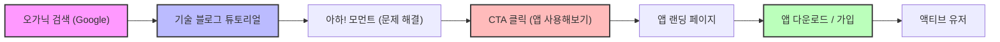
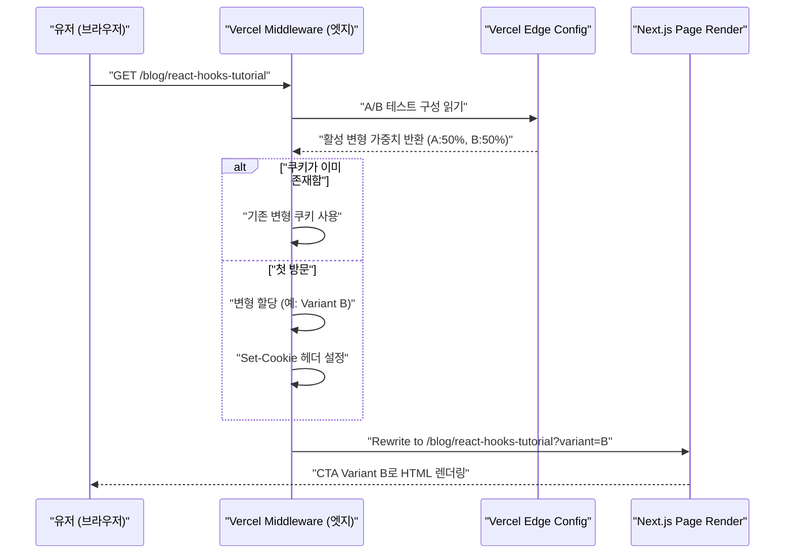

개인 개발자로서 훌륭한 애플리케이션을 완성한 후, 많은 사람이 직면하는 가장 큰 장벽은 '아무도 그 앱을 모른다'는 잔혹한 현실입니다. 아무리 세련된 코드베이스라 하더라도, 아무리 아름다운 UI/UX라 하더라도, 프로모션 전략이 결여되어 있다면 사용자의 눈에 띌 수 없습니다.

현대의 인디 개발자(Indie Hacker)에게 가장 강력하고 지속 가능한 프로모션 채널 중 하나가 바로 '기술 블로그'입니다. 단순한 개발 비망록이 아닌, 전략적인 인바운드 마케팅의 엔진으로서 기술 블로그를 기능하게 하는 방법에 대해 본 기사에서는 기술적인 구현(SEO 메타데이터 설계, A/B 테스트 아키텍처, GA4나 PostHog를 통한 트래킹)부터 수리적인 평가 모델까지 아주 깊이 있게 해설하겠습니다.

## 1. 기술 블로그를 '집객 장치'로 바꾸는 SEO 전략

기술 블로그에서의 SEO(검색 엔진 최적화)는 단순히 키워드를 흩뿌리는 것이 아닙니다. 검색 엔진(Googlebot)과 소셜 미디어 크롤러에게 콘텐츠의 시맨틱스(의미)를 정확하게 전달하는 프로그래매틱한 접근이 요구됩니다.

### 1.1 Open Graph Protocol (OGP) 최적화

기술 기사가 X(구 Twitter)나 Hacker News, Zenn 등에서 공유되었을 때, 클릭스루율(CTR)을 극대화하기 위해서는 OGP의 동적 생성이 필수적입니다. Next.js의 App Router를 사용하는 경우, `generateMetadata` 함수를 사용하여 기사마다 최적화된 OGP를 출력합니다.

```typescript
// app/blog/[slug]/page.tsx
import { Metadata } from 'next';

export async function generateMetadata({ params }: { params: { slug: string } }): Promise<Metadata> {
  const post = await fetchPostBySlug(params.slug);
  
  return {
    title: `${post.title} | My Indie App Dev Blog`,
    description: post.excerpt,
    openGraph: {
      title: post.title,
      description: post.excerpt,
      url: `https://example.com/blog/${params.slug}`,
      siteName: 'Indie Dev Blog',
      images: [
        {
          url: `https://example.com/api/og?title=${encodeURIComponent(post.title)}`,
          width: 1200,
          height: 630,
          alt: post.title,
        },
      ],
      locale: 'ja_JP',
      type: 'article',
      authors: ['Kenji'],
    },
    twitter: {
      card: 'summary_large_image',
      title: post.title,
      description: post.excerpt,
      creator: '@kenjinote',
    },
  };
}
```

### 1.2 JSON-LD를 이용한 구조화 데이터 구현

검색 엔진에게 '이것은 기술 기사이며, 동시에 소프트웨어 앱의 프로모션이다'라는 문맥을 전달하기 위해, JSON-LD(JavaScript Object Notation for Linked Data)를 이용한 구조화 데이터를 페이지에 임베드합니다. `Article` 스키마뿐만 아니라 앱의 랜딩 페이지로 연결되는 링크를 가진 `SoftwareApplication` 스키마를 조합하여, 리치 리절트(Rich Results) 획득을 목표로 합니다.

```tsx
// app/blog/[slug]/page.tsx (컴포넌트 내)
const jsonLd = {
  "@context": "https://schema.org",
  "@graph": [
    {
      "@type": "TechArticle",
      "headline": post.title,
      "image": [
        `https://example.com/api/og?title=${encodeURIComponent(post.title)}`
      ],
      "datePublished": post.publishedAt,
      "dateModified": post.updatedAt,
      "author": [{
          "@type": "Person",
          "name": "Kenji",
          "url": "https://example.com/about"
      }]
    },
    {
      "@type": "SoftwareApplication",
      "name": "My Awesome App",
      "operatingSystem": "Windows, macOS, Linux",
      "applicationCategory": "DeveloperApplication",
      "offers": {
        "@type": "Offer",
        "price": "0",
        "priceCurrency": "USD"
      }
    }
  ]
};

export default function BlogPost({ params }) {
  return (
    <article>
      <script
        type="application/ld+json"
        dangerouslySetInnerHTML={{ __html: JSON.stringify(jsonLd) }}
      />
      {/* 기사의 본문이 이어짐 */}
    </article>
  );
}
```

이 구현을 통해 Google은 단순한 텍스트 데이터가 아니라 엔티티의 집합으로서 페이지를 해석하고, 특정 기술적인 과제를 해결하기 위한 소프트웨어 도구가 소개되고 있다는 것을 이해하게 됩니다.

## 2. 튜토리얼에서 컨버전으로 이어지는 퍼널 설계

기술 블로그의 독자는 특정 에러 메시지나 기술적인 과제(예: 'React Context API 성능 최적화')를 검색하여 유입됩니다. 그들의 '검색 의도(Search Intent)'를 충족시킨 직후에, 자연스러운 형태로 앱에 대한 CTA(Call to Action)를 배치하는 것이 중요합니다.

### 2.1 유저 저니(User Journey)의 시각화

독자가 오가닉 검색에서 시작하여 앱을 설치하고, 액티브 유저가 되기까지의 이상적인 퍼널을 아래에 보여줍니다.



예를 들어, 'Redux의 보일러플레이트를 줄이는 방법'이라는 기사의 마지막에, '만약 상태 관리의 복잡성으로 고민하고 있다면, 제가 개발한 새로운 상태 관리 시각화 도구인 「StateViewer」를 사용해 보세요'라는 문맥에 맞는 CTA를 배치합니다.

### 2.2 컨버전율의 수리 모델

블로그를 통한 마케팅 성과는 다음의 컨버전율(Conversion Rate: $CR$) 수식으로 평가됩니다.

$$ CR_{overall} = \frac{N_{active\_users}}{N_{blog\_visitors}} \times 100 $$

퍼널을 분해하면, 전체 컨버전율은 각 단계의 전이율의 곱으로 나타낼 수 있습니다.

$$ CR_{overall} = P(CTA|Visit) \times P(Install|CTA) \times P(Active|Install) $$

여기서 $P(CTA|Visit)$는 블로그 방문자가 CTA를 클릭할 확률입니다. 기술 블로그의 컨버전율을 높이기 위한 가장 큰 레버리지 포인트는 바로 이 $P(CTA|Visit)$를 극대화하는 데 있습니다. 이를 최적화하기 위해, 다음 섹션에서 설명할 A/B 테스트를 도입합니다.

## 3. Vercel Edge Config를 이용한 엣지에서의 A/B 테스트 구현

CTA의 문구나 디자인, 배치 장소를 직감으로 결정해서는 안 됩니다. 데이터에 기반한 의사결정을 내리기 위해 A/B 테스트를 실시합니다. 프런트엔드에서의 클라이언트 사이드 A/B 테스트는 '플리커 현상(화면 깜빡임)'을 유발할 수 있으므로, Vercel Edge Middleware와 Edge Config를 사용하여 엣지 네트워크 상에서 고속으로 요청을 분배하는 아키텍처를 채택합니다.

### 3.1 엣지 A/B 테스트 아키텍처

아래의 시퀀스 다이어그램은 Vercel의 엣지 인프라스트럭처를 활용한 A/B 테스트의 흐름을 보여줍니다.



### 3.2 Middleware 구현 코드

Edge Config를 이용함으로써, 다시 배포할 필요 없이 밀리초 단위로 A/B 테스트의 플래그를 전환하는 것이 가능합니다.

```typescript
// middleware.ts
import { NextResponse } from 'next/server';
import type { NextRequest } from 'next/server';
import { get } from '@vercel/edge-config';

export const config = {
  matcher: '/blog/:slug*',
};

export async function middleware(request: NextRequest) {
  // Edge Config에서 현재 활성화된 A/B 테스트의 변형을 가져옴
  const ctaExperiment = await get('cta_experiment_v1');
  let variant = request.cookies.get('cta_variant')?.value;

  // 변형이 할당되지 않은 경우, 무작위로 할당함
  if (!variant && ctaExperiment?.active) {
    variant = Math.random() < 0.5 ? 'A' : 'B';
  }

  // Rewrite할 URL을 구성함
  const url = request.nextUrl.clone();
  if (variant) {
    url.searchParams.set('variant', variant);
  }

  const response = NextResponse.rewrite(url);

  // 쿠키에 저장하여, 동일한 유저에게는 같은 변형을 표시함
  if (variant && !request.cookies.has('cta_variant')) {
    response.cookies.set('cta_variant', variant, {
      maxAge: 60 * 60 * 24 * 30, // 30 days
      path: '/',
      sameSite: 'lax',
    });
  }

  return response;
}
```

블로그의 페이지 컴포넌트 측에서는 `searchParams.variant`를 받아들여, 그에 따라 '눈에 띄지 않는 텍스트 링크(A)'로 할지, '눈에 띄는 그래픽 배너(B)'로 할지를 렌더링합니다.

## 4. 데이터 주도 그로스 해킹: GA4와 PostHog의 구현

A/B 테스트를 실시하고 유저를 앱의 랜딩 페이지로 유도한 후에는, 그 효과를 정밀하게 측정할 필요가 있습니다. 페이지 뷰만을 쫓는 시대는 끝났습니다. 현재 요구되는 것은 '이벤트 기반' 트래킹과, 유저의 프로덕트 내 행동을 연결하는 프로덕트 애널리틱스입니다.

### 4.1 Google Analytics 4 (GA4)를 통한 이벤트 트래킹

GA4는 기존의 세션 기반에서 이벤트 기반 데이터 모델로 전환되었습니다. 블로그 기사 내의 특정 CTA가 클릭되는 순간을 포착하기 위해 커스텀 이벤트를 발생시킵니다.

```typescript
// components/CallToAction.tsx
'use client';

export default function CallToAction({ variant, appUrl }) {
  const handleCTAClick = () => {
    // GA4의 dataLayer에 이벤트를 푸시함
    if (typeof window !== 'undefined' && window.gtag) {
      window.gtag('event', 'generate_lead', {
        event_category: 'engagement',
        event_label: 'blog_bottom_cta',
        value: 1,
        ab_variant: variant,
      });
    }
  };

  return (
    <div className={`cta-container ${variant}`}>
      <h3>제가 개발한 앱을 사용해 보시겠습니까?</h3>
      <a href={appUrl} onClick={handleCTAClick} className="btn-primary">
        지금 다운로드
      </a>
    </div>
  );
}
```

### 4.2 PostHog를 이용한 프로덕트 애널리틱스

GA4는 웹사이트 트래픽 분석에는 뛰어나지만, '블로그를 통해 유입된 유저가 실제로 앱을 설치하고, 1주일 후에도 계속해서 사용하고 있는지(리텐션)'를 추적하기 위해서는 PostHog와 같은 오픈 소스 기반의 프로덕트 애널리틱스 도구가 적합합니다.

PostHog를 도입함으로써 프런트엔드(블로그)부터 백엔드(앱의 API)까지 일련의 행동을 하나의 유저 ID로 꿰뚫어 분석할 수 있습니다.

```typescript
// PostHog 초기화 및 이벤트 트래킹 예시
import posthog from 'posthog-js';

// 클라이언트 사이드에서의 초기화
if (typeof window !== 'undefined') {
  posthog.init('phc_YOUR_PROJECT_API_KEY', {
    api_host: 'https://app.posthog.com',
    loaded: (posthog) => {
      if (process.env.NODE_ENV === 'development') posthog.debug();
    }
  });
}

// CTA 클릭 시의 트래킹
export const trackAppDownload = (sourceId: string, variant: string) => {
  posthog.capture('app_download_clicked', {
    source_article: sourceId,
    ab_test_variant: variant,
    timestamp: new Date().toISOString()
  });
};
```

PostHog의 강력한 'Funnel' 기능을 사용하면 '블로그 열람 -> CTA 클릭 -> 가입 -> 첫 코어 액션 실행'이라는 각 단계별 이탈률(Drop-off rate)을 시각화할 수 있어, 어디에 병목이 있는지 한눈에 파악할 수 있습니다.

### 4.3 유닛 이코노믹스(LTV와 CAC) 평가

최종적으로 기술 블로그 집필에 드는 시간 비용(또는 외부 라이터에 대한 외주 비용)이 비즈니스로서 성립하고 있는지를 수학적으로 평가할 필요가 있습니다. 여기서 중요해지는 것이 고객 획득 비용(CAC: Customer Acquisition Cost)과 고객 생애 가치(LTV: Lifetime Value)의 관계입니다.

CAC는 다음과 같이 계산됩니다. 기술 블로그의 경우 직접적인 광고비는 제로일지 모르지만, 집필에 걸린 '노동 시간 × 당신의 시급'을 비용으로 계상해야 합니다.

$$ CAC = \frac{Total\_Cost\_of\_Content\_Creation}{Total\_Customers\_Acquired} $$

한편, 구독형 개인 앱이라면 LTV는 ARPU(Average Revenue Per User: 유저 1인당 평균 매출)와 이탈률(Churn Rate: 해지율)로부터 산출됩니다. 매출 총이익률(Gross Margin)을 곱함으로써 보다 정확한 이익 기반의 LTV가 나옵니다.

$$ LTV = ARPU \times \frac{1}{Churn\_Rate} \times Gross\_Margin $$

건전한 SaaS 비즈니스, 혹은 인디 앱의 성장을 유지하기 위한 황금률(유닛 이코노믹스의 건전성)은 다음 부등식을 만족시키는 것입니다.

$$ \frac{LTV}{CAC} > 3 $$

기술 블로그는 한 번 질 높은 기사를 인덱스시키면 장기간에 걸쳐 검색 엔진으로부터 오가닉한 트래픽을 계속해서 창출해냅니다. 즉, 시간이 지남에 따라 획득 유저 수(분모)가 증가하고, $CAC$가 극한까지 0에 가까워지는 강력한 복리 효과(레버리지)를 가지고 있습니다. 이것이 바로 자금력이 없는 개인 개발자에게 기술 블로그가 최강의 프로모션 무기가 되는 가장 큰 이유입니다.

## 5. 결론

본 기사에서는 단순한 '일기'로서의 기술 블로그를 고도로 최적화된 '앱 집객 자동화 엔진'으로 승화시키기 위한 기술적 전략을 해설했습니다.

1. **SEO와 구조화 데이터**: OGP와 JSON-LD를 이용하여 크롤러에게 콘텐츠의 진가를 정확하게 전달한다.
2. **퍼널 설계**: 독자의 기술적인 페인 포인트(Pain Point)를 해결한 직후에 가장 관련성 높은 CTA를 제시한다.
3. **엣지 A/B 테스트**: Vercel Edge Config를 활용하여 성능 희생 없이 최적의 UI를 모색한다.
4. **정밀한 애널리틱스**: GA4와 PostHog를 조합하여 PV가 아닌 '컨버전'과 '리텐션'을 추적하고, LTV/CAC 비율을 건전하게 유지한다.

훌륭한 프로덕트를 만드는 것은 성공의 절반에 불과합니다. 나머지 절반은 그것을 필요로 하는 사람들의 손에 닿게 하기 위한 '엔지니어링으로서의 마케팅'입니다. 기술 블로그를 단순한 아웃풋의 장으로 끝내지 말고, 여러분의 앱의 지속적인 성장을 뒷받침하는 가장 큰 자산으로 키워나가길 바랍니다.
