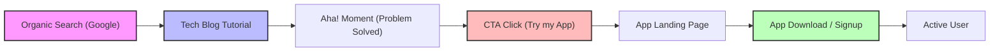
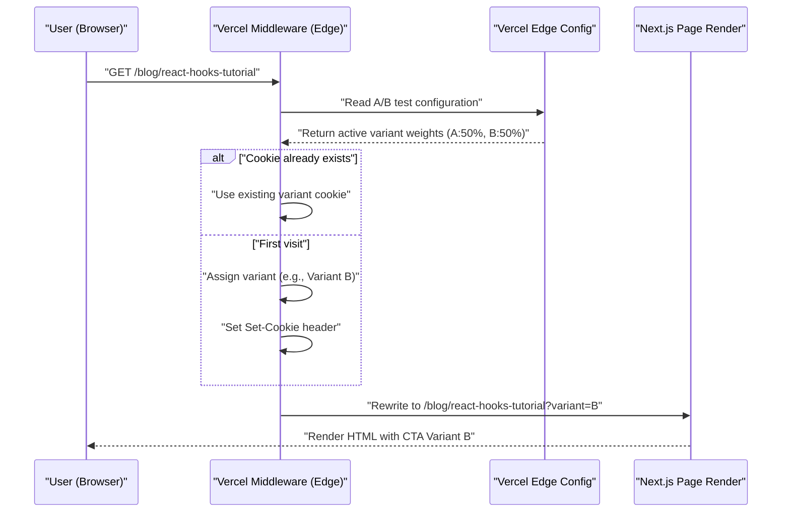

個人開発者として素晴らしいアプリケーションを作り上げた後、多くの人が直面する最大の壁は「誰もそのアプリを知らない」という残酷な現実です。どんなに洗練されたコードベースであっても、どんなに美しいUI/UXであっても、プロモーション戦略が欠如していれば、ユーザーの目に触れることはありません。

現代のインディー開発者（Indie Hacker）にとって、最も強力かつ持続可能なプロモーションチャネルの一つが「技術ブログ」です。単なる開発の備忘録としてではなく、戦略的なインバウンド・マーケティングのエンジンとして技術ブログを機能させる方法について、本記事では技術的な実装（SEOのメタデータ設計、A/Bテストのアーキテクチャ、GA4やPostHogによるトラッキング）から数理的な評価モデルまで、非常にディープに解説していきます。

## 1. 技術ブログを「集客装置」に変えるSEO戦略

技術ブログにおけるSEO（検索エンジン最適化）は、単にキーワードを散りばめることではありません。検索エンジン（Googlebot）とソーシャルメディアのクローラーに対して、コンテンツのセマンティクス（意味）を正確に伝達するプログラマティックなアプローチが求められます。

### 1.1 Open Graph Protocol (OGP) の最適化

技術記事がX（旧Twitter）やHacker News、Zennなどでシェアされた際、クリックスルーレート（CTR）を最大化するためには、OGPの動的生成が不可欠です。Next.jsのApp Routerを使用している場合、`generateMetadata`関数を用いて記事ごとに最適化されたOGPを出力します。

```typescript
// app/blog/[slug]/page.tsx
import { Metadata } from 'next';

export async function generateMetadata({ params }: { params: { slug: string } }): Promise<Metadata> {
  const post = await fetchPostBySlug(params.slug);
  
  return {
    title: `${post.title} | My Indie App Dev Blog`,
    description: post.excerpt,
    openGraph: {
      title: post.title,
      description: post.excerpt,
      url: `https://example.com/blog/${params.slug}`,
      siteName: 'Indie Dev Blog',
      images: [
        {
          url: `https://example.com/api/og?title=${encodeURIComponent(post.title)}`,
          width: 1200,
          height: 630,
          alt: post.title,
        },
      ],
      locale: 'ja_JP',
      type: 'article',
      authors: ['Kenji'],
    },
    twitter: {
      card: 'summary_large_image',
      title: post.title,
      description: post.excerpt,
      creator: '@kenjinote',
    },
  };
}
```

### 1.2 JSON-LDを用いた構造化データの実装

検索エンジンに対して「これは技術記事であり、同時にソフトウェアアプリのプロモーションである」という文脈を伝えるために、JSON-LD（JavaScript Object Notation for Linked Data）を用いた構造化データをページに埋め込みます。`Article`スキーマだけでなく、アプリのランディングページへのリンクを持つ`SoftwareApplication`スキーマを組み合わせることで、リッチリザルトの獲得を目指します。

```tsx
// app/blog/[slug]/page.tsx (コンポーネント内)
const jsonLd = {
  "@context": "https://schema.org",
  "@graph": [
    {
      "@type": "TechArticle",
      "headline": post.title,
      "image": [
        `https://example.com/api/og?title=${encodeURIComponent(post.title)}`
      ],
      "datePublished": post.publishedAt,
      "dateModified": post.updatedAt,
      "author": [{
          "@type": "Person",
          "name": "Kenji",
          "url": "https://example.com/about"
      }]
    },
    {
      "@type": "SoftwareApplication",
      "name": "My Awesome App",
      "operatingSystem": "Windows, macOS, Linux",
      "applicationCategory": "DeveloperApplication",
      "offers": {
        "@type": "Offer",
        "price": "0",
        "priceCurrency": "USD"
      }
    }
  ]
};

export default function BlogPost({ params }) {
  return (
    <article>
      <script
        type="application/ld+json"
        dangerouslySetInnerHTML={{ __html: JSON.stringify(jsonLd) }}
      />
      {/* 記事の本文が続く */}
    </article>
  );
}
```

この実装により、Googleは単なるテキストデータとしてではなく、エンティティの集合としてページを解釈し、特定の技術的な課題を解決するためのソフトウェアツールが紹介されていることを理解します。

## 2. チュートリアルからコンバージョンへのファネル設計

技術ブログの読者は、特定のエラーメッセージや技術的な課題（例：「React Context API パフォーマンス 最適化」）を検索して流入します。彼らの「検索意図（Search Intent）」を満たした直後に、自然な形でアプリへのCTA（Call to Action）を配置することが重要です。

### 2.1 ユーザージャーニーの可視化

読者がオーガニック検索からアプリのインストール、そしてアクティブユーザーになるまでの理想的なファネルを以下に示します。



例えば、「Reduxのボイラープレートを減らす方法」という記事の最後に、「もしあなたが状態管理の複雑さに悩んでいるなら、私が開発した新しい状態管理可視化ツール『StateViewer』を試してみてください」というコンテキストに沿ったCTAを配置します。

### 2.2 コンバージョン率の数理モデル

ブログを通じたマーケティングの成果は、以下のコンバージョン率（Conversion Rate: $CR$）の数式で評価されます。

$$ CR_{overall} = \frac{N_{active\_users}}{N_{blog\_visitors}} \times 100 $$

ファネルを分解すると、全体のコンバージョン率は各ステップの遷移率の積として表すことができます。

$$ CR_{overall} = P(CTA|Visit) \times P(Install|CTA) \times P(Active|Install) $$

ここで、$P(CTA|Visit)$ はブログ訪問者がCTAをクリックする確率です。技術ブログのコンバージョン率を上げるための最大のレバレッジポイントは、この $P(CTA|Visit)$ を最大化することにあります。これを最適化するために、次のセクションで解説するA/Bテストを導入します。

## 3. Vercel Edge Configを用いたエッジでのA/Bテスト実装

CTAの文言やデザイン、配置場所を直感で決めてはいけません。データに基づいた意思決定を行うために、A/Bテストを実施します。フロントエンドでのクライアントサイドのA/Bテストは「フリッカー現象（画面のちらつき）」を引き起こすため、Vercel Edge MiddlewareとEdge Configを用いて、エッジネットワーク上で高速にリクエストを振り分けるアーキテクチャを採用します。

### 3.1 エッジA/Bテストのアーキテクチャ

以下のシーケンス図は、Vercelのエッジインフラストラクチャを活用したA/Bテストのフローを示しています。



### 3.2 Middlewareの実装コード

Edge Configを利用することで、デプロイし直すことなくミリ秒単位でA/Bテストのフラグを切り替えることが可能です。

```typescript
// middleware.ts
import { NextResponse } from 'next/server';
import type { NextRequest } from 'next/server';
import { get } from '@vercel/edge-config';

export const config = {
  matcher: '/blog/:slug*',
};

export async function middleware(request: NextRequest) {
  // Edge Configから現在アクティブなA/Bテストのバリアントを取得
  const ctaExperiment = await get('cta_experiment_v1');
  let variant = request.cookies.get('cta_variant')?.value;

  // バリアントが未割り当ての場合、ランダムに割り当てる
  if (!variant && ctaExperiment?.active) {
    variant = Math.random() < 0.5 ? 'A' : 'B';
  }

  // Rewrite先のURLを構築
  const url = request.nextUrl.clone();
  if (variant) {
    url.searchParams.set('variant', variant);
  }

  const response = NextResponse.rewrite(url);

  // Cookieに保存して、同一ユーザーには同じバリアントを表示
  if (variant && !request.cookies.has('cta_variant')) {
    response.cookies.set('cta_variant', variant, {
      maxAge: 60 * 60 * 24 * 30, // 30 days
      path: '/',
      sameSite: 'lax',
    });
  }

  return response;
}
```

ブログのページコンポーネント側では、`searchParams.variant` を受け取り、それに応じて「控えめなテキストリンク（A）」にするか、「目立つグラフィカルなバナー（B）」にするかをレンダリングします。

## 4. データ主導のグロースハック：GA4とPostHogの実装

A/Bテストを実施し、ユーザーをアプリのランディングページへと誘導した後は、その効果を精密に測定する必要があります。ページビューだけを追う時代は終わりました。現在求められているのは「イベントベース」のトラッキングと、ユーザーのプロダクト内での行動を紐づけるプロダクトアナリティクスです。

### 4.1 Google Analytics 4 (GA4) によるイベントトラッキング

GA4は従来のセッションベースからイベントベースのデータモデルへと移行しました。ブログ記事内の特定のCTAがクリックされた瞬間を捉えるために、カスタムイベントを発火させます。

```typescript
// components/CallToAction.tsx
'use client';

export default function CallToAction({ variant, appUrl }) {
  const handleCTAClick = () => {
    // GA4のdataLayerにイベントをプッシュ
    if (typeof window !== 'undefined' && window.gtag) {
      window.gtag('event', 'generate_lead', {
        event_category: 'engagement',
        event_label: 'blog_bottom_cta',
        value: 1,
        ab_variant: variant,
      });
    }
  };

  return (
    <div className={`cta-container ${variant}`}>
      <h3>私の開発したアプリを試してみませんか？</h3>
      <a href={appUrl} onClick={handleCTAClick} className="btn-primary">
        今すぐダウンロード
      </a>
    </div>
  );
}
```

### 4.2 PostHogを用いたプロダクトアナリティクス

GA4はWebサイトのトラフィック分析には優れていますが、「ブログから流入したユーザーが、実際にアプリをインストールし、1週間後に継続して利用しているか（リテンション）」を追跡するには、PostHogのようなオープンソースベースのプロダクトアナリティクスツールが適しています。

PostHogを導入することで、フロントエンド（ブログ）からバックエンド（アプリのAPI）までの一連の行動を一つのユーザーIDで串刺しにして分析できます。

```typescript
// PostHogの初期化とイベントトラッキング例
import posthog from 'posthog-js';

// クライアントサイドでの初期化
if (typeof window !== 'undefined') {
  posthog.init('phc_YOUR_PROJECT_API_KEY', {
    api_host: 'https://app.posthog.com',
    loaded: (posthog) => {
      if (process.env.NODE_ENV === 'development') posthog.debug();
    }
  });
}

// CTAクリック時のトラッキング
export const trackAppDownload = (sourceId: string, variant: string) => {
  posthog.capture('app_download_clicked', {
    source_article: sourceId,
    ab_test_variant: variant,
    timestamp: new Date().toISOString()
  });
};
```

PostHogの強力な「Funnel」機能を使えば、「ブログ閲覧 -> CTAクリック -> サインアップ -> 最初のコアアクション実行」というステップごとのドロップオフ率を視覚化でき、どこにボトルネックがあるのかを一目で把握できます。

### 4.3 ユニットエコノミクス（LTVとCAC）の評価

最終的に、技術ブログの執筆にかかる時間コスト（または外部ライターへの外注費）が、ビジネスとして成立しているかを数学的に評価する必要があります。ここで重要になるのが、顧客獲得単価（CAC: Customer Acquisition Cost）と顧客生涯価値（LTV: Lifetime Value）の関係です。

CACは次のように計算されます。技術ブログの場合、直接的な広告費はゼロかもしれませんが、執筆にかかった「労働時間 × あなたの時給」をコストとして計上すべきです。

$$ CAC = \frac{Total\_Cost\_of\_Content\_Creation}{Total\_Customers\_Acquired} $$

一方、サブスクリプション型の個人アプリであれば、LTVはARPU（Average Revenue Per User: ユーザー1人あたりの平均売上）とチャーンレート（解約率）から算出されます。粗利率（Gross Margin）を掛け合わせることで、より正確な利益ベースのLTVが出ます。

$$ LTV = ARPU \times \frac{1}{Churn\_Rate} \times Gross\_Margin $$

健全なSaaSビジネス、あるいはインディーアプリのグロースを維持するための黄金律（ユニットエコノミクスの健全性）は以下の不等式を満たすことです。

$$ \frac{LTV}{CAC} > 3 $$

技術ブログは、一度質の高い記事をインデックスさせれば、長期間にわたって検索エンジンからオーガニックなトラフィックを生み出し続けます。つまり、時間が経つにつれて獲得ユーザー数（分母）が増加し、$CAC$ が極限までゼロに近づいていくという強力な複利効果（レバレッジ）を持っています。これが、資金力のない個人開発者にとって技術ブログが最強のプロモーション武器となる最大の理由です。

## 5. 結論

本記事では、単なる「日記」としての技術ブログを、高度に最適化された「アプリ集客の自動化エンジン」へと昇華させるための技術的戦略を解説しました。

1. **SEOと構造化データ**: OGPとJSON-LDを用いて、クローラーにコンテンツの真価を正確に伝達する。
2. **ファネル設計**: 読者の技術的なペインポイントを解決した直後に、最も関連性の高いCTAを提示する。
3. **エッジA/Bテスト**: Vercel Edge Configを活用し、パフォーマンスを犠牲にすることなく最適なUIを模索する。
4. **精密なアナリティクス**: GA4とPostHogを組み合わせ、PVではなく「コンバージョン」と「リテンション」を追跡し、LTV/CAC比率を健全に保つ。

素晴らしいプロダクトを作ることは、成功の半分に過ぎません。残りの半分は、それを必要としている人々の手に届けるための「エンジニアリングとしてのマーケティング」です。技術ブログを単なるアウトプットの場として終わらせず、あなたのアプリの持続的な成長を支える最大の資産へと育て上げていきましょう。
