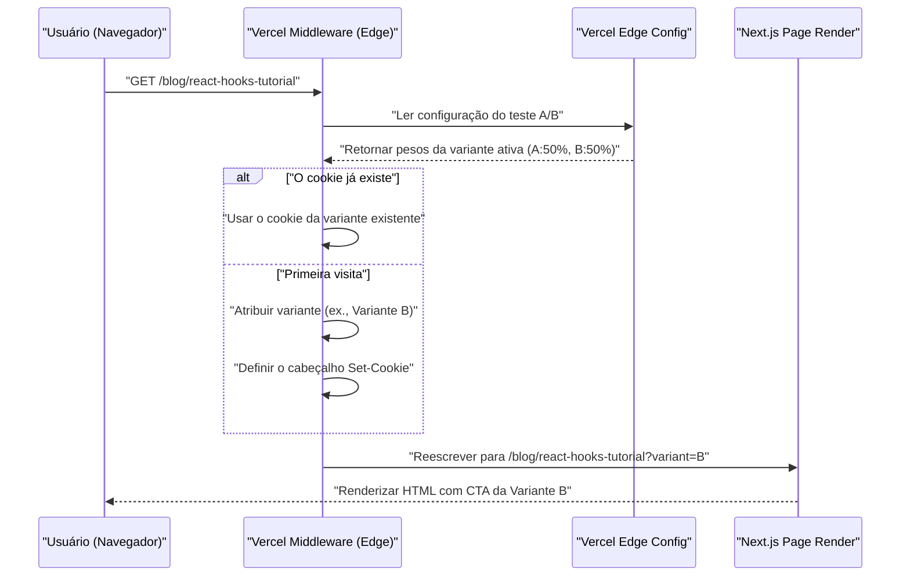

Após criar um aplicativo incrível como desenvolvedor independente, o maior obstáculo que muitos enfrentam é a cruel realidade de que "ninguém conhece o aplicativo". Não importa quão refinada seja a base de código ou quão bela seja a UI/UX, sem uma estratégia de promoção, ele nunca chegará aos olhos dos usuários.

Para os desenvolvedores indie modernos (Indie Hackers), um dos canais de promoção mais poderosos e sustentáveis é o "blog de tecnologia". Este artigo explicará profundamente como fazer um blog de tecnologia funcionar como um mecanismo estratégico de inbound marketing, em vez de um mero registro de desenvolvimento. Abordaremos desde a implementação técnica (design de metadados de SEO, arquitetura de testes A/B, rastreamento via GA4 e PostHog) até modelos matemáticos de avaliação.

## 1. Estratégia de SEO para Transformar seu Blog de Tecnologia em uma "Máquina de Atração de Clientes"

O SEO (Otimização para Mecanismos de Busca) em um blog de tecnologia não se trata apenas de espalhar palavras-chave. É necessária uma abordagem programática para transmitir com precisão a semântica (significado) do conteúdo aos mecanismos de busca (Googlebot) e aos rastreadores de mídias sociais.

### 1.1 Otimização do Open Graph Protocol (OGP)

Quando artigos técnicos são compartilhados no X (antigo Twitter), Hacker News, Zenn, etc., a geração dinâmica de OGP é essencial para maximizar a taxa de cliques (CTR). Se você estiver usando o App Router do Next.js, poderá usar a função `generateMetadata` para gerar um OGP otimizado para cada artigo.

```typescript
// app/blog/[slug]/page.tsx
import { Metadata } from 'next';

export async function generateMetadata({ params }: { params: { slug: string } }): Promise<Metadata> {
  const post = await fetchPostBySlug(params.slug);
  
  return {
    title: `${post.title} | My Indie App Dev Blog`,
    description: post.excerpt,
    openGraph: {
      title: post.title,
      description: post.excerpt,
      url: `https://example.com/blog/${params.slug}`,
      siteName: 'Indie Dev Blog',
      images: [
        {
          url: `https://example.com/api/og?title=${encodeURIComponent(post.title)}`,
          width: 1200,
          height: 630,
          alt: post.title,
        },
      ],
      locale: 'ja_JP',
      type: 'article',
      authors: ['Kenji'],
    },
    twitter: {
      card: 'summary_large_image',
      title: post.title,
      description: post.excerpt,
      creator: '@kenjinote',
    },
  };
}
```

### 1.2 Implementação de Dados Estruturados usando JSON-LD

Para comunicar o contexto aos mecanismos de busca de que "este é um artigo técnico e, ao mesmo tempo, uma promoção para um aplicativo de software", incorporamos dados estruturados na página usando JSON-LD (JavaScript Object Notation for Linked Data). Ao combinar não apenas o esquema `Article`, mas também o esquema `SoftwareApplication` que contém um link para a landing page do aplicativo, nosso objetivo é alcançar rich results (resultados de pesquisa aprimorados).

```tsx
// app/blog/[slug]/page.tsx (no componente)
const jsonLd = {
  "@context": "https://schema.org",
  "@graph": [
    {
      "@type": "TechArticle",
      "headline": post.title,
      "image": [
        `https://example.com/api/og?title=${encodeURIComponent(post.title)}`
      ],
      "datePublished": post.publishedAt,
      "dateModified": post.updatedAt,
      "author": [{
          "@type": "Person",
          "name": "Kenji",
          "url": "https://example.com/about"
      }]
    },
    {
      "@type": "SoftwareApplication",
      "name": "My Awesome App",
      "operatingSystem": "Windows, macOS, Linux",
      "applicationCategory": "DeveloperApplication",
      "offers": {
        "@type": "Offer",
        "price": "0",
        "priceCurrency": "USD"
      }
    }
  ]
};

export default function BlogPost({ params }) {
  return (
    <article>
      <script
        type="application/ld+json"
        dangerouslySetInnerHTML={{ __html: JSON.stringify(jsonLd) }}
      />
      {/* O corpo do artigo continua */}
    </article>
  );
}
```

Com essa implementação, o Google interpreta a página não apenas como dados de texto simples, mas como um conjunto de entidades, e entende que uma ferramenta de software para resolver problemas técnicos específicos está sendo apresentada.

## 2. Design do Funil: Do Tutorial à Conversão

Os leitores de um blog de tecnologia chegam pesquisando mensagens de erro específicas ou desafios técnicos (ex: "otimização de desempenho React Context API"). Logo após satisfazer sua "Intenção de Busca" (Search Intent), é importante colocar um CTA (Call to Action) para o seu aplicativo de forma natural.

### 2.1 Visualização da Jornada do Usuário

O funil ideal desde que um leitor vem da busca orgânica, instala o aplicativo e se torna um usuário ativo é mostrado abaixo.

```mermaid
flowchart LR
    A["Busca Orgânica (Google)"] --> B["Tutorial de Blog de Tecnologia"]
    B --> C["Momento Aha! (Problema Resolvido)"]
    C --> D["Clique no CTA (Experimente meu App)"]
    D --> E["Landing Page do App"]
    E --> F["Download do App / Cadastro"]
    F --> G["Usuário Ativo"]
    
    style A fill:#f9f,stroke:#333,stroke-width:2px
    style B fill:#bbf,stroke:#333,stroke-width:2px
    style D fill:#fbb,stroke:#333,stroke-width:2px
    style F fill:#bfb,stroke:#333,stroke-width:2px
```



Por exemplo, no final de um artigo intitulado "Como Reduzir o Boilerplate do Redux", você pode colocar um CTA contextualmente relevante, como "Se você está com dificuldades com a complexidade do gerenciamento de estado, experimente o 'StateViewer', uma nova ferramenta de visualização de gerenciamento de estado que eu desenvolvi".

### 2.2 Modelo Matemático da Taxa de Conversão

O resultado do marketing através de um blog é avaliado pela seguinte fórmula de Taxa de Conversão (Conversion Rate: $CR$).

$$ CR_{overall} = \frac{N_{active\_users}}{N_{blog\_visitors}} \times 100 $$

Ao decompor o funil, a taxa de conversão geral pode ser expressa como o produto das taxas de transição de cada etapa.

$$ CR_{overall} = P(CTA|Visit) \times P(Install|CTA) \times P(Active|Install) $$

Aqui, $P(CTA|Visit)$ é a probabilidade de um visitante do blog clicar no CTA. O maior ponto de alavancagem para aumentar a taxa de conversão de um blog de tecnologia está em maximizar este $P(CTA|Visit)$. Para otimizar isso, implementaremos testes A/B, conforme explicado na próxima seção.

## 3. Implementação de Testes A/B na Edge Usando Vercel Edge Config

A redação, o design e o posicionamento do CTA não devem ser decididos apenas por intuição. Para tomar decisões baseadas em dados, realizaremos testes A/B. Como os testes A/B no lado do cliente (frontend) podem causar "flicker" (cintilação na tela), adotaremos uma arquitetura que roteia requisições rapidamente na rede edge usando o Vercel Edge Middleware e o Edge Config.

### 3.1 Arquitetura do Teste A/B na Edge

O diagrama de sequência abaixo mostra o fluxo de um teste A/B utilizando a infraestrutura edge da Vercel.



### 3.2 Código de Implementação do Middleware

Ao usar o Edge Config, é possível alternar as flags do teste A/B em questão de milissegundos, sem precisar refazer o deploy.

```typescript
// middleware.ts
import { NextResponse } from 'next/server';
import type { NextRequest } from 'next/server';
import { get } from '@vercel/edge-config';

export const config = {
  matcher: '/blog/:slug*',
};

export async function middleware(request: NextRequest) {
  // Obter a variante ativa do teste A/B a partir do Edge Config
  const ctaExperiment = await get('cta_experiment_v1');
  let variant = request.cookies.get('cta_variant')?.value;

  // Se a variante não estiver atribuída, atribuir aleatoriamente
  if (!variant && ctaExperiment?.active) {
    variant = Math.random() < 0.5 ? 'A' : 'B';
  }

  // Construir a URL para o rewrite
  const url = request.nextUrl.clone();
  if (variant) {
    url.searchParams.set('variant', variant);
  }

  const response = NextResponse.rewrite(url);

  // Salvar no Cookie para mostrar a mesma variante para o mesmo usuário
  if (variant && !request.cookies.has('cta_variant')) {
    response.cookies.set('cta_variant', variant, {
      maxAge: 60 * 60 * 24 * 30, // 30 days
      path: '/',
      sameSite: 'lax',
    });
  }

  return response;
}
```

No lado do componente da página do blog, recebemos `searchParams.variant` e, com base nisso, renderizamos um "link de texto discreto (A)" ou um "banner gráfico chamativo (B)".

## 4. Growth Hacking Orientado por Dados: Implementação de GA4 e PostHog

Depois de realizar testes A/B e guiar os usuários para a landing page do seu aplicativo, é necessário medir o impacto disso com precisão. A era de rastrear apenas visualizações de página já passou. O que é necessário hoje é o rastreamento "baseado em eventos" e a análise de produtos (product analytics) que vincula o comportamento do usuário dentro do produto.

### 4.1 Rastreamento de Eventos com o Google Analytics 4 (GA4)

O GA4 fez a transição do modelo de dados tradicional baseado em sessão para um modelo baseado em eventos. Para capturar o momento exato em que um CTA específico é clicado dentro de um post no blog, disparamos um evento customizado.

```typescript
// components/CallToAction.tsx
'use client';

export default function CallToAction({ variant, appUrl }) {
  const handleCTAClick = () => {
    // Enviar evento para a dataLayer do GA4
    if (typeof window !== 'undefined' && window.gtag) {
      window.gtag('event', 'generate_lead', {
        event_category: 'engagement',
        event_label: 'blog_bottom_cta',
        value: 1,
        ab_variant: variant,
      });
    }
  };

  return (
    <div className={`cta-container ${variant}`}>
      <h3>Gostaria de experimentar o aplicativo que desenvolvi?</h3>
      <a href={appUrl} onClick={handleCTAClick} className="btn-primary">
        Baixe Agora
      </a>
    </div>
  );
}
```

### 4.2 Análise de Produto Usando o PostHog

Embora o GA4 seja excelente para análise de tráfego de sites, para rastrear se "os usuários que chegaram através do blog realmente instalaram o aplicativo e continuam a usá-lo uma semana depois (retenção)", uma ferramenta de análise de produtos de código aberto como o PostHog é mais apropriada.

Ao introduzir o PostHog, você pode unificar e analisar uma série de ações do frontend (blog) ao backend (API do aplicativo) usando um único ID de usuário.

```typescript
// Exemplo de inicialização do PostHog e rastreamento de eventos
import posthog from 'posthog-js';

// Inicialização no lado do cliente
if (typeof window !== 'undefined') {
  posthog.init('phc_YOUR_PROJECT_API_KEY', {
    api_host: 'https://app.posthog.com',
    loaded: (posthog) => {
      if (process.env.NODE_ENV === 'development') posthog.debug();
    }
  });
}

// Rastreamento ao clicar no CTA
export const trackAppDownload = (sourceId: string, variant: string) => {
  posthog.capture('app_download_clicked', {
    source_article: sourceId,
    ab_test_variant: variant,
    timestamp: new Date().toISOString()
  });
};
```

Usando o poderoso recurso "Funnel" (Funil) do PostHog, você pode visualizar a taxa de abandono (drop-off) em cada etapa — "Visualização do Blog -> Clique no CTA -> Cadastro -> Execução da Primeira Ação Principal" — e identificar gargalos rapidamente.

### 4.3 Avaliando a Economia Unitária (LTV e CAC)

Por fim, é necessário avaliar matematicamente se o custo de tempo gasto escrevendo para o blog de tecnologia (ou os custos de terceirização para escritores externos) é viável como um negócio. O importante aqui é a relação entre o Custo de Aquisição de Clientes (CAC) e o Valor do Ciclo de Vida do Cliente (LTV).

O CAC é calculado da seguinte forma. No caso de um blog de tecnologia, os custos diretos com publicidade podem ser zero, mas você deve contabilizar como custo "Horas trabalhadas × Sua taxa horária" gastas escrevendo.

$$ CAC = \frac{Total\_Cost\_of\_Content\_Creation}{Total\_Customers\_Acquired} $$

Por outro lado, no caso de um aplicativo indie baseado em assinatura, o LTV é calculado a partir da ARPU (Average Revenue Per User: Receita Média por Usuário) e a Taxa de Churn (Taxa de Cancelamento). Ao multiplicar pela Margem Bruta (Gross Margin), obtém-se um LTV baseado em lucro mais preciso.

$$ LTV = ARPU \times \frac{1}{Churn\_Rate} \times Gross\_Margin $$

A regra de ouro (saúde da economia unitária) para manter um negócio de SaaS saudável ou o crescimento de um aplicativo indie é satisfazer a seguinte desigualdade.

$$ \frac{LTV}{CAC} > 3 $$

Uma vez que artigos de alta qualidade estejam indexados, um blog de tecnologia continuará a gerar tráfego orgânico de mecanismos de busca por um longo tempo. Em outras palavras, à medida que o tempo passa, o número de usuários adquiridos (o denominador) aumenta e o $CAC$ se aproxima assintoticamente de zero — este é um poderoso efeito de juros compostos (alavancagem). Esta é a principal razão pela qual um blog de tecnologia é a arma de promoção mais poderosa para desenvolvedores independentes com capital limitado.

## 5. Conclusão

Neste artigo, explicamos estratégias técnicas para elevar um blog de tecnologia de um simples "diário" para uma ferramenta altamente otimizada, um "mecanismo automatizado de atração de clientes para aplicativos".

1. **SEO e Dados Estruturados**: Usando OGP e JSON-LD para comunicar com precisão o verdadeiro valor do conteúdo aos rastreadores.
2. **Design de Funil**: Apresentar o CTA mais relevante logo após resolver os pontos de dor (pain points) técnicos do leitor.
3. **Testes A/B na Edge**: Utilizar o Vercel Edge Config para explorar a UI ideal sem sacrificar o desempenho.
4. **Análises Precisas**: Combinar o GA4 e o PostHog para rastrear "conversões" e "retenção" em vez de apenas visualizações de página (PV), e manter uma relação LTV/CAC saudável.

Construir um ótimo produto é apenas metade do caminho para o sucesso. A outra metade é "o marketing como engenharia" — para entregá-lo nas mãos daqueles que precisam dele. Não deixe que o seu blog de tecnologia acabe sendo apenas um espaço para produzir conteúdo; cultive-o para ser o maior ativo de suporte ao crescimento contínuo do seu aplicativo.
