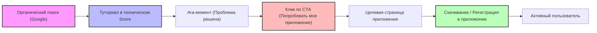
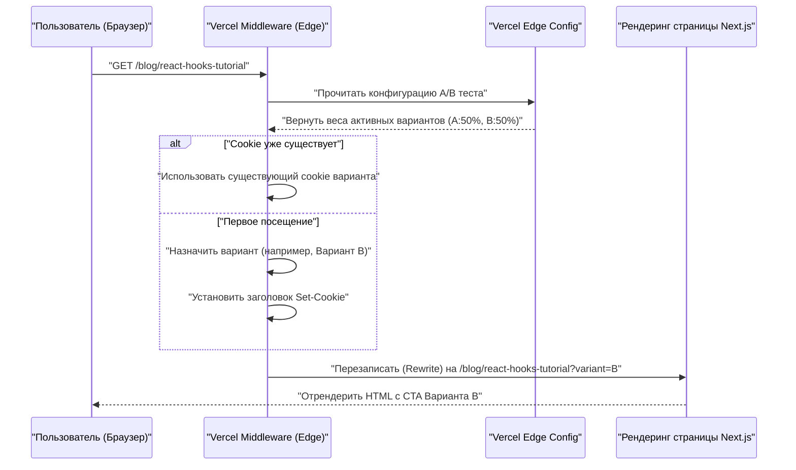

Для многих независимых разработчиков после создания отличного приложения самым большим препятствием становится жестокая реальность: "никто не знает об этом приложении". Каким бы совершенным ни был ваш код или насколько красивым ни был бы UI/UX, без стратегии продвижения ваше приложение никогда не увидит свет.

Для современного инди-разработчика (Indie Hacker) одним из самых мощных и устойчивых каналов продвижения является "технический блог". В этой статье мы подробно рассмотрим, как заставить технический блог работать в качестве механизма стратегического входящего маркетинга, а не просто как блокнот для заметок о разработке. Мы обсудим техническую реализацию (проектирование SEO-метаданных, архитектуру A/B-тестирования, отслеживание с помощью GA4 и PostHog), а также математические модели оценки.

## 1. SEO-стратегия для превращения технического блога в "машину по привлечению трафика"

SEO (поисковая оптимизация) для технического блога — это не просто расстановка ключевых слов. Требуется программный подход для точной передачи семантики (смысла) вашего контента поисковым системам (Googlebot) и краулерам социальных сетей.

### 1.1 Оптимизация Open Graph Protocol (OGP)

Для максимизации кликабельности (CTR), когда вашей технической статьей делятся в X (бывший Twitter), Hacker News, Zenn и т.д., динамическая генерация OGP просто необходима. При использовании App Router в Next.js используйте функцию `generateMetadata` для вывода оптимизированного OGP для каждой статьи.

```typescript
// app/blog/[slug]/page.tsx
import { Metadata } from 'next';

export async function generateMetadata({ params }: { params: { slug: string } }): Promise<Metadata> {
  const post = await fetchPostBySlug(params.slug);
  
  return {
    title: `${post.title} | My Indie App Dev Blog`,
    description: post.excerpt,
    openGraph: {
      title: post.title,
      description: post.excerpt,
      url: `https://example.com/blog/${params.slug}`,
      siteName: 'Indie Dev Blog',
      images: [
        {
          url: `https://example.com/api/og?title=${encodeURIComponent(post.title)}`,
          width: 1200,
          height: 630,
          alt: post.title,
        },
      ],
      locale: 'ja_JP',
      type: 'article',
      authors: ['Kenji'],
    },
    twitter: {
      card: 'summary_large_image',
      title: post.title,
      description: post.excerpt,
      creator: '@kenjinote',
    },
  };
}
```

### 1.2 Внедрение структурированных данных с использованием JSON-LD

Чтобы сообщить поисковым системам контекст: "это техническая статья, и в то же время продвижение программного приложения", мы встраиваем на страницу структурированные данные, используя JSON-LD (JavaScript Object Notation for Linked Data). Объединяя схему `Article` со схемой `SoftwareApplication`, которая содержит ссылку на целевую страницу приложения, мы стремимся получить расширенные результаты (rich results).

```tsx
// app/blog/[slug]/page.tsx (внутри компонента)
const jsonLd = {
  "@context": "https://schema.org",
  "@graph": [
    {
      "@type": "TechArticle",
      "headline": post.title,
      "image": [
        `https://example.com/api/og?title=${encodeURIComponent(post.title)}`
      ],
      "datePublished": post.publishedAt,
      "dateModified": post.updatedAt,
      "author": [{
          "@type": "Person",
          "name": "Kenji",
          "url": "https://example.com/about"
      }]
    },
    {
      "@type": "SoftwareApplication",
      "name": "My Awesome App",
      "operatingSystem": "Windows, macOS, Linux",
      "applicationCategory": "DeveloperApplication",
      "offers": {
        "@type": "Offer",
        "price": "0",
        "priceCurrency": "USD"
      }
    }
  ]
};

export default function BlogPost({ params }) {
  return (
    <article>
      <script
        type="application/ld+json"
        dangerouslySetInnerHTML={{ __html: JSON.stringify(jsonLd) }}
      />
      {/* Далее следует текст статьи */}
    </article>
  );
}
```

Благодаря этой реализации Google интерпретирует страницу не просто как текстовые данные, а как набор сущностей, и понимает, что на ней представлен программный инструмент для решения конкретной технической проблемы.

## 2. Проектирование воронки: от туториала к конверсии

Читатели технических блогов приходят из поиска, пытаясь найти решение конкретного сообщения об ошибке или технической проблемы (например, "оптимизация производительности React Context API"). Очень важно естественно разместить призыв к действию (CTA — Call to Action) для вашего приложения сразу после удовлетворения их "поискового намерения" (Search Intent).

### 2.1 Визуализация пути пользователя

Идеальная воронка от органического поиска до установки приложения и становления активным пользователем показана ниже.



Например, в конце статьи "Как уменьшить шаблонный код в Redux" вы можете разместить контекстный CTA: "Если вы страдаете от сложности управления состоянием, попробуйте 'StateViewer', новый инструмент визуализации управления состоянием, который я разработал".

### 2.2 Математическая модель коэффициента конверсии

Результаты маркетинга через блог оцениваются с помощью следующей формулы для коэффициента конверсии (Conversion Rate: $CR$).

$$ CR_{overall} = \frac{N_{active\_users}}{N_{blog\_visitors}} \times 100 $$

Разложив воронку на составляющие, общий коэффициент конверсии можно выразить как произведение коэффициентов перехода на каждом этапе.

$$ CR_{overall} = P(CTA|Visit) \times P(Install|CTA) \times P(Active|Install) $$

Где $P(CTA|Visit)$ — это вероятность того, что посетитель блога кликнет по CTA. Самой мощной точкой приложения усилий для повышения коэффициента конверсии технического блога является максимизация этого $P(CTA|Visit)$. Для оптимизации этого показателя мы внедрим A/B-тестирование, о котором пойдет речь в следующем разделе.

## 3. Реализация A/B-тестирования на Edge с использованием Vercel Edge Config

Вы не должны полагаться на интуицию при выборе текста, дизайна или размещения CTA. Для принятия решений на основе данных необходимо проводить A/B-тестирование. Поскольку A/B-тестирование на стороне клиента во фронтенде вызывает "эффект мерцания" (flicker), мы будем использовать архитектуру, которая быстро распределяет запросы в edge-сети, применяя Vercel Edge Middleware и Edge Config.

### 3.1 Архитектура A/B-тестирования на Edge

Следующая диаграмма последовательности показывает процесс A/B-тестирования с использованием edge-инфраструктуры Vercel.



### 3.2 Код реализации Middleware

Используя Edge Config, можно переключать флаги A/B-тестирования за миллисекунды без необходимости повторного деплоя.

```typescript
// middleware.ts
import { NextResponse } from 'next/server';
import type { NextRequest } from 'next/server';
import { get } from '@vercel/edge-config';

export const config = {
  matcher: '/blog/:slug*',
};

export async function middleware(request: NextRequest) {
  // Получить текущий активный вариант A/B теста из Edge Config
  const ctaExperiment = await get('cta_experiment_v1');
  let variant = request.cookies.get('cta_variant')?.value;

  // Если вариант не назначен, назначаем случайным образом
  if (!variant && ctaExperiment?.active) {
    variant = Math.random() < 0.5 ? 'A' : 'B';
  }

  // Создаем URL для Rewrite
  const url = request.nextUrl.clone();
  if (variant) {
    url.searchParams.set('variant', variant);
  }

  const response = NextResponse.rewrite(url);

  // Сохраняем в Cookie, чтобы показывать один и тот же вариант одному и тому же пользователю
  if (variant && !request.cookies.has('cta_variant')) {
    response.cookies.set('cta_variant', variant, {
      maxAge: 60 * 60 * 24 * 30, // 30 дней
      path: '/',
      sameSite: 'lax',
    });
  }

  return response;
}
```

На стороне компонента страницы блога мы принимаем `searchParams.variant` и на его основе рендерим либо "скромную текстовую ссылку (A)", либо "заметный графический баннер (B)".

## 4. Гроуфхакинг (Growth Hacking) на основе данных: интеграция GA4 и PostHog

После проведения A/B-тестирования и направления пользователей на целевую страницу вашего приложения, необходимо точно измерить его эффективность. Эра отслеживания только просмотров страниц подошла к концу. Сегодня требуется отслеживание на основе событий (event-based) и продуктовая аналитика, которая связывает действия пользователей внутри продукта.

### 4.1 Отслеживание событий с помощью Google Analytics 4 (GA4)

GA4 перешел от традиционной модели на основе сессий к модели данных на основе событий. Чтобы зафиксировать момент клика по конкретному CTA внутри статьи блога, мы инициируем кастомное событие.

```typescript
// components/CallToAction.tsx
'use client';

export default function CallToAction({ variant, appUrl }) {
  const handleCTAClick = () => {
    // Отправляем событие в dataLayer GA4
    if (typeof window !== 'undefined' && window.gtag) {
      window.gtag('event', 'generate_lead', {
        event_category: 'engagement',
        event_label: 'blog_bottom_cta',
        value: 1,
        ab_variant: variant,
      });
    }
  };

  return (
    <div className={`cta-container ${variant}`}>
      <h3>Не хотите попробовать приложение, которое я разработал?</h3>
      <a href={appUrl} onClick={handleCTAClick} className="btn-primary">
        Скачать сейчас
      </a>
    </div>
  );
}
```

### 4.2 Продуктовая аналитика с использованием PostHog

GA4 отлично подходит для анализа трафика веб-сайта, но для отслеживания того, "действительно ли пользователь, пришедший из блога, установил приложение и продолжает использовать его через неделю (retention)", лучше подойдет инструмент продуктовой аналитики на базе open-source, такой как PostHog.

Внедрив PostHog, вы можете анализировать серию действий от фронтенда (блог) до бэкенда (API приложения), связывая их с помощью одного идентификатора пользователя.

```typescript
// Инициализация PostHog и пример отслеживания событий
import posthog from 'posthog-js';

// Инициализация на стороне клиента
if (typeof window !== 'undefined') {
  posthog.init('phc_YOUR_PROJECT_API_KEY', {
    api_host: 'https://app.posthog.com',
    loaded: (posthog) => {
      if (process.env.NODE_ENV === 'development') posthog.debug();
    }
  });
}

// Отслеживание клика по CTA
export const trackAppDownload = (sourceId: string, variant: string) => {
  posthog.capture('app_download_clicked', {
    source_article: sourceId,
    ab_test_variant: variant,
    timestamp: new Date().toISOString()
  });
};
```

С помощью мощной функции "Воронка" (Funnel) в PostHog вы можете визуализировать процент оттока (drop-off rate) на каждом этапе "Просмотр блога -> Клик по CTA -> Регистрация -> Выполнение первого ключевого действия", что позволяет с первого взгляда понять, где находится узкое место (bottleneck).

### 4.3 Оценка юнит-экономики (LTV и CAC)

В конечном итоге вам необходимо математически оценить, окупаются ли затраты времени на написание статей для технического блога (или затраты на привлечение внешних авторов) как бизнес. Здесь ключевым моментом является соотношение между стоимостью привлечения клиента (CAC: Customer Acquisition Cost) и пожизненной ценностью клиента (LTV: Lifetime Value).

CAC рассчитывается следующим образом. В случае с техническим блогом прямые затраты на рекламу могут быть нулевыми, но вы должны учитывать "часы работы × ваша почасовая ставка", затраченные на написание статьи, как затраты.

$$ CAC = \frac{Total\_Cost\_of\_Content\_Creation}{Total\_Customers\_Acquired} $$

С другой стороны, для личного приложения по модели подписки LTV рассчитывается на основе ARPU (Average Revenue Per User: средний доход на пользователя) и коэффициента оттока (Churn Rate). Умножив результат на валовую маржу (Gross Margin), вы получите более точный LTV на основе прибыли.

$$ LTV = ARPU \times \frac{1}{Churn\_Rate} \times Gross\_Margin $$

Золотым правилом для поддержания здорового SaaS-бизнеса или роста инди-приложения (здоровая юнит-экономика) является соблюдение следующего неравенства:

$$ \frac{LTV}{CAC} > 3 $$

Как только качественная статья в техническом блоге проиндексируется, она будет продолжать генерировать органический трафик из поисковых систем в течение длительного периода. Это означает, что с течением времени количество привлеченных пользователей (знаменатель) увеличивается, а $CAC$ стремится к нулю. Это мощный эффект сложных процентов (кредитного плеча), и это главная причина, по которой технический блог является самым сильным оружием продвижения для инди-разработчиков без финансовых ресурсов.

## 5. Заключение

В этой статье мы рассмотрели технические стратегии превращения технического блога из простого "дневника" в высокооптимизированную "систему автоматического привлечения пользователей для приложения".

1. **SEO и структурированные данные**: Использование OGP и JSON-LD для точной передачи истинной ценности контента краулерам.
2. **Проектирование воронки**: Предложение наиболее релевантного CTA сразу после решения технической "боли" читателя.
3. **A/B-тестирование на Edge**: Использование Vercel Edge Config для поиска оптимального пользовательского интерфейса без ущерба для производительности.
4. **Точная аналитика**: Сочетание GA4 и PostHog для отслеживания "конверсии" и "удержания" вместо просмотров страниц (PV), сохраняя здоровое соотношение LTV/CAC.

Создание отличного продукта — это только половина успеха. Вторая половина — это "маркетинг как инженерия", направленный на то, чтобы доставить его в руки людей, которым он нужен. Не позволяйте своему техническому блогу оставаться просто местом для вывода информации; превратите его в свой самый большой актив, который будет поддерживать устойчивый рост вашего приложения.
