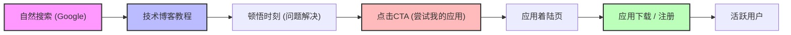
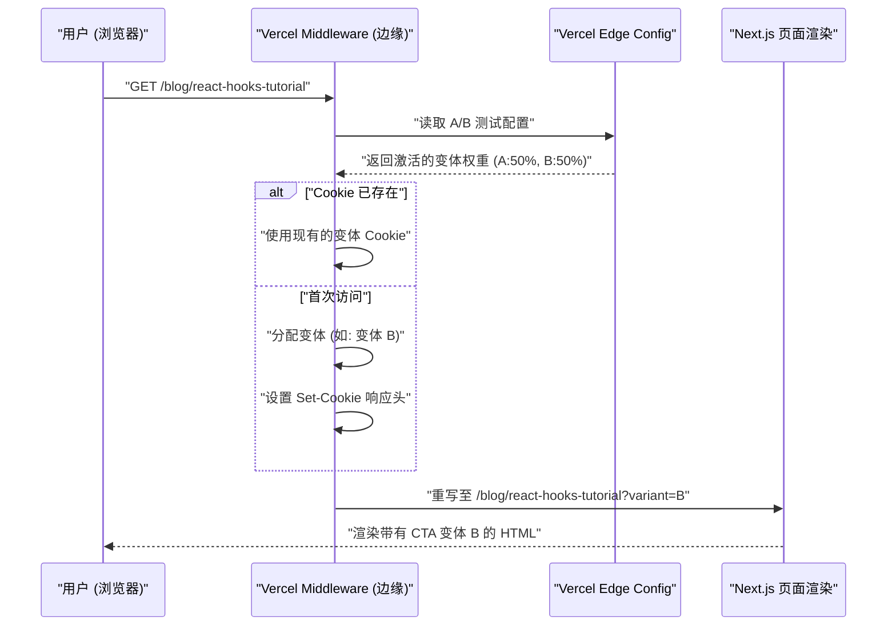

作为个人开发者，在打造出色的应用程序之后，许多人面临的最大障碍是“无人知晓该应用”这一残酷的现实。无论代码库多么精炼，UI/UX 多么精美，如果缺乏推广策略，就不会出现在用户的视野中。

对于现代独立开发者（Indie Hacker）而言，最强大且可持续的推广渠道之一就是“技术博客”。本文将深入探讨如何让技术博客不仅仅作为开发的备忘录，而是作为战略性的集客营销（Inbound Marketing）引擎发挥作用。内容涵盖从技术实现（SEO的元数据设计、A/B测试的架构、基于GA4和PostHog的追踪）到数学评估模型等非常深度的内容。

## 1. 将技术博客转化为“引流机器”的SEO策略

在技术博客中，SEO（搜索引擎优化）不仅仅是堆砌关键字。我们需要一种程序化的方法，向搜索引擎（Googlebot）和社交媒体的爬虫准确传达内容的语义（含义）。

### 1.1 优化 Open Graph Protocol (OGP)

当技术文章在X（原Twitter）、Hacker News或Zenn等平台被分享时，为了最大化点击率（CTR），动态生成OGP是必不可少的。如果使用Next.js的App Router，可以利用`generateMetadata`函数为每篇文章输出优化过的OGP。

```typescript
// app/blog/[slug]/page.tsx
import { Metadata } from 'next';

export async function generateMetadata({ params }: { params: { slug: string } }): Promise<Metadata> {
  const post = await fetchPostBySlug(params.slug);
  
  return {
    title: `${post.title} | My Indie App Dev Blog`,
    description: post.excerpt,
    openGraph: {
      title: post.title,
      description: post.excerpt,
      url: `https://example.com/blog/${params.slug}`,
      siteName: 'Indie Dev Blog',
      images: [
        {
          url: `https://example.com/api/og?title=${encodeURIComponent(post.title)}`,
          width: 1200,
          height: 630,
          alt: post.title,
        },
      ],
      locale: 'ja_JP',
      type: 'article',
      authors: ['Kenji'],
    },
    twitter: {
      card: 'summary_large_image',
      title: post.title,
      description: post.excerpt,
      creator: '@kenjinote',
    },
  };
}
```

### 1.2 使用 JSON-LD 实现结构化数据

为了向搜索引擎传达“这是一篇技术文章，同时也是软件应用的推广”这一上下文，我们需要在页面中嵌入使用JSON-LD（JavaScript Object Notation for Linked Data）的结构化数据。除了`Article`模式之外，通过结合带有应用着陆页链接的`SoftwareApplication`模式，我们的目标是获得富媒体搜索结果（Rich Results）。

```tsx
// app/blog/[slug]/page.tsx (组件内)
const jsonLd = {
  "@context": "https://schema.org",
  "@graph": [
    {
      "@type": "TechArticle",
      "headline": post.title,
      "image": [
        `https://example.com/api/og?title=${encodeURIComponent(post.title)}`
      ],
      "datePublished": post.publishedAt,
      "dateModified": post.updatedAt,
      "author": [{
          "@type": "Person",
          "name": "Kenji",
          "url": "https://example.com/about"
      }]
    },
    {
      "@type": "SoftwareApplication",
      "name": "My Awesome App",
      "operatingSystem": "Windows, macOS, Linux",
      "applicationCategory": "DeveloperApplication",
      "offers": {
        "@type": "Offer",
        "price": "0",
        "priceCurrency": "USD"
      }
    }
  ]
};

export default function BlogPost({ params }) {
  return (
    <article>
      <script
        type="application/ld+json"
        dangerouslySetInnerHTML={{ __html: JSON.stringify(jsonLd) }}
      />
      {/* 文章正文继续 */}
    </article>
  );
}
```

通过这种实现，Google不仅将其作为纯文本数据来解析，而是将页面理解为实体的集合，并理解其中介绍了用于解决特定技术难题的软件工具。

## 2. 从教程到转化（Conversion）的漏斗设计

技术博客的读者通常是通过搜索特定的错误信息或技术难题（例如：“React Context API 性能优化”）引流而来的。在满足他们的“搜索意图（Search Intent）”之后，自然地放置指向应用程序的CTA（Call to Action，行动号召）非常重要。

### 2.1 用户旅程（User Journey）可视化

以下展示了读者从自然搜索（Organic Search）到应用安装，最终成为活跃用户的理想漏斗模型。



例如，在一篇名为“如何减少Redux样板代码”的文章末尾，可以放置一个符合上下文的CTA：“如果你正为状态管理的复杂性而烦恼，不妨试试我开发的新型状态管理可视化工具‘StateViewer’。”

### 2.2 转化率的数学模型

通过博客进行营销的成果，可以通过以下转化率（Conversion Rate: $CR$）公式进行评估。

$$ CR_{overall} = \frac{N_{active\_users}}{N_{blog\_visitors}} \times 100 $$

拆解漏斗后，整体的转化率可以表示为各个步骤转化率的乘积。

$$ CR_{overall} = P(CTA|Visit) \times P(Install|CTA) \times P(Active|Install) $$

在这里，$P(CTA|Visit)$ 是博客访问者点击CTA的概率。提高技术博客转化率的最大杠杆点在于最大化这个 $P(CTA|Visit)$。为了对其进行优化，我们将引入在下一节中解释的A/B测试。

## 3. 使用 Vercel Edge Config 在边缘（Edge）实现 A/B 测试

不能凭直觉来决定CTA的文案、设计或放置位置。为了做出基于数据的决策，我们需要进行A/B测试。前端客户端的A/B测试容易引起“闪烁现象（Flicker）”，因此我们采用 Vercel Edge Middleware 和 Edge Config，利用在边缘网络上高速分发请求的架构。

### 3.1 边缘 A/B 测试的架构

以下序列图展示了利用Vercel边缘基础设施进行A/B测试的流程。



### 3.2 Middleware 的实现代码

利用Edge Config，无需重新部署即可在毫秒级切换A/B测试的标志（Flag）。

```typescript
// middleware.ts
import { NextResponse } from 'next/server';
import type { NextRequest } from 'next/server';
import { get } from '@vercel/edge-config';

export const config = {
  matcher: '/blog/:slug*',
};

export async function middleware(request: NextRequest) {
  // 从 Edge Config 获取当前激活的 A/B 测试变体
  const ctaExperiment = await get('cta_experiment_v1');
  let variant = request.cookies.get('cta_variant')?.value;

  // 如果未分配变体，则随机分配
  if (!variant && ctaExperiment?.active) {
    variant = Math.random() < 0.5 ? 'A' : 'B';
  }

  // 构建 Rewrite 目标的 URL
  const url = request.nextUrl.clone();
  if (variant) {
    url.searchParams.set('variant', variant);
  }

  const response = NextResponse.rewrite(url);

  // 保存到 Cookie 中，确保向同一用户显示相同的变体
  if (variant && !request.cookies.has('cta_variant')) {
    response.cookies.set('cta_variant', variant, {
      maxAge: 60 * 60 * 24 * 30, // 30天
      path: '/',
      sameSite: 'lax',
    });
  }

  return response;
}
```

在博客页面的组件端，接收 `searchParams.variant`，并根据其值来渲染“低调的文本链接（A）”或“醒目的图形横幅（B）”。

## 4. 数据驱动的增长黑客（Growth Hack）：GA4与PostHog的实现

在进行A/B测试并将用户引导至应用的着陆页之后，有必要精确地衡量其效果。只追求页面浏览量（PV）的时代已经结束。现在我们需要的是“基于事件（Event-based）”的追踪，以及将用户在产品内的行为关联起来的产品分析（Product Analytics）。

### 4.1 使用 Google Analytics 4 (GA4) 进行事件追踪

GA4已从传统的基于会话转变为基于事件的数据模型。为了捕捉到博客文章中特定CTA被点击的瞬间，我们将触发自定义事件。

```typescript
// components/CallToAction.tsx
'use client';

export default function CallToAction({ variant, appUrl }) {
  const handleCTAClick = () => {
    // 向 GA4 的 dataLayer 推送事件
    if (typeof window !== 'undefined' && window.gtag) {
      window.gtag('event', 'generate_lead', {
        event_category: 'engagement',
        event_label: 'blog_bottom_cta',
        value: 1,
        ab_variant: variant,
      });
    }
  };

  return (
    <div className={`cta-container ${variant}`}>
      <h3>要不要试试我开发的应用？</h3>
      <a href={appUrl} onClick={handleCTAClick} className="btn-primary">
        立即下载
      </a>
    </div>
  );
}
```

### 4.2 使用 PostHog 进行产品分析

虽然GA4在网站流量分析方面非常优秀，但要追踪“从博客引流来的用户，是否真正安装了应用，并在1周后继续使用（留存率）”，像PostHog这样基于开源的产品分析工具则更为合适。

通过引入PostHog，能够使用一个用户ID将从前端（博客）到后端（应用的API）的一系列行为串联起来进行分析。

```typescript
// PostHog的初始化与事件追踪示例
import posthog from 'posthog-js';

// 客户端初始化
if (typeof window !== 'undefined') {
  posthog.init('phc_YOUR_PROJECT_API_KEY', {
    api_host: 'https://app.posthog.com',
    loaded: (posthog) => {
      if (process.env.NODE_ENV === 'development') posthog.debug();
    }
  });
}

// 点击CTA时的追踪
export const trackAppDownload = (sourceId: string, variant: string) => {
  posthog.capture('app_download_clicked', {
    source_article: sourceId,
    ab_test_variant: variant,
    timestamp: new Date().toISOString()
  });
};
```

借助PostHog强大的“Funnel（漏斗）”功能，我们可以将“博客浏览 -> 点击CTA -> 注册 -> 执行首个核心操作”这每一步的流失率可视化，从而一眼看出瓶颈在哪里。

### 4.3 评估单位经济效益（LTV 与 CAC）

最终，必须在数学上评估撰写技术博客所花费的时间成本（或外包给外部作家的费用）是否能构成一项成立的业务。这里至关重要的是客户获取成本（CAC: Customer Acquisition Cost）与客户终身价值（LTV: Lifetime Value）之间的关系。

CAC的计算方式如下。对于技术博客，直接的广告费用可能为零，但应将写作所耗费的“工作时间 × 你的时薪”计入成本。

$$ CAC = \frac{Total\_Cost\_of\_Content\_Creation}{Total\_Customers\_Acquired} $$

另一方面，如果是订阅制的个人应用，LTV将由ARPU（Average Revenue Per User: 每用户平均收入）和流失率（Churn Rate）计算得出。通过乘以毛利率（Gross Margin），可以得出更准确的基于利润的LTV。

$$ LTV = ARPU \times \frac{1}{Churn\_Rate} \times Gross\_Margin $$

维持健康的SaaS业务，或者说个人应用增长的黄金法则（单位经济效益的健康度），是满足以下不等式：

$$ \frac{LTV}{CAC} > 3 $$

技术博客一旦有高质量的文章被索引，将在很长一段时间内持续从搜索引擎产生自然流量。也就是说，随着时间的推移，获取的用户数量（分母）会增加，$CAC$ 会无限趋近于零，具有强大的复利效应（杠杆）。这也是为什么对于资金匮乏的个人开发者来说，技术博客成为最强推广武器的最大原因。

## 5. 结论

本文讲解了如何将仅仅作为“日记”的技术博客，升华为了高度优化的“应用集客自动化引擎”的技术战略。

1. **SEO与结构化数据**：利用OGP和JSON-LD，向爬虫准确传达内容的真正价值。
2. **漏斗设计**：在解决读者的技术痛点之后，立即展示最相关的CTA。
3. **边缘 A/B 测试**：借助 Vercel Edge Config，在不牺牲性能的前提下探索最佳UI。
4. **精密分析**：结合 GA4 和 PostHog，追踪“转化率”和“留存率”而不是PV，保持健康的 LTV/CAC 比例。

打造出色的产品只完成了成功的一半。剩下的一半则是为了让需要它的人能够获得它，这种“作为工程学的营销”。不要让技术博客仅仅成为一个输出的平台，而是将它培养成支撑你的应用程序持续增长的最大资产吧。
