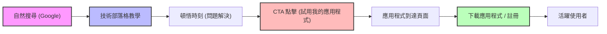
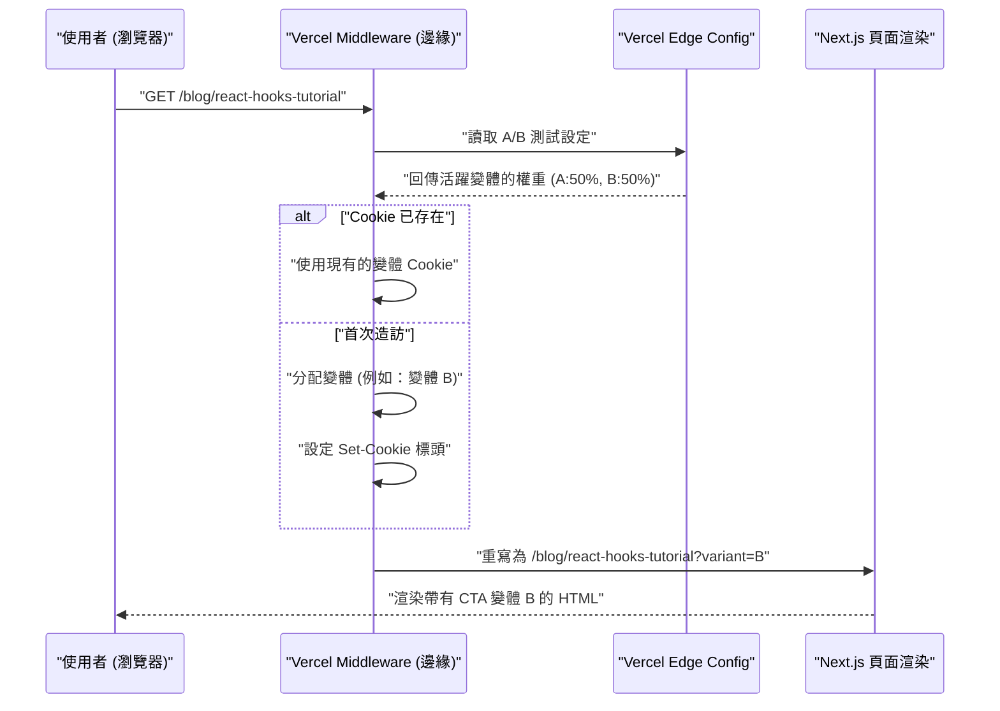

作為個人開發者，在打造出色的應用程式後，許多人面臨的最大障礙是「沒有人知道這個應用程式」的殘酷現實。無論程式碼庫多麼精煉，UI/UX 多麼美觀，如果缺乏推廣策略，就無法進入使用者的視野。

對於現代的獨立開發者 (Indie Hacker) 來說，最有效且可持續的推廣管道之一就是「技術部落格」。這不僅僅是開發備忘錄，更是將技術部落格作為戰略性集客行銷引擎來發揮作用。在本文中，我們將從技術實作（SEO 詮釋資料設計、A/B 測試架構、透過 GA4 和 PostHog 進行追蹤）到數學評估模型，進行非常深入的解說。

## 1. 將技術部落格變成「集客裝置」的 SEO 策略

技術部落格的 SEO (搜尋引擎最佳化) 並不僅僅是散佈關鍵字而已。必須採用程式化的方法，向搜尋引擎 (Googlebot) 和社群媒體爬蟲準確地傳達內容的語義 (semantics)。

### 1.1 Open Graph Protocol (OGP) 最佳化

當技術文章在 X (前 Twitter)、Hacker News 或 Zenn 等平台被分享時，為了將點閱率 (CTR) 最大化，動態生成 OGP 是不可或缺的。如果使用 Next.js 的 App Router，可以透過 `generateMetadata` 函式來為每篇文章輸出最佳化的 OGP。

```typescript
// app/blog/[slug]/page.tsx
import { Metadata } from 'next';

export async function generateMetadata({ params }: { params: { slug: string } }): Promise<Metadata> {
  const post = await fetchPostBySlug(params.slug);
  
  return {
    title: `${post.title} | My Indie App Dev Blog`,
    description: post.excerpt,
    openGraph: {
      title: post.title,
      description: post.excerpt,
      url: `https://example.com/blog/${params.slug}`,
      siteName: 'Indie Dev Blog',
      images: [
        {
          url: `https://example.com/api/og?title=${encodeURIComponent(post.title)}`,
          width: 1200,
          height: 630,
          alt: post.title,
        },
      ],
      locale: 'ja_JP',
      type: 'article',
      authors: ['Kenji'],
    },
    twitter: {
      card: 'summary_large_image',
      title: post.title,
      description: post.excerpt,
      creator: '@kenjinote',
    },
  };
}
```

### 1.2 使用 JSON-LD 實作結構化資料

為了向搜尋引擎傳達「這是一篇技術文章，同時也是軟體應用程式的推廣」這樣的脈絡，我們要在頁面中嵌入使用 JSON-LD (JavaScript Object Notation for Linked Data) 的結構化資料。除了 `Article` 結構描述 (schema) 之外，結合包含應用程式到達頁面 (landing page) 連結的 `SoftwareApplication` 結構描述，以爭取獲得複合式搜尋結果 (rich results)。

```tsx
// app/blog/[slug]/page.tsx (元件內)
const jsonLd = {
  "@context": "https://schema.org",
  "@graph": [
    {
      "@type": "TechArticle",
      "headline": post.title,
      "image": [
        `https://example.com/api/og?title=${encodeURIComponent(post.title)}`
      ],
      "datePublished": post.publishedAt,
      "dateModified": post.updatedAt,
      "author": [{
          "@type": "Person",
          "name": "Kenji",
          "url": "https://example.com/about"
      }]
    },
    {
      "@type": "SoftwareApplication",
      "name": "My Awesome App",
      "operatingSystem": "Windows, macOS, Linux",
      "applicationCategory": "DeveloperApplication",
      "offers": {
        "@type": "Offer",
        "price": "0",
        "priceCurrency": "USD"
      }
    }
  ]
};

export default function BlogPost({ params }) {
  return (
    <article>
      <script
        type="application/ld+json"
        dangerouslySetInnerHTML={{ __html: JSON.stringify(jsonLd) }}
      />
      {/* 文章本文接續在此 */}
    </article>
  );
}
```

透過這個實作，Google 會將頁面解讀為實體 (entities) 的集合，而不僅僅是純文字資料，並了解其中介紹了為了解決特定技術問題的軟體工具。

## 2. 從教學到轉換的漏斗設計

技術部落格的讀者是透過搜尋特定的錯誤訊息或技術問題 (例如：「React Context API 效能 最佳化」) 而來的。在滿足了他們的「搜尋意圖 (Search Intent)」之後，以自然的方式放置應用程式的 CTA (行動呼籲, Call to Action) 是非常重要的。

### 2.1 使用者旅程視覺化

以下展示讀者從自然搜尋到安裝應用程式，進而成為活躍使用者的理想漏斗 (funnel)。



例如，在「如何減少 Redux 樣板程式碼」這篇文章的最後，放置一個符合脈絡的 CTA：「如果您正為狀態管理的複雜性所苦，不妨試試我開發的全新狀態管理視覺化工具『StateViewer』。」

### 2.2 轉換率的數學模型

透過部落格進行行銷的成果，可以透過以下轉換率 (Conversion Rate: $CR$) 的數學公式來評估。

$$ CR_{overall} = \frac{N_{active\_users}}{N_{blog\_visitors}} \times 100 $$

將漏斗分解後，整體的轉換率可以表示為各步驟轉換率的乘積。

$$ CR_{overall} = P(CTA|Visit) \times P(Install|CTA) \times P(Active|Install) $$

這裡的 $P(CTA|Visit)$ 是部落格訪客點擊 CTA 的機率。提高技術部落格轉換率的最大著力點就在於將這個 $P(CTA|Visit)$ 最大化。為了最佳化這一點，我們將導入下一節要解說的 A/B 測試。

## 3. 使用 Vercel Edge Config 在邊緣運算 (Edge) 實作 A/B 測試

CTA 的文案、設計和放置位置不應該憑直覺決定。為了做出基於資料的決策，我們將實施 A/B 測試。由於前端用戶端的 A/B 測試會引起「畫面閃爍 (Flicker) 現象」，因此我們採用 Vercel Edge Middleware 和 Edge Config，在邊緣網路上高速分配請求的架構。

### 3.1 邊緣 A/B 測試架構

以下的循序圖展示了活用 Vercel 邊緣基礎設施的 A/B 測試流程。



### 3.2 Middleware 的實作程式碼

透過使用 Edge Config，我們能夠在毫秒級別切換 A/B 測試的旗標 (flag)，而不需要重新部署。

```typescript
// middleware.ts
import { NextResponse } from 'next/server';
import type { NextRequest } from 'next/server';
import { get } from '@vercel/edge-config';

export const config = {
  matcher: '/blog/:slug*',
};

export async function middleware(request: NextRequest) {
  // 從 Edge Config 取得目前活躍的 A/B 測試變體
  const ctaExperiment = await get('cta_experiment_v1');
  let variant = request.cookies.get('cta_variant')?.value;

  // 如果變體未分配，則隨機分配
  if (!variant && ctaExperiment?.active) {
    variant = Math.random() < 0.5 ? 'A' : 'B';
  }

  // 建構 Rewrite 的目標 URL
  const url = request.nextUrl.clone();
  if (variant) {
    url.searchParams.set('variant', variant);
  }

  const response = NextResponse.rewrite(url);

  // 儲存到 Cookie，讓同一位使用者看到相同的變體
  if (variant && !request.cookies.has('cta_variant')) {
    response.cookies.set('cta_variant', variant, {
      maxAge: 60 * 60 * 24 * 30, // 30 days
      path: '/',
      sameSite: 'lax',
    });
  }

  return response;
}
```

在部落格的頁面元件端，會接收 `searchParams.variant`，並根據其值來渲染「低調的文字連結 (A)」或「醒目的圖形化橫幅 (B)」。

## 4. 數據驅動的成長駭客 (Growth Hack)：GA4 與 PostHog 實作

實施 A/B 測試並將使用者引導至應用程式的到達頁面後，必須精準地測量其效果。只追求瀏覽量 (Page Views) 的時代已經結束了。現在需要的是「基於事件 (Event-based)」的追蹤，以及將使用者在產品內行為串聯起來的產品分析 (Product Analytics)。

### 4.1 透過 Google Analytics 4 (GA4) 進行事件追蹤

GA4 已經從傳統的基於工作階段 (Session-based) 轉移到基於事件 (Event-based) 的資料模型。為了捕捉部落格文章內特定 CTA 被點擊的瞬間，我們要觸發自訂事件。

```typescript
// components/CallToAction.tsx
'use client';

export default function CallToAction({ variant, appUrl }) {
  const handleCTAClick = () => {
    // 將事件推送 (push) 至 GA4 的 dataLayer
    if (typeof window !== 'undefined' && window.gtag) {
      window.gtag('event', 'generate_lead', {
        event_category: 'engagement',
        event_label: 'blog_bottom_cta',
        value: 1,
        ab_variant: variant,
      });
    }
  };

  return (
    <div className={`cta-container ${variant}`}>
      <h3>想試試看我開發的應用程式嗎？</h3>
      <a href={appUrl} onClick={handleCTAClick} className="btn-primary">
        立即下載
      </a>
    </div>
  );
}
```

### 4.2 使用 PostHog 進行產品分析

雖然 GA4 在網站流量分析方面非常出色，但要追蹤「從部落格流入的使用者是否實際安裝了應用程式，並在 1 週後繼續使用 (留存率)」，則更適合使用像 PostHog 這類基於開源的產品分析工具。

透過導入 PostHog，可以將從前端 (部落格) 到後端 (應用程式 API) 的一連串行為，透過單一使用者 ID 串聯起來進行分析。

```typescript
// PostHog 的初始化與事件追蹤範例
import posthog from 'posthog-js';

// 用戶端的初始化
if (typeof window !== 'undefined') {
  posthog.init('phc_YOUR_PROJECT_API_KEY', {
    api_host: 'https://app.posthog.com',
    loaded: (posthog) => {
      if (process.env.NODE_ENV === 'development') posthog.debug();
    }
  });
}

// 點擊 CTA 時的追蹤
export const trackAppDownload = (sourceId: string, variant: string) => {
  posthog.capture('app_download_clicked', {
    source_article: sourceId,
    ab_test_variant: variant,
    timestamp: new Date().toISOString()
  });
};
```

使用 PostHog 強大的「漏斗 (Funnel)」功能，可以視覺化「瀏覽部落格 -> 點擊 CTA -> 註冊 -> 執行首次核心操作」各個步驟的流失率，一眼就能掌握瓶頸出在哪裡。

### 4.3 單位經濟效益 (LTV 與 CAC) 評估

最終，我們必須在數學上評估撰寫技術部落格所花費的時間成本 (或外包給寫手的費用)，是否能作為一項業務而成立。這裡重要的是獲客成本 (CAC: Customer Acquisition Cost) 與顧客終身價值 (LTV: Lifetime Value) 之間的關係。

CAC 的計算方式如下。就技術部落格而言，雖然直接的廣告費用可能為零，但應該將寫作所花費的「勞動時間 × 你的時薪」計入成本中。

$$ CAC = \frac{Total\_Cost\_of\_Content\_Creation}{Total\_Customers\_Acquired} $$

另一方面，如果是訂閱制的個人應用程式，LTV 則是由 ARPU (Average Revenue Per User: 每位使用者的平均營收) 和流失率 (Churn Rate: 取消訂閱的比例) 計算得出。透過乘上毛利率 (Gross Margin)，可以得出更準確、基於利潤的 LTV。

$$ LTV = ARPU \times \frac{1}{Churn\_Rate} \times Gross\_Margin $$

要維持健康的 SaaS 業務或是獨立開發應用程式的成長，其黃金法則 (單位經濟效益的健全度) 就是滿足以下不等式：

$$ \frac{LTV}{CAC} > 3 $$

技術部落格一旦讓高品質的文章被索引，就能在很長一段時間內持續從搜尋引擎帶來自然流量。也就是說，隨著時間推移，獲得的使用者數量 (分母) 會增加，使得 $CAC$ 會極限地趨近於零，這具備了強大的複利效應 (槓桿作用)。對於缺乏資金的個人開發者來說，這就是為什麼技術部落格會成為最強大推廣武器的最大理由。

## 5. 結論

在本文中，我們解說了將僅作為「日記」的技術部落格，昇華為高度最佳化的「應用程式自動集客引擎」的技術策略。

1. **SEO 與結構化資料**：利用 OGP 和 JSON-LD，向爬蟲準確傳達內容的真正價值。
2. **漏斗設計**：在解決讀者技術上的痛點後，立刻提供最相關的 CTA。
3. **邊緣 A/B 測試**：活用 Vercel Edge Config，在不犧牲效能的情況下尋找最佳 UI。
4. **精準分析**：結合 GA4 和 PostHog，追蹤的不是 PV 而是「轉換率」和「留存率」，並保持健全的 LTV/CAC 比例。

打造出色的產品，只是成功的一半。剩下的一半，是為了將產品送到需要它的人手中，也就是「作為工程學的行銷」。別讓技術部落格僅僅成為一個輸出的地方，將它培養成支撐你應用程式持續成長的最大資產吧。
