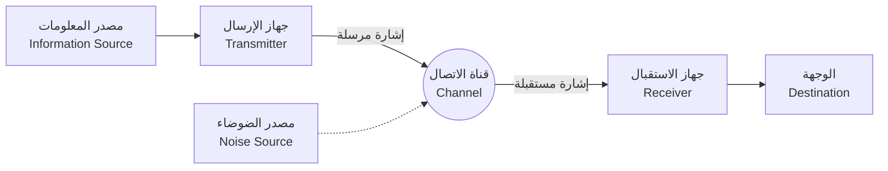

## 1. مقدمة: ما هي المعلومات؟

إن كلمة "معلومات" نستخدمها في حياتنا اليومية باستمرار، ولكن محاولة تعريف "المعلومات" علميًا تعتبر أمرًا بالغ الصعوبة. الأخبار، الرسائل من الأصدقاء، تسلسل القواعد في الحمض النووي (DNA)، أو حتى الموجات الراديوية القادمة من الفضاء، كل هذه الأشياء تحتوي على معلومات. ولكن، للتعامل معها ضمن إطار رياضي مشترك، نحتاج إلى مؤشر موضوعي وكمي.

من تصدى لهذا التحدي الكبير وأرسى أسس المجتمع الرقمي الحديث هو عالم الرياضيات والمهندس كلود شانون (Claude Shannon). يمكن القول دون مبالغة أن ورقته البحثية التي نُشرت عام 1948 بعنوان "نظرية رياضية للاتصال (A Mathematical Theory of Communication)" قد أسست بمفردها مجالًا أكاديميًا جديدًا تمامًا يُعرف باسم **نظرية المعلومات** (Information Theory).

في هذا المقال، سنتعمق بشكل شامل في كيفية تعريف شانون "للمعلومات" رياضيًا، وما يعنيه مفهومه المركزي **إنتروبيا شانون** في سياق ضغط البيانات وتكنولوجيا الاتصالات.

## 2. النموذج العام للاتصال

قام شانون بفصل معنى المعلومات (الدلالات) مؤقتًا، وركز بدلاً من ذلك على "نقل" المعلومات بحد ذاته. النموذج العام لنظام الاتصال الذي اقترحه يمكن تمثيله باستخدام مخطط Mermaid التالي:



في هذا النموذج، يتلخص التحدي الأكبر للاتصال في النقطة التالية: **"كيف يمكن نقل الرسائل بدقة وكفاءة عبر قناة اتصال تحتوي على ضوضاء (تشويش)؟"** .

## 3. التعريف الرياضي لكمية المعلومات

السؤال الأساسي في نظرية المعلومات هو: "عندما نعلم بحدوث حدث ما، ما هو مقدار المعلومات التي حصلنا عليها؟".

اعتبر شانون أن كمية المعلومات هي "درجة المفاجأة".
- إذا حدث **أمر شائع (حدث ذو احتمالية عالية)** ، فإن المفاجأة تكون قليلة، وكمية المعلومات المكتسبة تكون صغيرة.
- إذا حدث **أمر نادر الحدوث (حدث ذو احتمالية منخفضة)** ، فإن المفاجأة تكون كبيرة، وكمية المعلومات المكتسبة تكون كبيرة.

إذا افترضنا أن احتمالية حدوث الحدث $ x $ هي $ P(x) $ ، فإن **كمية المعلومات الذاتية** (Self-Information) $ I(x) $ التي يمتلكها ذلك الحدث تُعرّف على النحو التالي:

$$
I(x) = - \log_2 P(x) = \log_2 \frac{1}{P(x)}
$$

عند استخدام $ 2 $ كأساس للوغاريتم، تكون وحدة كمية المعلومات هي **بت** (bit). على سبيل المثال، عند رمي عملة معدنية لها احتمالية متساوية ($ P = 0.5 $) لظهور الوجه أو الظهر، فإن كمية المعلومات لحدث ظهور "الوجه" هي:

$$
I(\text{الوجه}) = - \log_2(0.5) = 1 \text{ bit}
$$

وهذا يتطابق مع الفهم البديهي "لمعلومة بحجم 1 بت".

## 4. إنتروبيا شانون

كمية المعلومات الذاتية تمثل كمية المعلومات لحدث فردي، ولكن كيف يمكننا معرفة مقدار المعلومات المتولدة في المتوسط من مصدر المعلومات بأكمله؟

هنا يأتي دور **الإنتروبيا** (Entropy). عندما يقوم مصدر المعلومات $ X $ بتوليد $ n $ من الرموز المختلفة $ x_1, x_2, \dots, x_n $ باحتماليات $ P(x_1), P(x_2), \dots, P(x_n) $ ، فإن الإنتروبيا $ H(X) $ لمصدر المعلومات $ X $ تُعرّف على أنها القيمة المتوقعة لكمية المعلومات الذاتية.

$$
H(X) = - \sum_{i=1}^{n} P(x_i) \log_2 P(x_i)
$$

(ومع ذلك، في حالة $ P(x_i) = 0 $ ، نعتبر أن $ 0 \log_2 0 = 0 $ )

### المعنى البديهي للإنتروبيا
تمثل الإنتروبيا $ H(X) $ درجة **عدم اليقين** التي يمتلكها مصدر المعلومات.
- عندما يكون من المستحيل تمامًا التنبؤ بالرمز الذي سيظهر (جميع الاحتمالات متساوية)، تصل الإنتروبيا إلى أقصى قيمة لها.
- عندما يظهر نفس الرمز دائمًا (احتمال واحد هو $ 1 $ والباقي $ 0 $ )، يختفي عدم اليقين وتصبح الإنتروبيا $ 0 $ .

باستخدام كود Python التالي، دعونا نحسب التغير في الإنتروبيا عند تغيير احتمالية ظهور وجه العملة $ p $ .

```python
import numpy as np
import matplotlib.pyplot as plt

def binary_entropy(p):
    if p == 0 or p == 1:
        return 0
    return -p * np.log2(p) - (1 - p) * np.log2(1 - p)

probabilities = np.linspace(0, 1, 100)
entropies = [binary_entropy(p) for p in probabilities]

plt.plot(probabilities, entropies)
plt.title('Binary Entropy Function')
plt.xlabel('Probability of heads (p)')
plt.ylabel('Entropy H(X) in bits')
plt.grid(True)
plt.show()
```

عند رسم هذا الرسم البياني، يمكننا أن نرى أنه عندما يكون $ p = 0.5 $ ، تصل الإنتروبيا إلى قيمتها القصوى وهي $ 1 $ ، وهي حالة لا يمكن التنبؤ بها على الإطلاق.

## 5. مبرهنة ترميز المصدر: حدود ضغط البيانات

الإنتروبيا ليست مجرد مفهوم تجريدي. أثبت شانون أن هذه الإنتروبيا تحدد **الحد المطلق لضغط البيانات** . وهذا ما يُعرف باسم **مبرهنة ترميز المصدر** (مبرهنة شانون الأولى).

مضمون المبرهنة بسيط للغاية.
**"مهما كانت خوارزمية الضغط غير المفقود (Lossless) المستخدمة، فإنه لا يمكن أن يكون متوسط طول الكود للبيانات الناتجة عن مصدر المعلومات أصغر من إنتروبيا ذلك المصدر $ H(X) $ ."**

$$
L \ge H(X)
$$
(حيث $ L $ هو متوسط طول الكود)

بعبارة أخرى، تشير الإنتروبيا إلى "الحجم الأساسي الذي تمتلكه المعلومات نفسها"، وتعني أنه من المستحيل رياضيًا تجاوز حاجز هذا الحد لضغط البيانات، مهما بلغت كفاءة الخوارزميات المطورة مثل ZIP أو gzip.

### ترميز هوفمان (Huffman Coding)
كطريقة ملموسة للاقتراب من حد الإنتروبيا، قام ديفيد هوفمان (David Huffman) بتطوير **ترميز هوفمان** بناءً على فكرة من فانو (Fano)، الذي كان باحثًا مساعدًا لشانون.

من خلال تخصيص سلاسل بتات قصيرة للرموز ذات احتمالية الظهور العالية وسلاسل بتات طويلة للرموز ذات احتمالية الظهور المنخفضة، يتم تقليل متوسط طول الكود الإجمالي إلى الحد الأدنى. فيما يلي مثال بسيط لبناء ترميز هوفمان باستخدام Python.

```python
import heapq
from collections import Counter

class Node:
    def __init__(self, char, freq):
        self.char = char
        self.freq = freq
        self.left = None
        self.right = None

    def __lt__(self, other):
        return self.freq < other.freq

def build_huffman_tree(text):
    frequency = Counter(text)
    heap = [Node(char, freq) for char, freq in frequency.items()]
    heapq.heapify(heap)

    while len(heap) > 1:
        left = heapq.heappop(heap)
        right = heapq.heappop(heap)
        merged = Node(None, left.freq + right.freq)
        merged.left = left
        merged.right = right
        heapq.heappush(heap, merged)

    return heap[0]

def generate_huffman_codes(node, prefix="", codebook={}):
    if node is not None:
        if node.char is not None:
            codebook[node.char] = prefix
        generate_huffman_codes(node.left, prefix + "0", codebook)
        generate_huffman_codes(node.right, prefix + "1", codebook)
    return codebook

# نص نموذجي
text = "shannon_entropy_and_information_theory"
tree_root = build_huffman_tree(text)
codes = generate_huffman_codes(tree_root)

print("Huffman Codes:")
for char, code in sorted(codes.items()):
    print(f"'{char}': {code}")
```

## 6. مبرهنة ترميز القناة: حدود الاتصال الخالي من الأخطاء

بعد توضيح حدود ضغط البيانات، انتقل شانون لتحدي "قنوات الاتصال التي تحتوي على ضوضاء". عندما يكون هناك ضوضاء، قد تنعكس أو تُفقد بعض البيانات. للتعامل مع ذلك، نقوم بإضافة **تكرار** (Redundancy) إلى البيانات حتى نتمكن من تصحيح الأخطاء (رمز تصحيح الخطأ).

ومع ذلك، كلما أضفنا المزيد من التكرار، انخفضت السرعة الفعلية (المعدل) التي يمكننا بها إرسال المعلومات. إذن، في بيئة مليئة بالضوضاء، ما هي السرعة ومدى الدقة التي يمكننا بها إرسال المعلومات؟

الإجابة على هذا السؤال هي **مبرهنة ترميز القناة** (مبرهنة شانون الثانية).

أثبت شانون أن أي قناة اتصال لها **سعة قناة** (Channel Capacity) خاصة بها يُرمز لها بـ $ C $ . والمثير للدهشة أنه صرح بما يلي:

**"إذا كانت سرعة نقل المعلومات $ R $ أصغر من سعة القناة $ C $ (أي $ R < C $ )، فمن خلال إجراء ترميز مناسب، يمكن تقليل معدل الخطأ ليقترب من الصفر قدر الإمكان."**

كصيغة تمثيلية لحساب سعة القناة $ C $ ، هناك مبرهنة شانون-هارتلي الخاصة بقناة الضوضاء الغاوسية البيضاء المضافة (AWGN).

$$
C = B \log_2 \left( 1 + \frac{S}{N} \right)
$$

هنا:
- $ C $ : سعة القناة (بت في الثانية - bits per second)
- $ B $ : عرض النطاق الترددي (هرتز - Hz)
- $ S $ : طاقة الإشارة (واط - Watt)
- $ N $ : طاقة الضوضاء (واط - Watt)
- $ \frac{S}{N} $ : نسبة الإشارة إلى الضوضاء (Signal-to-Noise Ratio)

تُعتبر هذه المبرهنة بمثابة دليل إرشادي يوضح الحد النظري الممكن الوصول إليه (حد شانون - Shannon Limit) في تصميم جميع أنظمة الاتصالات الرقمية الحديثة، مثل شبكات Wi-Fi، اتصالات الجيل الخامس المتنقلة (5G)، والاتصالات الفضائية.

## 7. الخاتمة

لقد نجحت نظرية المعلومات التي أسسها كلود شانون في وضع تعريف رياضي دقيق لشيء غير ملموس مثل "المعلومات"، مما فتح الباب أمام العصر الرقمي. لم يظل مفهوم **إنتروبيا شانون** مجرد فكرة مجردة، بل وضع الحد المطلق لخوارزميات ضغط البيانات، كما حددت سعة القناة مسار تطور الإنترنت والاتصالات اللاسلكية التي نستخدمها يوميًا.

إن قدرتنا على بث مقاطع الفيديو عبر هواتفنا الذكية وتلقي صور واضحة للكون من مسابير فضائية بعيدة، ترجع لوجود هذا الأساس الرياضي المتين المسمى بنظرية المعلومات. واليوم، يستمر تأثير مفهوم الإنتروبيا في الاتساع ليشمل مجالات أوسع، حيث تُناقش علاقته بالإنتروبيا الديناميكية الحرارية في الفيزياء، ويلعب دورًا محوريًا في التعلم الآلي (مثل إنتروبيا التقاطع - Cross Entropy).

إن فهم طبيعة البيانات من جذورها ومعرفة حدودها سيظل النهج الأكثر أهمية في تصميم أنظمة الاتصالات والمعلومات الأكثر تقدمًا في المستقبل.
