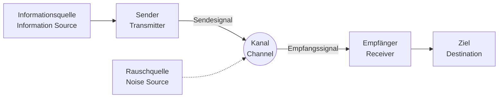

## 1. Einführung: Was ist Information?

Das Wort "Information" verwenden wir täglich, aber der Versuch, es wissenschaftlich zu definieren, erweist sich als äußerst schwierig. Nachrichten, eine Nachricht von einem Freund, DNA-Sequenzen oder Radiowellen aus dem Weltall - all dies enthält Informationen. Um sie jedoch mathematisch in einem gemeinsamen Rahmen zu behandeln, ist ein objektiver, quantitativer Indikator erforderlich.

Es war der Mathematiker und Ingenieur Claude Shannon, der sich dieser gewaltigen Herausforderung stellte und den Grundstein für die moderne digitale Gesellschaft legte. Man kann ohne Übertreibung sagen, dass seine 1948 veröffentlichte Arbeit "A Mathematical Theory of Communication" im Alleingang das völlig neue akademische Feld der **Informationstheorie** (Information Theory) begründete.

In diesem Artikel werden wir tiefgehend untersuchen, wie Shannon "Information" mathematisch definierte und welche Bedeutung ihr zentrales Konzept, die **Shannon-Entropie**, für die Datenkompression und Kommunikationstechnologie hat.

## 2. Ein allgemeines Kommunikationsmodell

Shannon löste sich zunächst von der Bedeutung (Semantik) der Information und konzentrierte sich auf die reine "Übertragung". Das von ihm vorgeschlagene allgemeine Modell eines Kommunikationssystems wird im folgenden Mermaid-Diagramm dargestellt.



In diesem Modell konzentriert sich die größte Herausforderung der Kommunikation auf die Frage: **"Wie kann man eine Nachricht genau und effizient über einen Kanal übertragen, in dem Rauschen vorhanden ist?"**

## 3. Die mathematische Definition der Informationsmenge

Die grundlegendste Frage in der Informationstheorie lautet: "Wie viel Information haben wir erhalten, wenn wir erfahren, dass ein bestimmtes Ereignis eingetreten ist?"

Shannon verstand die Informationsmenge als "Grad der Überraschung".
- Wenn ein **häufig auftretendes Ereignis (hohe Wahrscheinlichkeit)** eintritt, ist die Überraschung gering und die gewonnene Informationsmenge klein.
- Wenn ein **seltenes Ereignis (niedrige Wahrscheinlichkeit)** eintritt, ist die Überraschung groß und die gewonnene Informationsmenge groß.

Wenn die Wahrscheinlichkeit, dass ein Ereignis $ x $ eintritt, $ P(x) $ ist, wird der **Informationsgehalt** (Self-Information) $ I(x) $ dieses Ereignisses wie folgt definiert:

$$
I(x) = - \log_2 P(x) = \log_2 \frac{1}{P(x)}
$$

Wenn die Basis des Logarithmus $ 2 $ verwendet wird, ist die Einheit der Informationsmenge das **Bit** (bit). Das Informationsvolumen des Ereignisses, bei dem ein fairer Münzwurf (Kopf und Zahl mit gleicher Wahrscheinlichkeit, $ P = 0.5 $) "Kopf" ergibt, ist beispielsweise:

$$
I(\text{Kopf}) = - \log_2(0.5) = 1 \text{ bit}
$$

Dies stimmt auch mit unserem intuitiven Verständnis von "1 Bit Information" überein.

## 4. Shannon-Entropie

Der Informationsgehalt ist die Informationsmenge für einzelne Ereignisse, aber wie können wir herausfinden, wie viel Information durchschnittlich von einer gesamten Informationsquelle erzeugt wird?

Hier kommt die **Entropie** (Entropy) ins Spiel. Wenn eine Informationsquelle $ X $ $ n $ verschiedene Symbole $ x_1, x_2, \dots, x_n $ mit den Wahrscheinlichkeiten $ P(x_1), P(x_2), \dots, P(x_n) $ generiert, wird die Entropie $ H(X) $ der Informationsquelle $ X $ als der Erwartungswert des Informationsgehalts definiert.

$$
H(X) = - \sum_{i=1}^{n} P(x_i) \log_2 P(x_i)
$$

(Falls $ P(x_i) = 0 $, wird $ 0 \log_2 0 = 0 $ angenommen)

### Intuitive Bedeutung der Entropie
Die Entropie $ H(X) $ stellt den Grad der **Unsicherheit** dar, den eine Informationsquelle hat.
- Wenn völlig unvorhersehbar ist, welches Symbol erscheint (alle Wahrscheinlichkeiten sind gleich), ist die Entropie maximal.
- Wenn immer das gleiche Symbol erscheint (eine Wahrscheinlichkeit ist $ 1 $ und die anderen sind $ 0 $), gibt es keine Unsicherheit mehr und die Entropie ist $ 0 $.

Lassen Sie uns mit dem folgenden Python-Code berechnen, wie sich die Entropie ändert, wenn wir die Wahrscheinlichkeit $ p $ variieren, dass eine Münze Kopf zeigt.

```python
import numpy as np
import matplotlib.pyplot as plt

def binary_entropy(p):
    if p == 0 or p == 1:
        return 0
    return -p * np.log2(p) - (1 - p) * np.log2(1 - p)

probabilities = np.linspace(0, 1, 100)
entropies = [binary_entropy(p) for p in probabilities]

plt.plot(probabilities, entropies)
plt.title('Binary Entropy Function')
plt.xlabel('Probability of heads (p)')
plt.ylabel('Entropy H(X) in bits')
plt.grid(True)
plt.show()
```

Wenn wir diesen Graphen zeichnen, sehen wir, dass die Entropie ihren Maximalwert von $ 1 $ erreicht, wenn $ p = 0.5 $, was anzeigt, dass der [Zustand](https://kenji.blog/de/p/state-management-history-redux-context-recoil-zustand/) völlig unvorhersehbar ist.

## 5. Das Quellencodierungstheorem: Die Grenze der Datenkompression

Entropie ist nicht nur ein abstraktes Konzept. Shannon bewies, dass diese Entropie die **absolute Grenze der Datenkompression** festlegt. Dies ist das **Quellencodierungstheorem** (Shannons erstes Theorem).

Die Aussage des Theorems ist sehr einfach:
**"Egal welchen verlustfreien Kompressionsalgorithmus wir verwenden, die durchschnittliche Codelänge der aus einer Informationsquelle generierten Daten kann niemals kleiner gemacht werden als die Entropie $ H(X) $ dieser Informationsquelle."**

$$
L \ge H(X)
$$
($ L $ ist die durchschnittliche Codelänge)

Das bedeutet, dass die Entropie die "essenzielle Größe der Information selbst" anzeigt. Egal wie überlegen ein Algorithmus wie ZIP oder gzip ist, es ist mathematisch unmöglich, Daten über diese Grenze hinaus zu komprimieren.

### Huffman-Codierung (Huffman Coding)
Als konkrete Methode zur Annäherung an die Entropiegrenze erfand David Huffman die **Huffman-Codierung**, basierend auf einer Idee von Shannons Forschungspartner Fano.

Indem Symbolen mit hoher Auftrittswahrscheinlichkeit kurze Bitfolgen und Symbolen mit niedriger Auftrittswahrscheinlichkeit lange Bitfolgen zugewiesen werden, wird die gesamte durchschnittliche Codelänge minimiert. Im Folgenden finden Sie ein Beispiel für die Implementierung einer einfachen Huffman-Codierung in Python.

```python
import heapq
from collections import Counter

class Node:
    def __init__(self, char, freq):
        self.char = char
        self.freq = freq
        self.left = None
        self.right = None

    def __lt__(self, other):
        return self.freq < other.freq

def build_huffman_tree(text):
    frequency = Counter(text)
    heap = [Node(char, freq) for char, freq in frequency.items()]
    heapq.heapify(heap)

    while len(heap) > 1:
        left = heapq.heappop(heap)
        right = heapq.heappop(heap)
        merged = Node(None, left.freq + right.freq)
        merged.left = left
        merged.right = right
        heapq.heappush(heap, merged)

    return heap[0]

def generate_huffman_codes(node, prefix="", codebook={}):
    if node is not None:
        if node.char is not None:
            codebook[node.char] = prefix
        generate_huffman_codes(node.left, prefix + "0", codebook)
        generate_huffman_codes(node.right, prefix + "1", codebook)
    return codebook

# Beispieltext
text = "shannon_entropy_and_information_theory"
tree_root = build_huffman_tree(text)
codes = generate_huffman_codes(tree_root)

print("Huffman Codes:")
for char, code in sorted(codes.items()):
    print(f"'{char}': {code}")
```

## 6. Das Kanalcodierungstheorem: Die Grenze fehlerfreier Kommunikation

Nachdem er die Grenzen der Datenkompression aufgezeigt hatte, befasste sich Shannon mit dem "verrauschten Kommunikationskanal". Bei Rauschen werden einige Daten invertiert oder gehen verloren. Um dem entgegenzuwirken, fügen wir den Daten **Redundanz** hinzu, damit Fehler korrigiert werden können (Fehlerkorrekturcode).

Je mehr Redundanz wir jedoch hinzufügen, desto mehr sinkt die effektive Geschwindigkeit (Rate), mit der wir die Informationen tatsächlich übertragen können. Wie schnell und wie genau können wir also Informationen in einer verrauschten Umgebung senden?

Die Antwort auf diese Frage ist das **Kanalcodierungstheorem** (Shannons zweites Theorem).

Shannon bewies, dass es für jeden Kommunikationskanal eine inhärente **Kanalkapazität** (Channel Capacity) $ C $ gibt. Und er stellte die folgende verblüffende Behauptung auf:

**"Wenn die Informationsübertragungsrate $ R $ kleiner als die Kanalkapazität $ C $ ist ($ R < C $), kann die Fehlerrate durch geeignete Codierung beliebig nahe an null gebracht werden."**

Eine repräsentative Formel zur Berechnung der Kanalkapazität $ C $ ist das Shannon-Hartley-Theorem für den AWGN-Kanal (Additive White Gaussian Noise).

$$
C = B \log_2 \left( 1 + \frac{S}{N} \right)
$$

Hierbei gilt:
- $ C $ : Kanalkapazität (bits per second)
- $ B $ : Bandbreite (Hz)
- $ S $ : Signalleistung (Watt)
- $ N $ : Rauschleistung (Watt)
- $ \frac{S}{N} $ : Signal-Rausch-Verhältnis (Signal-to-Noise Ratio)

Dieses Theorem dient als Leitfaden, der die erreichbare theoretische Grenze (Shannon-Limit) bei der Entwicklung aller digitalen Kommunikationssysteme anzeigt, wie z.B. das moderne Wi-Fi, 5G-Mobilfunk und Satellitenkommunikation.

## 7. Fazit

Die von Claude Shannon entwickelte Informationstheorie definierte das immaterielle Konstrukt der "Information" auf mathematisch strenge Weise und öffnete die Tür zum digitalen Zeitalter. Die **Shannon-Entropie** ist nicht nur ein abstraktes Konzept; sie zeigt die absolute Grenze von Datenkompressionsalgorithmen auf, und die Kanalkapazität bestimmte die Entwicklungsrichtung des Internets und der drahtlosen Kommunikation, die wir täglich nutzen.

Wir können Videos auf unseren Smartphones streamen und klare Bilder des Weltalls von weit entfernten Sonden empfangen, weil es die solide mathematische Grundlage der Informationstheorie gibt. Das Konzept der Entropie greift nun auf noch breitere Bereiche über; ihre Beziehung zur thermodynamischen Entropie in der Physik wird diskutiert, und sie spielt eine wichtige Rolle beim maschinellen Lernen (wie bei der Kreuzentropie-Fehlerfunktion).

Das fundamentale Verständnis der Eigenschaften von Daten und die Kenntnis ihrer Grenzen wird weiterhin der wichtigste Ansatz bei der Entwicklung fortschrittlicherer Informations- und Kommunikationssysteme für die Zukunft bleiben.
