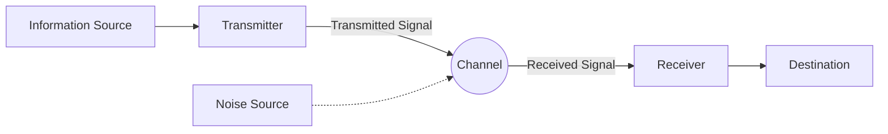

## 1. Introduction: What is Information?

Although we casually use the word "information" on a daily basis, it is extremely difficult to define "information" scientifically. News, messages from friends, DNA base sequences, or radio waves arriving from space, all of these contain information. However, in order to handle them within a common mathematical framework, an objective and quantitative measure is necessary.

It was Claude Shannon, a mathematician and engineer, who tackled this grand challenge and laid the foundation for modern digital society. It is no exaggeration to say that his 1948 paper "A Mathematical Theory of Communication" single-handedly founded the entirely new academic field of **Information Theory**.

In this article, we will thoroughly delve into how Shannon mathematically defined "information", and what its central concept, **Shannon Entropy**, means for data compression and communication technology.

## 2. General Model of Communication

Shannon temporarily set aside the meaning (semantics) of information and focused on the "transmission" of information itself. The general model of a communication system he proposed is represented as the Mermaid diagram below.



In this model, the greatest challenge of communication boils down to the point of **"how to transmit messages accurately and efficiently through a channel where noise is present"**.

## 3. Mathematical Definition of Information Quantity

The most fundamental question in information theory is, "How much information did we gain when we learned that a certain event occurred?"

Shannon considered the quantity of information as the "degree of surprise".
- Even if **something that happens often (an event with a high probability)** occurs, the surprise is small, and the amount of information gained is small.
- If **something that rarely happens (an event with a low probability)** occurs, the surprise is large, and the amount of information gained is large.

When the probability of an event $ x $ occurring is $ P(x) $, the **Self-Information** $ I(x) $ that the event possesses is defined as follows:

$$
I(x) = - \log_2 P(x) = \log_2 \frac{1}{P(x)}
$$

When $ 2 $ is used as the base of the logarithm, the unit of information quantity is the **bit**. For example, the information quantity of the event that a coin, which has an equal probability for heads and tails ($ P = 0.5 $), is flipped and lands on heads is,

$$
I(\text{Heads}) = - \log_2(0.5) = 1 \text{ bit}
$$

This also matches our intuitive understanding of "1 bit of information".

## 4. Shannon Entropy

Self-information is the amount of information for an individual event, but how can we know how much information is generated on average from the entire information source?

This is where **Entropy** comes into play. When an information source $ X $ generates $ n $ different symbols $ x_1, x_2, \dots, x_n $ with probabilities $ P(x_1), P(x_2), \dots, P(x_n) $, the entropy $ H(X) $ of the information source $ X $ is defined as the expected value of self-information.

$$
H(X) = - \sum_{i=1}^{n} P(x_i) \log_2 P(x_i)
$$

(However, when $ P(x_i) = 0 $, it is considered as $ 0 \log_2 0 = 0 $)

### Intuitive Meaning of Entropy
Entropy $ H(X) $ represents the degree of **uncertainty** that an information source has.
- When it is completely unpredictable which symbol will appear (all probabilities are equal), entropy is maximized.
- When the same symbol always appears (a certain probability is $ 1 $ and the others are $ 0 $), there is no uncertainty, and the entropy becomes $ 0 $.

Let's calculate the change in entropy when the probability $ p $ of a coin landing on heads is varied, using the following Python code.

```python
import numpy as np
import matplotlib.pyplot as plt

def binary_entropy(p):
    if p == 0 or p == 1:
        return 0
    return -p * np.log2(p) - (1 - p) * np.log2(1 - p)

probabilities = np.linspace(0, 1, 100)
entropies = [binary_entropy(p) for p in probabilities]

plt.plot(probabilities, entropies)
plt.title('Binary Entropy Function')
plt.xlabel('Probability of heads (p)')
plt.ylabel('Entropy H(X) in bits')
plt.grid(True)
plt.show()
```

When this graph is drawn, it can be seen that the entropy reaches its maximum value of $ 1 $ when $ p = 0.5 $, which is a state of complete unpredictability.

## 5. Source Coding Theorem: The Limits of Data Compression

Entropy is not just an abstract concept. Shannon proved that this entropy defines the **absolute limit of data compression**. This is the **Source Coding Theorem** (Shannon's first theorem).

The claim of the theorem is very simple.
**"No matter what lossless compression algorithm is used, the average code length of the data generated from an information source cannot be smaller than the entropy $ H(X) $ of that information source."**

$$
L \ge H(X)
$$
( $ L $ is the average code length)

In other words, entropy indicates the "essential size that the information itself possesses", meaning that no matter how excellent an algorithm like ZIP or gzip is developed, it is mathematically impossible to compress beyond the wall of this limit.

### Huffman Coding
As a specific method to approach the limit of entropy, **Huffman Coding** was devised by David Huffman, who developed the idea of Fano, Shannon's collaborator.

By assigning short bit strings to symbols with high occurrence probabilities and long bit strings to symbols with low occurrence probabilities, the overall average code length is minimized. Below is an example of constructing a simple Huffman code in Python.

```python
import heapq
from collections import Counter

class Node:
    def __init__(self, char, freq):
        self.char = char
        self.freq = freq
        self.left = None
        self.right = None

    def __lt__(self, other):
        return self.freq < other.freq

def build_huffman_tree(text):
    frequency = Counter(text)
    heap = [Node(char, freq) for char, freq in frequency.items()]
    heapq.heapify(heap)

    while len(heap) > 1:
        left = heapq.heappop(heap)
        right = heapq.heappop(heap)
        merged = Node(None, left.freq + right.freq)
        merged.left = left
        merged.right = right
        heapq.heappush(heap, merged)

    return heap[0]

def generate_huffman_codes(node, prefix="", codebook={}):
    if node is not None:
        if node.char is not None:
            codebook[node.char] = prefix
        generate_huffman_codes(node.left, prefix + "0", codebook)
        generate_huffman_codes(node.right, prefix + "1", codebook)
    return codebook

# Sample text
text = "shannon_entropy_and_information_theory"
tree_root = build_huffman_tree(text)
codes = generate_huffman_codes(tree_root)

print("Huffman Codes:")
for char, code in sorted(codes.items()):
    print(f"'{char}': {code}")
```

## 6. Channel Coding Theorem: The Limit of Error-Free Communication

Having shown the limits of data compression, Shannon next tackled "noisy channels". When noise is present, parts of the data are inverted or lost. To cope with this, we add **redundancy** to the data so that errors can be corrected (error-correcting codes).

However, the more redundancy is added, the lower the effective speed (rate) of information that can actually be sent. So, in a noisy environment, at what speed and how accurately can information be sent?

The answer to this question is the **Channel Coding Theorem** (Shannon's second theorem).

Shannon proved that each channel has a specific **Channel Capacity** $ C $. And, surprisingly, he claimed the following.

**"If the information transmission rate $ R $ is less than the channel capacity $ C $ ( $ R < C $ ), it is possible to bring the error rate as close to zero as desired by performing appropriate coding."**

A representative formula for calculating the channel capacity $ C $ is the Shannon-Hartley theorem regarding the Additive White Gaussian Noise (AWGN) channel.

$$
C = B \log_2 \left( 1 + \frac{S}{N} \right)
$$

Here,
- $ C $ : Channel Capacity (bits per second)
- $ B $ : Bandwidth (Hz)
- $ S $ : Signal Power (Watt)
- $ N $ : Noise Power (Watt)
- $ \frac{S}{N} $ : Signal-to-Noise Ratio (SNR)

This theorem serves as a guidepost indicating the attainable theoretical limit (Shannon limit) in the design of all digital communication systems, such as modern Wi-Fi, 5G mobile communications, and satellite communications.

## 7. Conclusion

Information theory constructed by Claude Shannon mathematically and rigorously defined the intangible concept of "information" and opened the door to the digital age. **Shannon Entropy** goes beyond a mere abstract concept, showing the absolute limit of data compression algorithms, and channel capacity has determined the direction of evolution of the Internet and wireless communications that we use daily.

The reason we can stream videos on our smartphones and receive clear images of space from distant probes is because the solid mathematical foundation of information theory exists. The concept of entropy is now spreading to even wider fields, such as being discussed in relation to thermodynamic entropy in physics and playing an important role in machine learning (e.g., cross-entropy loss).

Fundamentally understanding the nature of data and knowing its limits will continue to remain the most important approach in designing more advanced information and communication systems of the future.
