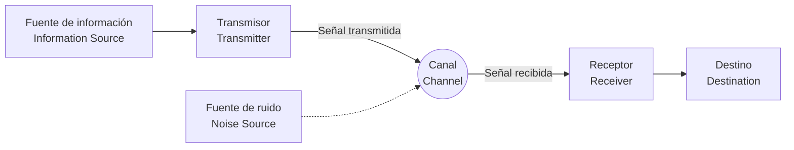

## 1. Introducción: ¿Qué es la información?

La palabra "información" es algo de lo que hablamos habitualmente, pero resulta extremadamente difícil intentar definir la "información" de forma científica. Las noticias, los mensajes de amigos, la secuencia de bases del ADN o las ondas de radio del espacio, todo esto contiene información. Sin embargo, para tratar esto en un marco matemático común, se necesita un indicador objetivo y cuantitativo.

Quien asumió este gran desafío y sentó las bases de nuestra sociedad digital moderna fue el matemático e ingeniero Claude Shannon. No es una exageración decir que su artículo de 1948, "Una teoría matemática de la comunicación" (A Mathematical Theory of Communication), creó por sí solo un campo de estudio completamente nuevo llamado **teoría de la información** (Information Theory).

En este artículo, profundizaremos en cómo Shannon definió matemáticamente la "información" y qué significa su concepto central, la **entropía de Shannon**, en el contexto de la compresión de datos y las tecnologías de comunicación.

## 2. Modelo general de comunicación

Shannon dejó de lado el significado (semántica) de la información y se centró en la "transmisión" de la misma. El modelo general del sistema de comunicación que propuso se representa en el siguiente diagrama de Mermaid.



En este modelo, el mayor desafío de la comunicación se resume en **"cómo transmitir un mensaje de manera precisa y eficiente a través de un canal con ruido"**.

## 3. Definición matemática de la cantidad de información

La pregunta más fundamental en la teoría de la información es: "¿Cuánta información obtenemos cuando sabemos que ha ocurrido un evento?".

Shannon consideró la cantidad de información como el "grado de sorpresa".
- Cuando ocurre algo que **sucede a menudo (evento de alta probabilidad)**, hay poca sorpresa y la cantidad de información obtenida es pequeña.
- Cuando ocurre algo que **rara vez sucede (evento de baja probabilidad)**, hay una gran sorpresa y la cantidad de información obtenida es grande.

Dado que la probabilidad de que ocurra el evento $ x $ es $ P(x) $, la **autoinformación** (Self-Information) $ I(x) $ que posee ese evento se define de la siguiente manera:

$$
I(x) = - \log_2 P(x) = \log_2 \frac{1}{P(x)}
$$

Cuando se utiliza $ 2 $ como base del logaritmo, la unidad de la cantidad de información es el **bit** (bit). Por ejemplo, si lanzas una moneda donde cara y cruz tienen la misma probabilidad de salir ($ P = 0.5 $), la cantidad de información del evento de que salga cara es:

$$
I(\text{cara}) = - \log_2(0.5) = 1 \text{ bit}
$$

Esto coincide con la comprensión intuitiva de "1 bit de información".

## 4. Entropía de Shannon

La autoinformación es la cantidad de información de eventos individuales, pero ¿cómo podemos saber cuánta información se genera en promedio a partir de una fuente de información completa?

Aquí es donde entra la **entropía** (Entropy). Cuando una fuente de información $ X $ genera $ n $ símbolos diferentes $ x_1, x_2, \dots, x_n $ con probabilidades $ P(x_1), P(x_2), \dots, P(x_n) $, la entropía $ H(X) $ de la fuente $ X $ se define como el valor esperado de la autoinformación.

$$
H(X) = - \sum_{i=1}^{n} P(x_i) \log_2 P(x_i)
$$

(Sin embargo, cuando $ P(x_i) = 0 $, consideramos que $ 0 \log_2 0 = 0 $)

### Significado intuitivo de la entropía
La entropía $ H(X) $ representa el grado de **incertidumbre** que tiene una fuente de información.
- Cuando es completamente impredecible qué símbolo aparecerá (todas las probabilidades son iguales), la entropía es máxima.
- Cuando siempre sale el mismo símbolo (una probabilidad es $ 1 $ y las demás $ 0 $), la incertidumbre desaparece y la entropía es $ 0 $.

Calculemos el cambio en la entropía al variar la probabilidad $ p $ de que salga cara en una moneda, con el siguiente código en Python.

```python
import numpy as np
import matplotlib.pyplot as plt

def binary_entropy(p):
    if p == 0 or p == 1:
        return 0
    return -p * np.log2(p) - (1 - p) * np.log2(1 - p)

probabilities = np.linspace(0, 1, 100)
entropies = [binary_entropy(p) for p in probabilities]

plt.plot(probabilities, entropies)
plt.title('Función de entropía binaria')
plt.xlabel('Probabilidad de cara (p)')
plt.ylabel('Entropía H(X) en bits')
plt.grid(True)
plt.show()
```

Al dibujar este gráfico, podemos ver que cuando $ p = 0.5 $, la entropía alcanza su valor máximo de $ 1 $, lo cual representa un estado completamente impredecible.

## 5. Teorema de codificación de fuentes: El límite de la compresión de datos

La entropía no es solo un concepto abstracto. Shannon demostró que esta entropía establece un **límite absoluto para la compresión de datos**. A esto se le llama el **teorema de codificación de fuentes** (Primer teorema de Shannon).

La afirmación del teorema es muy simple.
**"Independientemente del algoritmo de compresión sin pérdida que se utilice, la longitud media del código de los datos generados por una fuente de información no puede ser menor que la entropía $ H(X) $ de dicha fuente."**

$$
L \ge H(X)
$$
(donde $ L $ es la longitud media del código)

En otras palabras, la entropía muestra "el tamaño intrínseco que posee la información misma", y esto significa que matemáticamente es imposible comprimir más allá de esta barrera límite, sin importar qué tan excelente sea el algoritmo ZIP o gzip que desarrollemos.

### Código de Huffman (Huffman Coding)
Como un método concreto para acercarse al límite de la entropía, David Huffman ideó el **código de Huffman** desarrollando la idea de Fano, un colaborador de Shannon.

Al asignar secuencias de bits cortas a los símbolos con alta probabilidad de aparición, y secuencias de bits largas a los símbolos con baja probabilidad de aparición, se minimiza la longitud media total del código. A continuación se muestra un ejemplo sencillo de construcción de un código de Huffman en Python.

```python
import heapq
from collections import Counter

class Node:
    def __init__(self, char, freq):
        self.char = char
        self.freq = freq
        self.left = None
        self.right = None

    def __lt__(self, other):
        return self.freq < other.freq

def build_huffman_tree(text):
    frequency = Counter(text)
    heap = [Node(char, freq) for char, freq in frequency.items()]
    heapq.heapify(heap)

    while len(heap) > 1:
        left = heapq.heappop(heap)
        right = heapq.heappop(heap)
        merged = Node(None, left.freq + right.freq)
        merged.left = left
        merged.right = right
        heapq.heappush(heap, merged)

    return heap[0]

def generate_huffman_codes(node, prefix="", codebook={}):
    if node is not None:
        if node.char is not None:
            codebook[node.char] = prefix
        generate_huffman_codes(node.left, prefix + "0", codebook)
        generate_huffman_codes(node.right, prefix + "1", codebook)
    return codebook

# Texto de muestra
text = "shannon_entropy_and_information_theory"
tree_root = build_huffman_tree(text)
codes = generate_huffman_codes(tree_root)

print("Códigos de Huffman:")
for char, code in sorted(codes.items()):
    print(f"'{char}': {code}")
```

## 6. Teorema de codificación de canales: El límite de la comunicación sin errores

Después de mostrar los límites de la compresión de datos, Shannon se enfrentó a los "canales con ruido". Cuando hay ruido, parte de los datos se invierte o se pierde. Para lidiar con esto, añadimos **redundancia** a los datos para poder corregir los errores (códigos de corrección de errores).

Sin embargo, cuanta más redundancia añadamos, más disminuirá la velocidad efectiva (tasa) de la información que realmente podemos enviar. Entonces, en un entorno ruidoso, ¿a qué velocidad y con qué precisión podemos enviar información?

La respuesta a esta pregunta es el **teorema de codificación de canales** (Segundo teorema de Shannon).

Shannon demostró que los canales de comunicación tienen una **capacidad de canal** (Channel Capacity) inherente $ C $. Y, sorprendentemente, afirmó lo siguiente:

**"Si la velocidad de transmisión de la información $ R $ es menor que la capacidad del canal $ C $ ($ R < C $), entonces mediante una codificación adecuada, la tasa de errores puede acercarse a cero tanto como se desee."**

Como una fórmula representativa para calcular la capacidad del canal $ C $, se encuentra el teorema de Shannon-Hartley para un canal con ruido gaussiano blanco aditivo (AWGN).

$$
C = B \log_2 \left( 1 + \frac{S}{N} \right)
$$

Donde:
- $ C $ : Capacidad del canal (bits por segundo)
- $ B $ : Ancho de banda (Hz)
- $ S $ : Potencia de la señal (Watt)
- $ N $ : Potencia del ruido (Watt)
- $ \frac{S}{N} $ : Relación señal-ruido (Signal-to-Noise Ratio)

Este teorema sirve como guía que indica el límite teórico alcanzable (límite de Shannon) en el diseño de cualquier sistema de comunicación digital, incluyendo el Wi-Fi moderno, las comunicaciones móviles 5G y las comunicaciones por satélite.

## 7. Conclusión

La teoría de la información construida por Claude Shannon definió de forma matemática y rigurosa algo intangible como la "información", abriendo la puerta a la era digital. La **entropía de Shannon** no se limitó a un mero concepto abstracto, sino que demostró los límites absolutos de los algoritmos de compresión de datos, y la capacidad de canal determinó la dirección de la evolución de Internet y las comunicaciones inalámbricas que utilizamos a diario.

El hecho de que podamos transmitir vídeos en nuestros teléfonos inteligentes y recibir imágenes nítidas del espacio de sondas espaciales lejanas es porque existe una base matemática sólida llamada teoría de la información. El concepto de entropía sigue expandiéndose a campos aún más amplios en la actualidad, como el debate sobre su relación con la entropía termodinámica en la física, o su papel fundamental en el aprendizaje automático (como la pérdida de entropía cruzada).

Comprender la naturaleza de los datos desde su raíz y conocer sus límites seguirá siendo sin duda el enfoque más importante para diseñar los sistemas de información y comunicación más avanzados del futuro.
