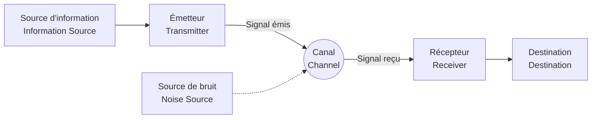

## 1. Introduction : Qu'est-ce que l'information ?

Bien que nous utilisions le mot "information" tous les jours, essayer de définir l'"information" de manière scientifique s'avère extrêmement difficile. Les actualités, les messages d'amis, les séquences de bases de l'ADN ou même les ondes radio provenant de l'espace, tout cela contient de l'information. Cependant, pour les traiter dans un cadre mathématique commun, il est nécessaire de disposer d'un indicateur objectif et quantitatif.

Celui qui a relevé ce défi colossal et posé les bases de la société numérique moderne est le mathématicien et ingénieur Claude Shannon. Il n'est pas exagéré de dire que son article publié en 1948, "Une théorie mathématique de la communication" (A Mathematical Theory of Communication), a fondé à lui seul un domaine d'étude entièrement nouveau : la **théorie de l'information** (Information Theory).

Dans cet article, nous allons examiner en profondeur comment Shannon a défini mathématiquement l'"information", et la signification de son concept central, l' **entropie de Shannon**, dans la compression de données et les technologies de communication.

## 2. Modèle général de communication

Shannon a délibérément mis de côté le sens de l'information (la sémantique) pour se concentrer sur la "transmission" elle-même. Le modèle général d'un système de communication qu'il a proposé est représenté dans le diagramme Mermaid suivant.



Dans ce modèle, le plus grand défi de la communication se résume à : **"Comment transmettre un message de manière précise et efficace à travers un canal en présence de bruit"**.

## 3. Définition mathématique de la quantité d'information

La question la plus fondamentale de la théorie de l'information est : "Quelle quantité d'information avons-nous obtenue en apprenant qu'un événement s'est produit ?"

Shannon a considéré la quantité d'information comme le "degré de surprise".
- Lorsqu'un **événement fréquent (de forte probabilité)** se produit, la surprise est faible et la quantité d'information obtenue est petite.
- Lorsqu'un **événement rare (de faible probabilité)** se produit, la surprise est grande et la quantité d'information obtenue est importante.

Si la probabilité d'occurrence d'un événement $ x $ est $ P(x) $, la **quantité d'information propre** (Self-Information) $ I(x) $ contenue dans cet événement est définie comme suit :

$$
I(x) = - \log_2 P(x) = \log_2 \frac{1}{P(x)}
$$

Lorsque la base du logarithme est $ 2 $, l'unité de la quantité d'information est le **bit** (bit). Par exemple, la quantité d'information de l'événement où une pièce, dont les côtés sont équiprobables ($ P = 0.5 $), tombe sur face est :

$$
I(\text{face}) = - \log_2(0.5) = 1 \text{ bit}
$$

Cela correspond également à la compréhension intuitive d'"1 bit d'information".

## 4. L'entropie de Shannon

Bien que la quantité d'information propre concerne des événements individuels, comment pouvons-nous savoir combien d'information est générée en moyenne par l'ensemble de la source d'information ?

C'est ici qu'intervient l' **entropie** (Entropy). Lorsqu'une source d'information $ X $ génère $ n $ symboles différents $ x_1, x_2, \dots, x_n $ avec les probabilités $ P(x_1), P(x_2), \dots, P(x_n) $, l'entropie $ H(X) $ de la source d'information $ X $ est définie comme l'espérance de la quantité d'information propre.

$$
H(X) = - \sum_{i=1}^{n} P(x_i) \log_2 P(x_i)
$$

(Toutefois, si $ P(x_i) = 0 $, on considère que $ 0 \log_2 0 = 0 $)

### Signification intuitive de l'entropie
L'entropie $ H(X) $ représente le degré d' **incertitude** de la source d'information.
- Lorsque le symbole qui va apparaître est totalement imprévisible (toutes les probabilités sont égales), l'entropie est maximale.
- Lorsque le même symbole apparaît toujours (une probabilité est de $ 1 $ et les autres de $ 0 $), il n'y a plus d'incertitude et l'entropie est de $ 0 $.

Avec le code Python suivant, calculons l'évolution de l'entropie en fonction de la variation de la probabilité $ p $ d'obtenir face avec une pièce.

```python
import numpy as np
import matplotlib.pyplot as plt

def binary_entropy(p):
    if p == 0 or p == 1:
        return 0
    return -p * np.log2(p) - (1 - p) * np.log2(1 - p)

probabilities = np.linspace(0, 1, 100)
entropies = [binary_entropy(p) for p in probabilities]

plt.plot(probabilities, entropies)
plt.title("Fonction d'entropie binaire")
plt.xlabel("Probabilité d'obtenir face (p)")
plt.ylabel("Entropie H(X) en bits")
plt.grid(True)
plt.show()
```

Le tracé de ce graphique montre que l'entropie atteint sa valeur maximale de $ 1 $ lorsque $ p = 0.5 $, ce qui indique un état complètement imprévisible.

## 5. Théorème du codage de source : Les limites de la compression de données

L'entropie n'est pas qu'un concept abstrait. Shannon a prouvé que cette entropie définit la **limite absolue de la compression de données**. C'est le **théorème du codage de source** (le premier théorème de Shannon).

L'énoncé du théorème est très simple.
**"Quel que soit l'algorithme de compression sans perte utilisé, la longueur moyenne du code des données générées par une source d'information ne peut être inférieure à l'entropie $ H(X) $ de cette source."**

$$
L \ge H(X)
$$
(où $ L $ est la longueur moyenne du code)

En d'autres termes, l'entropie indique la "taille intrinsèque de l'information elle-même", ce qui signifie que même en développant d'excellents algorithmes comme ZIP ou gzip, il est mathématiquement impossible de compresser au-delà de cette limite.

### Codage de Huffman (Huffman Coding)
En tant que méthode concrète pour s'approcher de la limite de l'entropie, David Huffman, en développant une idée de Fano, collaborateur de Shannon, a inventé le **codage de Huffman**.

En attribuant des séquences de bits courtes aux symboles ayant une probabilité d'apparition élevée, et des séquences longues aux symboles ayant une faible probabilité, la longueur moyenne du code global est minimisée. Voici un exemple simple de construction d'un code de Huffman en Python.

```python
import heapq
from collections import Counter

class Node:
    def __init__(self, char, freq):
        self.char = char
        self.freq = freq
        self.left = None
        self.right = None

    def __lt__(self, other):
        return self.freq < other.freq

def build_huffman_tree(text):
    frequency = Counter(text)
    heap = [Node(char, freq) for char, freq in frequency.items()]
    heapq.heapify(heap)

    while len(heap) > 1:
        left = heapq.heappop(heap)
        right = heapq.heappop(heap)
        merged = Node(None, left.freq + right.freq)
        merged.left = left
        merged.right = right
        heapq.heappush(heap, merged)

    return heap[0]

def generate_huffman_codes(node, prefix="", codebook={}):
    if node is not None:
        if node.char is not None:
            codebook[node.char] = prefix
        generate_huffman_codes(node.left, prefix + "0", codebook)
        generate_huffman_codes(node.right, prefix + "1", codebook)
    return codebook

# Texte d'exemple
text = "shannon_entropy_and_information_theory"
tree_root = build_huffman_tree(text)
codes = generate_huffman_codes(tree_root)

print("Codes de Huffman :")
for char, code in sorted(codes.items()):
    print(f"'{char}': {code}")
```

## 6. Théorème du codage de canal : Les limites de la communication sans erreur

Après avoir défini les limites de la compression de données, Shannon s'est attaqué au "canal avec bruit". En présence de bruit, une partie des données peut être inversée ou perdue. Pour y remédier, nous ajoutons de la **redondance** aux données afin de pouvoir corriger les erreurs (code correcteur d'erreurs).

Cependant, plus nous ajoutons de redondance, plus la vitesse effective (le débit) de l'information transmise diminue. Dès lors, dans un environnement bruyant, à quelle vitesse et avec quelle précision peut-on transmettre des informations ?

La réponse à cette question est le **théorème du codage de canal** (le deuxième théorème de Shannon).

Shannon a prouvé que tout canal possède une **capacité de canal** (Channel Capacity) $ C $ intrinsèque. Et, de manière surprenante, il a affirmé ce qui suit :

**"Si le taux de transmission de l'information $ R $ est inférieur à la capacité du canal $ C $ ( $ R < C $ ), alors, en utilisant un codage approprié, il est possible de réduire le taux d'erreur de manière arbitrairement proche de zéro."**

Le théorème de Shannon-Hartley pour le canal à bruit blanc gaussien additif (AWGN) est la formule représentative pour calculer la capacité de canal $ C $.

$$
C = B \log_2 \left( 1 + \frac{S}{N} \right)
$$

Où :
- $ C $ : Capacité de canal (bits par seconde)
- $ B $ : Bande passante (Hz)
- $ S $ : Puissance du signal (Watt)
- $ N $ : Puissance du bruit (Watt)
- $ \frac{S}{N} $ : Rapport signal sur bruit (Signal-to-Noise Ratio)

Ce théorème sert de guide en indiquant la limite théorique atteignable (la limite de Shannon) dans la conception de tous les systèmes de communication numérique modernes, tels que le Wi-Fi, les communications mobiles 5G et les communications par satellite.

## 7. Conclusion

La théorie de l'information, construite par Claude Shannon, a défini rigoureusement l'"information" d'un point de vue mathématique, ouvrant ainsi la voie à l'ère numérique. L' **entropie de Shannon** ne se limite pas à un concept abstrait ; elle fixe la limite absolue des algorithmes de compression de données, et la capacité de canal a déterminé l'orientation de l'évolution d'Internet et des communications sans fil que nous utilisons quotidiennement.

Si nous pouvons diffuser des vidéos sur nos smartphones et recevoir des images nettes de l'univers depuis des sondes lointaines, c'est parce qu'il existe une base mathématique solide appelée théorie de l'information. Aujourd'hui, le concept d'entropie continue de s'étendre à des domaines encore plus vastes, ses liens avec l'entropie thermodynamique en physique étant débattus, et il joue un rôle majeur dans l'apprentissage automatique (comme avec l'entropie croisée).

Comprendre fondamentalement la nature des données et connaître leurs limites restera certainement l'approche la plus cruciale pour concevoir les systèmes d'information et de communication avancés de demain.
