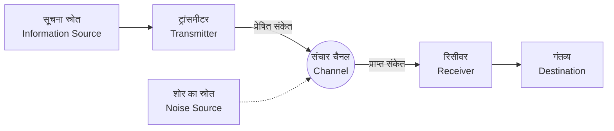

## 1. परिचय: सूचना क्या है?

जिस शब्द "सूचना" (information) का हम रोज़मर्रा की ज़िंदगी में इस्तेमाल करते हैं, उसे वैज्ञानिक रूप से परिभाषित करने की कोशिश करना बहुत मुश्किल है। समाचार, दोस्तों के संदेश, डीएनए अनुक्रम, या अंतरिक्ष से आने वाली रेडियो तरंगें - इन सभी में सूचना समाहित है। हालाँकि, इन सभी को गणितीय रूप से एक साझा ढांचे में व्यवहार में लाने के लिए, हमें एक वस्तुनिष्ठ और मात्रात्मक माप की आवश्यकता है।

इस विशाल चुनौती का सामना करते हुए और आधुनिक डिजिटल समाज की नींव रखते हुए, गणितज्ञ और इंजीनियर क्लाउड शैनन (Claude Shannon) सामने आए। यह कहना कोई अतिशयोक्ति नहीं होगी कि 1948 में प्रकाशित उनका शोध पत्र, "संचार का एक गणितीय सिद्धांत" (A Mathematical Theory of Communication), ने अकेले ही **सूचना सिद्धांत** (Information Theory) के बिल्कुल नए शैक्षणिक क्षेत्र की स्थापना की।

इस लेख में, हम गहराई से जानेंगे कि कैसे शैनन ने गणितीय रूप से "सूचना" को परिभाषित किया, और कैसे इसकी केंद्रीय अवधारणा, **शैनन की एन्ट्रापी** (Shannon's Entropy), का डेटा संपीड़न और संचार प्रौद्योगिकियों में बहुत गहरा महत्व है।

## 2. संचार का सामान्य मॉडल

शैनन ने अस्थायी रूप से सूचना के अर्थ (सिमेंटिक्स) को अलग कर दिया और सूचना के "संचरण" (transmission) पर ध्यान केंद्रित किया। उनके द्वारा प्रस्तावित संचार प्रणाली के सामान्य मॉडल को निम्नलिखित Mermaid आरेख में दर्शाया गया है।



इस मॉडल में, संचार की सबसे बड़ी चुनौती इस बिंदु पर संक्षेप में प्रस्तुत की जा सकती है: **"शोर (noise) वाले संचार चैनल के माध्यम से संदेशों को सटीक और कुशलता से कैसे प्रेषित किया जाए।"**

## 3. सूचना की मात्रा की गणितीय परिभाषा

सूचना सिद्धांत में सबसे बुनियादी सवाल यह है: "जब हम जानते हैं कि कोई घटना घटी है, तो हमें कितनी सूचना मिलती है?"

शैनन ने सूचना की मात्रा को "आश्चर्य की डिग्री" के रूप में माना।
- जब कोई **सामान्य घटना (उच्च संभावना वाली घटना)** होती है, तो आश्चर्य कम होता है, और प्राप्त सूचना की मात्रा भी कम होती है।
- जब कोई **दुर्लभ घटना (कम संभावना वाली घटना)** होती है, तो आश्चर्य अधिक होता है, और प्राप्त सूचना की मात्रा भी अधिक होती है।

मान लीजिए कि किसी घटना $ x $ के घटित होने की प्रायिकता $ P(x) $ है, तो उस घटना की **स्व-सूचना** (Self-Information) $ I(x) $ को इस प्रकार परिभाषित किया गया है:

$$
I(x) = - \log_2 P(x) = \log_2 \frac{1}{P(x)}
$$

जब लघुगणक (logarithm) का आधार $ 2 $ उपयोग किया जाता है, तो सूचना की मात्रा की इकाई **बिट** (bit) होती है। उदाहरण के लिए, यदि हम एक ऐसा सिक्का उछालते हैं जिसके चित (हेड) और पट (टेल) आने की समान प्रायिकता ($ P = 0.5 $) है, तो चित आने की घटना की सूचना की मात्रा होगी:

$$
I(\text{चित}) = - \log_2(0.5) = 1 \text{ bit}
$$

यह "1 बिट की सूचना" की सहज समझ के साथ भी मेल खाता है।

## 4. शैनन की एन्ट्रापी

स्व-सूचना व्यक्तिगत घटनाओं के लिए सूचना की मात्रा है, लेकिन हम यह कैसे जान सकते हैं कि औसतन पूरे सूचना स्रोत से कितनी सूचना उत्पन्न हो रही है?

यहीं पर **एन्ट्रापी** (Entropy) की अवधारणा सामने आती है। जब कोई सूचना स्रोत $ X $, $ n $ अलग-अलग प्रतीकों $ x_1, x_2, \dots, x_n $ को $ P(x_1), P(x_2), \dots, P(x_n) $ प्रायिकता के साथ उत्पन्न करता है, तो सूचना स्रोत $ X $ की एन्ट्रापी $ H(X) $ स्व-सूचना के अपेक्षित मूल्य (expected value) के रूप में परिभाषित की जाती है:

$$
H(X) = - \sum_{i=1}^{n} P(x_i) \log_2 P(x_i)
$$

(हालाँकि, यदि $ P(x_i) = 0 $ है, तो हम $ 0 \log_2 0 = 0 $ मानते हैं)

### एन्ट्रापी का सहज अर्थ
एन्ट्रापी $ H(X) $ सूचना स्रोत में **अनिश्चितता** (uncertainty) की डिग्री को दर्शाती है।
- जब यह अनुमान लगाना पूरी तरह से असंभव हो कि कौन सा प्रतीक आएगा (सभी प्रायिकताएं समान हैं), तो एन्ट्रापी अधिकतम होती है।
- जब हमेशा एक ही प्रतीक आता है (किसी एक की प्रायिकता $ 1 $ है और बाकी की $ 0 $), तो अनिश्चितता समाप्त हो जाती है, और एन्ट्रापी $ 0 $ हो जाती है।

आइए नीचे दिए गए Python कोड के साथ एन्ट्रापी में बदलाव की गणना करें, जहाँ हम सिक्के के चित आने की प्रायिकता $ p $ को बदलते हैं।

```python
import numpy as np
import matplotlib.pyplot as plt

def binary_entropy(p):
    if p == 0 or p == 1:
        return 0
    return -p * np.log2(p) - (1 - p) * np.log2(1 - p)

probabilities = np.linspace(0, 1, 100)
entropies = [binary_entropy(p) for p in probabilities]

plt.plot(probabilities, entropies)
plt.title('Binary Entropy Function')
plt.xlabel('Probability of heads (p)')
plt.ylabel('Entropy H(X) in bits')
plt.grid(True)
plt.show()
```

जब हम इस ग्राफ को खींचते हैं, तो हम देख सकते हैं कि जब $ p = 0.5 $ होता है, तो एन्ट्रापी अपने अधिकतम मान $ 1 $ पर पहुँच जाती है, जो कि पूरी तरह से अप्रत्याशित (unpredictable) स्थिति है।

## 5. स्रोत कोडिंग प्रमेय: डेटा संपीड़न की सीमाएँ

एन्ट्रापी कोई अमूर्त अवधारणा मात्र नहीं है। शैनन ने साबित किया कि यह एन्ट्रापी **डेटा संपीड़न की पूर्ण सीमा** को निर्धारित करती है। इसे ही **स्रोत कोडिंग प्रमेय** (Source Coding Theorem या शैनन का पहला प्रमेय) कहा जाता है।

प्रमेय का दावा बहुत सरल है:
**"चाहे किसी भी दोषरहित संपीड़न एल्गोरिथ्म (lossless compression algorithm) का उपयोग किया जाए, सूचना स्रोत से उत्पन्न होने वाले डेटा की औसत कोड लंबाई (average code length) को उस सूचना स्रोत की एन्ट्रापी $ H(X) $ से कम नहीं किया जा सकता है।"**

$$
L \ge H(X)
$$
(जहाँ $ L $ औसत कोड लंबाई है)

अर्थात्, एन्ट्रापी "सूचना का अंतर्निहित आकार" दर्शाती है। इसका अर्थ है कि गणितीय रूप से इस सीमा की दीवार को पार करना असंभव है, चाहे हम ZIP या gzip जैसे कितने भी शानदार एल्गोरिदम विकसित कर लें।

### हफमैन कोडिंग (Huffman Coding)
एन्ट्रापी की सीमा के करीब पहुँचने के लिए एक विशिष्ट विधि के रूप में, डेविड हफमैन ने शैनन के सहयोगी रॉबर्ट फानो (Robert Fano) विचारों को आगे बढ़ाया और **हफमैन कोडिंग** का आविष्कार किया।

उच्च प्रायिकता वाले प्रतीकों को छोटी बिट श्रृंखलाएँ और कम प्रायिकता वाले प्रतीकों को लंबी बिट श्रृंखलाएँ प्रदान करके, समग्र औसत कोड लंबाई को न्यूनतम किया जाता है। नीचे Python में हफमैन कोडिंग के निर्माण का एक सरल उदाहरण दिया गया है।

```python
import heapq
from collections import Counter

class Node:
    def __init__(self, char, freq):
        self.char = char
        self.freq = freq
        self.left = None
        self.right = None

    def __lt__(self, other):
        return self.freq < other.freq

def build_huffman_tree(text):
    frequency = Counter(text)
    heap = [Node(char, freq) for char, freq in frequency.items()]
    heapq.heapify(heap)

    while len(heap) > 1:
        left = heapq.heappop(heap)
        right = heapq.heappop(heap)
        merged = Node(None, left.freq + right.freq)
        merged.left = left
        merged.right = right
        heapq.heappush(heap, merged)

    return heap[0]

def generate_huffman_codes(node, prefix="", codebook={}):
    if node is not None:
        if node.char is not None:
            codebook[node.char] = prefix
        generate_huffman_codes(node.left, prefix + "0", codebook)
        generate_huffman_codes(node.right, prefix + "1", codebook)
    return codebook

# नमूना पाठ (Sample text)
text = "shannon_entropy_and_information_theory"
tree_root = build_huffman_tree(text)
codes = generate_huffman_codes(tree_root)

print("Huffman Codes:")
for char, code in sorted(codes.items()):
    print(f"'{char}': {code}")
```

## 6. चैनल कोडिंग प्रमेय: बिना त्रुटि के संचार की सीमाएँ

डेटा संपीड़न की सीमाओं को दिखाने के बाद, शैनन ने इसके बाद "शोर वाले संचार चैनल" (noisy channel) की चुनौती ली। शोर के कारण डेटा का कुछ हिस्सा पलट सकता है या खो सकता है। इससे निपटने के लिए, हम डेटा में **अतिरेक** (redundancy) जोड़ते हैं ताकि त्रुटियों को सुधारा जा सके (त्रुटि सुधार कोड)।

हालाँकि, हम जितना अधिक अतिरेक जोड़ते हैं, हम वास्तव में जिस प्रभावी गति (दर) से जानकारी भेज सकते हैं वह उतनी ही कम हो जाती है। तो, शोर भरे वातावरण में, हम किस गति से और कितनी सटीकता से जानकारी भेज सकते हैं?

इस प्रश्न का उत्तर **चैनल कोडिंग प्रमेय** (Channel Coding Theorem या शैनन का दूसरा प्रमेय) है।

शैनन ने साबित किया कि किसी संचार चैनल की अपनी विशिष्ट **चैनल क्षमता** (Channel Capacity) $ C $ होती है। और, आश्चर्यजनक रूप से, उन्होंने निम्नलिखित दावा किया:

**"यदि सूचना संचरण दर (information transmission rate) $ R $ चैनल क्षमता $ C $ से कम है ($ R < C $), तो उचित कोडिंग का उपयोग करके त्रुटि दर (error rate) को मनमाने ढंग से शून्य के करीब लाया जा सकता है।"**

सफ़ेद गाऊसी शोर (AWGN - Additive White Gaussian Noise) चैनल के लिए चैनल क्षमता $ C $ की गणना करने का एक प्रमुख सूत्र शैनन-हार्टले प्रमेय (Shannon-Hartley theorem) है।

$$
C = B \log_2 \left( 1 + \frac{S}{N} \right)
$$

यहाँ,
- $ C $ : चैनल क्षमता (बिट्स प्रति सेकंड - bits per second)
- $ B $ : बैंडविड्थ (हर्ट्ज़ - Hz)
- $ S $ : सिग्नल शक्ति (वाट - Watt)
- $ N $ : शोर शक्ति (वाट - Watt)
- $ \frac{S}{N} $ : सिग्नल-टू-नॉइज़ अनुपात (Signal-to-Noise Ratio)

यह प्रमेय आधुनिक डिजिटल संचार प्रणालियों (जैसे Wi-Fi, 5G मोबाइल संचार, उपग्रह संचार आदि) के डिजाइन में प्राप्त होने वाली सैद्धांतिक सीमा (शैनन लिमिट) को दर्शाने वाला एक मार्गदर्शक बन गया है।

## 7. निष्कर्ष

क्लाउड शैनन द्वारा निर्मित सूचना सिद्धांत ने गणितीय रूप से "सूचना" नामक अमूर्त चीज़ को कठोरता से परिभाषित किया और डिजिटल युग के द्वार खोले। **शैनन की एन्ट्रापी** केवल एक अमूर्त अवधारणा तक सीमित नहीं रही, बल्कि इसने डेटा संपीड़न एल्गोरिदम की पूर्ण सीमा को दिखाया, और चैनल क्षमता ने उस इंटरनेट और वायरलेस संचार के विकास की दिशा तय की जिसका हम आज दैनिक उपयोग करते हैं।

हम अपने स्मार्टफोन पर वीडियो स्ट्रीम करने में सक्षम हैं, और हम सुदूर अंतरिक्ष यान से अंतरिक्ष की स्पष्ट छवियां प्राप्त कर सकते हैं, क्योंकि सूचना सिद्धांत की ठोस गणितीय नींव मौजूद है। एन्ट्रापी की अवधारणा अब भौतिकी के थर्मोडायनामिक एन्ट्रापी के साथ संबंधों पर चर्चा करने और मशीन लर्निंग (जैसे क्रॉस-एन्ट्रापी लॉस) में महत्वपूर्ण भूमिका निभाने के साथ व्यापक क्षेत्रों में अपना प्रभाव फैला रही है।

भविष्य की अधिक उन्नत सूचना और संचार प्रणालियों को डिजाइन करने के लिए डेटा की प्रकृति को मौलिक रूप से समझना और उसकी सीमाओं को जानना अब भी सबसे महत्वपूर्ण दृष्टिकोण बना रहेगा।
