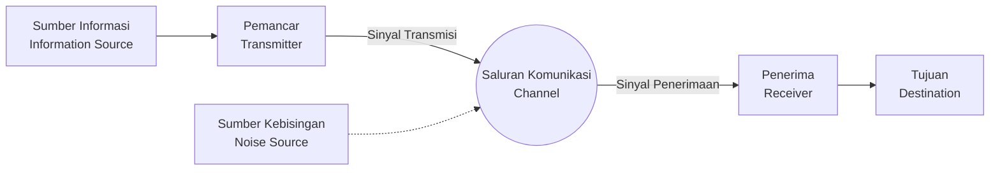

## 1. Pendahuluan: Apa itu Informasi?

Kata "informasi" adalah sesuatu yang sering kita ucapkan sehari-hari, namun mencoba mendefinisikannya secara ilmiah akan sangat sulit. Berita, pesan dari teman, urutan basa DNA, atau bahkan gelombang radio dari luar angkasa, semuanya mengandung informasi. Namun, untuk menangani semua ini dalam kerangka matematika yang sama, diperlukan sebuah metrik yang objektif dan kuantitatif.

Sosok yang menghadapi tantangan besar ini dan meletakkan dasar bagi masyarakat digital modern adalah seorang matematikawan dan insinyur, Claude Shannon. Tidak berlebihan untuk mengatakan bahwa makalahnya pada tahun 1948 yang berjudul "Teori Matematika Komunikasi (A Mathematical Theory of Communication)" secara tunggal mendirikan bidang studi yang sama sekali baru, yaitu **Teori Informasi** (Information Theory).

Pada artikel ini, kita akan menggali lebih dalam tentang bagaimana Shannon mendefinisikan "informasi" secara matematis, dan apa arti dari konsep utamanya, yaitu **Entropi Shannon**, dalam teknologi kompresi data dan komunikasi.

## 2. Model Umum Komunikasi

Shannon untuk sementara mengesampingkan makna (semantik) dari informasi dan memusatkan perhatian pada "transmisi" informasi itu sendiri. Model umum sistem komunikasi yang ia usulkan dapat direpresentasikan oleh diagram Mermaid berikut.



Dalam model ini, tantangan terbesar dari komunikasi dapat diringkas pada poin **"bagaimana mengirimkan pesan secara akurat dan efisien melalui saluran komunikasi yang terdapat kebisingan (noise)"**.

## 3. Definisi Matematis dari Jumlah Informasi

Pertanyaan paling mendasar dalam teori informasi adalah, "Berapa banyak informasi yang kita dapatkan ketika kita mengetahui bahwa suatu peristiwa telah terjadi?"

Shannon menganggap jumlah informasi sebagai "tingkat kejutan".
- Ketika **peristiwa yang sering terjadi (probabilitas tinggi)** terjadi, kejutannya kecil, dan jumlah informasi yang diperoleh sedikit.
- Ketika **peristiwa yang jarang terjadi (probabilitas rendah)** terjadi, kejutannya besar, dan jumlah informasi yang diperoleh banyak.

Jika probabilitas terjadinya peristiwa $ x $ adalah $ P(x) $, maka **informasi mandiri** (Self-Information) $ I(x) $ yang dimiliki oleh peristiwa tersebut didefinisikan sebagai berikut.

$$
I(x) = - \log_2 P(x) = \log_2 \frac{1}{P(x)}
$$

Jika basis logaritma yang digunakan adalah $ 2 $, satuan dari jumlah informasi menjadi **bit**. Sebagai contoh, informasi dari peristiwa munculnya sisi kepala (angka) ketika melempar koin dengan probabilitas yang sama antara kepala dan ekor ($ P = 0.5 $) adalah,

$$
I(\text{Kepala}) = - \log_2(0.5) = 1 \text{ bit}
$$

Ini selaras dengan pemahaman intuitif tentang "informasi 1 bit".

## 4. Entropi Shannon

Informasi mandiri adalah jumlah informasi untuk setiap peristiwa individu, tetapi bagaimana kita bisa mengetahui rata-rata jumlah informasi yang dihasilkan oleh seluruh sumber informasi?

Di sinilah **Entropi** (Entropy) berperan. Ketika sumber informasi $ X $ menghasilkan $ n $ simbol yang berbeda $ x_1, x_2, \dots, x_n $ dengan probabilitas $ P(x_1), P(x_2), \dots, P(x_n) $, entropi $ H(X) $ dari sumber informasi $ X $ didefinisikan sebagai nilai harapan (ekspektasi) dari informasi mandiri.

$$
H(X) = - \sum_{i=1}^{n} P(x_i) \log_2 P(x_i)
$$

(Namun, jika $ P(x_i) = 0 $, diasumsikan bahwa $ 0 \log_2 0 = 0 $)

### Makna Intuitif dari Entropi
Entropi $ H(X) $ merepresentasikan tingkat **ketidakpastian** yang dimiliki oleh sumber informasi.
- Ketika sama sekali tidak dapat diprediksi simbol mana yang akan muncul (semua probabilitas merata), entropi mencapai nilai maksimum.
- Ketika simbol yang sama selalu muncul (suatu probabilitas bernilai $ 1 $ dan yang lainnya $ 0 $), ketidakpastian hilang, dan entropi menjadi $ 0 $.

Mari kita hitung perubahan entropi ketika mengubah probabilitas $ p $ munculnya kepala dari sebuah koin dengan kode Python berikut.

```python
import numpy as np
import matplotlib.pyplot as plt

def binary_entropy(p):
    if p == 0 or p == 1:
        return 0
    return -p * np.log2(p) - (1 - p) * np.log2(1 - p)

probabilities = np.linspace(0, 1, 100)
entropies = [binary_entropy(p) for p in probabilities]

plt.plot(probabilities, entropies)
plt.title('Fungsi Entropi Biner')
plt.xlabel('Probabilitas kepala (p)')
plt.ylabel('Entropi H(X) dalam bit')
plt.grid(True)
plt.show()
```

Saat menggambar grafik ini, dapat dilihat bahwa ketika $ p = 0.5 $, entropi mencapai nilai maksimum $ 1 $, yang menandakan keadaan yang sama sekali tidak dapat diprediksi.

## 5. Teorema Pengkodean Sumber: Batasan Kompresi Data

Entropi bukanlah sekadar konsep abstrak. Shannon membuktikan bahwa entropi ini menentukan **batas absolut dari kompresi data**. Inilah **Teorema Pengkodean Sumber** (Teorema Pertama Shannon).

Pernyataan teoremanya sangat sederhana.
**"Apapun algoritma kompresi lossless yang digunakan, panjang kode rata-rata dari data yang dihasilkan oleh sumber informasi tidak bisa lebih kecil dari entropi $ H(X) $ sumber informasi tersebut."**

$$
L \ge H(X)
$$

( $ L $ adalah panjang kode rata-rata)

Artinya, entropi menunjukkan "ukuran esensial yang dimiliki informasi itu sendiri", dan tidak peduli seberapa hebat algoritma seperti ZIP atau gzip yang dikembangkan, secara matematis mustahil untuk melampaui batas kompresi ini.

### Kode Huffman (Huffman Coding)
Sebagai metode konkret untuk mendekati batas entropi, David Huffman mengembangkan ide Fano (rekan peneliti Shannon), yang kemudian dikenal sebagai **Kode Huffman**.

Dengan menetapkan urutan bit pendek untuk simbol dengan probabilitas kemunculan tinggi, dan urutan bit panjang untuk simbol dengan probabilitas kemunculan rendah, rata-rata panjang kode secara keseluruhan diminimalkan. Berikut adalah contoh sederhana pembentukan kode Huffman menggunakan Python.

```python
import heapq
from collections import Counter

class Node:
    def __init__(self, char, freq):
        self.char = char
        self.freq = freq
        self.left = None
        self.right = None

    def __lt__(self, other):
        return self.freq < other.freq

def build_huffman_tree(text):
    frequency = Counter(text)
    heap = [Node(char, freq) for char, freq in frequency.items()]
    heapq.heapify(heap)

    while len(heap) > 1:
        left = heapq.heappop(heap)
        right = heapq.heappop(heap)
        merged = Node(None, left.freq + right.freq)
        merged.left = left
        merged.right = right
        heapq.heappush(heap, merged)

    return heap[0]

def generate_huffman_codes(node, prefix="", codebook={}):
    if node is not None:
        if node.char is not None:
            codebook[node.char] = prefix
        generate_huffman_codes(node.left, prefix + "0", codebook)
        generate_huffman_codes(node.right, prefix + "1", codebook)
    return codebook

# Teks sampel
text = "entropi_shannon_dan_teori_informasi"
tree_root = build_huffman_tree(text)
codes = generate_huffman_codes(tree_root)

print("Kode Huffman:")
for char, code in sorted(codes.items()):
    print(f"'{char}': {code}")
```

## 6. Teorema Pengkodean Saluran: Batasan Komunikasi Tanpa Kesalahan

Setelah menunjukkan batasan kompresi data, Shannon kemudian menghadapi "saluran komunikasi dengan kebisingan". Adanya kebisingan menyebabkan sebagian data terbalik atau hilang. Untuk mengatasi hal ini, kita menambahkan **redundansi** pada data agar kesalahan dapat diperbaiki (kode koreksi kesalahan).

Namun, semakin banyak redundansi yang ditambahkan, semakin menurun pula kecepatan efektif (laju) transmisi informasi yang dapat dikirimkan. Lalu, dalam lingkungan yang bising, seberapa cepat dan seberapa akurat kita dapat mengirimkan informasi?

Jawaban dari pertanyaan ini adalah **Teorema Pengkodean Saluran** (Teorema Kedua Shannon).

Shannon membuktikan bahwa setiap saluran komunikasi memiliki **Kapasitas Saluran** (Channel Capacity) $ C $ yang spesifik. Dan yang mengejutkan, ia menyatakan hal berikut:

**"Jika kecepatan transmisi informasi $ R $ lebih kecil dari kapasitas saluran $ C $ ( $ R < C $ ), maka dengan melakukan pengkodean yang tepat, tingkat kesalahan dapat didekatkan ke angka nol sejauh mungkin."**

Sebagai rumus representatif untuk menghitung kapasitas saluran $ C $, terdapat Teorema Shannon-Hartley terkait saluran bising Gauss putih (AWGN).

$$
C = B \log_2 \left( 1 + \frac{S}{N} \right)
$$

Di mana,
- $ C $ : Kapasitas saluran (bit per detik)
- $ B $ : Lebar pita (Hz)
- $ S $ : Daya sinyal (Watt)
- $ N $ : Daya kebisingan (Watt)
- $ \frac{S}{N} $ : Rasio Sinyal terhadap Kebisingan (Signal-to-Noise Ratio)

Teorema ini menjadi penunjuk jalan yang menunjukkan batas teoretis yang dapat dicapai (Batas Shannon) dalam desain semua sistem komunikasi digital modern, seperti Wi-Fi, komunikasi seluler 5G, dan komunikasi satelit.

## 7. Penutup

Teori informasi yang dibangun oleh Claude Shannon mendefinisikan "informasi" yang tidak berwujud secara matematis dan ketat, serta membuka pintu menuju era digital. **Entropi Shannon** tidak hanya sekadar konsep abstrak, melainkan juga menunjukkan batas absolut dari algoritma kompresi data, dan kapasitas saluran telah menentukan arah evolusi internet dan komunikasi nirkabel yang kita gunakan setiap hari.

Alasan mengapa kita dapat melakukan streaming video di ponsel cerdas dan menerima gambar alam semesta yang jelas dari pesawat ruang angkasa yang jauh adalah karena adanya fondasi matematis yang kuat bernama teori informasi. Saat ini, konsep entropi terus menyebar ke bidang yang lebih luas, seperti perdebatan tentang hubungannya dengan entropi termodinamika dalam fisika, dan peran pentingnya dalam pembelajaran mesin (seperti kehilangan lintas-entropi) dan lain-lain.

Memahami sifat dasar dari data dan mengetahui batasannya akan terus menjadi pendekatan yang paling penting dalam merancang sistem komunikasi informasi yang lebih maju di masa depan.
