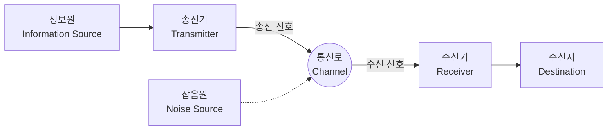

## 1. 서론: 정보란 무엇인가?

우리가 일상적으로 입에 담는 "정보"라는 단어지만, 과학적으로 "정보"를 정의하려고 하면 매우 큰 어려움이 따릅니다. 뉴스, 친구로부터 온 메시지, DNA의 염기 서열, 또는 우주에서 오는 전파 등, 이 모든 것들은 정보를 포함하고 있습니다. 그러나 이들을 수학적으로 공통된 틀에서 다루기 위해서는 객관적이고 정량적인 지표가 필요합니다.

이 거대한 과제에 도전하여, 현대 디지털 사회의 초석을 다진 인물이 바로 수학자이자 공학자인 클로드 섀넌(Claude Shannon)입니다. 그가 1948년에 발표한 논문 '통신의 수학적 이론(A Mathematical Theory of Communication)'은 **정보 이론** (Information Theory)이라는 전혀 새로운 학문 분야를 단독으로 창설했다고 해도 과언이 아닙니다.

본 기사에서는 섀넌이 어떻게 "정보"를 수학적으로 정의했는지, 그리고 그 중심적인 개념인 **섀넌의 엔트로피** 가 데이터 압축이나 통신 기술에서 어떤 의미를 갖는지에 대해 철저하게 파헤쳐 보겠습니다.

## 2. 커뮤니케이션의 일반 모델

섀넌은 정보의 의미(시맨틱스)를 일단 분리하고, 정보의 "전달" 그 자체에 초점을 맞추었습니다. 그가 제창한 통신 시스템의 일반 모델은 아래의 Mermaid 다이어그램과 같이 표현됩니다.



이 모델에서 통신의 최대 과제는 **"잡음(노이즈)이 존재하는 통신로를 통해, 어떻게 정확하고 효율적으로 메시지를 전송할 것인가"** 라는 점으로 요약됩니다.

## 3. 정보량의 수학적 정의

정보 이론에서 가장 기본적인 질문은, "어떤 사건이 일어났다는 것을 알았을 때, 우리는 얼마나 많은 정보를 얻었는가?"라는 것입니다.

섀넌은 정보의 양을 "놀라움의 정도"로 파악했습니다.
- **자주 일어나는 일(확률이 높은 사건)** 이 일어나도 놀라움은 적고, 얻을 수 있는 정보량은 작다.
- **거의 일어나지 않는 일(확률이 낮은 사건)** 이 일어나면 놀라움은 크고, 얻을 수 있는 정보량은 크다.

사건 $ x $ 가 일어날 확률을 $ P(x) $ 라고 했을 때, 그 사건이 가지고 있는 **자기 정보량** (Self-Information) $ I(x) $ 는 다음과 같이 정의됩니다.

$$
I(x) = - \log_2 P(x) = \log_2 \frac{1}{P(x)}
$$

로그의 밑으로 $ 2 $ 를 사용할 경우, 정보량의 단위는 **비트** (bit)가 됩니다. 예를 들어, 앞면과 뒷면이 동일한 확률($ P = 0.5 $)로 나오는 동전을 던져서 앞면이 나왔다는 사건의 정보량은,

$$
I(\text{앞면}) = - \log_2(0.5) = 1 \text{ 비트}
$$

가 됩니다. 이는 "1비트의 정보"에 대한 직관적인 이해와도 일치합니다.

## 4. 섀넌의 엔트로피

자기 정보량은 개별 사건에 대한 정보량이지만, 정보원 전체에서 평균적으로 얼마나 많은 정보가 발생하고 있는지 알기 위해서는 어떻게 해야 할까요?

여기서 등장하는 것이 **엔트로피** (Entropy)입니다. 정보원 $ X $ 가 $ n $ 개의 서로 다른 기호 $ x_1, x_2, \dots, x_n $ 을 확률 $ P(x_1), P(x_2), \dots, P(x_n) $ 으로 발생시킬 때, 정보원 $ X $ 의 엔트로피 $ H(X) $ 는 자기 정보량의 기댓값으로 정의됩니다.

$$
H(X) = - \sum_{i=1}^{n} P(x_i) \log_2 P(x_i)
$$

(단, $ P(x_i) = 0 $ 인 경우는 $ 0 \log_2 0 = 0 $ 으로 간주합니다)

### 엔트로피의 직관적인 의미
엔트로피 $ H(X) $ 는 정보원이 가진 **불확실성** 의 정도를 나타냅니다.
- 어떤 기호가 나올지 전혀 예측할 수 없을(모든 확률이 균등할) 때, 엔트로피는 최대가 됩니다.
- 항상 같은 기호가 나올(어떤 확률이 $ 1 $ 이고 다른 것이 $ 0 $ 일) 때, 불확실성은 사라지고 엔트로피는 $ 0 $ 이 됩니다.

아래의 Python 코드로, 동전의 앞면이 나올 확률 $ p $ 를 변화시켰을 때의 엔트로피 변화를 계산해 봅시다.

```python
import numpy as np
import matplotlib.pyplot as plt

def binary_entropy(p):
    if p == 0 or p == 1:
        return 0
    return -p * np.log2(p) - (1 - p) * np.log2(1 - p)

probabilities = np.linspace(0, 1, 100)
entropies = [binary_entropy(p) for p in probabilities]

plt.plot(probabilities, entropies)
plt.title('Binary Entropy Function')
plt.xlabel('Probability of heads (p)')
plt.ylabel('Entropy H(X) in bits')
plt.grid(True)
plt.show()
```

이 그래프를 그리면, $ p = 0.5 $ 일 때 엔트로피가 최댓값 $ 1 $ 이 되며, 완전히 예측 불가능한 상태임을 알 수 있습니다.

## 5. 정보원 부호화 정리: 데이터 압축의 한계

엔트로피는 단순한 추상적인 개념이 아닙니다. 섀넌은 이 엔트로피가 **데이터 압축의 절대적인 한계** 를 정하고 있다는 것을 증명했습니다. 이것이 **정보원 부호화 정리** (섀넌의 제1정리)입니다.

정리의 주장은 매우 간단합니다.
**"어떠한 무손실 압축 알고리즘을 사용하더라도, 정보원에서 발생하는 데이터의 평균 부호 길이를 그 정보원의 엔트로피 $ H(X) $ 보다 작게 만들 수는 없다."**

$$
L \ge H(X)
$$
( $ L $ 은 평균 부호 길이)

즉, 엔트로피는 "정보 그 자체가 가지고 있는 본질적인 크기"를 나타내며, 아무리 뛰어난 ZIP이나 gzip 등의 알고리즘을 개발하더라도 이 한계의 벽을 넘어 압축하는 것은 수학적으로 불가능하다는 것을 의미합니다.

### 허프만 부호 (Huffman Coding)
엔트로피의 한계에 다가가기 위한 구체적인 방법으로, 섀넌의 공동 연구자였던 파노의 아이디어를 발전시켜 데이비드 허프만이 고안한 것이 **허프만 부호** 입니다.

출현 확률이 높은 기호에는 짧은 비트열을, 출현 확률이 낮은 기호에는 긴 비트열을 할당함으로써 전체의 평균 부호 길이를 최소화합니다. 다음은 Python을 이용한 간단한 허프만 부호 구축 예시입니다.

```python
import heapq
from collections import Counter

class Node:
    def __init__(self, char, freq):
        self.char = char
        self.freq = freq
        self.left = None
        self.right = None

    def __lt__(self, other):
        return self.freq < other.freq

def build_huffman_tree(text):
    frequency = Counter(text)
    heap = [Node(char, freq) for char, freq in frequency.items()]
    heapq.heapify(heap)

    while len(heap) > 1:
        left = heapq.heappop(heap)
        right = heapq.heappop(heap)
        merged = Node(None, left.freq + right.freq)
        merged.left = left
        merged.right = right
        heapq.heappush(heap, merged)

    return heap[0]

def generate_huffman_codes(node, prefix="", codebook={}):
    if node is not None:
        if node.char is not None:
            codebook[node.char] = prefix
        generate_huffman_codes(node.left, prefix + "0", codebook)
        generate_huffman_codes(node.right, prefix + "1", codebook)
    return codebook

# 샘플 텍스트
text = "shannon_entropy_and_information_theory"
tree_root = build_huffman_tree(text)
codes = generate_huffman_codes(tree_root)

print("Huffman Codes:")
for char, code in sorted(codes.items()):
    print(f"'{char}': {code}")
```

## 6. 통신로 부호화 정리: 오류 없이 통신하는 한계

데이터 압축의 한계를 제시한 섀넌은 다음으로 "노이즈가 있는 통신로"에 도전했습니다. 노이즈가 있으면 데이터의 일부가 반전되거나 손실됩니다. 이에 대처하기 위해 우리는 데이터에 **중복성** 을 추가하여 오류를 정정할 수 있도록 합니다(오류 정정 부호).

그러나 중복성을 더하면 더할수록 실제로 보낼 수 있는 정보의 실질적인 속도(레이트)는 떨어지고 맙니다. 그렇다면 노이즈가 있는 환경에서 어느 정도의 속도로, 어느 정도 정확하게 정보를 보낼 수 있을까요?

이 질문에 대한 답이 **통신로 부호화 정리** (섀넌의 제2정리)입니다.

섀넌은 통신로에 고유한 **통신로 용량** (Channel Capacity) $ C $ 가 존재한다는 것을 증명했습니다. 그리고 놀랍게도 다음과 같이 주장했습니다.

**"정보 전송 속도 $ R $ 가 통신로 용량 $ C $ 보다 작다면( $ R < C $ ), 적절한 부호화를 통해 오류율을 얼마든지 0에 가깝게 만들 수 있다."**

통신로 용량 $ C $ 를 계산하는 대표적인 공식으로, 백색 가우스 잡음(AWGN) 통신로에 관한 섀넌-하틀리 정리가 있습니다.

$$
C = B \log_2 \left( 1 + \frac{S}{N} \right)
$$

여기서,
- $ C $ : 통신로 용량 (bits per second)
- $ B $ : 대역폭 (Hz)
- $ S $ : 신호 전력 (Watt)
- $ N $ : 잡음 전력 (Watt)
- $ \frac{S}{N} $ : SN비 (Signal-to-Noise Ratio)

이 정리는 현대의 Wi-Fi, 5G 모바일 통신, 위성 통신 등 모든 디지털 통신 시스템의 설계에 있어 도달 가능한 이론적 한계(섀넌 리미트)를 보여주는 길잡이가 되고 있습니다.

## 7. 맺음말

클로드 섀넌이 구축한 정보 이론은 "정보"라는 형태 없는 것을 수학적으로 엄밀하게 정의하고, 디지털 시대로의 문을 열었습니다. **섀넌의 엔트로피** 는 단순한 추상적인 개념에 머물지 않고 데이터 압축 알고리즘의 절대적인 한계를 제시했으며, 통신로 용량은 우리가 매일 이용하는 인터넷이나 무선 통신의 진화 방향성을 결정지었습니다.

우리가 스마트폰으로 동영상을 스트리밍할 수 있고, 멀리 떨어진 탐사선으로부터 우주의 선명한 이미지를 수신할 수 있는 것은 정보 이론이라는 확고한 수학적 기반이 존재하기 때문입니다. 엔트로피의 개념은 현재 물리학의 열역학적 엔트로피와의 관련성이 논의되거나 기계 학습(교차 엔트로피 오차 등)에서 중요한 역할을 하는 등 더욱 넓은 분야로 계속해서 파급되고 있습니다.

데이터의 성질을 근본부터 이해하고 그 한계를 아는 것은 미래의 보다 고도화된 정보 통신 시스템을 설계하는 데 있어 여전히 가장 중요한 접근 방식으로 남을 것입니다.
